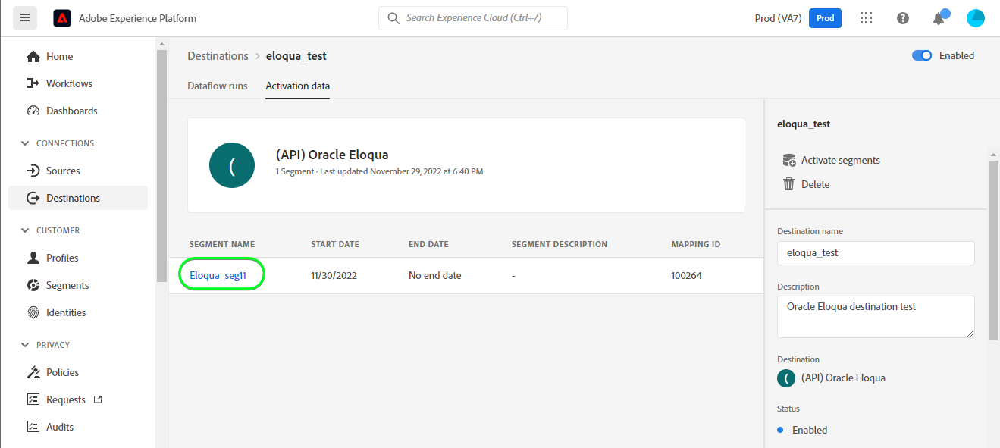

# [!DNL (API) Oracle Eloqua] anslutning

[[!DNL Oracle Eloqua]](https://www.oracle.com/cx/marketing/automation/) gör det möjligt för marknadsförare att planera och genomföra kampanjer samtidigt som de levererar en personaliserad kundupplevelse till sina presumtiva kunder. Tack vare integrerad hantering av leads och enkel kampanjframtagning kan marknadsförarna engagera rätt målgrupp vid rätt tidpunkt i köparens resa och på ett elegant sätt skala nå målgrupper över olika kanaler, inklusive e-post, webbannonsering, video och mobiler. Säljarna kan sluta fler avtal snabbare och öka avkastningen på marknadsföringen genom realtidsinsikter.

Detta [!DNL Adobe Experience Platform] [mål](/help/destinations/home.md) utnyttjar [Uppdatera en kontakt](https://docs.oracle.com/en/cloud/saas/marketing/eloqua-rest-api/op-api-rest-1.0-data-contact-id-put.html) åtgärd från [!DNL Oracle Eloqua] REST API, som gör att du kan **uppdatera identiteter** inom en viss målgrupp [!DNL Oracle Eloqua].

[!DNL Oracle Eloqua] använder [Grundläggande autentisering](https://docs.oracle.com/en/cloud/saas/marketing/eloqua-rest-api/Authentication_Basic.html) att kommunicera med [!DNL Oracle Eloqua] REST API. Instruktioner för hur du autentiserar [!DNL Oracle Eloqua] -instansen är längre ned, i [Autentisera till mål](#authenticate) -avsnitt.

## Användningsfall {#use-cases}

Marknadsföringsavdelningen på en onlineplattform vill sända en e-postbaserad marknadsföringskampanj till en välstrukturerad publik med leads. Plattformens marknadsföringsteam kan uppdatera befintlig huvudinformation via Adobe Experience Platform, bygga målgrupper utifrån sina egna offlinedata och skicka dessa målgrupper till [!DNL Oracle Eloqua]som sedan kan användas för att skicka marknadsföringskampanjens e-post.

## Förutsättningar {#prerequisites}

### Förutsättningar för Experience Platform {#prerequisites-in-experience-platform}

Innan du aktiverar data för [!DNL Oracle Eloqua] mål, du måste ha [schema](/help/xdm/schema/composition.md), a [datauppsättning](https://experienceleague.adobe.com/docs/platform-learn/tutorials/data-ingestion/create-datasets-and-ingest-data.html?lang=en)och [segment](https://experienceleague.adobe.com/docs/platform-learn/tutorials/segments/create-segments.html?lang=en) som [!DNL Experience Platform].

Se dokumentationen för Experience Platform för [Schemafältgrupp för målgruppsmedlemskapsdetaljer](/help/xdm/field-groups/profile/segmentation.md) om ni behöver vägledning om målgruppsstatus.

### [!DNL Oracle Eloqua] krav {#prerequisites-destination}

För att kunna exportera data från Platform till [!DNL Oracle Eloqua] konto du behöver ha [!DNL Oracle Eloqua] konto.

Dessutom behöver du åtminstone *&quot;Avancerade användare - marknadsföringsbehörigheter&quot;* för [!DNL Oracle Eloqua] -instans. Se *&quot;Säkerhetsgrupper&quot;* i [Skyddad användaråtkomst](https://docs.oracle.com/en/cloud/saas/marketing/eloqua-user/Help/SecurityOverview/SecuredUserAccess.htm) sida för vägledning. Åtkomsten krävs för att målet ska kunna programmera [fastställa din bas-URL](https://docs.oracle.com/en/cloud/saas/marketing/eloqua-rest-api/DeterminingBaseURL.html) när du anropar [!DNL Oracle Eloqua] API.

#### Samla [!DNL Oracle Eloqua] autentiseringsuppgifter {#gather-credentials}

Anteckna nedanstående innan du autentiserar dig för [!DNL Oracle Eloqua] mål:

| Autentiseringsuppgifter | Beskrivning |
| --- | --- |
| `Company Name` | Företagsnamnet som är associerat med din [!DNL Oracle Eloqua] konto. <br>Du kommer senare att använda `Company Name` och [!DNL Oracle Eloqua] `Username` som en sammanfogad sträng som ska användas som **[!UICONTROL Username]** när [autentiserar mot målet](#authenticate). |
| `Username` | Användarnamnet för [!DNL Oracle Eloqua] konto. |
| `Password` | Lösenordet för [!DNL Oracle Eloqua] konto. |
| `Pod` | [!DNL Oracle Eloqua] har stöd för flera datacenter, där var och en har ett unikt domännamn. [!DNL Oracle Eloqua] hänvisar till dessa som&quot;poder&quot;, det finns för närvarande sju totalt - p01, p02, p03, p04, p06, p07 och p08. Logga in på för att ta reda på vilken POD du är på [!DNL Oracle Eloqua] och notera URL:en i webbläsaren när du har loggat in. Om webbläsarens URL-adress till exempel är `secure.p01.eloqua.com` din `pod` är `p01`. Se [fastställa din POD](https://community.oracle.com/topliners/discussion/4470225/determining-your-pod-number-for-oracle-eloqua) sida för ytterligare vägledning. |

Se [Logga in på [!DNL Oracle Eloqua]](https://docs.oracle.com/en/cloud/saas/marketing/eloqua-user/Help/Administration/Tasks/SigningInToEloqua.htm#Signing) för vägledning.

## Guardrails {#guardrails}

>[!NOTE]
>
>* [!DNL Oracle Eloqua] anpassade kontaktfält skapas automatiskt med namnen på de målgrupper som valts under **[!UICONTROL Select segments]** steg.

* [!DNL Oracle Eloqua] har en maxgräns på 250 anpassade kontaktfält.
* Innan du exporterar nya målgrupper ser du till att antalet plattformsmålgrupper och antalet befintliga målgrupper inom [!DNL Oracle Eloqua] inte överskrider denna gräns.
* Om denna gräns överskrids kommer ett fel att uppstå i Experience Platform. Det beror på att [!DNL Oracle Eloqua] API:t kan inte validera begäran och svarar med en - *400: Ett valideringsfel uppstod* - felmeddelande som beskriver problemet.
* Om du har nått gränsen ovan måste du ta bort befintliga mappningar från målet och ta bort motsvarande anpassade kontaktfält i [!DNL Oracle Eloqua] innan du kan exportera fler segment.

* Se [[!DNL Oracle Eloqua] Skapa kontaktfält](https://docs.oracle.com/en/cloud/saas/marketing/eloqua-user/Help/ContactFields/Tasks/CreatingContactFields.htm) sida för information om ytterligare begränsningar.

## Identiteter som stöds {#supported-identities}

[!DNL Oracle Eloqua] har stöd för uppdatering av identiteter som beskrivs i tabellen nedan. Läs mer om [identiteter](/help/identity-service/namespaces.md).

| Målidentitet | Beskrivning | Obligatoriskt |
|---|---|---|
| `EloquaId` | Unik identifierare för kontakten. | Ja |

## Exportera typ och frekvens {#export-type-frequency}

Se tabellen nedan för information om exporttyp och frekvens för destinationen.

| Objekt | Typ | Anteckningar |
---------|----------|---------|
| Exporttyp | **[!UICONTROL Profile-based]** | <ul><li>Du exporterar alla medlemmar i ett segment tillsammans med de önskade schemafälten *(t.ex. e-postadress, telefonnummer, efternamn)*, enligt fältmappningen.</li><li> För varje vald publik i Platform [!DNL Oracle Eloqua] segmentets status uppdateras med målgruppsstatus från Platform.</li></ul> |
| Exportfrekvens | **[!UICONTROL Streaming]** | <ul><li>Direktuppspelningsmål är alltid på API-baserade anslutningar. Så snart en profil uppdateras i Experience Platform baserat på målgruppsutvärdering skickar anslutningsprogrammet uppdateringen nedströms till målplattformen. Läs mer om [mål för direktuppspelning](/help/destinations/destination-types.md#streaming-destinations).</li></ul> |

{style="table-layout:auto"}

## Anslut till målet {#connect}

>[!IMPORTANT]
>
>Om du vill ansluta till målet behöver du **[!UICONTROL Manage Destinations]** [behörighet för åtkomstkontroll](/help/access-control/home.md#permissions). Läs [åtkomstkontroll - översikt](/help/access-control/ui/overview.md) eller kontakta produktadministratören för att få de behörigheter som krävs.

Om du vill ansluta till det här målet följer du stegen som beskrivs i [självstudiekurs om destinationskonfiguration](../../ui/connect-destination.md). I arbetsflödet för att konfigurera mål fyller du i fälten som listas i de två avsnitten nedan.

Inom **[!UICONTROL Destinations]** > **[!UICONTROL Catalog]** sök efter [!DNL (API) Oracle Eloqua]. Du kan även hitta den under **[!UICONTROL Email Marketing]** kategori.

### Autentisera till mål {#authenticate}

>[!CONTEXTUALHELP]
>id="platform_destinations_apioracleeloqua_companyname_username"
>title="Företag\Användarnamn"
>abstract="Fyll i det här fältet med ditt företagsnamn och ditt användarnamn från Oraclet Eloqua i formuläret `{COMPANY_NAME}\{USERNAME}`"

Fyll i de obligatoriska fälten nedan. Se [Samla [!DNL Oracle Eloqua] autentiseringsuppgifter](#gather-credentials) för vägledning.
* **[!UICONTROL Password]**: Lösenordet för [!DNL Oracle Eloqua] konto.
* **[!UICONTROL Username]**: En sammanfogad sträng som består av [!DNL Oracle Eloqua] Företag och [!DNL Oracle Eloqua] Användarnamn.<br>Det sammanfogade värdet har formen av `{COMPANY_NAME}\{USERNAME}`.<br> Observera att du inte ska använda klammerparenteser eller mellanslag och bevara `\`. <br>Om du till exempel [!DNL Oracle Eloqua] Företagsnamnet är `MyCompany` och [!DNL Oracle Eloqua] Användarnamnet är `Username`, det sammanfogade värde som du kommer att använda i **[!UICONTROL Username]** fältet är `MyCompany\Username`.

Om du vill autentisera mot målet väljer du **[!UICONTROL Connect to destination]**.


Om den angivna informationen är giltig visas en **[!UICONTROL Connected]** status med en grön bockmarkering. Du kan sedan gå vidare till nästa steg.

### Fyll i målinformation {#destination-details}

>[!CONTEXTUALHELP]
>id="platform_destinations_apioracleeloqua_pod"
>title="Pod"
>abstract="Logga in på Oracle Eloqua för att hitta ditt podnummer. Anteckna URL-adressen i webbläsaren när du har loggat in. "
>additional-url="https://support.oracle.com/knowledge/Oracle%20Cloud/2307176_1.html" text="Oracle Knowledge Base - ta reda på ditt Pod-nummer"

Om du vill konfigurera information för målet fyller du i de obligatoriska och valfria fälten nedan. En asterisk bredvid ett fält i användargränssnittet anger att fältet är obligatoriskt.


* **[!UICONTROL Name]**: Ett namn som du känner igen det här målet med i framtiden.
* **[!UICONTROL Description]**: En beskrivning som hjälper dig att identifiera det här målet i framtiden.
* **[!UICONTROL Pod]**: För att få fram `pod` du är på, logga in på [!DNL Oracle Eloqua] och notera URL:en i webbläsaren när du har loggat in. Om webbläsarens URL-adress till exempel är `secure.p01.eloqua.com` den `pod` värdet du måste välja är `p01`. Se [Samla [!DNL Oracle Eloqua] autentiseringsuppgifter](#gather-credentials) för ytterligare vägledning.

### Aktivera aviseringar {#enable-alerts}

Du kan aktivera varningar för att få meddelanden om dataflödets status till ditt mål. Välj en avisering i listan om du vill prenumerera och få meddelanden om statusen för ditt dataflöde. Mer information om varningar finns i guiden på [prenumerera på destinationsvarningar med användargränssnittet](../../ui/alerts.md).

När du är klar med informationen för målanslutningen väljer du **[!UICONTROL Next]**.

## Aktivera målgrupper till det här målet {#activate}

>[!IMPORTANT]
>
>För att aktivera data behöver du **[!UICONTROL Manage Destinations]**, **[!UICONTROL Activate Destinations]**, **[!UICONTROL View Profiles]** och **[!UICONTROL View Segments]** [behörigheter för åtkomstkontroll](/help/access-control/home.md#permissions). Läs [åtkomstkontroll - översikt](/help/access-control/ui/overview.md) eller kontakta produktadministratören för att få de behörigheter som krävs.

Läs [Aktivera profiler och målgrupper för att strömma målgruppernas exportdestinationer](/help/destinations/ui/activate-segment-streaming-destinations.md) för instruktioner om hur du aktiverar målgrupper till det här målet.

### Mappa överväganden och exempel {#mapping-considerations-example}

Så här skickar du målgruppsdata från Adobe Experience Platform till [!DNL Oracle Eloqua] mål måste du gå igenom fältmappningssteget. Mappningen består av att skapa en länk mellan XDM-schemafälten (Experience Data Model) i ditt plattformskonto och motsvarande motsvarigheter från målmålet.

Så här mappar du XDM-fält till [!DNL Oracle Eloqua] målfält, följ dessa steg:

1. I **[!UICONTROL Mapping]** steg, välja **[!UICONTROL Add new mapping]**. En ny mappningsrad visas på skärmen.
1. I **[!UICONTROL Select source field]** väljer du **[!UICONTROL Select attributes]** och välj XDM-attributet eller välj **[!UICONTROL Select identity namespace]** och välj en identitet.
1. I **[!UICONTROL Select target field]** fönster, välja **[!UICONTROL Select identity namespace]** och välja en identitet, eller välja **[!UICONTROL Select custom attributes]** och skriv attributnamnet i **[!UICONTROL Attribute name]** fält. Attributnamnet som du anger ska matcha ett befintligt kontaktattribut i [!DNL Oracle Eloqua]. Se [[!DNL create a contact]](https://docs.oracle.com/en/cloud/saas/marketing/eloqua-rest-api/op-api-rest-1.0-data-contact-post.html) för de exakta attributnamnen som du kan använda i [!DNL Oracle Eloqua].
   * Upprepa dessa steg för att lägga till både nödvändiga och önskade attributkopplingar mellan XDM-profilschemat och [!DNL Oracle Eloqua]: | Källfält | Målfält | Obligatoriskt | |—|—|—| |`IdentityMap: Eid`|`Identity: EloquaId`| Ja | |`xdm: personalEmail.address`|`Attribute: emailAddress`| Ja | |`xdm: personName.firstName`|`Attribute: firstName`| | |`xdm: personName.lastName`|`Attribute: lastName`| | |`xdm: workAddress.street1`|`Attribute: address1`| | |`xdm: workAddress.street2`|`Attribute: address2`| | |`xdm: workAddress.street3`|`Attribute: address3`| | |`xdm: workAddress.postalCode`|`Attribute: postalCode`| | |`xdm: workAddress.country`|`Attribute: country`| | |`xdm: workAddress.city`|`Attribute: city`| |

   * Ett exempel med mappningarna ovan visas nedan:
     

>[!IMPORTANT]
>
>* Attribut som anges i **[!UICONTROL Target field]** ska ha exakt det namn som anges i [[!DNL Create a contact]](https://docs.oracle.com/en/cloud/saas/marketing/eloqua-rest-api/op-api-rest-1.0-data-contact-post.html) eftersom dessa attribut utgör begärandetexten.
>* Attribut som anges i **[!UICONTROL Source field]** inte följer någon sådan begränsning. Du kan mappa den baserat på dina behov, men om dataformatet inte är korrekt när det skickas till [!DNL Oracle Eloqua] det kommer att resultera i ett fel. Du kan till exempel mappa **[!UICONTROL Source field]** namnutrymme för identitet `contact key`, `ABC ID` osv. till **[!UICONTROL Target field]** : `EloquaId` efter att du kontrollerat att ID-värdena matchar det format som accepteras av [!DNL Oracle Eloqua].
>* The `EloquaID` mappning är obligatoriskt för att uppdatera attribut som motsvarar identiteten.
>* The `emailAddress` mappning krävs. Utan det genererar API:t ett fel enligt nedan:
>
>```json
>{
>     "type":"ObjectValidationError",
>     "container":{
>           "type":"ObjectKey",
>           "objectType":"Contact"
>     },
>     "property":"emailAddress",
>     "requirement":{
>           "type":"EmailAddressRequirement"
>     },
>     "value":"<null>"
>}
>```

När du är klar med mappningarna för målanslutningen väljer du **[!UICONTROL Next]**.

>[!NOTE]
>
>Målet lägger automatiskt till en unik identifierare till de valda målgruppsnamnen vid varje körning när kontaktfältsinformationen skickas till [!DNL Oracle Eloqua]. Detta garanterar att de kontaktfältsnamn som motsvarar målgruppsnamnen inte överlappar varandra. Se [Validera dataexport](#exported-data) skärmbild av ett avsnitt [!DNL Oracle Eloqua] Kontaktinformationssida med anpassat kontaktfält som skapats med målgruppsnamnen.

## Validera dataexport {#exported-data}

Följ stegen nedan för att verifiera att du har konfigurerat målet korrekt:

1. Välj **[!UICONTROL Destinations]** > **[!UICONTROL Browse]** och navigera till listan över destinationer.
1. Välj sedan målet och växla till **[!UICONTROL Activation data]** väljer du ett målgruppsnamn.
   

1. Övervaka målgruppssammanfattningen och kontrollera att antalet profiler motsvarar antalet inom segmentet.
   

1. Logga in på [!DNL Oracle Eloqua] webbplatsen och sedan navigera till **[!UICONTROL Contacts Overview]** sida för att kontrollera om profilerna från målgruppen har lagts till. Om du vill se målgruppens status kan du gå ned till en **[!UICONTROL Contact Detail]** och kontrollera om kontaktfältet med det valda målgruppsnamnet som prefix har skapats.


## Dataanvändning och styrning {#data-usage-governance}

Alla [!DNL Adobe Experience Platform] destinationerna är kompatibla med dataanvändningsprinciper när data hanteras. Detaljerad information om hur [!DNL Adobe Experience Platform] använder datastyrning, se [Datastyrning - översikt](/help/data-governance/home.md).

## Fel och felsökning {#errors-and-troubleshooting}

När du skapar målet kan du få något av följande felmeddelanden: `400: There was a validation error` eller `400 BAD_REQUEST`. Detta inträffar när du överskrider gränsen på 250 anpassade kontaktfält, vilket beskrivs i [skyddsräcken](#guardrails) -avsnitt. Kontrollera att du inte överskrider gränsen för anpassade kontaktfält i [!DNL Oracle Eloqua].


Se [[!DNL Oracle Eloqua] HTTP-statuskoder](https://docs.oracle.com/en/cloud/saas/marketing/eloqua-rest-api/APIRequests_HTTPStatusCodes.html) och [[!DNL Oracle Eloqua] Valideringsfel](https://docs.oracle.com/en/cloud/saas/marketing/eloqua-rest-api/APIRequests_HTTPValidationErrors.html) sidor med en omfattande lista över status- och felkoder med förklaringar.

## Ytterligare resurser {#additional-resources}

Mer information finns i [!DNL Oracle Eloqua] dokumentation:

* [Oracle Eloqua Marketing Automation](https://docs.oracle.com/en/cloud/saas/marketing/eloqua.html)
* [REST API för tjänsten Oracle Eloqua Marketing Cloud](https://docs.oracle.com/en/cloud/saas/marketing/eloqua-rest-api/rest-endpoints.html)

### Changelog

I det här avsnittet beskrivs funktionaliteten och viktiga dokumentationsuppdateringar för den här målanslutningen.

+++ Visa ändringslogg

| Releasamånad | Uppdateringstyp | Beskrivning |
|---|---|---|
| April 2023 | Dokumentation - uppdatering | <ul><li>Vi uppdaterade [användningsfall](#use-cases) med ett tydligare exempel på när kunderna skulle kunna dra nytta av detta mål.</li> <li>Vi uppdaterade [mappning](#mapping-considerations-example) med tydliga exempel på både obligatoriska och valfria mappningar.</li> <li>Vi uppdaterade [Anslut till målet](#connect) med ett exempel på hur det sammanfogade värdet för **[!UICONTROL Username]** fält med [!DNL Oracle Eloqua] Företag och [!DNL Oracle Eloqua] Användarnamn. (PLATIR-28343)</li><li>Vi uppdaterade [Samla [!DNL Oracle Eloqua] autentiseringsuppgifter](#gather-credentials) och [Fyll i målinformation](#destination-details) avsnitt med vägledning om [!DNL Oracle Eloqua] **[!UICONTROL Pod]** markering. The *Pod* -värdet används av målet för att skapa bas-URL:en för API-anropen. The [[!DNL Oracle Eloqua] krav](#prerequisites-destination) har även uppdaterats med vägledning om tilldelning *&quot;Avancerade användare - marknadsföringsbehörigheter&quot;* som krävs *&quot;Säkerhetsgrupper&quot;* för [!DNL Oracle Eloqua] -instans.</li></ul> |
| Mars 2023 | Inledande version | Ursprunglig målversion och dokumentationspublicering. |

{style="table-layout:auto"}

+++