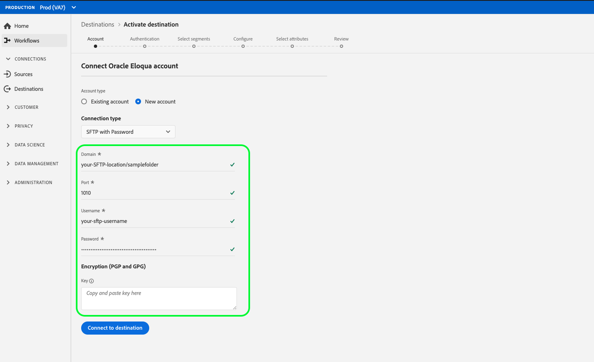

# [!DNL Oracle Eloqua]

## Översikt

[[!DNL Oracle Eloqua]](https://www.oracle.com/marketingcloud/products/marketing-automation/) är en SaaS-plattform (Software as a service) för automatiserad marknadsföring som erbjuds av [!DNL Oracle] som hjälper B2B-marknadsförare och organisationer att hantera marknadsföringskampanjer och generera säljleads.

Om du vill skicka segmentdata till [!DNL Oracle Eloqua]måste du först [ansluta målet](#connect-destination) i kunddataplattformen i realtid och sedan [konfigurera en dataimport](#import-data-into-eloqua) från lagringsplatsen till [!DNL Oracle Eloqua].

## Exporttyp {#export-type}

**Profilbaserad** - du exporterar alla medlemmar i ett segment tillsammans med önskade schemafält (till exempel: e-postadress, telefonnummer, efternamn), som du väljer på skärmen Välj attribut i arbetsflödet [för](../../ui/activate-destinations.md#select-attributes)målaktivering.

## Anslut till mål {#connect-destination}

I **[!UICONTROL Connections]** > **[!UICONTROL Destinations]** markerar du [!DNL Oracle Eloqua]och sedan **[!UICONTROL Connect destination]**.

[Anslut till Eloqua](../../assets/catalog/email-marketing/oracle-eloqua/catalog.png)

Om du tidigare har konfigurerat en anslutning till molnlagringsmålet markerar du **[!UICONTROL Authentication]** och väljer en av dina befintliga anslutningar i **[!UICONTROL Existing Account]** steget. Du kan också välja **[!UICONTROL New Account]** att konfigurera en ny anslutning. Fyll i autentiseringsuppgifter för ditt konto och välj **[!UICONTROL Connect to destination]**. Du kan t. [!DNL Oracle Eloqua]ex. välja mellan **[!UICONTROL SFTP with Password]** och **[!UICONTROL SFTP with SSH Key]**. Fyll i informationen nedan, beroende på din anslutningstyp, och välj **[!UICONTROL Connect to destination]**.

För **[!UICONTROL SFTP with Password]** anslutningar måste du ange domän, port, användarnamn och lösenord.
För **[!UICONTROL SFTP with SSH Key]** anslutningar måste du ange domän, port, användarnamn och SSH-nyckel.

I **[!UICONTROL Setup]** steget fyller du i relevant information för destinationen enligt nedan:
- **[!UICONTROL Name]**: Välj ett relevant namn för destinationen.
- **[!UICONTROL Description]**: Ange en beskrivning för destinationen.
- **[!UICONTROL Folder Path]**: Ange sökvägen till lagringsplatsen där CDP i realtid ska placera dina exportdata som CSV-filer eller tabbavgränsade filer.
- **[!UICONTROL File Format]**: **CSV** eller **TAB_DELIMITED**. Välj vilket filformat som ska exporteras till lagringsplatsen.

Klicka **[!UICONTROL Create destination]** när du har fyllt i fälten ovan. Målet har skapats och du kan [aktivera segment](../../ui/activate-destinations.md) till målet.

## Aktivera segment {#activate-segments}

Mer information om arbetsflödet för [aktivering finns i Aktivera profiler och segment till ett mål](../../ui/activate-destinations.md) .

## Målattribut {#destination-attributes}

När du [aktiverar segment](../../ui/activate-destinations.md) till [!DNL Oracle Eloqua] målet rekommenderar vi att du väljer en unik identifierare från ditt [unionsschema](../../../profile/home.md#profile-fragments-and-union-schemas). Välj den unika identifieraren och eventuella andra XDM-fält som du vill exportera till målet. Mer information finns i [Välja vilka schemafält som ska användas som målattribut i de exporterade filerna](./overview.md#destination-attributes) i Destinationer för e-postmarknadsföring.

## Exporterade data {#exported-data}

För [!DNL Oracle Eloqua] mål skapar CDP i realtid en tabbavgränsad fil `.txt` eller `.csv` fil på den lagringsplats som du angav. Mer information om filerna finns i [E-postmarknadsföringsmål och molnlagringsmål](../../ui/activate-destinations.md#esp-and-cloud-storage) i självstudiekursen om segmentaktivering.

## Konfigurera dataimport i [!DNL Oracle Eloqua] {#import-data-into-eloqua}

När du har anslutit CDP i realtid till din Amazon S3- eller SFTP-lagring måste du konfigurera dataimporten från lagringsplatsen till [!DNL Oracle Eloqua]. Mer information om hur du gör detta finns i [Importera kontakter eller konton](https://docs.oracle.com/cloud/latest/marketingcs_gs/OMCAA/Help/DataImportExport/Tasks/ImportingContactsOrAccounts.htm) i [!DNL Oracle Eloqua Help Center].