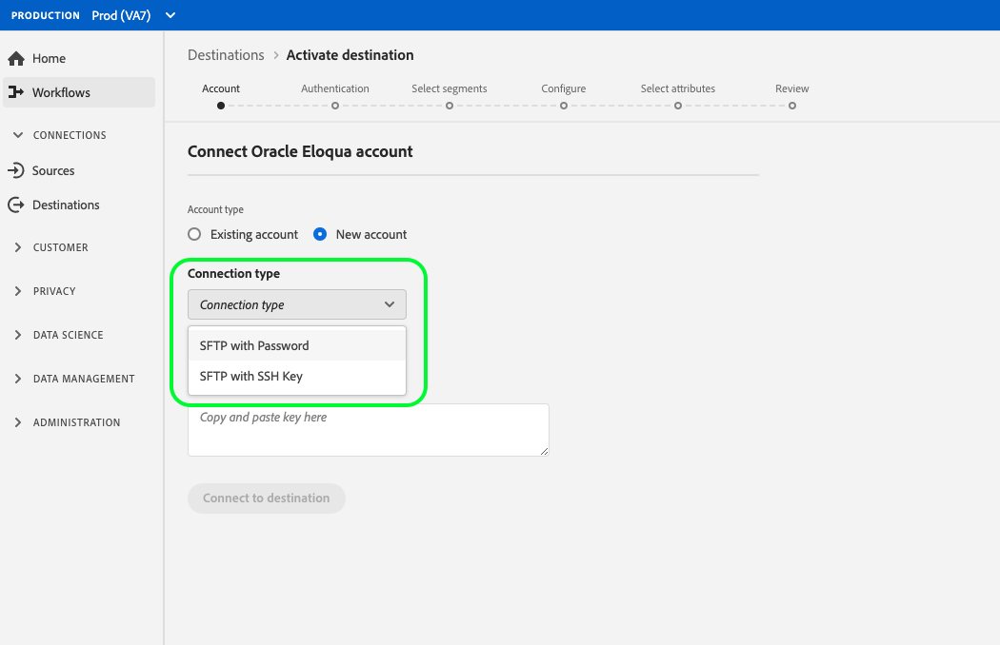

# [!DNL Oracle Eloqua] anslutning

[[!DNL Oracle Eloqua]](https://www.oracle.com/cx/marketing/automation/) är en SaaS-plattform (Software as a service) för automatiserad marknadsföring som erbjuds av  [!DNL Oracle] som hjälper B2B-marknadsförare och organisationer att hantera marknadsföringskampanjer och generera säljleads.

Om du vill skicka segmentdata till [!DNL Oracle Eloqua] måste du först [ansluta målet](#connect-destination) i Adobe Experience Platform och sedan [konfigurera en dataimport](#import-data-into-eloqua) från lagringsplatsen till [!DNL Oracle Eloqua].

## Exporttyp {#export-type}

**Profilbaserat**  - du exporterar alla medlemmar i ett segment tillsammans med önskade schemafält (till exempel: e-postadress, telefonnummer, efternamn), som du väljer på skärmen Välj attribut i arbetsflödet [ för ](../../ui/activate-destinations.md#select-attributes)målaktivering.

## IP-adress tillåtelselista {#allow-list}

När du konfigurerar e-postmarknadsföringsmål med SFTP-lagring rekommenderar Adobe att du lägger till vissa IP-intervall till tillåtelselista.

Se [IP-adressen tillåtelselista för molnlagringsdestinationer](../cloud-storage/ip-address-allow-list.md) om du behöver lägga till IP-adresser för Adobe i tillåtelselista.

## Anslut till målet {#connect-destination}

I **[!UICONTROL Connections]** > **[!UICONTROL Destinations]** väljer du [!DNL Oracle Eloqua] och sedan **[!UICONTROL Configure]**.

>[!NOTE]
>
>Om det redan finns en anslutning till det här målet kan du se en **[!UICONTROL Activate]**-knapp på målkortet. Mer information om skillnaden mellan [!UICONTROL Activate] och [!UICONTROL Configure] finns i avsnittet [Katalog](../../ui/destinations-workspace.md#catalog) i dokumentationen för målarbetsytan.

I steget **[!UICONTROL Account]** väljer du **[!UICONTROL Existing Account]** och en av dina befintliga anslutningar om du tidigare har konfigurerat en anslutning till molnlagringsmålet. Du kan också välja **[!UICONTROL New Account]** för att konfigurera en ny anslutning. Fyll i autentiseringsuppgifterna för ditt konto och välj **[!UICONTROL Connect to destination]**. För [!DNL Oracle Eloqua] kan du välja mellan **[!UICONTROL SFTP with Password]** och **[!UICONTROL SFTP with SSH Key]**.

Fyll i informationen nedan, beroende på din anslutningstyp, och välj **[!UICONTROL Connect to destination]**.

- För **[!UICONTROL SFTP with Password]**-anslutningar måste du ange [!UICONTROL Domain], [!UICONTROL Port], [!UICONTROL Username] och [!UICONTROL Password].
- För **[!UICONTROL SFTP with SSH Key]**-anslutningar måste du ange [!UICONTROL Domain], [!UICONTROL Port], [!UICONTROL Username] och [!UICONTROL SSH Key].

Du kan även bifoga den RSA-formaterade offentliga nyckeln för att lägga till kryptering med PGP/GPG till dina exporterade filer under **[!UICONTROL Key]**-avsnittet. Din offentliga nyckel måste skrivas som en [!DNL Base64]-kodad sträng.

I steget **[!UICONTROL Authentication]** ska du fylla i relevant information för destinationen enligt nedan:
- **[!UICONTROL Name]**: Välj ett relevant namn för destinationen.
- **[!UICONTROL Description]**: Ange en beskrivning för destinationen.
- **[!UICONTROL Folder Path]**: Ange sökvägen till lagringsplatsen där Plattform ska placera dina exportdata som CSV-filer eller tabbavgränsade filer.
- **[!UICONTROL File Format]**:  **** CSVor  **TAB_DELIMITED**. Välj vilket filformat som ska exporteras till lagringsplatsen.
- **[!UICONTROL Marketing actions]**: Marknadsföringsåtgärder anger för vilken metod data ska exporteras till målet. Du kan välja bland Adobe-definierade marknadsföringsåtgärder eller skapa en egen marknadsföringsåtgärd. Mer information om marknadsföringsåtgärder finns i [Översikt över dataanvändningsprinciper](../../../data-governance/policies/overview.md).

<!--

Commenting out Amazon S3 bucket part for now until support is clarified

- **[!UICONTROL Bucket name]**: Your Amazon S3 bucket, where Platform will deposit the data export. Your input must be between 3 and 63 characters long. Must begin and end with a letter or number. Must contain only lowercase letters, numbers, or hyphens ( - ). Must not be formatted as an IP address (for example, 192.100.1.1).

-->

Klicka på **[!UICONTROL Create destination]** när du har fyllt i fälten ovan. Målet har skapats och du kan [aktivera segment](../../ui/activate-destinations.md) till målet.

## Aktivera segment {#activate-segments}

Mer information om arbetsflödet för segmentaktivering finns i [Aktivera profiler och segment till ett mål](../../ui/activate-destinations.md).

## Målattribut {#destination-attributes}

När du [aktiverar segment](../../ui/activate-destinations.md) till målet [!DNL Oracle Eloqua] rekommenderar Adobe att du väljer en unik identifierare i ditt [unionsschema](../../../profile/home.md#profile-fragments-and-union-schemas). Välj den unika identifieraren och eventuella andra XDM-fält som du vill exportera till målet. Mer information finns i [Välja vilka schemafält som ska användas som målattribut i de exporterade filerna](./overview.md#destination-attributes).

## Exporterade data {#exported-data}

För [!DNL Oracle Eloqua]-mål skapar Plattform en tabbavgränsad `.csv`-fil på den angivna lagringsplatsen. Mer information om filerna finns i [E-postmarknadsföringsmål och molnlagringsmål](../../ui/activate-destinations.md#esp-and-cloud-storage) i självstudiekursen om segmentaktivering.

## Konfigurera dataimport till [!DNL Oracle Eloqua] {#import-data-into-eloqua}

När du har anslutit [!DNL Platform] till ditt [!DNL SFTP]-lagringsutrymme måste du konfigurera dataimporten från din lagringsplats till [!DNL Oracle Eloqua]. Mer information om hur du gör detta finns i [Importera kontakter eller konton](https://docs.oracle.com/cloud/latest/marketingcs_gs/OMCAA/Help/DataImportExport/Tasks/ImportingContactsOrAccounts.htm) i [!DNL Oracle Eloqua Help Center].
