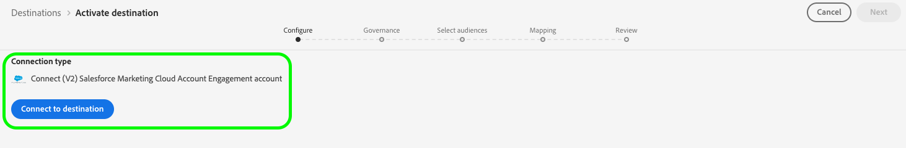
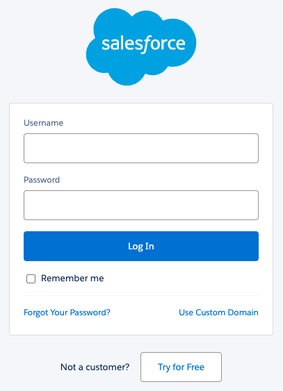

# [!DNL (V2) Salesforce Marketing Cloud Account Engagement]-anslutning

Med målet [[!DNL Salesforce Marketing Cloud Account Engagement]](https://www.salesforce.com/products/marketing-cloud/marketing-automation/) (tidigare kallat [!DNL Pardot]) kan du exportera dina Adobe Experience Platform-profildata till Salesforce automatiseringsplattform för B2B-marknadsföring.

Den här integreringen möjliggör smidig datasynkronisering mellan kundprofiler i Adobe Experience Platform och marknadsföringskampanjer i [!DNL Salesforce Marketing Cloud Account Engagement].

Det här målet använder [[!DNL Salesforce Import API v5]](https://developer.salesforce.com/docs/marketing/pardot/guide/import-v5.html) för att bearbeta batchdataexporter på ett effektivt sätt.

>[!IMPORTANT]
> 
> Det här är V2-versionen av målet [Salesforce Marketing Cloud Account Engagement](/help/destinations/catalog/email-marketing/salesforce-marketing-cloud-account-engagement.md). Den här versionen ersätter den tidigare målversionen och finns för närvarande i Alpha-utgåvan.
> >  
> > Om du för närvarande använder den tidigare versionen av målet [Salesforce Marketing Cloud Account Engagement](/help/destinations/catalog/email-marketing/salesforce-marketing-cloud-account-engagement.md) måste du migrera till den här V2-versionen före **januari 2026**. Efter januari 2026 kommer Adobe att avveckla den tidigare versionen och den kommer inte längre att vara tillgänglig.

## Användningsfall {#use-cases}

För att du bättre ska kunna förstå hur och när du ska använda målet [!DNL (V2) Marketing Cloud Account Engagement] finns det exempel på användning som Adobe Experience Platform-kunder kan lösa genom att använda det här målet.

### Leadhantering inom B2B {#use-case-lead-management}

Synkronisera lead-data från Adobe Experience Platform till [!DNL Salesforce Marketing Cloud Account Engagement] för omfattande leadorientering och poängsättning. Marknadsföringsteamet kan skapa omfattande målgruppsprofiler i Experience Platform och exportera dem till [!DNL Salesforce Marketing Cloud Account Engagement] för automatiserade B2B-marknadsföringskampanjer.

### Campaign-automatisering {#use-case-campaign-automation}

Du kan aktivera marknadsföringskampanjer i [!DNL Salesforce Marketing Cloud Account Engagement] genom att använda målgrupper som du har definierat i Adobe Experience Platform. När du har exporterat dina målgrupper till [!DNL Salesforce] kan du använda dem för att köra e-postkampanjer och hantera dina leads via näring, poängsättning och kampanjsegmentering.

### Profilberikning {#use-case-profile-enrichment}

Förbättra dina profiler för [!DNL Salesforce Marketing Cloud Account Engagement] potentiella kunder med omfattande kunddata från Adobe Experience Platform. Exportera omfattande profilattribut för att skapa mer detaljerade poster för potentiella kunder i [!DNL Salesforce Marketing Cloud Account Engagement] för förbättrad målinriktning och personalisering.

## Förhandskrav {#prerequisites}

I avsnitten nedan finns information om eventuella krav som du måste konfigurera i Experience Platform och [!DNL Salesforce]. Här finns även information som du måste samla in innan du kan arbeta med målet för [!DNL (V2) Marketing Cloud Account Engagement].

### Krav för Experience Platform {#prerequisites-in-experience-platform}

Innan du aktiverar data till målet [!DNL (V2) Marketing Cloud Account Engagement] måste du ha ett [schema](/help/xdm/schema/composition.md), en [datamängd](../../../catalog/datasets/overview.md) och [målgrupper](../../../segmentation/types/overview.md) som skapats i [!DNL Experience Platform].

### Krav för [!DNL Salesforce Marketing Cloud Account Engagement] {#prerequisites-destination}

Observera följande krav för att kunna exportera data från Experience Platform till ditt [!DNL Marketing Cloud Account Engagement]-konto:

#### Du måste ha ett [!DNL Marketing Cloud Account Engagement]-konto {#prerequisites-account}

Ett [!DNL Marketing Cloud Account Engagement]-konto med en prenumeration på [Marketing Cloud Account Engagement](https://www.salesforce.com/products/marketing-cloud/marketing-automation/)-produkten är obligatoriskt för att fortsätta.

#### Samla in inloggningsuppgifter för [!DNL Marketing Cloud Account Engagement] {#gather-credentials}

Skriv ned objekten nedan innan du autentiserar till målet [!DNL (V2) Marketing Cloud Account Engagement].

| Autentiseringsuppgifter | Beskrivning |
| --- | --- |
| **[!UICONTROL Account Engagement Business Unit ID]** | Affärsenhets-ID för ditt [!DNL Salesforce]-kontoengagemang. Läs Salesforce [dokumentation](https://help.salesforce.com/s/articleView?id=000381973&type=1) om du vill veta mer om hur du hittar ID:t. |

{style="table-layout:auto"}

## Identiteter som stöds {#supported-identities}

[!DNL (V2) Marketing Cloud Account Engagement] stöder aktivering av identiteter som beskrivs i tabellen nedan. Läs mer om [identiteter](/help/identity-service/features/namespaces.md).

Om en matchning hittas med någon av dessa identifierare uppdateras den befintliga posten för kontoengagemang med data från Adobe Experience Platform. Om ingen matchning hittas skapas en ny post för potentiell kund i Kontoengagemang.

| Målidentitet | Beskrivning | Överväganden |
|---|---|---|
| `matchId` | Prospekt-ID i kontoengagemang | Minst en av dessa tre identiteter krävs |
| `matchSalesforceId` | Salesforce lead/kontakt-ID för den potentiella kunden | Minst en av dessa tre identiteter krävs |
| `matchEmail` | E-postadress till den potentiella kunden | Minst en av dessa tre identiteter krävs |

{style="table-layout:auto"}

## Exportera typ och frekvens {#export-type-frequency}

Se tabellen nedan för information om exporttyp och frekvens för destinationen.

| Objekt | Typ | Anteckningar |
---------|----------|---------|
| Exporttyp | **[!UICONTROL Profile-based]** | <ul><li>Du exporterar alla medlemmar i en målgrupp tillsammans med de önskade schemafälten *(till exempel e-postadress, telefonnummer, efternamn)*, enligt fältmappningen.</li><li>Detta mål stöder batchexport av profildata med Salesforce Import API v5.</li></ul> |
| Exportfrekvens | **[!UICONTROL Batch]** | <ul><li>**Inledande export**: Fullständig export omedelbart efter mappning</li><li>**Efterföljande exporter**: Inkrementell export var tredje timme</li><li>Schemat är fast och kan inte anpassas i Alpha</li></ul> |

{style="table-layout:auto"}

## Anslut till målet {#connect}

>[!IMPORTANT]
>
>Om du vill ansluta till målet behöver du behörigheterna **[!UICONTROL View Destinations]** och **[!UICONTROL Manage Destinations]** [åtkomstkontroll](/help/access-control/home.md#permissions). Läs [åtkomstkontrollsöversikten](/help/access-control/ui/overview.md) eller kontakta produktadministratören för att få den behörighet som krävs.

Om du vill ansluta till det här målet följer du stegen som beskrivs i självstudiekursen [för destinationskonfiguration](../../ui/connect-destination.md). I arbetsflödet för att konfigurera mål fyller du i fälten som listas i de två avsnitten nedan.

### Autentisera till mål {#authenticate}

Om du vill autentisera till målet väljer du **[!UICONTROL Connect to destination]**.

Du omdirigeras till inloggningssidan för [!DNL Salesforce]. Ange autentiseringsuppgifterna för ditt [!DNL Marketing Cloud Account Engagement]-konto och välj **[!UICONTROL Log In]**.

Välj sedan **[!UICONTROL Allow]** för att ge **Adobe Experience Platform**-appen behörighet att komma åt ditt [!DNL Salesforce Marketing Cloud Account Engagement]-konto. *Du behöver bara göra detta en gång*.

Om den angivna informationen är giltig visas ett meddelande i användargränssnittet: *Du har anslutit till (V2) Salesforce Marketing Cloud Account Engagement-konto* och en **[!UICONTROL Connected]**-status med en grön bockmarkering.

### Fyll i målinformation {#destination-details}

Om du vill konfigurera information för målet fyller du i de obligatoriska och valfria fälten nedan. En asterisk bredvid ett fält i användargränssnittet anger att fältet är obligatoriskt.

* **[!UICONTROL Name]**: Ett namn som du känner igen det här målet med i framtiden.
* **[!UICONTROL Description]**: En beskrivning som hjälper dig att identifiera det här målet i framtiden.
* **[!UICONTROL Account Engagement Business Unit ID]**: Din [!DNL Salesforce] `Account Engagement Business Unit ID`.
* **[!UICONTROL Account Engagement API]**: Välj om du vill använda slutpunkterna för produktion (`https://pi.pardot.com`) eller demo (`https://pi.demo.pardot.com`) i kontoengagemangs-API:t.
* **[!UICONTROL Account Engagement Campaign ID]**: Alla [!DNL Account Engagement]-potentiella kunder måste associeras med en kampanj. Om du inte anger ett kampanj-ID försöker Account Engagement tilldela ett automatiskt om det finns ett standardvärde i ditt Salesforce-konto.

### Aktivera aviseringar {#enable-alerts}

Du kan aktivera varningar för att få meddelanden om dataflödets status till ditt mål. Välj en avisering i listan om du vill prenumerera och få meddelanden om statusen för ditt dataflöde. Mer information om varningar finns i guiden [prenumerera på destinationsvarningar med användargränssnittet](../../ui/alerts.md).

Välj **[!UICONTROL Next]** när du är klar med att ange information för målanslutningen.

## Aktivera målgrupper till det här målet {#activate}

>[!IMPORTANT]
> 
>* För att aktivera data behöver du behörigheterna **[!UICONTROL View Destinations]**, **[!UICONTROL Activate Destinations]**, **[!UICONTROL View Profiles]** och **[!UICONTROL View Segments]** [åtkomstkontroll](/help/access-control/home.md#permissions). Läs [åtkomstkontrollsöversikten](/help/access-control/ui/overview.md) eller kontakta produktadministratören för att få den behörighet som krävs.
>* Om du vill exportera *identiteter* måste du ha **[!UICONTROL View Identity Graph]** [åtkomstkontrollbehörighet](/help/access-control/home.md#permissions).   {width="100" zoomable="yes"}

Läs [Aktivera målgruppsdata för att batchprofilera exportmål](/help/destinations/ui/activate-batch-profile-destinations.md) om du vill ha instruktioner om hur du aktiverar målgrupper till det här målet.

### Mappa överväganden och exempel {#mapping-considerations-example}

Om du vill skicka målgruppsdata från Adobe Experience Platform till målet [!DNL (V2) Marketing Cloud Account Engagement] måste du mappa XDM-schemafälten (Experience Data Model) till motsvarande fält i målet.

Se [Salesforce Prospect API v5-dokumentationen](https://developer.salesforce.com/docs/marketing/pardot/guide/prospect-v5.html) för en fullständig lista över fält som stöds. Observera att [anpassade fält](https://developer.salesforce.com/docs/marketing/pardot/guide/custom-field-v5.html) inte stöds i Alpha-versionen.

#### Attribut som stöds {#supported-attributes}

Salesforce Marketing Cloud Account Engagement-målet stöder de målattribut som beskrivs i tabellen nedan.

| Attribut | Typ | Beskrivning |
|---------|----------|----------|
| `salesforceId` | Sträng | Den potentiella kundens Salesforce-ID |
| `salesforceOwnerId` | Heltal | Salesforce användar-ID för den potentiella kundens ägare |
| `salutation` | Sträng | Den potentiella kundens hälsningsfras (t.ex. herr, fröken, dr) |
| `score` | Heltal | Den potentiella kundens poäng i Kontoengagemang |
| `source` | Sträng | Källan till posten för potentiell kund |
| `state` | Sträng | Den potentiella kundens delstat/provins |
| `territory` | Sträng | Området som tilldelats den potentiella kunden |
| `userId` | Heltal | Det användar-ID som är associerat med den potentiella kunden |
| `website` | Sträng | Den potentiella kundens webbplats-URL |
| `yearsInBusiness` | Sträng | Antal år som den potentiella kunden har varit i affärsverksamhet |
| `zip` | Sträng | Den potentiella kundens postnummer |

#### Obligatoriska mappningar {#required-mappings}

Innan du börjar mappa dina data ska du granska de obligatoriska fältmappningarna nedan.

| Målfält | Typ | Obligatoriskt | När ska du använda |
|---|---|---|---|
| `email` | Attribut | Alltid obligatoriskt | Den potentiella kundens e-postadress. Det här är den primära identifieraren för att hitta och matcha poster för potentiella kunder i kontoengagemang när du inte har någon `matchId` eller `matchSalesforceId`.   **Obs!** Med kontoengagemangets funktion&quot;Tillåt flera potentiella kunder med samma e-postadress&quot; kan ett beroende av enbart e-post leda till tvetydighet om det finns flera potentiella kunder med samma e-postadress. Kontoengagemang uppdaterar vanligtvis den potentiella kunden med den senaste aktiviteten i sådana fall. |
| `matchId` | Identitet | Minst en av dessa tre identiteter krävs | En unik identifierare som genereras av Kontoengagemang för varje enskild post för potentiell kund. Använd detta när du redan har ett ID för kontoengagemang och vill se till att uppdateringar tillämpas på rätt potentiella kunder, särskilt när flera potentiella kunder delar samma e-postadress. |
| `matchSalesforceId` | Identitet | Minst en av dessa tre identiteter krävs | Salesforce-id för en lead eller kontakt i Salesforce. Använd detta när en potentiell kund redan har synkroniserats med Salesforce för att upprätthålla datakonsekvensen mellan Account Engagement och Salesforce. |
| `matchEmail` | Identitet | Minst en av dessa tre identiteter krävs | Den potentiella kundens e-postadress som används för matchning. Använd detta som en alternativ identifierare om du inte har det specifika ID:t för kontoengagemang eller Salesforce ID:t. Obs! Om flera potentiella kunder delar samma e-postadress kommer kontoengagemang vanligtvis att uppdatera den potentiella kunden med den senaste aktiviteten. |

Följ stegen nedan för att mappa rätt fält.

1. Välj **[!UICONTROL Mapping]** i steget **[!UICONTROL Add new mapping]**. En ny mappningsrad visas på skärmen.
1. Välj kategorin **[!UICONTROL Select source field]** i fönstret **[!UICONTROL Select attributes]** och markera XDM-attributet eller välj **[!UICONTROL Select identity namespace]** och välj en identitet.
1. I fönstret **[!UICONTROL Select target field]** väljer du **[!UICONTROL Select identity namespace]** och väljer en identitet eller väljer kategorin **[!UICONTROL Select custom attributes]** och anger i listan över standardfält för kontoengagemang.

## Validera dataexport {#exported-data}

Följ stegen nedan för att verifiera att du har konfigurerat målet korrekt:

1. Navigera till en av de valda målgrupperna. Klicka på fliken **[!DNL Activation data]**.  Kolumnen **[!UICONTROL Mapping ID]** visar namnet på det anpassade fält som genereras på sidan [!DNL Marketing Cloud Account Engagement Prospects].
   

1. Logga in på webbplatsen [[!DNL Salesforce]](https://login.salesforce.com/). Gå sedan till sidan **[!DNL Account Engagement]** > **[!DNL Prospects]** > **[!DNL Pardot Prospects]** och kontrollera om potentiella kunder från målgruppen har lagts till/uppdaterats. Du kan även komma åt [[!DNL Account Engagement]](https://pi.pardot.com/) och få åtkomst till sidan **[!DNL Prospects]**.
   

1. Om du vill kontrollera om potentiella kunder har uppdaterats väljer du en potentiell kund och kontrollerar om fältet för anpassad potentiell kund har uppdaterats med Experience Platform målgruppsstatus.
   

## Dataanvändning och styrning {#data-usage-governance}

Alla [!DNL Adobe Experience Platform]-mål är kompatibla med dataanvändningsprinciper när data hanteras. Mer information om hur [!DNL Adobe Experience Platform] använder datastyrning finns i [Datastyrningsöversikten](/help/data-governance/home.md).

## Ytterligare resurser {#additional-resources}

* [!DNL Marketing Cloud Account Engagement] [API-dokumentation](https://developer.salesforce.com/docs/marketing/pardot/guide/overview.html)
* [Salesforce Import API v5 Documentation](https://developer.salesforce.com/docs/marketing/pardot/guide/import-v5.html)
* [Salesforce Prospect API v5 Documentation](https://developer.salesforce.com/docs/marketing/pardot/guide/prospect-v5.html)