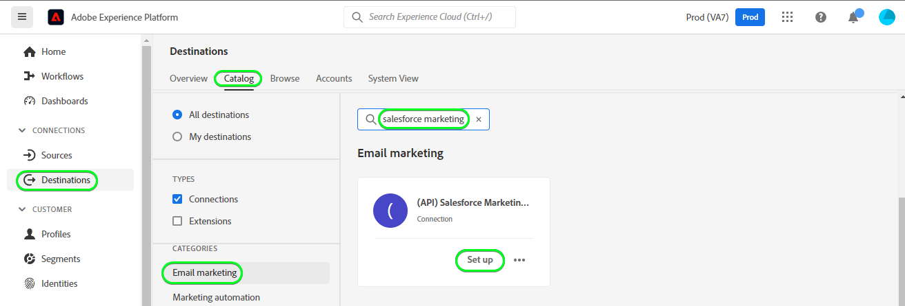

# [!DNL (API) Salesforce Marketing Cloud] anslutning

## Översikt {#overview}

[[!DNL Salesforce Marketing Cloud]](https://www.salesforce.com/products/marketing-cloud/overview/) (tidigare kallat ExactTarget) är en digital marknadsföringssvit som gör att ni kan skapa och anpassa resor för besökare och kunder för att personalisera deras upplevelse.

>[!IMPORTANT]
> 
> Observera skillnaden mellan den här anslutningen och den andra [Salesforce Marketing Cloud-anslutning](https://experienceleague.adobe.com/docs/experience-platform/destinations/catalog/email-marketing/salesforce-marketing-cloud.html?lang=en) som finns i katalogavsnittet E-postmarknadsföring. Med den andra Salesforce Marketing Cloud-anslutningen kan du exportera filer till en angiven lagringsplats, medan detta är en API-baserad direktuppspelningsanslutning.

Detta [!DNL Adobe Experience Platform] [mål](/help/destinations/home.md) utnyttjar [REST API för Salesforce Update Contacts](https://developer.salesforce.com/docs/marketing/marketing-cloud/guide/updateContacts.html), som gör att du kan lägga till kontakter/uppdatera kontaktdata för dina affärsbehov efter att ha aktiverat dem i ett nytt Salesforce-segment.

Salesforce Marketing Cloud använder OAuth 2 med klientautentiseringsuppgifter som autentiseringsmekanism för att kommunicera med Salesforce REST API. Instruktioner för autentisering till Salesforce-instansen finns längre ned i [Autentisera till mål](#authenticate) -avsnitt.

## Användningsfall {#use-cases}

För att du bättre ska kunna förstå hur och när du ska använda Salesforce-destinationen Marketing Cloud finns det ett exempel på användning som Adobe Experience Platform-kunder kan lösa genom att använda den här destinationen.

### Skicka e-post till kontakter för marknadsföringskampanjer {#use-case-send-emails}

Försäljningsavdelningen på en uthyrningsplattform vill sända ett marknadsföringsmejl till en målgrupp. Plattformens marknadsföringsteam kan lägga till nya kontakter/uppdatera befintliga kontakter *(och deras e-postadresser)* genom Adobe Experience Platform, skapa segment utifrån sina egna offlinedata och skicka dessa segment till Salesforce Marketing Cloud, som sedan kan användas för att skicka marknadsföringskampanjens e-post.

## Förutsättningar {#prerequisites}

### Förutsättningar i Experience Platform {#prerequisites-in-experience-platform}

Innan du aktiverar data till Salesforce Marketing Cloud-målet måste du ha en [schema](/help/xdm/schema/composition.md), a [datauppsättning](https://experienceleague.adobe.com/docs/platform-learn/tutorials/data-ingestion/create-datasets-and-ingest-data.html?lang=en)och [segment](https://experienceleague.adobe.com/docs/platform-learn/tutorials/segments/create-segments.html?lang=en) skapad i [!DNL Experience Platform].

### Förutsättningar i Salesforce CRM {#prerequisites-destination}

Observera följande krav i Salesforce för att kunna exportera data från Platform till ditt Salesforce Marketing Cloud-konto:

#### Du måste ha ett Salesforce-konto {#prerequisites-account}

Gå till Salesforce [testversion](https://www.salesforce.com/in/form/signup/freetrial-sales/) om du vill registrera och skapa ett Salesforce-konto, om du inte redan har ett.

#### Skapa anpassat fält i Salesforce {#prerequisites-custom-field}

Du måste skapa ett anpassat attribut av typen `Text Area Long`, som Experience Platform ska använda för att uppdatera segmentstatusen i Salesforce Marketing Cloud. I arbetsflödet för att aktivera segment till målet, i **[Segmentschema](#schedule-segment-export-example)** använder du det anpassade attributet som mappnings-ID för varje segment som du aktiverar.

Läs Salesforce Marketing Cloud-dokumentationen för att [skapa anpassade fält](https://help.salesforce.com/s/articleView?id=mc_cab_create_an_attribute.htm&amp;type=5&amp;language=en_US) om du behöver ytterligare vägledning.

>[!IMPORTANT]
>
> Se till att du skapar det anpassade attributet under attributuppsättningen&quot;Email Demographics&quot; i ditt Salesforce Marketing Cloud-konto.

>[!NOTE]
>
> * Antalet anpassade attribut som tillåts per objekt varierar beroende på din Salesforce Edition. Läs Salesforce-dokumentationen för [anpassade fält tillåtna per objekt](https://help.salesforce.com/s/articleView?id=sf.custom_field_allocations.htm&amp;type=5) om du behöver ytterligare vägledning.
> * Om du har nått denna gräns i Salesforce måste du ta bort det anpassade attributet från Salesforce som användes för att lagra segmentstatusen mot äldre segment i Experience Platform innan ett nytt mappnings-ID kan användas.

Läs Adobe Experience Platform-dokumentationen för [Schemafältgrupp för detaljer om segmentmedlemskap](/help/xdm/field-groups/profile/segmentation.md) om du behöver vägledning om segmentstatus.

#### Samla in Salesforce-inloggningsuppgifter {#gather-credentials}

Observera objekten nedan innan du autentiserar till Salesforce Marketing Cloud-målet.

| Autentiseringsuppgifter | Beskrivning | Exempel |
| --- | --- | --- |
| <ul><li>Salesforce Marketing Cloud prefix</li></ul> | Se [Domänprefix för Salesforce Marketing Cloud](https://help.salesforce.com/s/articleView?id=sf.domain_name_setting_login_policy.htm&amp;type=5) för ytterligare vägledning. | <ul><li>Om din domän är som nedan behöver du det markerade värdet.  <i>`mcq4jrssqdlyc4lph19nnqgzzs84`.login.exactarget.com</i></li></ul> |
| <ul><li>Klient-ID</li><li>Klienthemlighet</li></ul> | Se [Salesforce-dokumentation](https://developer.salesforce.com/docs/marketing/marketing-cloud/guide/access-token-s2s.html) om du behöver ytterligare vägledning. | <ul><li>r23kxxxxxx0z05xxxx</li><li>ipxxxxxxxxxxT4xxxxxxxx</li></ul> |

{style=&quot;table-layout:auto&quot;}

## Identiteter som stöds {#supported-identities}

Salesforce Marketing Cloud stöder aktivering av identiteter som beskrivs i tabellen nedan. Läs mer om [identiteter](/help/identity-service/namespaces.md).

| Målidentitet | Beskrivning | Överväganden |
|---|---|---|
| contactKey | Salesforce-kontaktnyckel. Se [Salesforce-dokumentation](https://help.salesforce.com/s/articleView?id=sf.mc_cab_contact_builder_best_practices.htm&amp;type=5) om du behöver ytterligare vägledning. | Obligatoriskt |

## Exportera typ och frekvens {#export-type-frequency}

Se tabellen nedan för information om exporttyp och frekvens för destinationen.

| Objekt | Typ | Anteckningar |
---------|----------|---------|
| Exporttyp | **[!UICONTROL Profile-based]** | Du exporterar alla medlemmar i ett segment tillsammans med önskade schemafält (till exempel: e-postadress, telefonnummer, efternamn), som du har valt på skärmen Välj profilattribut i [arbetsflöde för målaktivering](/help/destinations/ui/activate-batch-profile-destinations.md#select-attributes). |
| Exportfrekvens | **[!UICONTROL Streaming]** | Direktuppspelningsmål är alltid på API-baserade anslutningar. Så snart en profil uppdateras i Experience Platform baserat på segmentutvärdering skickar kopplingen uppdateringen nedåt till målplattformen. Läs mer om [mål för direktuppspelning](/help/destinations/destination-types.md#streaming-destinations). |

{style=&quot;table-layout:auto&quot;}

## Anslut till målet {#connect}

>[!IMPORTANT]
> 
>Om du vill ansluta till målet behöver du **[!UICONTROL Manage Destinations]** [åtkomstkontrollbehörighet](/help/access-control/home.md#permissions). Läs [åtkomstkontroll - översikt](/help/access-control/ui/overview.md) eller kontakta produktadministratören för att få de behörigheter som krävs.

Om du vill ansluta till det här målet följer du stegen som beskrivs i [självstudiekurs om destinationskonfiguration](../../ui/connect-destination.md). I arbetsflödet för att konfigurera mål fyller du i fälten som listas i de två avsnitten nedan.

### Autentisera till mål {#authenticate}

Om du vill autentisera mot målet fyller du i de obligatoriska fälten och väljer **[!UICONTROL Connect to destination]**.

* **[!UICONTROL Subdomain]**: Ditt Salesforce Marketing Cloud-domänprefix. Om din domän till exempel är *`mcq4jrssqdlyc4lph19nnqgzzs84`.login.exactarget.com* behöver du det markerade värdet.
* **[!UICONTROL Client ID]**: Ditt Salesforce-klient-ID.
* **[!UICONTROL Client Secret]**: Din Salesforce-klienthemlighet.

Om den angivna informationen är giltig visas en **Ansluten** status med en grön bockmarkering kan du fortsätta till nästa steg.

### Fyll i målinformation {#destination-details}

Om du vill konfigurera information för målet fyller du i de obligatoriska och valfria fälten nedan. En asterisk bredvid ett fält i användargränssnittet anger att fältet är obligatoriskt.

* **[!UICONTROL Name]**: Ett namn som du känner igen det här målet med i framtiden.
* **[!UICONTROL Description]**: En beskrivning som hjälper dig att identifiera det här målet i framtiden.
* **[!UICONTROL Customer name]**: Detta kan vara vilket värde som helst, men ett värde är obligatoriskt. Annars misslyckas målaktiveringen.

### Aktivera aviseringar {#enable-alerts}

Du kan aktivera varningar för att få meddelanden om dataflödets status till ditt mål. Välj en avisering i listan om du vill prenumerera och få meddelanden om status för ditt dataflöde. Mer information om varningar finns i guiden [prenumerera på destinationsvarningar med hjälp av användargränssnittet](../../ui/alerts.md).

När du är klar med informationen för målanslutningen väljer du **[!UICONTROL Next]**.

## Aktivera segment till den här destinationen {#activate}

>[!IMPORTANT]
> 
>Om du vill aktivera data måste du ha **[!UICONTROL Manage Destinations]**, **[!UICONTROL Activate Destinations]**, **[!UICONTROL View Profiles]** och **[!UICONTROL View Segments]** [behörigheter för åtkomstkontroll](/help/access-control/home.md#permissions). Läs [åtkomstkontroll - översikt](/help/access-control/ui/overview.md) eller kontakta produktadministratören för att få de behörigheter som krävs.

Läs [Aktivera profiler och segment för att direktuppspela segmentexportmål](/help/destinations/ui/activate-segment-streaming-destinations.md) om du vill ha instruktioner om hur du aktiverar målgruppssegment till det här målet.

### Mappa överväganden och exempel {#mapping-considerations-example}

Om du vill skicka målgruppsdata från Adobe Experience Platform till Salesforce Marketing Cloud måste du gå igenom fältmappningssteget. Mappningen består av att skapa en länk mellan XDM-schemafälten (Experience Data Model) i ditt plattformskonto och motsvarande motsvarigheter från målmålet. Följ stegen nedan för att mappa dina XDM-fält till målfälten i Salesforce Marketing Cloud.

Listan med attributmappningar som kan ställas in för [Salesforce REST API](https://developer.salesforce.com/docs/atlas.en-us.api_rest.meta/api_rest/dome_composite_upsert_example.htm?q=contacts) anges nedan. Målet använder [Salesforce Search Attribut-Set Definitions REST API](https://developer.salesforce.com/docs/marketing/marketing-cloud/guide/retrieveAttributeSetDefinitions.html) för att hämta attribut som definierats i Salesforce för dina kontakter och som är specifika för ditt konto.

>[!IMPORTANT]
> 
> Även om dina attributnamn är som i ditt Salesforce-konto är mappningarna för `contactKey` och `personalEmail.address` är obligatoriska.

1. Klicka på i mappningssteget **[!UICONTROL Add new mapping]**. Nu kan du se en ny mappningsrad på skärmen.
   

1. När du väljer källfältet i fönstret Välj källfält väljer du **[!UICONTROL Select attributes]** och lägg till mappningarna.
   

1. Markera målfältet och välj **[!UICONTROL Select identity namespace]** och lägg till mappningarna.
   

1. Om du vill mappa anpassade attribut väljer du målfältsfönstret, markerar målfältet och väljer **[!UICONTROL Select attributes]** > **E-postdemografi** kategori. Ange sedan önskat målattributnamn och lägg till önskade mappningar.
   

1. Du kan till exempel lägga till följande mappning mellan XDM-profilschemat och [!DNL Salesforce Marketing Cloud] instans:

   |  | XDM-profilschema | [!DNL Salesforce Marketing Cloud] Instans | Obligatoriskt |
   |---|---|---|---|
   | Attribut | <ul><li>person.name.firstName</code></li><li>personalEmail.address</code></li></ul> | <ul><li>E-postdemografi.Förnamn</code></li><li>E-postadresser.E-postadress</code></li></ul> | <ul><li>–</li><li>Ja</code></li></ul> |
   | Identiteter | <ul><li>contactKey</code></li></ul> | <ul><li>salesforceContactKey</code></li></ul> | Ja |

1. Ett exempel på hur du använder dessa mappningar visas nedan:
   

### Schemalägg segmentexport och exempel {#schedule-segment-export-example}

När du utför [Schemalägg segmentexport](/help/destinations/ui/activate-segment-streaming-destinations.md#scheduling) måste du manuellt mappa plattformssegment till det anpassade attributet i Salesforce.

Det gör du genom att markera varje segment och sedan ange motsvarande anpassade attribut från Salesforce i dialogrutan **[!UICONTROL Mapping ID]** fält.

>[!IMPORTANT]
>
> Värdet som används för mappnings-ID:t ska exakt matcha namnet på det anpassade attributet som skapats i Salesforce under attributuppsättningen&quot;Email Demographics&quot;.

Ett exempel visas nedan:

## Validera dataexport {#exported-data}

Följ stegen nedan för att verifiera att du har konfigurerat målet korrekt:

1. Välj **[!UICONTROL Destinations]** > **[!UICONTROL Browse]** för att navigera till listan över destinationer.

   

1. Markera målet och validera att statusen är **[!UICONTROL enabled]**.

   

1. Växla till **[!DNL Activation data]** väljer du ett segmentnamn.

   

1. Övervaka segmentsammanfattningen och se till att antalet profiler motsvarar antalet som skapas i segmentet.

   

1. Logga in på webbplatsen Salesforce Marketing Cloud. Navigera sedan till **[!DNL Audience Builder]** > **[!DNL Contact Builder]** > **[!DNL All contacts]** > **[!DNL Email]** och kontrollera om profilerna från segmentet har lagts till.

   

1. Navigera till **[!DNL Email]** kontrollera om attributvärdena för profilen från segmentet har uppdaterats.

   

## Dataanvändning och styrning {#data-usage-governance}

Alla [!DNL Adobe Experience Platform] destinationerna är kompatibla med dataanvändningsprinciper när data hanteras. Detaljerad information om hur [!DNL Adobe Experience Platform] använder datastyrning, se [Datastyrning - översikt](/help/data-governance/home.md).

## Fel och felsökning {#errors-and-troubleshooting}

### Okända fel påträffades när händelser skickades till Salesforce Marketing Cloud {#unknown-errors}

Om felmeddelandet nedan visas när du kontrollerar ett dataflöde kontrollerar du att det mappnings-ID som du angav i [!DNL Salesforce CRM] för ditt plattformssegment är giltigt och finns inom [!DNL Salesforce CRM].

## Ytterligare resurser {#additional-resources}

* [Salesforce-utvecklarportal](https://developer.salesforce.com/)

### Gränser {#limits}

* Salesforce inför vissa [hastighetsbegränsningar](https://developer.salesforce.com/docs/marketing/marketing-cloud/guide/rate-limiting.html).
* Se [fel i hastighetsbegränsningar](https://developer.salesforce.com/docs/marketing/marketing-cloud/guide/rate-limiting-errors.html) för att kontrollera eventuella fel som kan uppstå.
* Se [Salesforce Marketing Cloud Engagement Pricing](https://www.salesforce.com/editions-pricing/marketing-cloud/email/) sida till *Ladda ned jämförelsetabellen för fullversionen* som en pdf som detaljerar de begränsningar som din plan innebär.
* The [API-översikt](https://developer.salesforce.com/docs/marketing/marketing-cloud/guide/apis-overview.html) ytterligare begränsningar för sidinformation.
* Det finns ett kB-objekt som sorterar informationen [här](https://salesforce.stackexchange.com/questions/205898/marketing-cloud-api-limits#:~:text=Day%2FHour%2FMinute%20Limit&amp;text=We%20recommend%20a%20limit%20of,per%20minute%20for%20SOAP%20calls.&amp;text=As%20has%20has%20added%20in,interacting%20with%20the%20REST%2DAPI).
