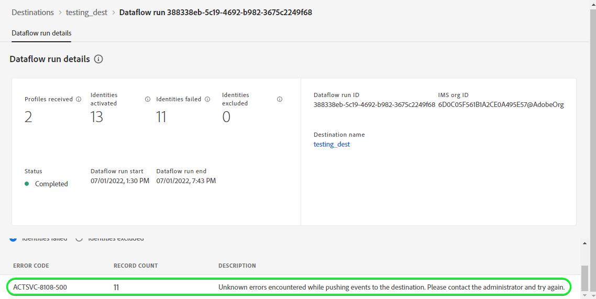

# [!DNL (API) Salesforce Marketing Cloud] anslutning

## Översikt {#overview}

[[!DNL Salesforce Marketing Cloud]](https://www.salesforce.com/products/marketing-cloud/overview/) (tidigare känt som [!DNL ExactTarget]) är en digital marknadsföringssvit som gör att ni kan skapa och anpassa resor för besökare och kunder för att personalisera deras upplevelse.

>[!IMPORTANT]
>
>Observera skillnaden mellan den här anslutningen och den andra [[!DNL Salesforce Marketing Cloud] anslutning](/help/destinations/catalog/email-marketing/salesforce-marketing-cloud.md) som finns i katalogavsnittet E-postmarknadsföring. Med den andra Salesforce Marketing Cloud-anslutningen kan du exportera filer till en angiven lagringsplats, medan detta är en API-baserad direktuppspelningsanslutning.

Detta [!DNL Adobe Experience Platform] [mål](/help/destinations/home.md) utnyttjar [!DNL Salesforce Marketing Cloud] [uppdatera kontakter](https://developer.salesforce.com/docs/marketing/marketing-cloud/guide/updateContacts.html) API, som gör att du kan lägga till kontakter/uppdatera kontaktdata för ditt företags behov efter att ha aktiverat dem i en ny [!DNL Salesforce Marketing Cloud] segment.

[!DNL Salesforce Marketing Cloud] använder OAuth 2 med klientautentiseringsuppgifter som autentiseringsmekanism för att kommunicera med [!DNL Salesforce Marketing Cloud] API. Instruktioner för hur du autentiserar [!DNL Salesforce Marketing Cloud] -instansen är längre ned, i [Autentisera till mål](#authenticate) -avsnitt.

## Användningsfall {#use-cases}

För att du bättre ska förstå hur och när du ska använda [!DNL Salesforce Marketing Cloud] mål, här är ett exempel på användning som Adobe Experience Platform-kunder kan lösa genom att använda den här destinationen.

### Skicka e-post till kontakter för marknadsföringskampanjer {#use-case-send-emails}

Försäljningsavdelningen på en uthyrningsplattform vill sända ett marknadsföringsmejl till en målgrupp. Plattformens marknadsföringsteam kan lägga till nya kontakter/uppdatera befintliga kontakter *(och deras e-postadresser)* genom Adobe Experience Platform, skapa segment utifrån sina egna offlinedata och skicka dessa segment till [!DNL Salesforce Marketing Cloud]som sedan kan användas för att skicka marknadsföringskampanjens e-post.

## Förutsättningar {#prerequisites}

### Förutsättningar i Experience Platform {#prerequisites-in-experience-platform}

Innan du aktiverar data för [!DNL Salesforce Marketing Cloud] mål, du måste ha en [schema](/help/xdm/schema/composition.md), a [datauppsättning](https://experienceleague.adobe.com/docs/platform-learn/tutorials/data-ingestion/create-datasets-and-ingest-data.html?lang=en)och [segment](https://experienceleague.adobe.com/docs/platform-learn/tutorials/segments/create-segments.html?lang=en) skapad i [!DNL Experience Platform].

### Förutsättningar [!DNL Salesforce Marketing Cloud] {#prerequisites-destination}

Observera följande krav för att kunna exportera data från Platform till [!DNL Salesforce Marketing Cloud] konto:

#### Du måste ha en [!DNL Salesforce Marketing Cloud] konto {#prerequisites-account}

Nå ut till [!DNL Salesforce Account Executive] prenumerera på [!DNL Salesforce Marketing Cloud Account Engagement] om du inte redan har det.

#### Skapa anpassat fält i [!DNL Salesforce Marketing Cloud] {#prerequisites-custom-field}

Du måste skapa ett anpassat attribut av typen `Text Area Long`som Experience Platform ska använda för att uppdatera segmentstatusen i [!DNL Salesforce Marketing Cloud]. I arbetsflödet för att aktivera segment till målet, i **[Segmentschema](#schedule-segment-export-example)** använder du det anpassade attributet som **[!UICONTROL Mapping ID]** för varje segment som du aktiverar.

Se [!DNL Salesforce Marketing Cloud] dokumentation till [skapa anpassade fält](https://help.salesforce.com/s/articleView?id=mc_cab_create_an_attribute.htm&amp;type=5&amp;language=en_US) om du behöver ytterligare vägledning.

>[!IMPORTANT]
>
> Se till att du skapar det anpassade attributet under `Email Demographics` i din [!DNL Salesforce Marketing Cloud] konto.

Läs Adobe Experience Platform-dokumentationen för [Schemafältgrupp för detaljer om segmentmedlemskap](/help/xdm/field-groups/profile/segmentation.md) om du behöver vägledning om segmentstatus.

#### Samla in Salesforce-inloggningsuppgifter {#gather-credentials}

Anteckna vad som står nedan innan du autentiserar dig för [!DNL Salesforce Marketing Cloud] mål.

| Autentiseringsuppgifter | Beskrivning | Exempel |
| --- | --- | --- |
| <ul><li>[!DNL Salesforce Marketing Cloud] prefix</li></ul> | Se [[!DNL Salesforce Marketing Cloud domain prefix]](https://developer.salesforce.com/docs/marketing/marketing-cloud/guide/your-subdomain-tenant-specific-endpoints.html) för ytterligare vägledning. | <ul><li>Om din domän är som nedan behöver du det markerade värdet.  <i>`mcq4jrssqdlyc4lph19nnqgzzs84`.login.exactarget.com</i></li></ul> |
| <ul><li>Klient-ID</li><li>Klienthemlighet</li></ul> | Se [!DNL Salesforce Marketing Cloud] [dokumentation](https://developer.salesforce.com/docs/marketing/marketing-cloud/guide/access-token-s2s.html) om du behöver ytterligare vägledning. | <ul><li>r23kxxxxxx0z05xxxx</li><li>ipxxxxxxxxxxT4xxxxxxxx</li></ul> |

{style=&quot;table-layout:auto&quot;}

## Gränser i [!DNL Salesforce Marketing Cloud] {#limits}

* Salesforce inför vissa [hastighetsbegränsningar](https://developer.salesforce.com/docs/marketing/marketing-cloud/guide/rate-limiting.html).
   * Se [!DNL Salesforce Marketing Cloud] [dokumentation](https://developer.salesforce.com/docs/marketing/marketing-cloud/guide/rate-limiting-errors.html) för att åtgärda eventuella begränsningar som kan uppstå och minska antalet fel under körningen.
   * Se [[!DNL Salesforce Marketing Cloud] Priser](https://www.salesforce.com/editions-pricing/marketing-cloud/email/) sida till *Ladda ned jämförelsetabellen för fullversionen* som en pdf som detaljerar de begränsningar som din plan innebär.
   * The [API-översikt](https://developer.salesforce.com/docs/marketing/marketing-cloud/guide/apis-overview.html) ytterligare begränsningar för sidinformation.
   * Referens [här](https://salesforce.stackexchange.com/questions/205898/marketing-cloud-api-limits) för en sida som sammanställer dessa uppgifter.
* Antal *anpassade fält tillåtna per objekt* varierar beroende på din Salesforce Edition.
   * Se [!DNL Salesforce] [dokumentation](https://help.salesforce.com/s/articleView?id=sf.custom_field_allocations.htm&amp;type=5) för ytterligare vägledning.
   * Om du har nått gränsen för *anpassade fält tillåtna per objekt* inom [!DNL Salesforce Marketing Cloud] måste du
      * Ta bort äldre anpassade fält innan du lägger till nya anpassade fält i [!DNL Salesforce Marketing Cloud].
      * Uppdatera eller ta bort alla mål i plattformen som använder dessa äldre anpassade fältnamn som det angivna värdet **[!UICONTROL Mapping ID]** under [segmentplanering](#schedule-segment-export-example) steg.

## Identiteter som stöds {#supported-identities}

[!DNL Salesforce Marketing Cloud] stöder aktivering av identiteter som beskrivs i tabellen nedan. Läs mer om [identiteter](/help/identity-service/namespaces.md).

| Målidentitet | Beskrivning | Överväganden |
|---|---|---|
| contactKey | [!DNL Salesforce Marketing Cloud] Kontaktnyckel. Se [!DNL Salesforce Marketing Cloud] [dokumentation](https://help.salesforce.com/s/articleView?id=sf.mc_cab_contact_builder_best_practices.htm&amp;type=5) om du behöver ytterligare vägledning. | Obligatoriskt |

## Exportera typ och frekvens {#export-type-frequency}

Se tabellen nedan för information om exporttyp och frekvens för destinationen.

| Objekt | Typ | Anteckningar |
---------|----------|---------|
| Exporttyp | **[!UICONTROL Profile-based]** | <ul><li>Du exporterar alla medlemmar i ett segment tillsammans med de önskade schemafälten *(till exempel: e-postadress, telefonnummer, efternamn)*, enligt fältmappningen.</li><li> Varje segmentstatus i [!DNL Salesforce Marketing Cloud] uppdateras med motsvarande segmentstatus från Platform, baserat på **[!UICONTROL Mapping ID]** det värde som anges under [segmentplanering](#schedule-segment-export-example) steg.</li></ul> |
| Exportfrekvens | **[!UICONTROL Streaming]** | Direktuppspelningsmål är alltid på API-baserade anslutningar. Så snart en profil uppdateras i Experience Platform baserat på segmentutvärdering skickar kopplingen uppdateringen nedåt till målplattformen. Läs mer om [mål för direktuppspelning](/help/destinations/destination-types.md#streaming-destinations). |

{style=&quot;table-layout:auto&quot;}

## Anslut till målet {#connect}

>[!IMPORTANT]
>
>Om du vill ansluta till målet behöver du **[!UICONTROL Manage Destinations]** [åtkomstkontrollbehörighet](/help/access-control/home.md#permissions). Läs [åtkomstkontroll - översikt](/help/access-control/ui/overview.md) eller kontakta produktadministratören för att få de behörigheter som krävs.

Om du vill ansluta till det här målet följer du stegen som beskrivs i [självstudiekurs om destinationskonfiguration](../../ui/connect-destination.md). I arbetsflödet för att konfigurera mål fyller du i fälten som listas i de två avsnitten nedan.

Inom **[!UICONTROL Destinations]** > **[!UICONTROL Catalog]**, sök efter [!DNL (API) Salesforce Marketing Cloud]. Du kan även hitta den under **[!UICONTROL Email marketing]** kategori.

### Autentisera till mål {#authenticate}

Om du vill autentisera mot målet fyller du i de obligatoriska fälten och väljer **[!UICONTROL Connect to destination]**.

* **[!UICONTROL Subdomain]**: Dina [!DNL Salesforce Marketing Cloud] domänprefix. Om din domän till exempel är *`mcq4jrssqdlyc4lph19nnqgzzs84`.login.exactarget.com* behöver du det markerade värdet.
* **[!UICONTROL Client ID]**: Dina [!DNL Salesforce Marketing Cloud] Klient-ID.
* **[!UICONTROL Client Secret]**: Dina [!DNL Salesforce Marketing Cloud] Klienthemlighet.

Om den angivna informationen är giltig visas en **[!UICONTROL Connected]** status med en grön bockmarkering kan du fortsätta till nästa steg.

### Fyll i målinformation {#destination-details}

Om du vill konfigurera information för målet fyller du i de obligatoriska och valfria fälten nedan. En asterisk bredvid ett fält i användargränssnittet anger att fältet är obligatoriskt.

* **[!UICONTROL Name]**: Ett namn som du känner igen det här målet med i framtiden.
* **[!UICONTROL Description]**: En beskrivning som hjälper dig att identifiera det här målet i framtiden.

### Aktivera aviseringar {#enable-alerts}

Du kan aktivera varningar för att få meddelanden om dataflödets status till ditt mål. Välj en avisering i listan om du vill prenumerera och få meddelanden om status för ditt dataflöde. Mer information om varningar finns i guiden [prenumerera på destinationsvarningar med hjälp av användargränssnittet](../../ui/alerts.md).

När du är klar med informationen för målanslutningen väljer du **[!UICONTROL Next]**.

## Aktivera segment till den här destinationen {#activate}

>[!IMPORTANT]
>
>Om du vill aktivera data måste du ha **[!UICONTROL Manage Destinations]**, **[!UICONTROL Activate Destinations]**, **[!UICONTROL View Profiles]** och **[!UICONTROL View Segments]** [behörigheter för åtkomstkontroll](/help/access-control/home.md#permissions). Läs [åtkomstkontroll - översikt](/help/access-control/ui/overview.md) eller kontakta produktadministratören för att få de behörigheter som krävs.

Läs [Aktivera profiler och segment för att direktuppspela segmentexportmål](/help/destinations/ui/activate-segment-streaming-destinations.md) om du vill ha instruktioner om hur du aktiverar målgruppssegment till det här målet.

### Mappa överväganden och exempel {#mapping-considerations-example}

Så här skickar du målgruppsdata från Adobe Experience Platform till [!DNL Salesforce Marketing Cloud] mål måste du gå igenom fältmappningssteget. Mappningen består av att skapa en länk mellan XDM-schemafälten (Experience Data Model) i ditt plattformskonto och motsvarande motsvarigheter från målmålet. Koppla XDM-fälten till [!DNL Salesforce Marketing Cloud] målfält, följ stegen nedan.

>[!IMPORTANT]
>
>Även om attributnamnen är som du vill [!DNL Salesforce Marketing Cloud] konto, mappningar för båda `contactKey` och `personalEmail.address` är obligatoriska.

1. I **[!UICONTROL Mapping]** steg, välja **[!UICONTROL Add new mapping]**. En ny mappningsrad visas på skärmen.
   

1. I **[!UICONTROL Select source field]** väljer du **[!UICONTROL Select attributes]** kategori och välj `contactKey`.
   

1. I **[!UICONTROL Select target field]** väljer du den typ av målfält som du vill mappa källfältet till.
   * **[!UICONTROL Select identity namespace]**: Välj det här alternativet om du vill mappa källfältet till ett identitetsnamnområde från listan.
      

   * Lägg till följande mappning mellan XDM-profilschemat och [!DNL Salesforce Marketing Cloud] instans: |XDM-profilschema|[!DNL Salesforce Marketing Cloud] Instans| Obligatorisk| |—|—|—| |`contactKey`|`salesforceContactKey`| Ja |

   * **[!UICONTROL Select custom attributes]**: välj det här alternativet om du vill mappa källfältet till ett anpassat attribut som du definierar i dialogrutan **[!UICONTROL Attribute name]** fält. Se [!DNL Salesforce Marketing Cloud] [dokumentation](https://developer.salesforce.com/docs/marketing/marketing-cloud/guide/updateContacts.html) om du vill se en lista över attribut som stöds. Observera också att målet använder [Salesforce Search Attribut-Set Definitions REST API](https://developer.salesforce.com/docs/marketing/marketing-cloud/guide/retrieveAttributeSetDefinitions.html) för att hämta attribut som definierats i Salesforce för dina kontakter och som är specifika för ditt konto.
      

   * Beroende på vilka värden du vill uppdatera lägger du till följande mappning mellan XDM-profilschemat och ditt [!DNL Salesforce Marketing Cloud] instans: |XDM-profilschema|[!DNL Salesforce Marketing Cloud] Instans| |—|—| |`person.name.firstName`|`Email Demographics.First Name`| |`personalEmail.address`|`Email Addresses.Email Address`|

   * Ett exempel på hur du använder dessa mappningar visas nedan:
      

### Schemalägg segmentexport och exempel {#schedule-segment-export-example}

När du utför [Schemalägg segmentexport](/help/destinations/ui/activate-segment-streaming-destinations.md#scheduling) måste du manuellt mappa plattformssegment till [anpassat attribut](#prerequisites-custom-field) i Salesforce.

Det gör du genom att markera varje segment och sedan ange motsvarande anpassade attribut från Salesforce i dialogrutan **[!UICONTROL Mapping ID]** fält.

>[!IMPORTANT]
>
>Värdet som används för mappnings-ID:t ska exakt matcha namnet på det anpassade attributet som skapats i Salesforce under attributuppsättningen&quot;Email Demographics&quot;.

Ett exempel visas nedan:

## Validera dataexport {#exported-data}

Följ stegen nedan för att verifiera att du har konfigurerat målet korrekt:

1. Välj **[!UICONTROL Destinations]** > **[!UICONTROL Browse]** för att navigera till listan över destinationer.
   

1. Markera målet och validera att statusen är **[!UICONTROL enabled]**.
   

1. Växla till **[!DNL Activation data]** väljer du ett segmentnamn.
   

1. Övervaka segmentsammanfattningen och se till att antalet profiler motsvarar antalet som skapas i segmentet.
   

1. Logga in på [[!DNL Salesforce Marketing Cloud]](https://mc.exacttarget.com/) webbplats. Navigera sedan till **[!DNL Audience Builder]** > **[!DNL Contact Builder]** > **[!DNL All contacts]** > **[!DNL Email]** och kontrollera om profilerna från segmentet har lagts till.
   

1. Navigera till **[!UICONTROL Email]** och verifiera om attributvärdena för profilen från segmentet har uppdaterats. Om du lyckas ser du att varje segment har statusen [!DNL Salesforce Marketing Cloud] uppdaterades med motsvarande segmentstatus från Platform, baserat på **[!UICONTROL Mapping ID]** värdet i [segmentplanering](#schedule-segment-export-example) steg.
   

## Dataanvändning och styrning {#data-usage-governance}

Alla [!DNL Adobe Experience Platform] destinationerna är kompatibla med dataanvändningsprinciper när data hanteras. Detaljerad information om hur [!DNL Adobe Experience Platform] använder datastyrning, se [Datastyrning - översikt](/help/data-governance/home.md).

## Fel och felsökning {#errors-and-troubleshooting}

### Okända fel påträffades när händelser skickades till Salesforce Marketing Cloud {#unknown-errors}

När du kontrollerar ett dataflöde kan följande felmeddelande visas: `Unknown errors encountered while pushing events to the destination. Please contact the administrator and try again.`

Kontrollera att **[!UICONTROL Mapping ID]** som du angav i [!DNL Salesforce Marketing Cloud] för ditt plattformssegment är giltigt och finns inom [!DNL Salesforce Marketing Cloud].

## Ytterligare resurser {#additional-resources}

* [[!DNL Salesforce Marketing Cloud] API:er](https://developer.salesforce.com/docs/marketing/marketing-cloud/guide/apis-overview.html)
