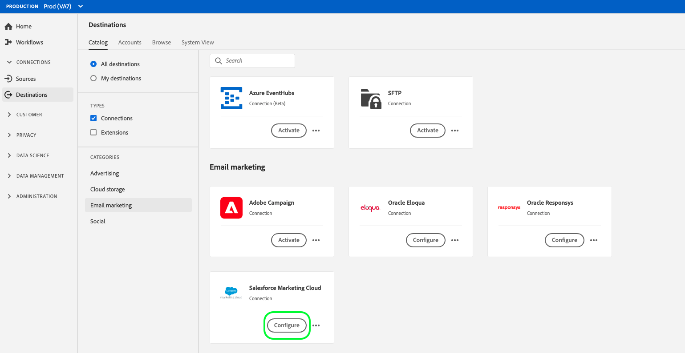

# [!DNL Salesforce Marketing Cloud] anslutning

[[!DNL Salesforce Marketing Cloud]](https://www.salesforce.com/products/marketing-cloud/email-marketing/) är en digital marknadsföringssvit som tidigare kallades ExactTarget som gör att ni kan skapa och anpassa resor för besökare och kunder för att personalisera deras upplevelse.

Om du vill skicka segmentdata till [!DNL Salesforce Marketing Cloud] måste du först [ansluta målet](#connect-destination) i plattformen och sedan [konfigurera en dataimport](#import-data-into-salesforce) från lagringsplatsen till [!DNL Salesforce Marketing Cloud].

## Exporttyp {#export-type}

**Profilbaserat**  - du exporterar alla medlemmar i ett segment tillsammans med önskade schemafält (till exempel: e-postadress, telefonnummer, efternamn), som du väljer på skärmen Välj attribut i arbetsflödet [ för ](../../ui/activate-destinations.md#select-attributes)målaktivering.

## Anslutningsmål {#connect-destination}

I **[!UICONTROL Connections]** > **[!UICONTROL Destinations]** väljer du [!DNL Salesforce Marketing Cloud] och sedan **[!UICONTROL Connect destination]**.

I steget **[!UICONTROL Authentication]** väljer du **[!UICONTROL Existing Account]** och en av dina befintliga anslutningar om du tidigare har konfigurerat en anslutning till molnlagringsmålet. Du kan också välja **[!UICONTROL New Account]** för att konfigurera en ny anslutning. Fyll i autentiseringsuppgifterna för ditt konto och välj **[!UICONTROL Connect to destination]**. För [!DNL Salesforce Marketing Cloud] kan du välja mellan **[!UICONTROL SFTP with Password]** och **[!UICONTROL SFTP with SSH Key]**. Fyll i informationen nedan, beroende på din anslutningstyp, och välj **[!UICONTROL Connect to destination]**.

För **[!UICONTROL SFTP with Password]**-anslutningar måste du ange domän, port, användarnamn och lösenord.

För **[!UICONTROL SFTP with SSH Key]**-anslutningar måste du ange domän, port, användarnamn och SSH-nyckel.

I steget **[!UICONTROL Setup]** ska du fylla i relevant information för destinationen enligt nedan:
- **[!UICONTROL Name]**: Välj ett relevant namn för destinationen.
- **[!UICONTROL Description]**: Ange en beskrivning för destinationen.
- **[!UICONTROL Folder Path]**: Ange sökvägen till lagringsplatsen där Plattform ska placera dina exportdata som CSV-filer eller tabbavgränsade filer.
- **[!UICONTROL File Format]**:  **[!UICONTROL CSV]** eller  **[!UICONTROL TAB_DELIMITED]**. Välj vilket filformat som ska exporteras till lagringsplatsen.

Klicka på **[!UICONTROL Create destination]** när du har fyllt i fälten ovan. Målet är nu anslutet och du kan [aktivera segment](../../ui/activate-destinations.md) till målet.

## Aktivera segment {#activate-segments}

Mer information om arbetsflödet för segmentaktivering finns i [Aktivera profiler och segment till ett mål](../../ui/activate-destinations.md).

## Målattribut {#destination-attributes}

När du [aktiverar segment](../../ui/activate-destinations.md) till målet [!DNL Salesforce Marketing Cloud] rekommenderar vi att du väljer en unik identifierare från ditt [unionsschema](../../../profile/home.md#profile-fragments-and-union-schemas). Välj den unika identifieraren och eventuella andra XDM-fält som du vill exportera till målet. Mer information finns i [Välja vilka schemafält som ska användas som målattribut i de exporterade filerna](./overview.md#destination-attributes) i Destinationer för e-postmarknadsföring.

## Exporterade data {#exported-data}

För [!DNL Salesforce Marketing Cloud]-mål skapar Platform en tabbavgränsad `.txt`- eller `.csv`-fil på den angivna lagringsplatsen. Mer information om filerna finns i [E-postmarknadsföringsmål och molnlagringsmål](../../ui/activate-destinations.md#esp-and-cloud-storage) i självstudiekursen om segmentaktivering.

## Konfigurera dataimport till [!DNL Salesforce Marketing Cloud] {#import-data-into-salesforce}

När du har anslutit plattformen till ditt [!DNL Amazon S3]- eller SFTP-lagringsutrymme måste du konfigurera dataimporten från din lagringsplats till [!DNL Salesforce Marketing Cloud]. Mer information om hur du gör detta finns i [Importera prenumeranter till Marketing Cloud från en fil](https://help.salesforce.com/articleView?id=mc_es_import_subscribers_from_file.htm&amp;type=5) i [!DNL Salesforce Help Center].