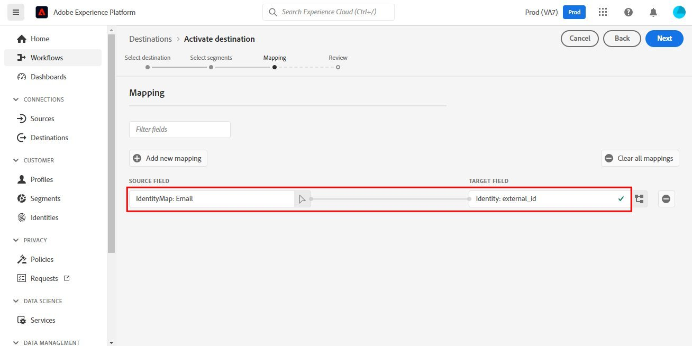

# [!DNL SendGrid]-anslutning

## Översikt {#overview}

[SendGrid](https://www.sendgrid.com) är en populär plattform för kundkommunikation för transaktioner och marknadsföring.

Detta [!DNL Adobe Experience Platform] [mål](/help/destinations/home.md) utnyttjar [[!DNL SendGrid Marketing Contacts API]](https://api.sendgrid.com/v3/marketing/contacts), som gör att du kan exportera dina e-postprofiler från första part och aktivera dem inom en ny SendGrid-målgrupp för dina affärsbehov.

SendGrid använder API-bearer-token som en autentiseringsmekanism för att kommunicera med SendGrid API:t.

## Förhandskrav {#prerequisites}

Följande objekt krävs innan du börjar konfigurera målet.

1. Du måste ha ett SendGrid-konto.
   * Gå till sidan [signup](https://signup.sendgrid.com/) för SendGrid om du vill registrera och skapa ett SendGrid-konto, om du inte redan har ett.
1. När du har loggat in på SendGrid-portalen måste du också generera en API-token.
1. Navigera till SendGrid-webbplatsen och gå till sidan **[!DNL Settings]** > **[!DNL API Keys]**. Du kan även läsa dokumentationen för [SendGrid](https://app.sendgrid.com/settings/api_keys) för att få tillgång till rätt avsnitt i SendGrid-appen.
1. Klicka slutligen på knappen **[!DNL Create API Key]**.
   * Läs [dokumentationen för SendGrid](https://docs.sendgrid.com/ui/account-and-settings/api-keys#creating-an-api-key) om du behöver hjälp med vilka åtgärder som ska utföras.
   * Om du vill generera API-nyckeln via programmering kan du läsa [dokumentationen för SendGrid](https://docs.sendgrid.com/api-reference/api-keys/create-api-keys).

Innan du aktiverar data till SendGrid-målet måste du ha ett [schema](https://experienceleague.adobe.com/docs/experience-platform/xdm/schema/composition.html?lang=sv-SE), en [datamängd](https://experienceleague.adobe.com/docs/platform-learn/tutorials/data-ingestion/create-datasets-and-ingest-data.html?lang=sv-SE) och [segment](https://experienceleague.adobe.com/docs/platform-learn/tutorials/segments/create-segments.html?lang=sv-SE) som skapats i [!DNL Experience Platform]. Se även avsnittet [limits](#limits) längre ned på den här sidan.

>[!IMPORTANT]
>
>* Det SendGrid-API som används för att skapa distributionslistan från e-postprofiler kräver att unika e-postadresser anges i varje profil. Detta är oberoende av om det används som ett värde för *email* eller *alternativ e-post*. Eftersom SendGrid-anslutningen stöder mappningar för både e-postadresser och alternativa e-postadresser måste alla e-postadresser som används vara unika inom varje profil i *datauppsättningen*. Annars, när e-postprofilerna skickas till SendGrid, resulterar det i ett fel och den e-postprofilen kommer inte att finnas i dataexporten.
>
>* Det finns för närvarande ingen funktion för att ta bort profiler från SendGrid när de tas bort från målgrupper i Experience Platform.

## Identiteter som stöds {#supported-identities}

SendGrid stöder aktivering av identiteter som beskrivs i tabellen nedan. Läs mer om [identiteter](/help/identity-service/features/namespaces.md).

| Målidentitet | Beskrivning | Överväganden |
|---|---|---|
| e-post | E-postadress | Observera att både oformaterad text och SHA256-hashade e-postadresser stöds av [!DNL Adobe Experience Platform]. Om källfältet för Experience-plattformen innehåller ohashade attribut ska du kontrollera alternativet **[!UICONTROL Apply transformation]** så att [!DNL Experience Platform] automatiskt hash-kodar data vid aktiveringen.   Observera att **SendGrid** inte har stöd för hash-kodade e-postadresser. Därför skickas endast oformaterade textdata utan omformning till målet. |

{style="table-layout:auto"}

## Exportera typ och frekvens {#export-type-frequency}

Se tabellen nedan för information om exporttyp och frekvens för destinationen.

| Objekt | Typ | Anteckningar |
---------|----------|---------|
| Exporttyp | **[!UICONTROL Profile-based]** | Du exporterar alla medlemmar i ett segment tillsammans med de önskade schemafälten (t.ex. e-postadress, telefonnummer, efternamn), som du har valt på skärmen Välj profilattribut i arbetsflödet för [målaktivering](/help/destinations/ui/activate-batch-profile-destinations.md#select-attributes). |
| Exportfrekvens | **[!UICONTROL Streaming]** | Direktuppspelningsmål är alltid på API-baserade anslutningar. Så snart en profil uppdateras i Experience Platform baserat på målgruppsutvärdering skickar anslutningsprogrammet uppdateringen nedströms till målplattformen. Läs mer om [direktuppspelningsmål](/help/destinations/destination-types.md#streaming-destinations). |

{style="table-layout:auto"}

## Användningsfall {#use-cases}

För att du bättre ska förstå hur och när du ska använda SendGrid-målet finns det exempel på användningsområden som [!DNL Experience Platform]-kunder kan lösa genom att använda det här målet.

### Skapa en marknadsföringslista för flera marknadsföringsaktiviteter

Marknadsföringsteam som använder SendGrid kan skapa en e-postlista i SendGrid och fylla i den med e-postadresser. Den utskickslista som nu skapas i SendGrid kan sedan användas för flera marknadsföringsaktiviteter.

## Anslut till mål {#connect}

>[!IMPORTANT]
> 
>Om du vill ansluta till målet behöver du behörigheterna **[!UICONTROL View Destinations]** och **[!UICONTROL Manage Destinations]** [åtkomstkontroll](/help/access-control/home.md#permissions). Läs [åtkomstkontrollsöversikten](/help/access-control/ui/overview.md) eller kontakta produktadministratören för att få den behörighet som krävs.

Om du vill ansluta till det här målet följer du stegen som beskrivs i självstudiekursen [för destinationskonfiguration](../../ui/connect-destination.md). I arbetsflödet för att konfigurera mål fyller du i fälten som listas i de två avsnitten nedan.

### Autentisera till mål {#authenticate}

1. Navigera till **Destinationer** i konsolen [!DNL Adobe Experience Platform].

1. Välj fliken **Katalog** och sök efter *SendGrid*. Välj sedan **Konfigurera**. När du har upprättat en anslutning till målet ändras gränssnittsetiketten till **Aktivera segment**.
   

1. En guide visas som hjälper dig att konfigurera SendGrid-målet. Skapa det nya målet genom att välja **Konfigurera nytt mål**.
   

1. Välj alternativet **Nytt konto** och fyll i värdet **Bearer Token**. Det här värdet är SendGrid *API Key* som tidigare nämndes i avsnittet [Requirements](#prerequisites).
   

1. Välj **Anslut till mål**. Om den *API-nyckel* för SendGrid som du har angett är giltig visar gränssnittet en **Connected**-status med en grön bockmarkering. Du kan sedan gå vidare till nästa steg och fylla i ytterligare informationsfält.

### Fyll i målinformation {#destination-details}

När [konfigurerar](https://experienceleague.adobe.com/docs/experience-platform/destinations/ui/connect-destination.html?lang=sv-SE) för det här målet måste du ange följande information:

* **[!UICONTROL Name]**: Det namn som du känner igen det här målet med i framtiden.
* **[!UICONTROL Description]**: En valfri beskrivning som hjälper dig att identifiera det här målet i framtiden.

### Aktivera aviseringar {#enable-alerts}

Du kan aktivera varningar för att få meddelanden om dataflödets status till ditt mål. Välj en avisering i listan om du vill prenumerera och få meddelanden om statusen för ditt dataflöde. Mer information om varningar finns i guiden [prenumerera på destinationsvarningar med användargränssnittet](../../ui/alerts.md).

Välj **[!UICONTROL Next]** när du är klar med att ange information för målanslutningen.

## Aktivera målgrupper till det här målet {#activate}

>[!IMPORTANT]
> 
>* För att aktivera data behöver du behörigheterna **[!UICONTROL View Destinations]**, **[!UICONTROL Activate Destinations]**, **[!UICONTROL View Profiles]** och **[!UICONTROL View Segments]** [åtkomstkontroll](/help/access-control/home.md#permissions). Läs [åtkomstkontrollsöversikten](/help/access-control/ui/overview.md) eller kontakta produktadministratören för att få den behörighet som krävs.
>* Om du vill exportera *identiteter* måste du ha **[!UICONTROL View Identity Graph]** [åtkomstkontrollbehörighet](/help/access-control/home.md#permissions).   {width="100" zoomable="yes"}

Läs [Aktivera profiler och målgrupper för att direktuppspela målgruppsexportdestinationer](/help/destinations/ui/activate-segment-streaming-destinations.md) för instruktioner om hur du aktiverar målgrupper till det här målet.

Se bilden nedan för mer information om det här målet.

1. Välj en eller flera målgrupper att exportera till SendGrid.
   

1. När du har valt **[!UICONTROL Add new mapping]** i steget **[!UICONTROL Mapping]** visas mappningssidan som mappar XDM-källfälten till API-målfälten för SendGrid. Bilderna nedan visar hur du mappar identitetsnamnutrymmen mellan Experience Platform och SendGrid. Kontrollera att **[!UICONTROL Source field]** *Email* mappas till **[!UICONTROL Target field]** *external_id* enligt nedan.
   
   
   
   

1. Mappa på samma sätt de [!DNL Adobe Experience Platform]-attribut du vill exportera till SendGrid-målet.
   
   

1. När du är klar med mappningarna väljer du **[!UICONTROL Next]** för att gå vidare till granskningsskärmen.
   

1. Välj **[!UICONTROL Finish]** för att slutföra installationen.
   

Nedan finns en omfattande lista över attributmappningar som stöds och som kan ställas in för [SendGrid Marketing Contacts > Add or Update Contact API](https://docs.sendgrid.com/api-reference/contacts/add-or-update-a-contact).

| Source Field | Målfält | Typ | Beskrivning | Gränser |
|---|---|---|---|---|
| xdm:  homeAddress.street1 | xdm:  address_line_1 | Sträng | Adressens första rad. | Maximal längd:  100 tecken |
| xdm:  homeAddress.street2 | xdm:  address_line_2 | Sträng | En valfri andra rad för adressen. | Maximal längd:  100 tecken |
| xdm:  _extconndev.alternate_emails | xdm:  alternativ_emails | Array med strängen | Ytterligare e-postmeddelanden som är kopplade till kontakten. | <ul><li>Max: 5 objekt</li><li>Min: 0 objekt</li></ul> |
| xdm:  homeAddress.city | xdm:  stad | Sträng | Kontaktens stad. | Maximal längd:  60 tecken |
| xdm:  homeAddress.country | xdm:  land | Sträng | Kontaktens land. Kan vara ett fullständigt namn eller en förkortning. | Maximal längd:  50 tecken |
| identityMap:  Email | Identitet:  external_id | Sträng | Kontaktens primära e-postadress. Detta måste vara en giltig e-postadress. | Maximal längd:  254 tecken |
| xdm:  person.name.firstName | xdm:  first_name | Sträng | Kontaktens namn | Maximal längd:  50 tecken |
| xdm:  person.name.lastName | xdm:  last_name | Sträng | Kontaktens familj | Maximal längd:  50 tecken |
| xdm:  homeAddress.mailCode | xdm: ,postnummer | Sträng | Kontaktens postnummer eller annat postnummer. | |
| xdm:  homeAddress.stateProvince | xdm:  state_Region_region | Sträng | Kontaktens delstat, provins eller region. | Maximal längd:  50 tecken |

## Validera dataexporten i SendGrid {#validate}

Följ stegen nedan för att verifiera att du har konfigurerat målet korrekt:

1. Välj **[!UICONTROL Destinations]** > **[!UICONTROL Browse]** för att navigera till listan över mål.
   

1. Markera målet och validera att statusen är **[!UICONTROL enabled]**.
   

1. Växla till fliken **[!DNL Activation data]** och välj sedan ett publiknamn.
   

1. Övervaka målgruppssammanfattningen och kontrollera att antalet profiler motsvarar antalet som skapas i datauppsättningen.
   

1. [SendGrid Marketing Lists > Create List API](https://docs.sendgrid.com/api-reference/lists/create-list) används för att skapa unika kontaktlistor i SendGrid genom att koppla värdet för attributet *list_name* och tidsstämpeln för dataexporten. Navigera till SendGrid-webbplatsen och kontrollera om den nya kontaktlistan som överensstämmer med namnmönstret skapas.
   
   

1. Markera den nya kontaktlistan och kontrollera om den nya e-postposten från datauppsättningen som du skapade fylls i i den nya kontaktlistan.

1. Kontrollera också några e-postmeddelanden för att verifiera om fältmappningen är korrekt.
   
   

## Dataanvändning och styrning {#data-usage-governance}

Alla [!DNL Adobe Experience Platform]-mål är kompatibla med dataanvändningsprinciper när data hanteras. Mer information om hur [!DNL Adobe Experience Platform] använder datastyrning finns i [Datastyrningsöversikten](/help/data-governance/home.md).

## Ytterligare resurser {#additional-resources}

Detta SendGrid-mål utnyttjar API:erna nedan:
* [SendGrid Marketing Lists > Create List API](https://docs.sendgrid.com/api-reference/lists/create-list)
* [SendGrid Marketing Contacts > Add or Update Contact API](https://docs.sendgrid.com/api-reference/contacts/add-or-update-a-contact)

### Gränser {#limits}

* [SendGrid Marketing Contacts > Add or Update Contact API](https://api.sendgrid.com/v3/marketing/contacts) kan ta emot 30 000 kontakter, eller 6 MB data, beroende på vilket som är lägst.
