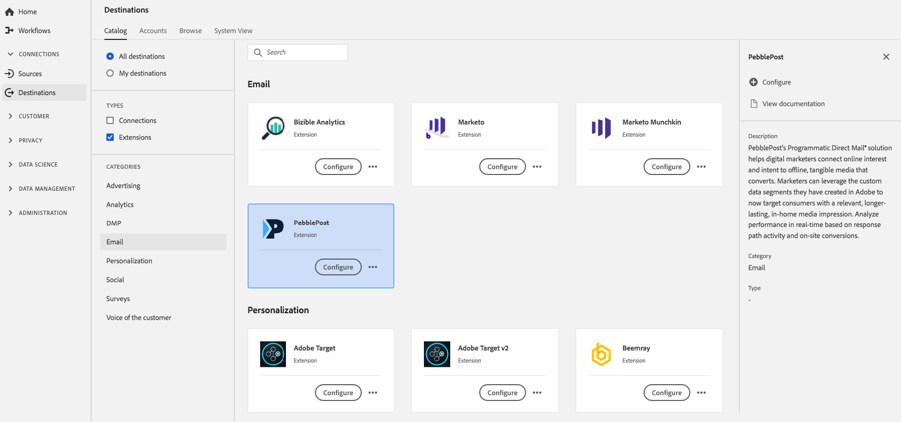

# [!DNL PebblePost]-tillägg {#pebblepost-extension}

## Översikt {#overview}

Med lösningen [!DNL PebblePost's Programmatic Direct Mail] kan digitala marknadsförare koppla samman online-intressen och avsikter med offlinematerial som konverteras. Marknadsförarna kan utnyttja de anpassade datapunkter de har skapat i Adobe för att nu rikta sig till konsumenterna med ett relevant, långvarigt mediefunktioner hemma. Analysera prestanda i realtid baserat på responssökvägsaktivitet och konverteringar på plats.

[!DNL PebblePost] är ett e-posttillägg i [!DNL Adobe Experience Platform].

Det här målet är ett taggtillägg. Mer information om hur taggtillägg fungerar i Experience Platform finns i [Översikt över taggtillägg](../launch-extensions/overview.md).

## Förutsättningar {#prerequisites}

Det här tillägget är tillgängligt i katalogen [!DNL Destinations] för alla kunder som har köpt Experience Platform.

Om du vill använda det här tillägget måste du ha tillgång till taggar i [!DNL Adobe Experience Platform]. Taggar erbjuds [!DNL Adobe Experience Cloud] kunder som en inkluderad, värdeskapande funktion. Kontakta din organisations administratör för att få åtkomst till taggar och be dem att ge dig behörigheten **[!UICONTROL manage_properties]** så att du kan installera tillägg.

## Installera tillägg {#install-extension}

Så här installerar du tillägget [!DNL PebblePost]:

Gå till [&#x200B; > &#x200B;](https://platform.adobe.com/) i **[!UICONTROL Destinations]** Experience Platform-gränssnittet **[!UICONTROL Catalog]**.

Välj tillägget i katalogen eller använd sökfältet.

Välj målet och välj sedan **[!UICONTROL Configure]** i den högra listen. Om kontrollen **[!UICONTROL Configure]** är nedtonad saknar du behörigheten **[!UICONTROL manage_properties]**. Se [Krav](#prerequisites).

Välj den egenskap i vilken du vill installera tillägget. Du kan också skapa en ny egenskap. En egenskap är en samling regler, dataelement, konfigurerade tillägg, miljöer och bibliotek. Lär dig mer om egenskaper i avsnittet [Egenskaper](../../../tags/ui/administration/companies-and-properties.md#properties-page) i taggdokumentationen.

Arbetsflödet vägleder dig genom de olika stegen för att slutföra installationen.

Du kan också installera tillägget direkt i [användargränssnittet för datainsamling](https://experience.adobe.com/#/data-collection/). Mer information finns i avsnittet om att [lägga till ett nytt tillägg](../../../tags/ui/managing-resources/extensions/overview.md#add-a-new-extension) i taggdokumentationen.

## Så här använder du tillägget {#how-to-use}

När du har installerat tillägget kan du börja konfigurera regler.

Du kan konfigurera regler för de installerade tilläggen så att händelsedata skickas till tilläggets mål endast i vissa situationer. Mer information om hur du konfigurerar regler för dina tillägg finns i [taggdokumentationen](../../../tags/ui/managing-resources/rules.md).

## Konfigurera, uppgradera och ta bort tillägg {#configure-upgrade-delete}

Du kan konfigurera, uppgradera och ta bort tillägg i användargränssnittet för datainsamling.

>[!TIP]
>
>Om tillägget redan är installerat på en av dina egenskaper visas fortfarande **[!UICONTROL Install]** för tillägget i Experience Platform-gränssnittet. Stäng av installationsarbetsflödet enligt beskrivningen i [Installera tillägg](#install-extension) för att konfigurera eller ta bort tillägget.

Information om hur du uppgraderar ditt tillägg finns i handboken om uppgraderingsprocessen för [tillägget](../../../tags/ui/managing-resources/extensions/extension-upgrade.md) i taggdokumentationen.
