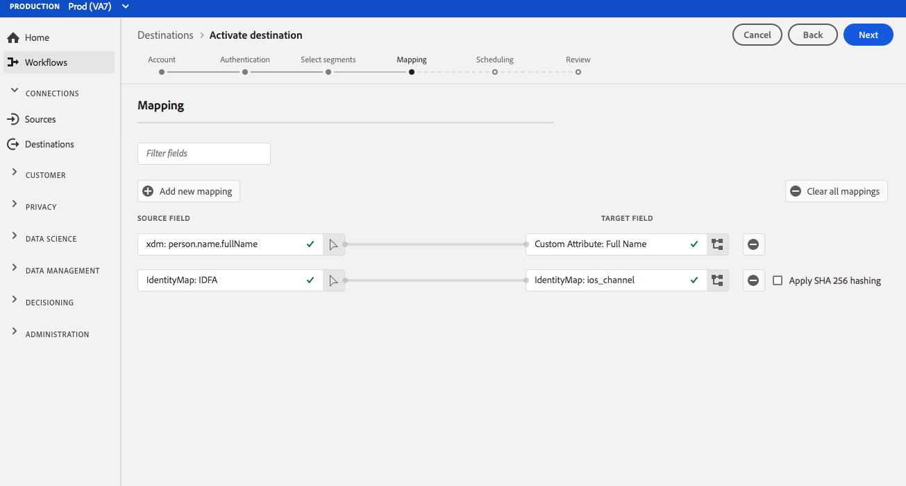
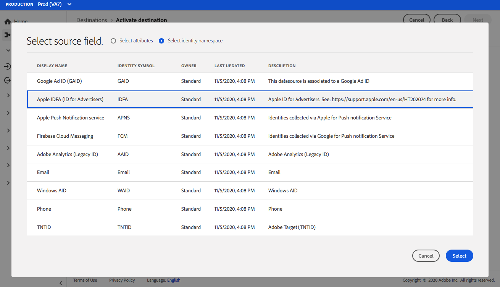
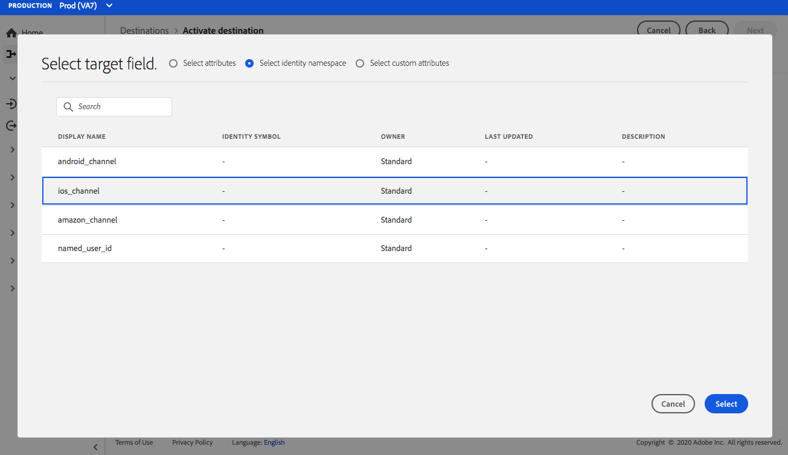
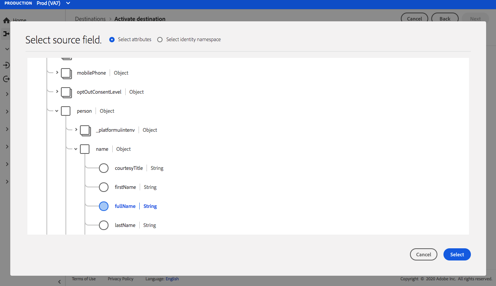
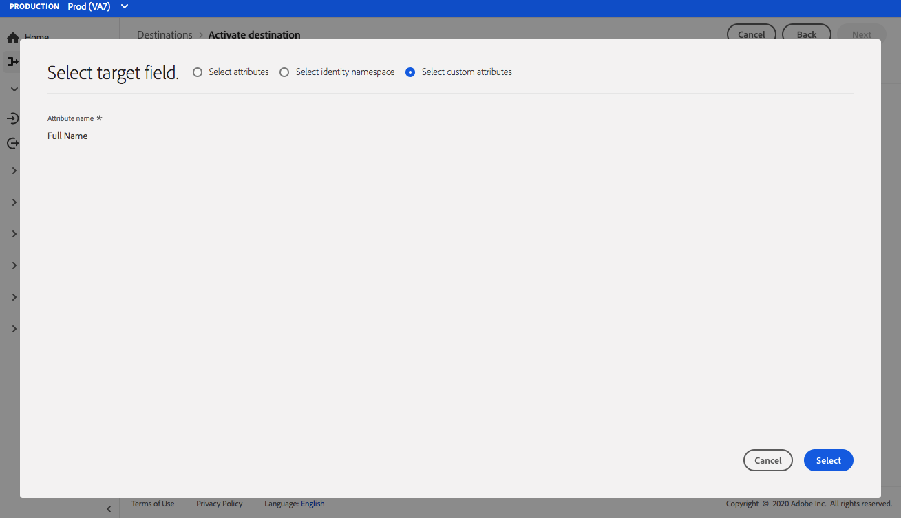

# [!DNL Airship Attributes]-anslutning {#airship-attributes-destination}

## Översikt {#overview}

[!DNL Airship] är det ledande Experience Platform för kundengagemang som hjälper dig att leverera meningsfulla, personaliserade flerkanalsmeddelanden till dina användare i alla faser av kundlivscykeln.

Den här integreringen skickar Adobe-profildata till [!DNL Airship] som [Attribut](https://docs.airship.com/guides/audience/attributes/) för målinriktning eller utlösande åtgärder.

Mer information om [!DNL Airship] finns i [Airship Docs](https://docs.airship.com).

>[!TIP]
>
>Målanslutningen och dokumentationssidan skapas och underhålls av [!DNL Airship]-teamet. Om du har frågor eller uppdateringsfrågor kontaktar du dem direkt på [support.airship.com](https://support.airship.com/).

## Förutsättningar {#prerequisites}

Innan du kan skicka målgrupper till [!DNL Airship] måste du:

* Aktivera attribut i ditt [!DNL Airship]-projekt.
* Generera en innehavartoken för autentisering.

>[!TIP]
>
>Skapa ett [!DNL Airship]-konto via [den här registreringslänken](https://go.airship.eu/accounts/register/plan/starter/) om du inte redan har det.

## Målgrupper {#supported-audiences}

I det här avsnittet beskrivs vilka typer av målgrupper du kan exportera till det här målet.

| Målgruppsursprung | Stöds | Beskrivning |
|---------|----------|----------|
| [!DNL Segmentation Service] | Ja | Publiker som genererats via Experience Platform [segmenteringstjänst](../../../segmentation/home.md). |
| Alla andra målgrupper kommer | Ja | Den här kategorin omfattar alla målgrupper som kommer utanför målgrupper som genereras via [!DNL Segmentation Service]. Läs om de [olika målgruppernas ursprung](/help/segmentation/ui/audience-portal.md#customize). Några exempel är: <ul><li> anpassade uppladdningsgrupper [importerade](../../../segmentation/ui/audience-portal.md#import-audience) till Experience Platform från CSV-filer,</li><li> lookalike-målgrupper, </li><li> federerade målgrupper, </li><li> målgrupper som har genererats i andra Experience Platform-appar som [!DNL Adobe Journey Optimizer], </li><li> med mera. </li></ul> |

{style="table-layout:auto"}

Målgrupper som stöds av olika typer av målgruppsdata:

| Typ av målgruppsdata | Stöds | Beskrivning | Användningsfall |
|--------------------|-----------|-------------|-----------|
| [Målgrupper](/help/segmentation/types/people-audiences.md) | Ja | Baserat på kundprofiler kan ni inrikta er på specifika grupper av människor för marknadsföringskampanjer. | Ofta köpare, övergivna varukorgar |
| [Kontomålgrupper](/help/segmentation/types/account-audiences.md) | Nej | Rikta er till individer inom specifika organisationer för kontobaserade marknadsföringsstrategier. | B2B-marknadsföring |
| [Prospektera målgrupper](/help/segmentation/types/prospect-audiences.md) | Nej | Rikta er till individer som ännu inte är kunder men som delar egenskaper med er målgrupp. | Prospektera med data från tredje part |
| [Datauppsättningsexport](/help/catalog/datasets/overview.md) | Nej | Samlingar med strukturerade data lagrade i datasjön [!DNL Adobe Experience Platform]. | Arbetsflöden för rapportering, datavetenskap |

{style="table-layout:auto"}

## Exportera typ och frekvens {#export-type-frequency}

Se tabellen nedan för information om exporttyp och frekvens för destinationen.

| Objekt | Typ | Anteckningar |
|---------|----------|---------|
| Exporttyp | **[!UICONTROL Profile-based]** | Du exporterar alla medlemmar i ett segment tillsammans med de önskade schemafälten (till exempel e-postadress, telefonnummer, efternamn) och/eller identiteter enligt fältmappningen. |
| Exportfrekvens | **[!UICONTROL Streaming]** | Direktuppspelningsmål är alltid på API-baserade anslutningar. Så snart en profil uppdateras i Experience Platform baserat på målgruppsutvärdering skickar anslutningsprogrammet uppdateringen nedströms till målplattformen. Läs mer om [direktuppspelningsmål](/help/destinations/destination-types.md#streaming-destinations). |

{style="table-layout:auto"}

## Aktivera attribut {#enable-attributes}

[!DNL Adobe Experience Platform]-profilattribut liknar [!DNL Airship]-attribut och kan enkelt mappas till varandra i Experience Platform med hjälp av mappningsverktyget som visas längre ned på den här sidan.

[!DNL Airship] projekt har flera fördefinierade attribut och standardattribut. Om du har ett anpassat attribut måste du definiera det i [!DNL Airship] först. Mer information finns i [Konfigurera och hantera attribut](https://docs.airship.com/tutorials/audience/attributes/).

## Generera innehavartoken {#bearer-token}

Gå till **[!UICONTROL Settings]** **[!UICONTROL APIs & Integrations]** på [kontrollpanelen för luftskepp](https://go.airship.com) och välj **[!UICONTROL Tokens]** på den vänstra menyn.

Klicka på **[!UICONTROL Create Token]**.

Ange ett användarvänligt namn för din token, till exempel&quot;Adobe Attributes Destination&quot;, och välj&quot;All Access&quot; för rollen.

Klicka på **[!UICONTROL Create Token]** och spara informationen som konfidentiell.

## Användningsfall {#use-cases}

För att du bättre ska kunna förstå hur och när du ska använda målet [!DNL Airship Attributes] finns det exempel på användningsområden som [!DNL Adobe Experience Platform]-kunder kan lösa genom att använda det här målet.

### Använd skiftläge 1 {#use-case-1}

Utnyttja profildata som samlats in inom [!DNL Adobe Experience Platform] för att anpassa meddelandet och det omfattande innehållet i någon av [!DNL Airship]s kanaler. Använd till exempel profildata för [!DNL Experience Platform] för att ange platsattribut i [!DNL Airship]. På så sätt kan ett hotellmärke visa en bild för varje användares närmaste hotell.

### Använd skiftläge 2 {#use-case-2}

Utnyttja attribut från [!DNL Adobe Experience Platform] för att ytterligare berika [!DNL Airship]-profiler och kombinera dem med prediktiva data från SDK eller [!DNL Airship]. En återförsäljare kan t.ex. skapa en målgrupp med lojalitetsstatus och platsdata (attribut från Experience Platform) och [!DNL Airship] förväntas ändra data för att skicka extremt målinriktade meddelanden till användare med guldlojalitetsstatus som bor i Las Vegas, NV och har en hög sannolikhet för kurning.

## Anslut till målet {#connect}

>[!IMPORTANT]
>
>Om du vill ansluta till målet behöver du behörigheterna **[!UICONTROL View Destinations]** och **[!UICONTROL Manage Destinations]** [åtkomstkontroll](/help/access-control/home.md#permissions). Läs [åtkomstkontrollsöversikten](/help/access-control/ui/overview.md) eller kontakta produktadministratören för att få den behörighet som krävs.

Om du vill ansluta till det här målet följer du stegen som beskrivs i självstudiekursen [för destinationskonfiguration](../../ui/connect-destination.md). I arbetsflödet för att konfigurera mål fyller du i fälten som listas i de två avsnitten nedan.

### Autentisera till mål {#authenticate}

Fyll i de obligatoriska fälten och välj **[!UICONTROL Connect to destination]** om du vill autentisera mot målet.

* **[!UICONTROL Bearer token]**: Bearer-token som du genererade från kontrollpanelen [!DNL Airship].

### Fyll i målinformation {#destination-details}

Om du vill konfigurera information för målet fyller du i de obligatoriska och valfria fälten nedan. En asterisk bredvid ett fält i användargränssnittet anger att fältet är obligatoriskt.

* **[!UICONTROL Name]**: Ange ett namn som hjälper dig att identifiera det här målet.
* **[!UICONTROL Description]**: Ange en beskrivning för det här målet.
* **[!UICONTROL Domain]**: välj ett datacenter för USA eller EU, beroende på vilket datacenter [!DNL Airship] som gäller för det här målet.

### Aktivera aviseringar {#enable-alerts}

Du kan aktivera varningar för att få meddelanden om dataflödets status till ditt mål. Välj en avisering i listan om du vill prenumerera och få meddelanden om statusen för ditt dataflöde. Mer information om varningar finns i guiden [prenumerera på destinationsvarningar med användargränssnittet](../../ui/alerts.md).

Välj **[!UICONTROL Next]** när du är klar med att ange information för målanslutningen.

## Aktivera målgrupper till det här målet {#activate}

>[!IMPORTANT]
>
>* För att aktivera data behöver du behörigheterna **[!UICONTROL View Destinations]**, **[!UICONTROL Activate Destinations]**, **[!UICONTROL View Profiles]** och **[!UICONTROL View Segments]** [åtkomstkontroll](/help/access-control/home.md#permissions). Läs [åtkomstkontrollsöversikten](/help/access-control/ui/overview.md) eller kontakta produktadministratören för att få den behörighet som krävs.
>* Om du vill exportera *identiteter* måste du ha **[!UICONTROL View Identity Graph]** [åtkomstkontrollbehörighet](/help/access-control/home.md#permissions).   {width="100" zoomable="yes"}

Se [Aktivera målgruppsdata för att direktuppspela målgruppsexportmål](../../ui/activate-segment-streaming-destinations.md) för instruktioner om hur du aktiverar målgrupper till det här målet.

## Mappningsöverväganden {#mapping-considerations}

[!DNL Airship]-attribut kan anges antingen på en kanal, som representerar en enhetsinstans, till exempel iPhone, eller en namngiven användare, som mappar alla användarens enheter till en gemensam identifierare, till exempel ett kund-ID. Om du har oformaterad e-postadress som primär identitet i ditt schema, markerar du e-postfältet i **[!UICONTROL Source Attributes]** och mappar till den [!DNL Airship] namngivna användaren i den högra kolumnen under **[!UICONTROL Target Identities]**, som visas nedan.

För identifierare som ska mappas till en kanal, dvs. en enhet, mappas till rätt kanal baserat på källan. Följande bilder visar hur två mappningar skapas:

* IDFA iOS Advertising ID till en [!DNL Airship] iOS-kanal
* Adobe `fullName`-attribut till attributet [!DNL Airship] &quot;Fullständigt namn&quot;

>[!NOTE]
>
>Använd det `attribute_id` som motsvarar attributet i kontrollpanelen [!DNL Airship] när du väljer målfältet för din attributmappning.

**Mappa identitet**

Välj källfält:

Välj målfält:

**Mappningsattribut**

Välj källattribut:

Välj målattribut:

Verifiera mappning:

## Dataanvändning och styrning {#data-usage-governance}

Alla [!DNL Adobe Experience Platform]-mål är kompatibla med dataanvändningsprinciper när data hanteras. Mer information om hur [!DNL Adobe Experience Platform] använder datastyrning finns i [Datastyrningsöversikten](../../../data-governance/home.md).
