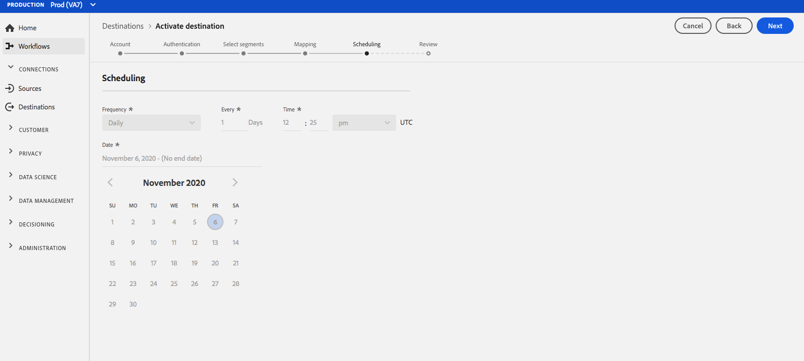

# (Beta) [!DNL Airship Attributes] mål {#airship-attributes-destination}

>[!IMPORTANT]
>
>Målet [!DNL Airship Attributes] i Adobe Experience Platform är för närvarande i betaversion. Dokumentationen och funktionaliteten kan komma att ändras.

## Översikt {#overview}

[!DNL Airship] är den ledande plattformen för kundengagemang, som hjälper er att leverera meningsfulla, personaliserade meddelanden i alla kanaler till era användare under hela kundlivscykeln.

Den här integreringen skickar profildata för Adobe till [!DNL Airship] som [Attribut](https://docs.airship.com/guides/audience/attributes/) för målinriktning eller utlösande åtgärder.

Mer information om [!DNL Airship] finns i [Airship Docs](https://docs.airship.com).

>[!TIP]
>
>Dokumentationssidan skapades av [!DNL Airship]-teamet. Om du har frågor eller uppdateringsfrågor kontaktar du dem direkt på [support.airship.com](https://support.airship.com/).

## Förutsättningar {#prerequisites}

Innan du kan skicka målgruppssegment till [!DNL Airship] måste du:

* Aktivera attribut i ditt [!DNL Airship]-projekt.
* Generera en innehavartoken för autentisering.

>[!TIP]
>
>Skapa ett [!DNL Airship]-konto via [den här registreringslänken](https://go.airship.eu/accounts/register/plan/starter/) om du inte redan gjort det.

### Aktivera attribut {#enable-attributes}

Adobe Experience Platform-profilattribut liknar [!DNL Airship]-attribut och kan enkelt mappas till varandra i Platform med hjälp av mappningsverktyget som visas längre ned på den här sidan.

[!DNL Airship] projekt har flera fördefinierade och standardattribut. Om du har ett anpassat attribut måste du definiera det i [!DNL Airship] först. Mer information finns i [Konfigurera och hantera attribut](https://docs.airship.com/tutorials/audience/attributes/).

### Bearer-token {#bearer-token}

Gå till **[!UICONTROL Settings]**&quot; **[!UICONTROL APIs & Integrations]** i kontrollpanelen [Airship](https://go.airship.com) och välj **[!UICONTROL Tokens]** i den vänstra menyn.

Klicka på **[!UICONTROL Create Token]**.

Ange ett användarvänligt namn för din token, t.ex. &quot;Adobe Attributes Destination&quot;, och välj &quot;All Access&quot; för rollen.

Klicka på **[!UICONTROL Create Token]** och spara informationen konfidentiellt.

## Användningsfall {#use-cases}

För att du bättre ska förstå hur och när du ska använda målet [!DNL Airship Attributes] finns det exempel på användningsområden som Adobe Experience Platform-kunder kan lösa genom att använda det här målet.

### Använd skiftläge 1

Utnyttja profildata som samlats in inom Adobe Experience Platform för att personalisera budskapet och multimediematerialet i någon av [!DNL Airship]:s kanaler. Använd till exempel [!DNL Experience Platform]-profildata för att ange platsattribut i [!DNL Airship]. På så sätt kan ett hotellmärke visa en bild för varje användares närmaste hotell.

### Använd skiftläge 2

Utnyttja attribut från Adobe Experience Platform för att ytterligare berika [!DNL Airship]-profiler och kombinera dem med SDK eller [!DNL Airship] prediktiva data. En återförsäljare kan till exempel skapa ett segment med lojalitetsstatus och platsdata (attribut från Platform) och [!DNL Airship] som förväntas ändra data för att skicka extremt målinriktade meddelanden till användare med guldlojalitetsstatus som bor i Las Vegas, NV, och som har en stor sannolikhet för att befinna sig.

## Anslut till [!DNL Airship Attributes] {#connect-airship-attributes}

Bläddra till kategorin **[!UICONTROL Mobile Engagement]** i **[!UICONTROL Destinations]** > **[!UICONTROL Catalog]**. Välj **[!DNL Airship Attributes]** och sedan **[!UICONTROL Configure]**.

>[!NOTE]
>
>Om det redan finns en anslutning till det här målet kan du se en **[!UICONTROL Activate]**-knapp på målkortet. Mer information om skillnaden mellan **[!UICONTROL Activate]** och **[!UICONTROL Configure]** finns i avsnittet [Katalog](../../ui/destinations-workspace.md#catalog) i dokumentationen för målarbetsytan.

Om du tidigare har konfigurerat en anslutning till ditt [!DNL Airship Attributes]-mål väljer du **[!UICONTROL Existing Account]** och väljer din befintliga anslutning i steget **Konto**. Du kan också välja **[!UICONTROL New Account]** för att konfigurera en ny anslutning till [!DNL Airship Attributes]. Välj **[!UICONTROL Connect to destination]** om du vill ansluta Adobe Experience Platform till ditt [!DNL Airship]-projekt med bearer-token som du skapade från kontrollpanelen [!DNL Airship].

>[!NOTE]
>
>Adobe Experience Platform stöder validering av autentiseringsuppgifter i autentiseringsprocessen och visar ett felmeddelande om du anger felaktiga autentiseringsuppgifter för ditt [!DNL Airship]-konto. Detta säkerställer att du inte slutför arbetsflödet med felaktiga inloggningsuppgifter.

När dina inloggningsuppgifter har bekräftats och Adobe Experience Platform är anslutet till ditt [!DNL Airship]-projekt kan du välja **[!UICONTROL Next]** för att fortsätta till **[!UICONTROL Setup]**-steget.

I steget **[!UICONTROL Authentication]** anger du ett **[!UICONTROL Name]** och ett **[!UICONTROL Description]** för aktiveringsflödet.

I det här steget kan du även välja ett datacenter i USA eller EU, beroende på vilket [!DNL Airship] datacenter som gäller för det här målet. Välj slutligen ett eller flera användningsfall för marknadsföring för vilka data ska exporteras till målet. Du kan välja bland Adobe-definierade användningsfall för marknadsföring eller skapa egna. Mer information om användningsfall för marknadsföring finns i [Översikt över dataanvändningsprinciper](../../../data-governance/policies/overview.md).

Välj **[!UICONTROL Create Destination]** när du har fyllt i fälten ovan.

Målet har skapats. Du kan välja **[!UICONTROL Save & Exit]** om du vill aktivera segment senare eller välja **[!UICONTROL Next]** om du vill fortsätta arbetsflödet och välja segment som ska aktiveras. I båda fallen ska du läsa nästa avsnitt, [Aktivera segment](#activate-segments), för resten av arbetsflödet.

## Aktivera segment {#activate-segments}

Så här aktiverar du segment till [!DNL Airship Attributes]:

I **[!UICONTROL Destinations > Browse]** väljer du det [!DNL Airship Attributes]-mål där du vill aktivera dina segment.

Klicka på målets namn. Då kommer du till aktiveringsflödet.

Observera att om det redan finns ett aktiveringsflöde för ett mål kan du se de segment som för närvarande skickas till målet. Välj **[!UICONTROL Edit activation]** till höger och följ stegen nedan för att ändra aktiveringsinformationen.

Välj **[!UICONTROL Activate]**. På sidan **[!UICONTROL Activate destination]** i arbetsflödet väljer du vilka segment som ska skickas till [!DNL Airship Attributes].**[!UICONTROL Select Segments]**

I steget **[!UICONTROL Mapping]** väljer du vilka attribut och identiteter från schemat [XDM](../../../xdm/home.md) som ska mappas till målschemat. Välj **[!UICONTROL Add new mapping]** om du vill bläddra i schemat och mappa dem till motsvarande målidentitet.

[!DNL Airship] attribut kan anges antingen på en kanal, som representerar enhetsinstans, t.ex. iPhone, eller en namngiven användare, som mappar alla användarens enheter till en gemensam identifierare, t.ex. ett kund-ID. Om du har oformaterad e-postadress som primär identitet i ditt schema väljer du e-postfältet i **[!UICONTROL Source Attributes]** och mappar till den [!DNL Airship] namngivna användaren i den högra kolumnen under **[!UICONTROL Target Identities]**, som visas nedan.

För identifierare som ska mappas till en kanal, d.v.s. en enhet, mappar du till lämplig kanal baserat på källan. Följande bilder visar hur två mappningar skapas:

* IDFA iOS Advertising ID to an [!DNL Airship] iOS channel
* Adobe `fullName`-attribut till [!DNL Airship]-attributet &quot;Fullständigt namn&quot;

>[!NOTE]
>
>Använd det användarvänliga namnet som visas på kontrollpanelen [!DNL Airship] när du väljer målfältet för din attributmappning.

**Kartidentitet**

Välj källfält:

Välj målfält:

**Mappningsattribut**

Välj källattribut:

Välj målattribut:

Verifiera mappning:

Schemaläggning är för närvarande inaktiverat på sidan **[!UICONTROL Segment schedule]**. Klicka på **[!UICONTROL Next]** för att fortsätta till granskningssteget.

På sidan **[!UICONTROL Review]** visas en sammanfattning av ditt val. Välj **[!UICONTROL Cancel]** om du vill dela upp flödet, **[!UICONTROL Back]** om du vill ändra inställningarna eller **[!UICONTROL Finish]** om du vill bekräfta valet och börja skicka data till målet.

>[!IMPORTANT]
>
>I det här steget söker Adobe Experience Platform efter brott mot dataanvändningspolicyn. Nedan visas ett exempel där en princip överträds. Du kan inte slutföra arbetsflödet för segmentaktivering förrän du har löst konflikten. Mer information om hur du löser policyöverträdelser finns i [Politiska åtgärder](../../../data-governance/enforcement/auto-enforcement.md) i dokumentationsavsnittet för datastyrning.

Om inga principöverträdelser har identifierats markerar du **[!UICONTROL Finish]** för att bekräfta ditt val och börja skicka data till målet.

## Dataanvändning och styrning {#data-usage-governance}

Alla [!DNL Adobe Experience Platform]-mål är kompatibla med dataanvändningsprinciper när data hanteras. Mer information om hur [!DNL Adobe Experience Platform] framtvingar datastyrning finns i [Datastyrningsöversikten](../../../data-governance/home.md).
