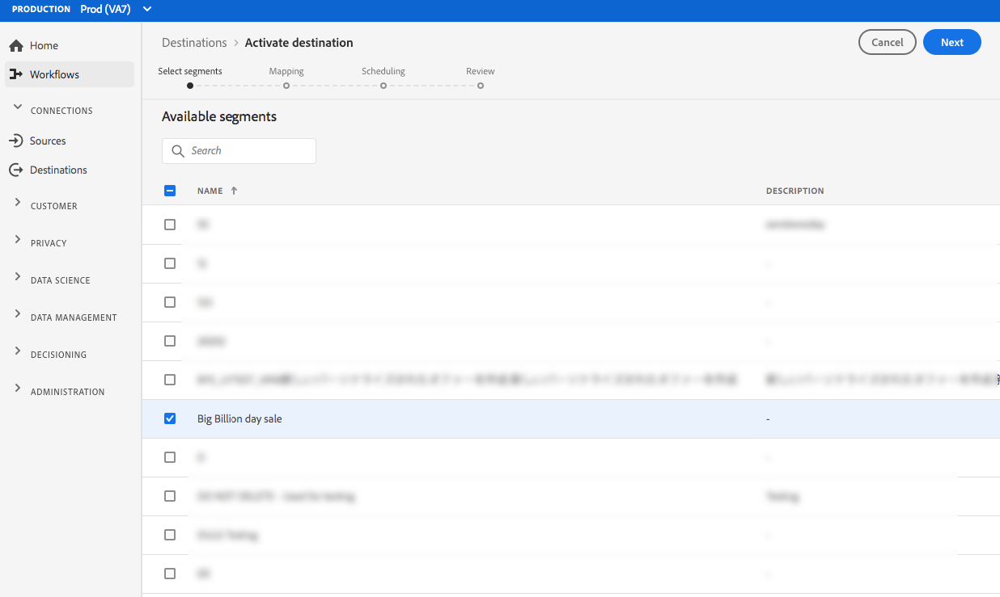
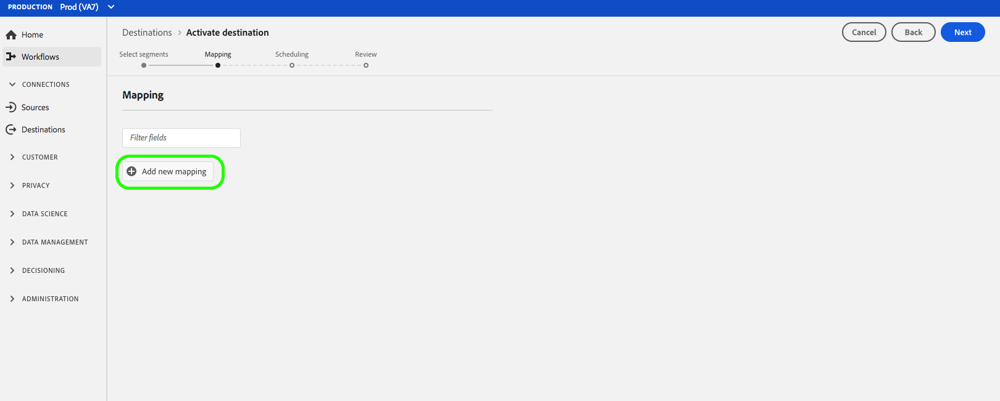

# (Beta) [!DNL Airship Tags] -mål {#airship-tags-destination}

>[!IMPORTANT]
>
>Målet [!DNL Airship Tags] i Adobe Experience Platform är för närvarande i betaversion. Dokumentationen och funktionaliteten kan komma att ändras.

## Översikt

[!DNL Airship] är den ledande plattformen för kundengagemang, som hjälper er att leverera meningsfulla, personaliserade meddelanden i alla kanaler till era användare under hela kundlivscykeln.

Den här integreringen överför data från Adobe Experience Platform segment till [!DNL Airship] taggar  för målinriktning eller utlösning.

Mer information [!DNL Airship]finns i [Airship Docs](https://docs.airship.com).

>[!TIP]
>
>Den här dokumentationssidan skapades av [!DNL Airship] teamet. Om du har frågor eller uppdateringsfrågor kontaktar du dem direkt på [support.airship.com](https://support.airship.com/).

## Förutsättningar

Innan du kan skicka dina Adobe Experience Platform-segment till [!DNL Airship]måste du:

* Skapa en tagggrupp i ditt [!DNL Airship] projekt.
* Generera en innehavartoken för autentisering.

>[!TIP]
> 
>Skapa ett [!DNL Airship] konto via [den här registreringslänken](https://go.airship.eu/accounts/register/plan/starter/) om du inte redan gjort det.

### Tagggrupper

Segmentkonceptet i Adobe Experience Platform liknar [taggar](https://docs.airship.com/guides/audience/tags/) i Airship, med små skillnader i implementering. Den här integreringen mappar statusen för en användares [medlemskap i ett Experience Platform-segment](https://experienceleague.adobe.com/docs/experience-platform/xdm/mixins/profile/segmentation.html?lang=en#mixins) till om en [!DNL Airship] tagg finns eller inte. I ett plattformssegment där `xdm:status` taggen ändras till `realized`, läggs taggen till i [!DNL Airship] kanalen eller namngivna användare som profilen mappas till. Om taggen `xdm:status` ändras till `exited`tas den bort.

Om du vill aktivera den här integreringen skapar du en *tagggrupp* i [!DNL Airship] namngiven `adobe-segments`.

>[!IMPORTANT]
>
>När du skapar en ny tagggrupp **Markera** inte alternativknappen som säger&quot;[!DNL Allow these tags to be set only from your server]&quot;. Om du gör det misslyckas integreringen av Adobe-taggar.

Mer information om hur du skapar tagggruppen finns i [Hantera tagggrupper](https://docs.airship.com/tutorials/manage-project/messaging/tag-groups) .

### Bearer-token

Gå till **[!UICONTROL Settings]** &quot; **[!UICONTROL APIs & Integrations]** på kontrollpanelen för [luftskepp](https://go.airship.com) och välj **[!UICONTROL Tokens]** i den vänstra menyn.

Klicka på **[!UICONTROL Create Token]**.

Ange ett användarvänligt namn för din token, t.ex. &quot;Adobe Tags Destination&quot;, och välj &quot;All Access&quot; för rollen.

Klicka **[!UICONTROL Create Token]** och spara informationen konfidentiellt.

## Användningsfall

För att du bättre ska förstå hur och när du ska använda [!DNL Airship Tags] destinationen finns exempel på användningsområden som Adobe Experience Platform-kunder kan lösa genom att använda den här destinationen.

### Använd skiftläge 1

Återförsäljare eller underhållningsplattformar kan skapa användarprofiler för sina lojalitetskunder och skicka in dessa segment [!DNL Airship] för att rikta meddelanden till mobilkampanjer.

### Använd skiftläge 2

Utlös personliga meddelanden i realtid när användare faller in i eller ut ur specifika segment inom Adobe Experience Platform.

En återförsäljare skapar till exempel ett jeans-specifikt segment i Platform. Den återförsäljaren kan nu utlösa ett mobilt meddelande så snart någon sätter sina jeans-preferenser för ett visst varumärke.

## Anslut till [!DNL Airship Tags] {#connect-airship-tags}

Bläddra till **[!UICONTROL Destinations]** kategorin i **[!UICONTROL Catalog]**> **[!UICONTROL Mobile Engagement]** . Markera **[!DNL Airship Tags]** och markera sedan **[!UICONTROL Configure]**.

>[!NOTE]
>
>Om det redan finns en anslutning till det här målet kan du se en **[!UICONTROL Activate]** knapp på målkortet. Mer information om skillnaden mellan **[!UICONTROL Activate]** och **[!UICONTROL Configure]** finns i avsnittet [Katalog](../../ui/destinations-workspace.md#catalog) i dokumentationen för målarbetsytan.

Om du tidigare har konfigurerat en anslutning till ditt **mål i** kontosteget [!DNL Airship Tags] markerar du **[!UICONTROL Existing Account]** och väljer den befintliga anslutningen. Du kan också välja **[!UICONTROL New Account]** att konfigurera en ny anslutning till [!DNL Airship Tags]. Välj **[!UICONTROL Connect to destination]** att ansluta Adobe Experience Platform till ditt [!DNL Airship] projekt med den innehavartoken som du skapade från [!DNL Airship] instrumentpanelen.

>[!NOTE]
>
>Adobe Experience Platform stöder validering av autentiseringsuppgifter i autentiseringsprocessen och visar ett felmeddelande om du anger felaktiga autentiseringsuppgifter för ditt [!DNL Airship] konto. Detta säkerställer att du inte slutför arbetsflödet med felaktiga inloggningsuppgifter.

När dina inloggningsuppgifter har bekräftats och Adobe Experience Platform är anslutet till ditt [!DNL Airship] projekt kan du välja **[!UICONTROL Next]** att fortsätta till **[!UICONTROL Setup]** steget.

I **[!UICONTROL Authentication]** steget anger du ett **[!UICONTROL Name]** och ett **[!UICONTROL Description]** för aktiveringsflödet.

I det här steget kan du även välja datacenter i USA eller EU beroende på vilket [!DNL Airship] datacenter som gäller för det här målet. Välj slutligen ett eller flera användningsfall för marknadsföring för vilka data ska exporteras till målet. Du kan välja bland Adobe-definierade användningsfall för marknadsföring eller skapa egna. Mer information om användningsfall för marknadsföring finns på sidan [Datastyrning i CDP](../../../rtcdp/privacy/data-governance-overview.md#destinations) i realtid. Mer information om de enskilda Adobe-definierade användningsfallen för marknadsföring finns i översikten över [dataanvändningspolicyn](../../../data-governance/policies/overview.md#core-actions).

Välj **[!UICONTROL Create Destination]** när du har fyllt i fälten ovan.

Målet har skapats. Du kan välja **[!UICONTROL Save & Exit]** om du vill aktivera segment senare eller om du vill fortsätta med arbetsflödet och välja vilka segment **[!UICONTROL Next]** som ska aktiveras. I båda fallen ska du läsa nästa avsnitt, [Aktivera segment](#activate-segments), för resten av arbetsflödet.

## Aktivera segment {#activate-segments}

Så här aktiverar du segment till [!DNL Airship Tags]:

I **[!UICONTROL Destinations > Browse]** väljer du det [!DNL Airship Tags] mål där du vill aktivera segmenten.

Klicka på målets namn. Då kommer du till aktiveringsflödet.

Observera att om det redan finns ett aktiveringsflöde för ett mål kan du se de segment som för närvarande skickas till målet. Välj **[!UICONTROL Edit activation]** i den högra listen och följ stegen nedan för att ändra aktiveringsinformationen.

Välj **[!UICONTROL Activate]**. I **[!UICONTROL Activate destination]** arbetsflödet på **[!UICONTROL Select Segments]** sidan väljer du vilka segment som ska skickas till [!DNL Airship Tags].

I **[!UICONTROL Mapping]** steget väljer du vilka attribut och identiteter från [XDM](../../../xdm/home.md) -schemat som ska mappas till målschemat. Välj **[!UICONTROL Add new mapping]** att bläddra i schemat och mappa dem till motsvarande målidentitet.

[!DNL Airship] -taggar kan anges antingen på en kanal, som representerar enhetsinstans, t.ex. iPhone, eller en namngiven användare, som mappar alla användarens enheter till en gemensam identifierare, t.ex. ett kund-ID. Om du har oformaterad text (ej hash-kodade) e-postadresser som primär identitet i ditt schema, markerar du e-postfältet i ditt schema **[!UICONTROL Source Attributes]** och mappar till den [!DNL Airship] namngivna användaren i den högra kolumnen under **[!UICONTROL Target Identities]**, som visas nedan.

För identifierare som ska mappas till en kanal, d.v.s. en enhet, mappar du till lämplig kanal baserat på källan. Följande bilder visar hur du mappar ett Google Advertising ID till en [!DNL Airship] Android-kanal.

Schemaläggning är för närvarande inaktiverat på **[!UICONTROL Segment schedule]** sidan. Klicka **[!UICONTROL Next]** för att fortsätta till granskningssteget.

På **[!UICONTROL Review]** sidan visas en sammanfattning av markeringen. Välj **[!UICONTROL Cancel]** om du vill dela upp flödet, **[!UICONTROL Back]** om du vill ändra inställningarna eller **[!UICONTROL Finish]** om du vill bekräfta urvalet och börja skicka data till målet.

>[!IMPORTANT]
>
>I det här steget söker Adobe Experience Platform efter brott mot dataanvändningspolicyn. Nedan visas ett exempel där en princip överträds. Du kan inte slutföra arbetsflödet för segmentaktivering förrän du har löst konflikten. Mer information om hur du löser policyöverträdelser finns i [Politiska åtgärder](../../../rtcdp/privacy/data-governance-overview.md#enforcement) i dokumentationsavsnittet för datastyrning.

Om inga principöverträdelser har identifierats markerar du **[!UICONTROL Finish]** för att bekräfta ditt val och börja skicka data till målet.

## Dataanvändning och styrning {#data-usage-governance}

Alla [!DNL Adobe Experience Platform] mål följer dataanvändningsprinciper när data hanteras. Mer information om hur [!DNL Adobe Experience Platform] datastyrning används finns i [Datastyrning i CDP](../../../rtcdp/privacy/data-governance-overview.md)i realtid.

