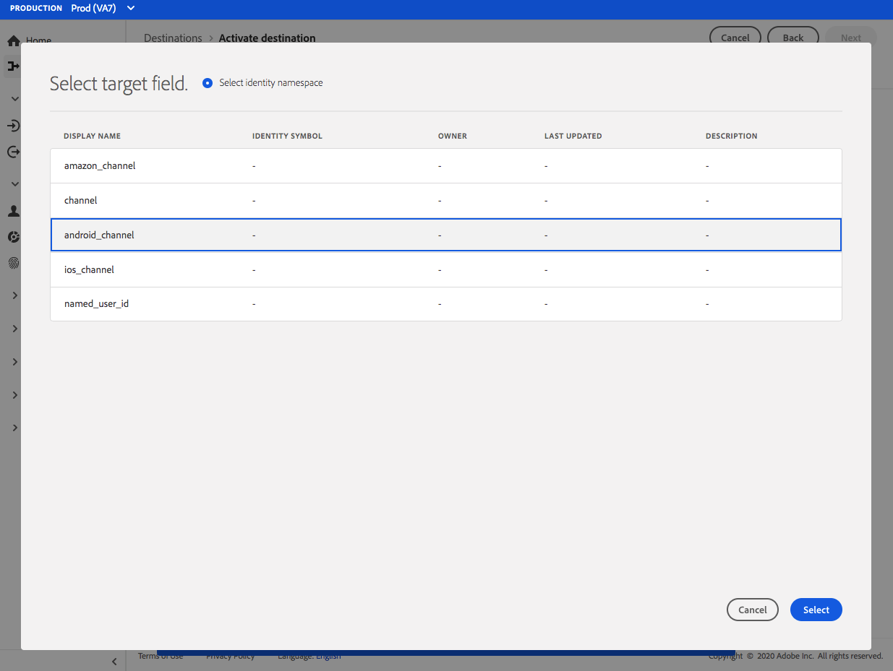

# [!DNL Airship Tags] anslutning {#airship-tags-destination}

## Översikt

[!DNL Airship] är den ledande plattformen för kundengagemang, som hjälper er att leverera meningsfulla, personaliserade meddelanden i alla kanaler till era användare under hela kundlivscykeln.

Den här integreringen överför data från Adobe Experience Platform segment till [!DNL Airship] as [Taggar](https://docs.airship.com/guides/audience/tags/) för målinriktning eller utlösande åtgärder.

Mer information om [!DNL Airship], se [Airship Docs](https://docs.airship.com).

>[!TIP]
>
>Dokumentationssidan skapades av [!DNL Airship] team. Om du har frågor eller uppdateringsfrågor kontaktar du dem direkt på [support.airship.com](https://support.airship.com/).

## Förutsättningar

Innan du skickar dina Adobe Experience Platform-segment till [!DNL Airship]måste du:

* Skapa en tagggrupp i [!DNL Airship] projekt.
* Generera en innehavartoken för autentisering.

>[!TIP]
> 
>Skapa en [!DNL Airship] konto via [den här signeringslänken](https://go.airship.eu/accounts/register/plan/starter/) om du inte redan gjort det.

## Exportera typ och frekvens {#export-type-frequency}

Se tabellen nedan för information om exporttyp och frekvens för destinationen.

| Objekt | Typ | Anteckningar |
---------|----------|---------|
| Exporttyp | **[!UICONTROL Segment export]** | Du exporterar alla medlemmar i ett segment (publik) med de identifierare som används i målet för Airship-taggar. |
| Exportfrekvens | **[!UICONTROL Streaming]** | Direktuppspelningsmål är alltid på API-baserade anslutningar. Så snart en profil uppdateras i Experience Platform baserat på segmentutvärdering skickar kopplingen uppdateringen nedåt till målplattformen. Läs mer om [mål för direktuppspelning](/help/destinations/destination-types.md#streaming-destinations). |

{style="table-layout:auto"}

## Tagggrupper

Segmentkonceptet i Adobe Experience Platform liknar det i [Taggar](https://docs.airship.com/guides/audience/tags/) i Airship, med små skillnader i genomförandet. Den här integreringen mappar statusen för en användares [medlemskap i ett Experience Platform-segment](../../../xdm/field-groups/profile/segmentation.md) till förekomsten eller frånvaron av en [!DNL Airship] -tagg. I ett plattformssegment där `xdm:status` ändringar i `realized`, läggs taggen till i [!DNL Airship] kanal eller namngiven användare som profilen är mappad till. Om `xdm:status` ändringar i `exited`, tas taggen bort.

Om du vill aktivera den här integreringen skapar du en *tagggrupp* in [!DNL Airship] namngiven `adobe-segments`.

>[!IMPORTANT]
>
>När du skapar en ny tagggrupp **Kontrollera inte** alternativknappen som säger &quot;[!DNL Allow these tags to be set only from your server]&quot;. Om du gör det misslyckas integreringen av Adobe-taggar.

Se [Hantera tagggrupper](https://docs.airship.com/tutorials/manage-project/messaging/tag-groups) för instruktioner om hur du skapar tagggruppen.

## Generera innehavartoken

Gå till **[!UICONTROL Settings]** &quot; **[!UICONTROL APIs & Integrations]** i [Kontrollpanel för luftfartyget](https://go.airship.com) och markera **[!UICONTROL Tokens]** i den vänstra menyn.

Klicka på **[!UICONTROL Create Token]**.

Ange ett användarvänligt namn för din token, t.ex. &quot;Adobe Tags Destination&quot;, och välj &quot;All Access&quot; för rollen.

Klicka **[!UICONTROL Create Token]** och spara informationen konfidentiellt.

## Användningsfall

För att du bättre ska förstå hur och när du ska använda [!DNL Airship Tags] mål, här är exempel på användningsområden som Adobe Experience Platform-kunder kan lösa genom att använda den här destinationen.

### Använd skiftläge 1

Återförsäljare eller underhållningsplattformar kan skapa användarprofiler för sina lojalitetskunder och skicka dessa segment till [!DNL Airship] för målgruppsanpassning av budskap i mobilkampanjer.

### Använd skiftläge 2

Utlös personliga meddelanden i realtid när användare faller in i eller ut ur specifika segment inom Adobe Experience Platform.

En återförsäljare skapar till exempel ett jeans-specifikt segment i Platform. Den återförsäljaren kan nu utlösa ett mobilt meddelande så snart någon sätter sina jeans-preferenser för ett visst varumärke.

## Anslut till målet {#connect}

>[!IMPORTANT]
> 
>Om du vill ansluta till målet behöver du **[!UICONTROL Manage Destinations]** [åtkomstkontrollbehörighet](/help/access-control/home.md#permissions). Läs [åtkomstkontroll - översikt](/help/access-control/ui/overview.md) eller kontakta produktadministratören för att få de behörigheter som krävs.

Om du vill ansluta till det här målet följer du stegen som beskrivs i [självstudiekurs om destinationskonfiguration](../../ui/connect-destination.md). I arbetsflödet för att konfigurera mål fyller du i fälten som listas i de två avsnitten nedan.

### Autentisera till mål {#authenticate}

Om du vill autentisera mot målet fyller du i de obligatoriska fälten och väljer **[!UICONTROL Connect to destination]**.

* **[!UICONTROL Bearer token]**: den innehavartoken som du skapade från [!DNL Airship] kontrollpanel.

### Fyll i målinformation {#destination-details}

Om du vill konfigurera information för målet fyller du i de obligatoriska och valfria fälten nedan. En asterisk bredvid ett fält i användargränssnittet anger att fältet är obligatoriskt.

* **[!UICONTROL Name]**: Ange ett namn som hjälper dig att identifiera det här målet.
* **[!UICONTROL Description]**: Ange en beskrivning för det här målet.
* **[!UICONTROL Domain]**: välj antingen ett datacenter för USA eller EU, beroende på vilket [!DNL Airship] datacenter gäller för den här destinationen.

### Aktivera aviseringar {#enable-alerts}

Du kan aktivera varningar för att få meddelanden om dataflödets status till ditt mål. Välj en avisering i listan om du vill prenumerera och få meddelanden om status för ditt dataflöde. Mer information om varningar finns i guiden [prenumerera på destinationsvarningar med hjälp av användargränssnittet](../../ui/alerts.md).

När du är klar med informationen för målanslutningen väljer du **[!UICONTROL Next]**.

## Aktivera segment till den här destinationen {#activate}

>[!IMPORTANT]
> 
>Om du vill aktivera data måste du ha **[!UICONTROL Manage Destinations]**, **[!UICONTROL Activate Destinations]**, **[!UICONTROL View Profiles]** och **[!UICONTROL View Segments]** [behörigheter för åtkomstkontroll](/help/access-control/home.md#permissions). Läs [åtkomstkontroll - översikt](/help/access-control/ui/overview.md) eller kontakta produktadministratören för att få de behörigheter som krävs.

Se [Aktivera målgruppsdata för att direktuppspela segmentexportmål](../../ui/activate-segment-streaming-destinations.md) om du vill ha instruktioner om hur du aktiverar målgruppssegment till det här målet.

## Mappningsöverväganden {#mapping-considerations}

[!DNL Airship] -taggar kan anges antingen på en kanal, som representerar enhetsinstans, t.ex. iPhone, eller en namngiven användare, som mappar alla användarens enheter till en gemensam identifierare, t.ex. ett kund-ID. Om du har e-postadresser med oformaterad text som primär identitet i ditt schema, markerar du e-postfältet i ditt **[!UICONTROL Source Attributes]** och mappa till [!DNL Airship] namngiven användare i den högra kolumnen under **[!UICONTROL Target Identities]**, vilket visas nedan.

För identifierare som ska mappas till en kanal, d.v.s. en enhet, mappar du till lämplig kanal baserat på källan. Följande bilder visar hur du mappar ett Google Advertising ID till ett [!DNL Airship] Android-kanal.

## Dataanvändning och styrning {#data-usage-governance}

Alla [!DNL Adobe Experience Platform] destinationerna är kompatibla med dataanvändningsprinciper när data hanteras. Detaljerad information om hur [!DNL Adobe Experience Platform] använder datastyrning, se [Datastyrning - översikt](../../../data-governance/home.md).
