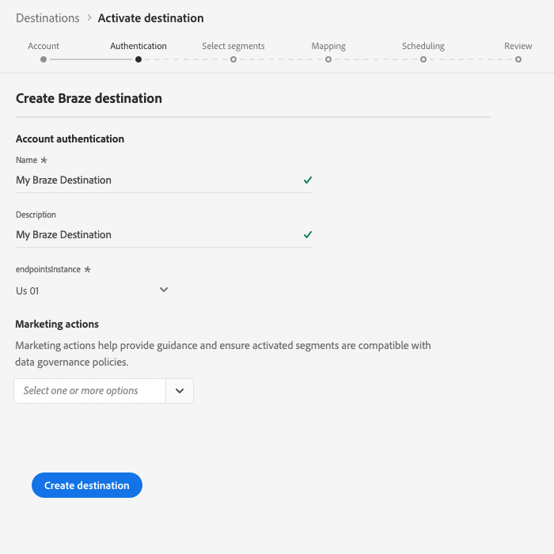
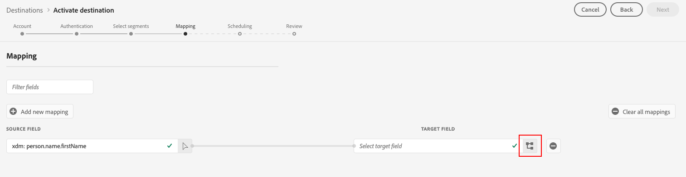

# (Beta) [!DNL Braze]-anslutning

>[!IMPORTANT]
>
>Braze-målet i Adobe Experience Platform är för närvarande i Beta. Dokumentationen och funktionaliteten kan komma att ändras.

Med [!DNL Braze]-målet kan du skicka profildata till [!DNL Braze].

[!DNL Braze] är en heltäckande plattform för kundengagemang som driver relevanta och minnesvärda upplevelser mellan kunder och varumärken de älskar.

Om du vill skicka profildata till [!DNL Braze] måste du först ansluta till målet.

## Målspecifikationer {#destination-specs}

Observera följande information som är specifik för [!DNL Braze]-målet:

* Du kan skicka alla [identiteter](../../../identity-service/namespaces.md) till [!DNL Braze]-målet, förutsatt att du mappar den till [!DNL Braze] [`external_id`](https://www.braze.com/docs/api/basics/#external-user-id-explanation).
* [!DNL Adobe Experience Platform] segment exporteras till  [!DNL Braze] under  `AdobeExperiencePlatformSegments` attributet.

>[!NOTE]
>
>Tänk på att om du skickar ytterligare anpassade attribut till [!DNL Braze] kan det leda till ökad datapunktsförbrukning för [!DNL Braze]. Kontakta din kontohanterare för [!DNL Braze] innan du skickar ytterligare anpassade attribut.

## Användningsfall {#use-cases}

Som marknadsförare vill jag rikta in mig på användare i ett mål för mobilengagemang, med segment inbyggda i [!DNL Adobe Experience Platform]. Dessutom vill jag leverera personaliserade upplevelser till dem, baserat på attribut från deras [!DNL Adobe Experience Platform]-profiler, så snart segment och profiler uppdateras i [!DNL Adobe Experience Platform].

## Exporttyp {#export-type}

**[!DNL Profile-based]** - du exporterar alla medlemmar i ett segment tillsammans med de önskade schemafälten (till exempel: e-postadress, telefonnummer, efternamn) och/eller identiteter enligt fältmappningen.
[!DNL Adobe Experience Platform] segment exporteras till  [!DNL Braze] under  `AdobeExperiencePlatformSegments` attributet.

## Anslut till målet {#connect-destination}

I **[!UICONTROL Connections]** > **[!UICONTROL Destinations]** väljer du [!DNL Braze] och väljer **[!UICONTROL Configure]**.

>[!NOTE]
>
>Om det redan finns en anslutning till det här målet kan du se en **[!UICONTROL Activate]**-knapp på målkortet. Mer information om skillnaden mellan **[!UICONTROL Activate]** och **[!UICONTROL Configure]** finns i avsnittet [Katalog](../../ui/destinations-workspace.md#catalog) i dokumentationen för målarbetsytan.
>
>

I steget [!UICONTROL Account] måste du ange din [!DNL Braze]-kontotoken. Det här är din [!DNL Braze] [!DNL API]-nyckel. Här finns detaljerade anvisningar om hur du får tag i din [!DNL API]-nyckel: [REST API Key Overview](https://www.braze.com/docs/api/api_key/). Ange token och klicka på **[!UICONTROL Connect to destination]**.

Klicka på **[!UICONTROL Next]**. I [!UICONTROL Authentication]-steget måste du ange [!DNL Braze]-anslutningsinformationen:
* **[!UICONTROL Name]**: Ange ett namn som du känner igen det här målet med i framtiden.
* **[!UICONTROL Description]**: Ange en beskrivning som hjälper dig att identifiera det här målet i framtiden.
* **[!UICONTROL Endpoint Instance]**: fråga din  [!DNL Braze] representant vilken slutpunktsinstans du ska använda.
* **[!UICONTROL Marketing use case]**: Användningsfall vid marknadsföring anger för vilken avsikt data ska exporteras till destinationen. Du kan välja bland Adobe-definierade användningsfall för marknadsföring eller skapa ett eget marknadsföringsexempel. Mer information om användningsfall för marknadsföring finns på sidan [Datastyrning i Adobe Experience Platform](../../../data-governance/policies/overview.md). Mer information om de enskilda Adobe-definierade användningsfallen för marknadsföring finns i [Översikt över dataanvändningsprinciper](../../../data-governance/policies/overview.md).

Klicka på **[!UICONTROL Create destination]**. Målet har skapats. Du kan klicka på **[!UICONTROL Save & Exit]** om du vill aktivera segment senare eller välja **[!UICONTROL Next]** om du vill fortsätta arbetsflödet och välja segment som ska aktiveras. I båda fallen ska du läsa nästa avsnitt, [Aktivera segment](#activate-segments), för resten av arbetsflödet.

## Aktivera segment {#activate-segments}

Mer information om arbetsflödet för segmentaktivering finns i [Aktivera profiler och segment till ett mål](../../ui/activate-destinations.md#select-attributes).

## Fältmappning {#field-mapping}

För att kunna skicka målgruppsdata från [!DNL Adobe Experience Platform] till [!DNL Braze]-målet måste du gå igenom fältmappningssteget.

Mappningen består av att skapa en länk mellan [!DNL Experience Data Model]-schemafälten (XDM) i ditt [!DNL Platform]-konto och deras motsvarande motsvarigheter från målmålet.

Följ de här stegen för att mappa dina XDM-fält till målfälten för [!DNL Braze]:

Klicka på **[!UICONTROL Add new mapping]** i steget [!UICONTROL Mapping].

Klicka på pilknappen bredvid det tomma fältet i [!UICONTROL Source Field]-avsnittet.

I fönstret [!UICONTROL Select source field] kan du välja mellan två kategorier med XDM-fält:
* [!UICONTROL Select attributes]: Använd det här alternativet om du vill mappa ett specifikt fält från XDM-schemat till ett  [!DNL Braze] attribut.

* [!UICONTROL Select identity namespace]: Använd det här alternativet om du vill mappa ett  [!DNL Platform] identitetsnamnutrymme till ett  [!DNL Braze] namnutrymme.

Välj källfält och klicka sedan på **[!UICONTROL Select]**.

Klicka på mappningsikonen till höger om fältet i [!UICONTROL Target Field]-avsnittet.

I fönstret [!UICONTROL Select target field] kan du välja mellan tre kategorier av målfält:
* [!UICONTROL Select attributes]: Använd det här alternativet om du vill mappa dina XDM-attribut till  [!DNL Braze] standardattribut.
* [!UICONTROL Select identity namespace]: Använd det här alternativet om du vill mappa  [!DNL Platform] identitetsnamnutrymmen till  [!DNL Braze] identitetsnamnutrymmen.
* [!UICONTROL Select custom attributes]: Använd det här alternativet om du vill mappa XDM-attribut till anpassade  [!DNL Braze] attribut som du har definierat i ditt  [!DNL Braze] konto.
* Du kan också använda det här alternativet om du vill ändra namn på befintliga XDM-attribut till [!DNL Braze]. Om du till exempel mappar ett `lastName` XDM-attribut till ett anpassat `Last_Name`-attribut i [!DNL Braze], skapas attributet `Last_Name` i [!DNL Braze], om det inte redan finns, och mappas XDM-attributet till det.`lastName`

Välj målfält och klicka sedan på **[!UICONTROL Select]**.

Nu bör du se fältmappningen i listan.

Upprepa föregående steg om du vill lägga till fler mappningar.

### Exempel {#mapping-example}

Säg att ditt XDM-profilschema och din [!DNL Braze]-instans innehåller följande attribut och identiteter:

|  | XDM-profilschema | [!DNL Braze] Instans |
|---|---|---|
| Attribut | <ul><li>person.name.firstName</code></li><li>person.name.lastName</code></li><li>mobilePhone.number</code></li></ul> | <ul><li>FirstName</code></li><li>LastName</code></li><li>Telefonnummer</code></li></ul> |
| Identiteter | <ul><li>E-post</code></li><li>Google Ad ID (GAID)</code></li><li>Apple-ID för annonsörer (IDFA)</code></li></ul> | <ul><li>external_id</code></li></ul> |

Den korrekta mappningen skulle se ut så här:

## Exporterade data {#exported-data}

Kontrollera ditt [!DNL Braze]-konto för att kontrollera om data har exporterats till [!DNL Braze]-målet. [!DNL Adobe Experience Platform] segment exporteras till  [!DNL Braze] under  `AdobeExperiencePlatformSegments` attributet.

## Dataanvändning och styrning {#data-usage-governance}

Alla [!DNL Adobe Experience Platform]-mål är kompatibla med dataanvändningsprinciper när data hanteras. Detaljerad information om hur [!DNL Adobe Experience Platform] verkställer datastyrning finns i [Datastyrningsöversikt](../../../data-governance/home.md).

