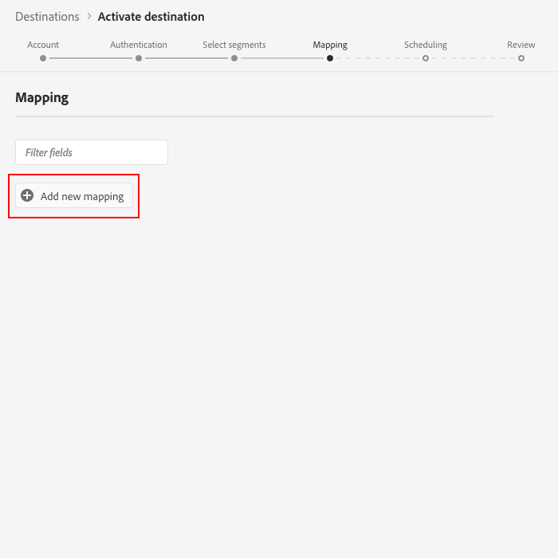
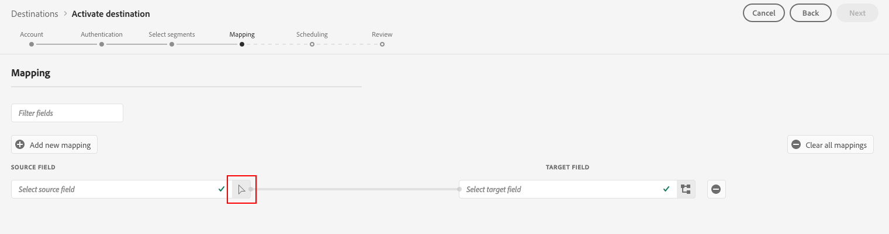
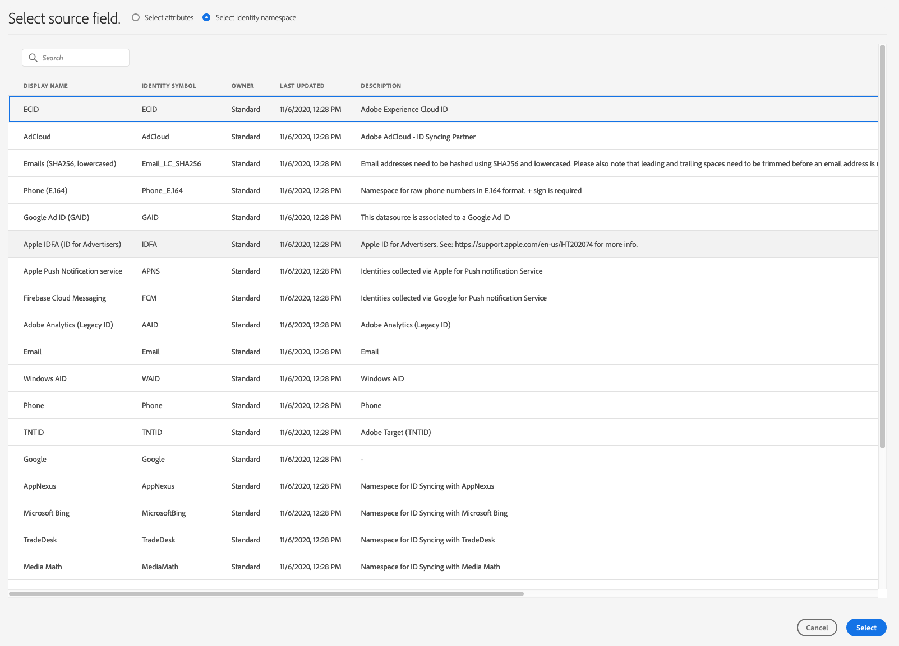
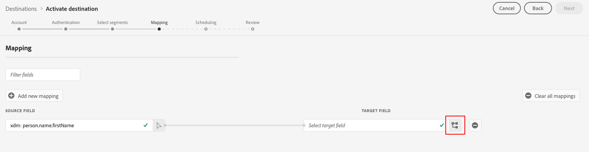
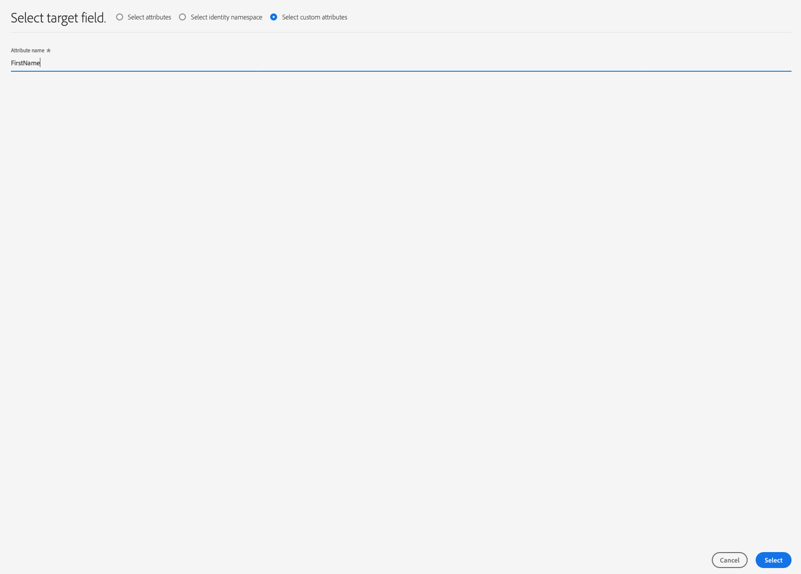
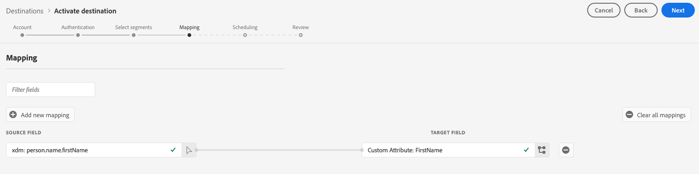
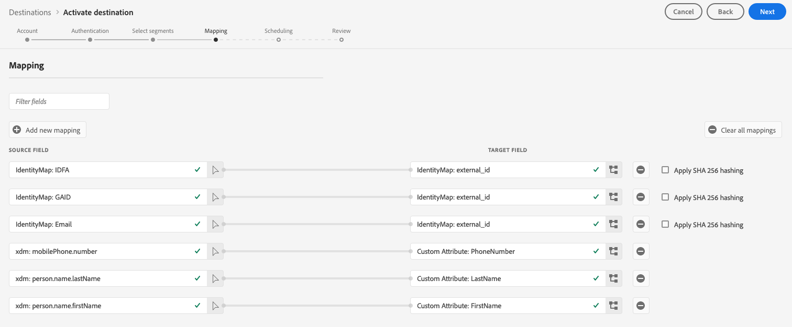

# [!DNL Braze]-anslutning

## Översikt {#overview}

Målet [!DNL Braze] hjälper dig att skicka profildata till [!DNL Braze].

[!DNL Braze] är en heltäckande plattform för kundengagemang som driver relevanta och minnesvärda upplevelser mellan kunder och de varumärken de älskar.

Om du vill skicka profildata till [!DNL Braze] måste du först ansluta till målet.

## Destinationsspecifikationer {#specifics}

Observera följande information som är specifik för målet [!DNL Braze]:

* [!DNL Adobe Experience Platform] målgrupper exporteras till [!DNL Braze] under attributet `AdobeExperiencePlatformSegments`.

>[!NOTE]
>
>Tänk på att om du skickar ytterligare anpassade attribut till [!DNL Braze] kan det leda till ökad datapunktsförbrukning i [!DNL Braze]. Kontakta din kontohanterare för [!DNL Braze] innan du skickar ytterligare anpassade attribut.

## Användningsfall {#use-cases}

Som marknadsförare vill jag rikta in mig på användare i ett mål för mobilengagemang, med målgrupper inbyggda i [!DNL Adobe Experience Platform]. Dessutom vill jag leverera personaliserade upplevelser till dem, baserat på attribut från deras [!DNL Adobe Experience Platform]-profiler, så snart som målgrupper och profiler uppdateras i [!DNL Adobe Experience Platform].

## Identiteter som stöds {#supported-identities}

[!DNL Braze] stöder aktivering av identiteter som beskrivs i tabellen nedan.

| Målidentitet | Beskrivning | Överväganden |
|---|---|---|
| external_id | Anpassad [!DNL Braze]-identifierare som stöder mappning av alla identiteter. | Du kan skicka alla [identiteter](../../../identity-service/features/namespaces.md) till [!DNL Braze]-målet, förutsatt att du mappar dem till [!DNL Braze] [`external_id`](https://www.braze.com/docs/api/basics/#external-user-id-explanation). |

{style="table-layout:auto"}

## Målgrupper {#supported-audiences}

I det här avsnittet beskrivs vilka typer av målgrupper du kan exportera till det här målet.

| Målgruppsursprung | Stöds | Beskrivning |
|---------|----------|----------|
| [!DNL Segmentation Service] | Ja | Publiker som genererats via Experience Platform [segmenteringstjänst](../../../segmentation/home.md). |
| Alla andra målgrupper kommer | Ja | Den här kategorin omfattar alla målgrupper som kommer utanför målgrupper som genereras via [!DNL Segmentation Service]. Läs om de [olika målgruppernas ursprung](/help/segmentation/ui/audience-portal.md#customize). Några exempel är: <ul><li> anpassade uppladdningsgrupper [importerade](../../../segmentation/ui/audience-portal.md#import-audience) till Experience Platform från CSV-filer,</li><li> lookalike-målgrupper, </li><li> federerade målgrupper, </li><li> målgrupper som har genererats i andra Experience Platform-appar som [!DNL Adobe Journey Optimizer], </li><li> med mera. </li></ul> |

{style="table-layout:auto"}

Målgrupper som stöds av olika typer av målgruppsdata:

| Typ av målgruppsdata | Stöds | Beskrivning | Användningsfall |
|--------------------|-----------|-------------|-----------|
| [Målgrupper](/help/segmentation/types/people-audiences.md) | Ja | Baserat på kundprofiler kan ni inrikta er på specifika grupper av människor för marknadsföringskampanjer. | Ofta köpare, övergivna varukorgar |
| [Kontomålgrupper](/help/segmentation/types/account-audiences.md) | Nej | Rikta er till individer inom specifika organisationer för kontobaserade marknadsföringsstrategier. | B2B-marknadsföring |
| [Prospektera målgrupper](/help/segmentation/types/prospect-audiences.md) | Nej | Rikta er till individer som ännu inte är kunder men som delar egenskaper med er målgrupp. | Prospektera med data från tredje part |
| [Datauppsättningsexport](/help/catalog/datasets/overview.md) | Nej | Samlingar med strukturerade data lagrade i datasjön [!DNL Adobe Experience Platform]. | Arbetsflöden för rapportering, datavetenskap |

{style="table-layout:auto"}

## Exportera typ och frekvens {#export-type-frequency}

Se tabellen nedan för information om exporttyp och frekvens för destinationen.

| Objekt | Typ | Anteckningar |
|---------|----------|---------|
| Exporttyp | **[!UICONTROL Profile-based]** | Du exporterar alla medlemmar i ett segment tillsammans med de önskade schemafälten (till exempel e-postadress, telefonnummer, efternamn) och/eller identiteter enligt fältmappningen.[!DNL Adobe Experience Platform] målgrupper exporteras till [!DNL Braze] under attributet `AdobeExperiencePlatformSegments`. |
| Exportfrekvens | **[!UICONTROL Streaming]** | Direktuppspelningsmål är alltid på API-baserade anslutningar. Så snart en profil uppdateras i Experience Platform baserat på målgruppsutvärdering skickar anslutningsprogrammet uppdateringen nedströms till målplattformen. Läs mer om [direktuppspelningsmål](/help/destinations/destination-types.md#streaming-destinations). |

{style="table-layout:auto"}

## Anslut till målet {#connect}

>[!IMPORTANT]
>
>Om du vill ansluta till målet behöver du behörigheterna **[!UICONTROL View Destinations]** och **[!UICONTROL Manage Destinations]** [åtkomstkontroll](/help/access-control/home.md#permissions). Läs [åtkomstkontrollsöversikten](/help/access-control/ui/overview.md) eller kontakta produktadministratören för att få den behörighet som krävs.

Om du vill ansluta till det här målet följer du stegen som beskrivs i självstudiekursen [för destinationskonfiguration](../../ui/connect-destination.md). I arbetsflödet för att konfigurera mål fyller du i fälten som listas i de två avsnitten nedan.

### Autentisera till mål {#authenticate}

Fyll i de obligatoriska fälten och välj **[!UICONTROL Connect to destination]** om du vill autentisera mot målet.

* **[!UICONTROL Braze account token]**: Det här är din [!DNL Braze] [!DNL API]-nyckel. Här finns detaljerade instruktioner om hur du hämtar nyckeln för [!DNL API]: [REST API Key Overview](https://www.braze.com/docs/api/api_key/).

### Fyll i målinformation {#destination-details}

Om du vill konfigurera information för målet fyller du i de obligatoriska och valfria fälten nedan. En asterisk bredvid ett fält i användargränssnittet anger att fältet är obligatoriskt.

* **[!UICONTROL Name]**: Ange ett namn som identifierar det här målet i framtiden.
* **[!UICONTROL Description]**: Ange en beskrivning som hjälper dig att identifiera det här målet i framtiden.
* **[!UICONTROL Endpoint Instance]**: alla [regionspecifika slutpunkter](https://www.braze.com/docs/user_guide/administrative/access_braze/sdk_endpoints) som stöds av [!DNL Braze] kan väljas. Fråga din [!DNL Braze]-representant vilken slutpunktsinstans du ska använda.

### Aktivera aviseringar {#enable-alerts}

Du kan aktivera varningar för att få meddelanden om dataflödets status till ditt mål. Välj en avisering i listan om du vill prenumerera och få meddelanden om statusen för ditt dataflöde. Mer information om varningar finns i guiden [prenumerera på destinationsvarningar med användargränssnittet](../../ui/alerts.md).

Välj **[!UICONTROL Next]** när du är klar med att ange information för målanslutningen.

## Aktivera målgrupper till det här målet {#activate}

>[!IMPORTANT]
>
>* För att aktivera data behöver du behörigheterna **[!UICONTROL View Destinations]**, **[!UICONTROL Activate Destinations]**, **[!UICONTROL View Profiles]** och **[!UICONTROL View Segments]** [åtkomstkontroll](/help/access-control/home.md#permissions). Läs [åtkomstkontrollsöversikten](/help/access-control/ui/overview.md) eller kontakta produktadministratören för att få den behörighet som krävs.
>* Om du vill exportera *identiteter* måste du ha **[!UICONTROL View Identity Graph]** [åtkomstkontrollbehörighet](/help/access-control/home.md#permissions).   {width="100" zoomable="yes"}

Se [Aktivera målgruppsdata för att direktuppspela målgruppsexportmål](../../ui/activate-segment-streaming-destinations.md) för instruktioner om hur du aktiverar målgrupper till det här målet.

## Mappningsöverväganden {#mapping-considerations}

Om du vill skicka målgruppsdata korrekt från [!DNL Adobe Experience Platform] till [!DNL Braze]-målet måste du gå igenom fältmappningssteget.

Mappningen består av att skapa en länk mellan [!DNL Experience Data Model] (XDM)-schemafälten i ditt [!DNL Experience Platform]-konto och motsvarande motsvarigheter från målmålet.

Följ de här stegen för att mappa dina XDM-fält korrekt till målfälten för [!DNL Braze]:

Välj [!UICONTROL Mapping] i steget **[!UICONTROL Add new mapping]**.

Klicka på pilknappen bredvid det tomma fältet i avsnittet [!UICONTROL Source Field].

I fönstret [!UICONTROL Select source field] kan du välja mellan två kategorier med XDM-fält:

* [!UICONTROL Select attributes]: använd det här alternativet om du vill mappa ett specifikt fält från XDM-schemat till ett [!DNL Braze] -attribut.

* [!UICONTROL Select identity namespace]: Använd det här alternativet om du vill mappa ett [!DNL Experience Platform] identity-namnutrymme till ett [!DNL Braze] -namnutrymme.

Välj källfältet och välj sedan **[!UICONTROL Select]**.

Klicka på mappningsikonen till höger om fältet i avsnittet [!UICONTROL Target Field].

I fönstret [!UICONTROL Select target field] kan du välja mellan två kategorier av målfält:

* [!UICONTROL Select identity namespace]: Använd det här alternativet om du vill mappa [!DNL Experience Platform] identitetsnamnutrymmen till [!DNL Braze] identitetsnamnutrymmen.
* [!UICONTROL Select custom attributes]: Använd det här alternativet om du vill mappa XDM-attribut till anpassade [!DNL Braze]-attribut som du har definierat i ditt [!DNL Braze]-konto.   Du kan också använda det här alternativet om du vill byta namn på befintliga XDM-attribut till [!DNL Braze]. Om du till exempel mappar ett `lastName` XDM-attribut till ett anpassat `Last_Name`-attribut i [!DNL Braze] skapas `Last_Name`-attributet i [!DNL Braze], om det inte redan finns, och `lastName` XDM-attributet mappas till det.

Välj målfältet och välj sedan **[!UICONTROL Select]**.

Nu bör du se fältmappningen i listan.

Upprepa föregående steg om du vill lägga till fler mappningar.

## Mappningsexempel {#mapping-example}

Säg att ditt XDM-profilschema och din [!DNL Braze]-instans innehåller följande attribut och identiteter:

|  | XDM-profilschema | [!DNL Braze]-instans |
|---|---|---|
| Attribut | <ul><li><code>person.name.firstName</code></li><li><code>person.name.lastName</code></li><li><code>mobilePhone.number</code></li></ul> | <ul><li><code>FirstName</code></li><li><code>LastName</code></li><li><code>Telefonnummer</code></li></ul> |
| Identiteter | <ul><li><code>E-post</code></li><li><code>Google Ad ID (GAID)</code></li><li><code>Apple ID för annonsörer (IDFA)</code></li></ul> | <ul><li><code>externt_id</code></li></ul> |

Den korrekta mappningen skulle se ut så här:

## Exporterade data {#exported-data}

Kontrollera ditt [!DNL Braze]-konto om du vill verifiera om data har exporterats till målet [!DNL Braze]. [!DNL Adobe Experience Platform] målgrupper exporteras till [!DNL Braze] under attributet `AdobeExperiencePlatformSegments`.

## Felsökning {#troubleshooting}

**Jag fick ett timeout-fel när mina målgrupper aktiverades på det här målet. Vad ska jag göra?**

Det kan hända att målgruppsaktiveringen till det här målet resulterar i ett timeout-fel. Detta fel indikerar inte ett aktiveringsproblem.

Om du får ett timeout-fel kontrollerar du målgruppens storlek på målplattformen. Om målgruppens storlek är korrekt fungerar integreringen som förväntat.

## Dataanvändning och styrning {#data-usage-governance}

Alla [!DNL Adobe Experience Platform]-mål är kompatibla med dataanvändningsprinciper när data hanteras. Mer information om hur [!DNL Adobe Experience Platform] använder datastyrning finns i [Översikt över datastyrning](../../../data-governance/home.md).
