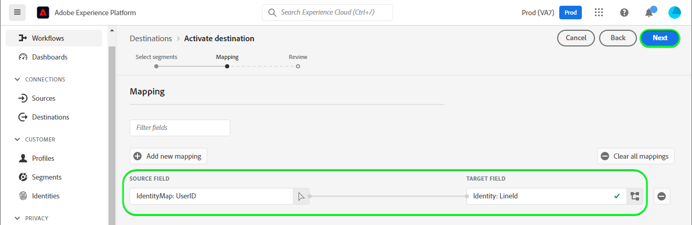

# [!DNL LINE]-anslutning

## Översikt {#overview}

[[!DNL LINE]](https://line.me/en/) är en populär kommunikationsplattform som kopplar samman människor, tjänster och information och har växt från en chattapp till ett nav för underhållning, sociala aktiviteter och dagliga aktiviteter.

Detta [!DNL Adobe Experience Platform] [mål](/help/destinations/home.md) använder [[!DNL LINE] MeddelandeAPI](https://developers.line.biz/en/reference/messaging-api/). Du kan aktivera profiler från dina Experience Platform-målgrupper som anslutningar inom [!DNL LINE] för dina affärsbehov.

[!DNL LINE] använder Bearer-token som autentiseringsmekanism för att kommunicera med [!DNL LINE] Messaging API. Instruktioner för autentisering till din [!DNL LINE]-instans finns längre ned i avsnittet [Autentisera till mål](#authenticate).

## Användningsfall {#use-cases}

Som marknadsförare kan ni inrikta er på användare i ett mål för mobilengagemang, med målgrupper inbyggda i [!DNL Adobe Experience Platform]. Dessutom kan du leverera personaliserade upplevelser till dem, baserat på attribut från deras [!DNL Adobe Experience Platform]-profiler, så snart som målgrupper och profiler uppdateras i [!DNL Adobe Experience Platform].

## Förhandskrav {#prerequisites}

### Krav för [!DNL LINE] {#prerequisites-destination}

Observera följande krav i [!DNL LINE] för att kunna exportera data från Experience Platform till ditt [!DNL LINE]-konto:

#### Du måste ha ett [!DNL LINE]-konto {#prerequisites-account}

Du måste registrera och skapa ett [!DNL LINE]-konto om du inte redan har ett. Skapa ett konto:

1. Navigera till sidan [!DNL LINE] [kontoinloggning](https://account.line.biz/login?redirectUri=https%3A%2F%2Fmanager.line.biz%2F)
2. Välj **[!UICONTROL Create an account]**.

#### Samla [!DNL LINE channel access token (long-lived)] från utvecklarkonsolen [!DNL LINE] {#gather-credentials}

För att Experience Platform ska kunna komma åt [!DNL LINE]-resurser måste du ha *[!DNL Channel access token (long-lived)]* från den önskade [!DNL LINE] *Messaging API* -kanalen.

1. Logga in med ditt [!DNL LINE]-konto på [[!DNL LINE] utvecklarkonsolen](https://developers.line.biz/console).
1. Gå sedan till listan *[!DNL Providers]*, markera *[!DNL Provider]* och markera till sist kanalen *MeddelandeAPI* för att komma åt inställningarna. Om du använder utvecklarkonsolen för första gången följer du [[!DNL LINE] dokumentationen](https://developers.line.biz/en/docs/messaging-api/getting-started/) för att slutföra stegen som krävs för att skapa en provider.
1. Till sist går du till avsnittet ***[!DNL Channel access token]*** och kopierar det ***[!DNL Channel access token (long-lived)]***-värde som krävs i steget [Autentisera till målet](#authenticate).

| Autentiseringsuppgifter | Beskrivning | Exempel |
| --- | --- | --- |
| `[!DNL Channel access token (long-lived)]` | Din [!DNL LINE Channel access token (long-lived)]. | `aaa2112XSMWqLXR7..........nyilFU=` |

Mer information om hur du skapar en kanal eller lägger till en kanal till ditt befintliga [!DNL LINE]-konto via [!DNL LINE]-utvecklarkonsolen finns i [[!DNL LINE] dokumentationen](https://developers.line.biz/en/docs/messaging-api/getting-started/).

## Identiteter som stöds {#supported-identities}

[!DNL LINE] stöder uppdatering och export av identiteter som beskrivs i tabellen nedan. Läs mer om [identiteter](/help/identity-service/features/namespaces.md).

| Målidentitet | Beskrivning |
|---|---|
| ID för annonsörer (IFA) | Markera ID:t för annonsörer (IFA:n) som mål-ID när källidentiteterna är IFA *(Apple ID för annonsörer)* eller GAID *(Google Advertising ID). |
| Användar-ID för RAD | Välj användar-ID-målidentiteten när källidentiteterna är LINE-användar-ID:n. |

## Exportera typ och frekvens {#export-type-frequency}

Se tabellen nedan för information om exporttyp och frekvens för destinationen.

| Objekt | Typ | Anteckningar |
---------|----------|---------|
| Exporttyp | **[!UICONTROL Profile-based]** | Du exporterar alla medlemmar i en målgrupp med identifierarna (namn, telefonnummer eller andra) som används i målet [!DNL LINE]. |
| Exportfrekvens | **[!UICONTROL Streaming]** | Direktuppspelningsmål är alltid på API-baserade anslutningar. Så snart en profil uppdateras i Experience Platform baserat på målgruppsutvärdering skickar anslutningsprogrammet uppdateringen nedströms till målplattformen. Läs mer om [direktuppspelningsmål](/help/destinations/destination-types.md#streaming-destinations). |

{style="table-layout:auto"}

## Anslut till målet {#connect}

>[!IMPORTANT]
>
>Om du vill ansluta till målet behöver du behörigheterna **[!UICONTROL View Destinations]** och **[!UICONTROL Manage Destinations]** [åtkomstkontroll](/help/access-control/home.md#permissions). Läs [åtkomstkontrollsöversikten](/help/access-control/ui/overview.md) eller kontakta produktadministratören för att få den behörighet som krävs.

Om du vill ansluta till det här målet följer du stegen som beskrivs i självstudiekursen [för destinationskonfiguration](../../ui/connect-destination.md). I arbetsflödet för att konfigurera mål fyller du i fälten som listas i de två avsnitten nedan.

I **[!UICONTROL Destinations]** > **[!UICONTROL Catalog]** söker du efter [!DNL LINE]. Du kan också hitta den under kategorin **[!UICONTROL Mobile engagement]**.

### Autentisera till mål {#authenticate}

Om du vill autentisera till målet väljer du **[!UICONTROL Connect to destination]**.

Fyll i de obligatoriska fälten nedan.
* **[!UICONTROL Bearer token]**: Din [!DNL LINE Channel access token (long-lived)] från utvecklarkonsolen [!DNL LINE]. Se avsnittet [Samla in inloggningsuppgifter](#gather-credentials).

Om den angivna informationen är giltig visas statusen **[!UICONTROL Connected]** med en grön bockmarkering. Du kan sedan gå vidare till nästa steg.

### Fyll i målinformation {#destination-details}

Om du vill konfigurera information för målet fyller du i de obligatoriska och valfria fälten nedan. En asterisk bredvid ett fält i användargränssnittet anger att fältet är obligatoriskt.

* **[!UICONTROL Name]**: Ett namn som du känner igen det här målet med i framtiden.
* **[!UICONTROL Description]**: En beskrivning som hjälper dig att identifiera det här målet i framtiden.
* **[!UICONTROL Audience Type]**: Välj **[!UICONTROL ID for Advertisers(IFAs)]** om de identiteter som du vill exportera är av typen *ID för annonsörer (IFA)*. Välj **[!UICONTROL LINE user IDs]** om de identiteter som du vill exportera är av typen *LINE-användar-ID*. Mer information om identitetstyperna finns i avsnittet [Identiteter som stöds](#supported-identities).

### Aktivera aviseringar {#enable-alerts}

Du kan aktivera varningar för att få meddelanden om dataflödets status till ditt mål. Välj en avisering i listan om du vill prenumerera och få meddelanden om statusen för ditt dataflöde. Mer information om varningar finns i guiden [prenumerera på destinationsvarningar med användargränssnittet](../../ui/alerts.md).

Välj **[!UICONTROL Next]** när du är klar med att ange information för målanslutningen.

## Aktivera målgrupper till det här målet {#activate}

>[!IMPORTANT]
> 
>* För att aktivera data behöver du behörigheterna **[!UICONTROL View Destinations]**, **[!UICONTROL Activate Destinations]**, **[!UICONTROL View Profiles]** och **[!UICONTROL View Segments]** [åtkomstkontroll](/help/access-control/home.md#permissions). Läs [åtkomstkontrollsöversikten](/help/access-control/ui/overview.md) eller kontakta produktadministratören för att få den behörighet som krävs.
>* Om du vill exportera *identiteter* måste du ha **[!UICONTROL View Identity Graph]** [åtkomstkontrollbehörighet](/help/access-control/home.md#permissions).   {width="100" zoomable="yes"}

Läs [Aktivera profiler och målgrupper för att direktuppspela målgruppsexportdestinationer](/help/destinations/ui/activate-segment-streaming-destinations.md) för instruktioner om hur du aktiverar målgrupper till det här målet.

### Mappa attribut och identiteter {#map}

Om du vill skicka målgruppsdata från Adobe Experience Platform till målet [!DNL LINE] måste du gå igenom fältmappningssteget. Mappningen består av att skapa en länk mellan XDM-schemafälten (Experience Data Model) i ditt Experience Platform-konto och deras motsvarande motsvarigheter från målmålet. Följ de här stegen för att mappa dina XDM-fält korrekt till målfälten för [!DNL LINE]:

Beroende på din källidentitet måste följande namnrymder för målidentitet mappas:

| Målidentitet | Source Field | Målfält |
| --- | --- | --- |
| ID för annonsörer (IFA) | `IDFA` eller `GAID` | `LineId` |
| Användar-ID för RAD | `UserID` | `LineId` |

Om dina mål-ID är *LINE-användar-ID:n* behöver du följande:

Om din målidentitet är *ID för Advertisers(IFA)* behöver du följande:

## Validera dataexport {#exported-data}

När dataexporten är klar från Experience Platform skapar [!DNL LINE]-målet en ny målgrupp inom [!DNL LINE] med det valda målgruppsnamnet.

Följ stegen nedan för att verifiera att du har konfigurerat målet korrekt:

1. Logga in på [Manager-konsolen](https://manager.line.biz/) i [!DNL LINE].

1. Gå sedan till **[!UICONTROL Data Controls]** > **[!UICONTROL Audiences]** och kontrollera namnet som matchar den valda målgruppen i kolumnen **[!UICONTROL Audience name]**.

1. Den uppdaterade volymen matchar antalet i segmentet.

1. Kolumnen *Type* anger **[!UICONTROL UserID]** om de identiteter som du exporterade är av typen *UserID*. På samma sätt kommer kolumnen *Typ* att innehålla **[!UICONTROL Mobile ad Id]** om de identiteter som du exporterade är av typen *IDFA*.

Ett exempel i [!DNL LINE] visas nedan:

## Dataanvändning och styrning {#data-usage-governance}

Alla [!DNL Adobe Experience Platform]-mål är kompatibla med dataanvändningsprinciper när data hanteras. Mer information om hur [!DNL Adobe Experience Platform] använder datastyrning finns i [Datastyrningsöversikten](/help/data-governance/home.md).
