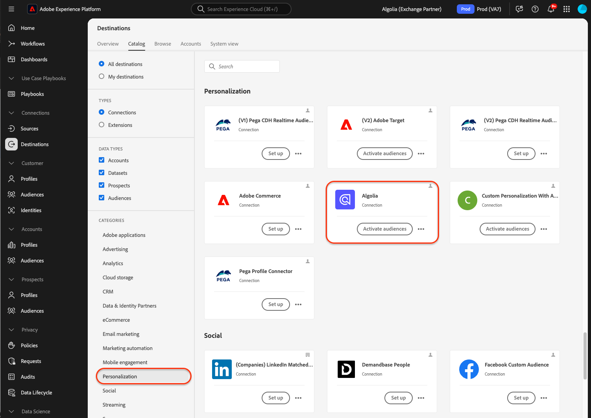

# [!DNL Algolia]-anslutning

## Översikt {#overview}

>[!IMPORTANT]
>
>Målanslutnings- och dokumentationssidan för [!DNL Algolia] skapas och underhålls av Algolia Integration Services-teamet. Om du har frågor eller uppdateringsfrågor kan du kontakta dem på [adobe-algolia-solutions@algolia.com](adobe-algolia-solutions@algolia.com).

Använd målanslutningen [!DNL Algolia] för att skicka Adobe Experience Platform-målgrupper till Algolia för personlig sökning och rekommendationer. Innan du kan använda målkopplingen [!DNL Algolia] måste du först konfigurera källkopplingen för [[!DNL Algolia User Profiles]](/help/sources/connectors/data-partners/algolia-user-profiles.md). Under självstudiekursen för konfiguration av källanslutning skapar du användaridentiteten för Algoliet-användartoken. Den här identiteten krävs för mappning när du konfigurerar målkopplingen.

I den här självstudiekursen beskrivs hur du skapar en [!DNL Algolia]-målanslutning och ett dataflöde med Adobe Experience Platform-användargränssnittet.

## Användningsfall {#use-cases}

För att du bättre ska kunna förstå hur och när du ska använda målet [!DNL Algolia] finns det exempel på användning som Adobe Experience Platform-kunder kan lösa genom att använda det här målet.

### Enhetlig Personalization {#personalization-consistency}

Använd den här målkopplingen för att leverera en konsekvent personalisering på hela webbplatsen från hemsidan till sökningen.

Som marknadsförare kanske du vill skapa en rik målgrupp i Adobe Experience Platform från flera datakällor, inklusive Algolia. Du kan använda målkopplingen [!DNL Algolia] för att dela målgrupper för målgruppsstrategier, vilket leder till en ökad kampanjpersonalisering och konvertering.

Om du vill implementera det här användningsfallet måste du använda både [[!DNL Algolia User Profiles]](/help/sources/connectors/data-partners/algolia-user-profiles.md)-källan och [!DNL Algolia]-målanslutningarna.

Du börjar med att importera dina befintliga [!DNL Algolia]-användarprofiler till Adobe Experience Platform Real-Time CDP och andra källor för att börja skapa avancerade målgrupper med källkopplingen. Marknadsförarna skulle kunna skapa målgrupper med hjälp av profildata som kan skickas till Algoliet för söknings- och rekommendationspersonalisering.

Använd sedan motsvarande [[!DNL Algolia User Profiles]](/help/sources/connectors/data-partners/algolia-user-profiles.md)-källanslutning för att importera och förstärka kundprofiler tillbaka till Real-Time CDP.

## Förhandskrav {#prerequisites}

>[!IMPORTANT]
>
>* Om du vill ansluta till målet behöver du behörigheterna **[!UICONTROL View Destinations]**, **[!UICONTROL Manage Destinations]**, **[!UICONTROL Activate Destinations]**, **[!UICONTROL View Profiles]** och **[!UICONTROL View Segments]** [åtkomstkontroll](/help/access-control/home.md#permissions). Läs [åtkomstkontrollsöversikten](/help/access-control/ui/overview.md) eller kontakta produktadministratören för att få den behörighet som krävs.
>* Om du vill exportera *identiteter* måste du ha **[!UICONTROL View Identity Graph]** [åtkomstkontrollbehörighet](/help/access-control/home.md#permissions).   {width="100" zoomable="yes"}

## Identiteter som stöds {#supported-identities}

[!DNL Algolia] stöder aktivering av identiteter som beskrivs i tabellen nedan. Läs mer om [identiteter](https://experienceleague.adobe.com/sv/docs/experience-platform/identity/features/namespaces).

| Målidentitet | Beskrivning | Överväganden |
|---------|---------|----------|
| userId | [!DNL Algolia] användartoken | Välj den här målidentiteten om du vill mappa `AlgoliaUserToken`-källidentiteten till `userToken` i [!DNL Algolia]-plattformen. |

{style="table-layout:auto"}

## Målgrupper {#supported-audiences}

I det här avsnittet beskrivs vilken typ av målgrupper du kan exportera till det här målet.

| Målgruppsursprung | Stöds | Beskrivning |
|---------|---------|----------|
| [!DNL Segmentation Service] | ✓ | Publiker som genererats via Experience Platform [segmenteringstjänst](../../../segmentation/home.md). |
| Anpassade överföringar | ✓ | Publikerna [importerade](../../../segmentation/ui/audience-portal.md#import-audience) till Experience Platform från CSV-filer. |

{style="table-layout:auto"}

## Exportera typ och frekvens {#export-type-frequency}

Se tabellen nedan för information om exporttyp och frekvens för destinationen.

| Objekt | Typ | Anteckningar |
|---------|----------|---------|
| Exporttyp | **[!DNL Audience export]** | Du exporterar alla medlemmar i en målgrupp med identifierarna (namn, telefonnummer eller andra) som används i målet [!DNL Algolia]. |
| Exportfrekvens | **[!UICONTROL Streaming]** | Direktuppspelningsmål är alltid på API-baserade anslutningar. Så snart en profil uppdateras i Experience Platform baserat på målgruppsutvärdering skickar anslutningsprogrammet uppdateringen nedströms till målplattformen. Läs mer om [direktuppspelningsmål](/help/destinations/destination-types.md#streaming-destinations). |

{style="table-layout:auto"}

## Anslut till målet {#connect}

>[!IMPORTANT]
>
>Om du vill ansluta till målet behöver du behörigheterna **[!UICONTROL View Destinations]** och **[!UICONTROL Manage and Activate Dataset Destinations]** [åtkomstkontroll](/help/access-control/home.md#permissions). Läs [åtkomstkontrollsöversikten](/help/access-control/ui/overview.md) eller kontakta produktadministratören för att få den behörighet som krävs.

Om du vill ansluta till det här målet följer du stegen som beskrivs i självstudiekursen [för destinationskonfiguration](../../ui/connect-destination.md). I arbetsflödet för målkonfiguration fyller du i fälten som listas i de två avsnitten nedan.

### Autentisera till mål {#authenticate}

Fyll i de obligatoriska fälten och välj **[!UICONTROL Connect to destination]** om du vill autentisera mot målet.

* **[!UICONTROL Application ID]**: Program-ID:t [!DNL Algolia] är en unik identifierare som tilldelats ditt [!DNL Algolia]-konto.
* **[!UICONTROL API Key]**: API-nyckeln [!DNL Algolia] är en autentiseringsuppgift som används för att autentisera och auktorisera API-begäranden till [!DNL Algolia] för sök- och indexeringstjänster.

Mer information om dessa autentiseringsuppgifter finns i [!DNL Algolia] [autentiseringsdokumentationen](https://www.algolia.com/doc/tools/cli/get-started/authentication/).

### Fyll i målinformation

Om du vill konfigurera information för målet fyller du i de obligatoriska och valfria fälten nedan. En asterisk bredvid ett fält i användargränssnittet anger att fältet är obligatoriskt.

* **[!UICONTROL Name]**: Fyll i det önskade namnet för det här målet.
* **[!UICONTROL Description]**: En kort förklaring av målets syfte.
* **[!UICONTROL Region]**: Alternativen är **US** eller **EU**. Välj den region där kunddata lagras.

### Aktivera aviseringar {#enable-alerts}

Du kan aktivera varningar för att få meddelanden om dataflödets status till ditt mål. Välj en avisering i listan om du vill prenumerera och få meddelanden om statusen för ditt dataflöde. Mer information om varningar finns i guiden [prenumerera på destinationsvarningar med användargränssnittet](../../ui/alerts.md).

Välj **[!UICONTROL Next]** när du är klar med att ange information för målanslutningen.

## Aktivera målgrupper till det här målet {#activate}

>[!IMPORTANT]
> 
>* För att aktivera data behöver du behörigheterna **[!UICONTROL View Destinations]**, **[!UICONTROL Activate Destinations]**, **[!UICONTROL View Profiles]** och **[!UICONTROL View Segments]** [åtkomstkontroll](/help/access-control/home.md#permissions). Läs [åtkomstkontrollsöversikten](/help/access-control/ui/overview.md) eller kontakta produktadministratören för att få den behörighet som krävs.
>* Om du vill exportera identiteter måste du ha behörigheten [Visa identitetsdiagram ](https://experienceleague.adobe.com/sv/docs/experience-platform/access-control/home#permissions).

Läs [Aktivera profiler och målgrupper för att direktuppspela målgruppsexportdestinationer](https://experienceleague.adobe.com/sv/docs/experience-platform/destinations/ui/activate/activate-segment-streaming-destinations) för instruktioner om hur du aktiverar målgrupper till det här målet.

### Mappa attribut och identiteter {#mapping-attributes-identities}

Under [!UICONTROL Mapping step] måste du mappa källidentiteten AlgoliaUserToken till mål-ID:t userId.

## Validera dataexport {#exported-data}

Kontrollera [!DNL Algolia]-instrumentpanelen och navigera till **[!UICONTROL Advanced Personalization]** och klicka på **[!UICONTROL User Inspector]** för att kontrollera om målgrupperna har exporterats till användarprofilerna. Hitta en användarprofil som är associerad med den exporterade Adobe Experience Platform-målgruppen och sök efter den i Användarpanelen. Du ser målgrupps-ID i segmentavsnittet.

## Dataanvändning och styrning {#data-usage-governance}

Alla [!DNL Adobe Experience Platform]-mål är kompatibla med dataanvändningsprinciper när data hanteras. Mer information om hur [!DNL Adobe Experience Platform] använder datastyrning finns i [Översikt över datastyrning](https://experienceleague.adobe.com/docs/experience-platform/data-governance/home.html?lang=sv-SE).

## Ytterligare resurser {#additional-resources}

Mer information finns i följande [!DNL Algolia]-dokumentation:

* [Vad är avancerad Personalization?](https://www.algolia.com/doc/guides/personalization/advanced-personalization/what-is-advanced-personalization/)
* [Användarprofiler](https://www.algolia.com/doc/guides/personalization/advanced-personalization/what-is-advanced-personalization/concepts/user-profiles/)
* [Segmentera användare med regelkontexter](https://www.algolia.com/doc/guides/personalization/advanced-personalization/implement/guides/segment-users-with-rule-contexts/#assign-a-segment-context-at-query-time)

## Nästa steg {#next-steps}

Genom att följa den här självstudiekursen har du skapat ett dataflöde för att exportera målgrupper från Experience Platform till ditt [!DNL Algolia]-program. Mer information om plattformen [!DNL Algolia] finns i [dokumentationen för Algoliet](https://www.algolia.com/doc/).