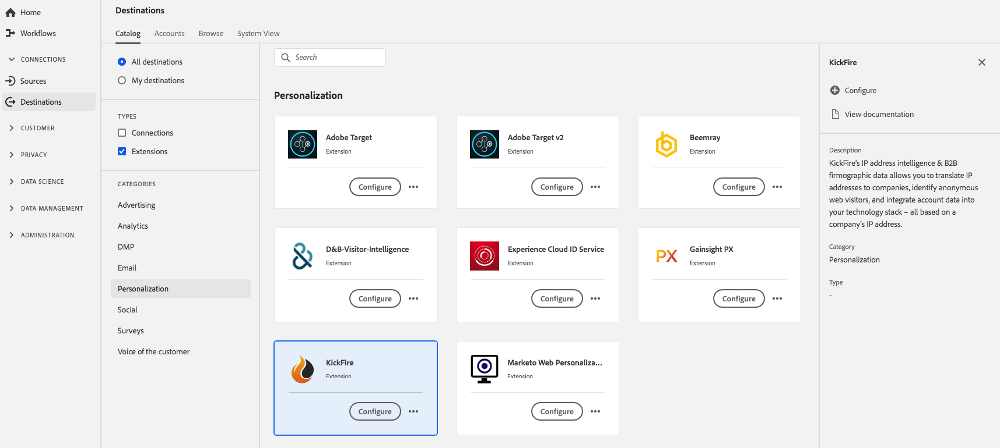

# [!DNL KickFire] extension {#kickfire-extension}

## Översikt {#overview}

[!DNL KickFire's] Med IP-adressintelligens och B2B-data kan ni översätta IP-adresser till företag, identifiera anonyma webbbesökare och integrera kontodata i er teknologi - allt baserat på ett företags IP-adress.

[!DNL KickFire] är ett personaliseringstillägg i Adobe Experience Platform. Mer information om tilläggsfunktioner finns på [Kickfire-webbplatsen](https://www.kickfire.com/).

Det här målet är ett Adobe Experience Platform Launch-tillägg. Mer information om hur tillägg till Platforma launcher fungerar i Platform finns i [Översikt över tillägg till Adobe Experience Platform Launch](../launch-extensions/overview.md).

## Förutsättningar {#prerequisites}

Det här tillägget är tillgängligt i [!DNL Destinations]-katalogen för alla kunder som har köpt Platform.

Om du vill använda det här tillägget måste du ha tillgång till Adobe Experience Platform Launch. platform launch erbjuds Adobe Experience Cloud-kunder som en inkluderad funktion som ger mervärde. Kontakta din organisations administratör för att få åtkomst till Platform launch och be dem att ge dig behörigheten **[!UICONTROL manage_properties]** så att du kan installera tillägg.

## Installera tillägg {#install-extension}

Så här installerar du tillägget [!DNL KickFire]:

Gå till **[!UICONTROL Destinations]** > **[!UICONTROL Catalog]** i [plattformsgränssnittet](http://platform.adobe.com/).

Välj tillägget i katalogen eller använd sökfältet.

Klicka på målet för att markera det och välj sedan **[!UICONTROL Configure]** i den högra listen. Om kontrollen **[!UICONTROL Configure]** är nedtonad saknar du behörigheten **[!UICONTROL manage_properties]**. Se [Förutsättningar](#prerequisites).

I fönstret **[!UICONTROL Select available Platform Launch property]** väljer du den Platform launch i vilken du vill installera tillägget. Du kan också skapa en ny egenskap i Platforma launchen. En egenskap är en samling regler, dataelement, konfigurerade tillägg, miljöer och bibliotek. Lär dig mer om egenskaper i avsnittet [Egenskaper](../../../tags/ui/administration/companies-and-properties.md#properties-page) i dokumentationen för Platforma launchen.

Arbetsflödet tar dig till Platforma launchen för att slutföra installationen.

Du kan också installera tillägget direkt i [Adobe Experience Platform Launch-gränssnittet](https://launch.adobe.com/). Se [Lägg till ett nytt tillägg](../../../tags/ui/managing-resources/extensions/overview.md#add-a-new-extension) i dokumentationen för Platforma launchen.

## Så här använder du tillägget {#how-to-use}

När du har installerat tillägget kan du börja konfigurera regler för det direkt i Platforma launchen.

I Platform launch kan du konfigurera regler för de installerade tilläggen så att händelsedata skickas till tilläggsmålet endast i vissa situationer. Mer information om hur du konfigurerar regler för tillägg finns i [Regeldokumentation](../../../tags/ui/managing-resources/rules.md).

## Konfigurera, uppgradera och ta bort tillägg {#configure-upgrade-delete}

Du kan konfigurera, uppgradera och ta bort tillägg i Platforma launchens gränssnitt.

>[!TIP]
>
>Om tillägget redan är installerat på en av dina egenskaper visas fortfarande **[!UICONTROL Install]** som plattformsgränssnitt för tillägget. Starta installationsarbetsflödet enligt beskrivningen i [Installera tillägget](#install-extension) för att komma till Platforma launchen och konfigurera eller ta bort tillägget.

Mer information om hur du uppgraderar tillägget finns i [Tilläggsuppgradering](../../../tags/ui/managing-resources/extensions/extension-upgrade.md) i Platforma launchens dokumentation.
