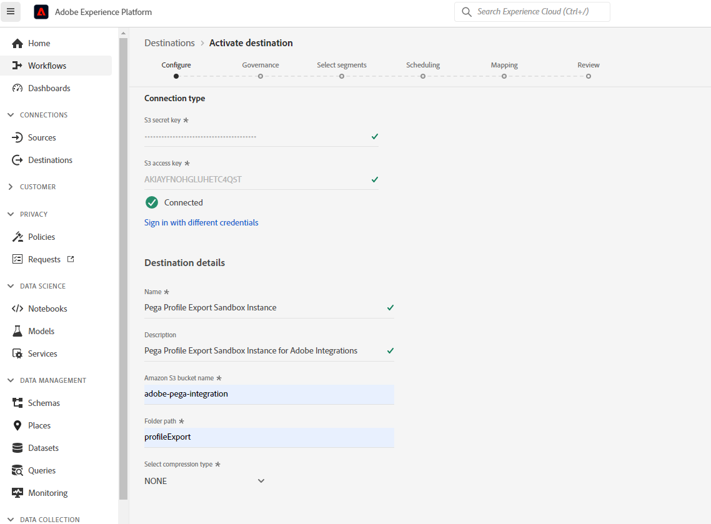

# Pega Profile Connector

## Översikt {#overview}

Använd [!DNL Pega Profile Connector] i Adobe Experience Platform för att skapa en utgående liveanslutning till [!DNL Amazon Web Services] (AWS) S3-lagring för att med jämna mellanrum exportera profildata till CSV-filer från Adobe Experience Platform till dina egna S3-butiker. I [!DNL Pega Customer Decision Hub]kan du schemalägga datajobb att importera profildata från S3-lagringsutrymmet för att uppdatera [!DNL Pega Customer Decision Hub] profil.

Denna koppling hjälper till att ställa in den inledande exporten av profildata och hjälper även till att synkronisera nya profiler regelbundet till [!DNL Pega Customer Decision Hub].  Med uppdaterade data i Kundbeslutshubben får du en bättre och uppdaterad bild av kundbasen för nästa beslut om bästa möjliga åtgärd.

>[!IMPORTANT]
>
>Målanslutningen och dokumentationssidan skapas och underhålls av Pegasystems. Kontakta Pega direkt för frågor eller uppdateringsförfrågningar [här](mailto:support@pega.com).

## Användningsfall

För att du bättre ska förstå hur och när du ska använda [!DNL Pega Profile Connector] mål, här är exempel på användningsområden som Adobe Experience Platform-kunder kan lösa genom att använda denna destination.

### Användningsfall 1

En marknadsförare vill initialt konfigurera [!DNL Pega Customer Decision Hub] med profildata inlästa från Adobe Experience Platform. Detta är en inledande full belastning följt av deltasterna på schemalagd basis.

### Användningsfall 2

En marknadsförare vill ha aktuella profildata från Adobe Experience Platform som finns i [!DNL Pega Customer Decision Hub] som kontinuerligt förbättrar Pegas insikter om kundprofiler.

## Förutsättningar {#prerequisites}

Innan du kan använda det här målet för att exportera data från Adobe Experience Platform och importera profiler till [!DNL Pega Customer Decision Hub]ska du kontrollera att du uppfyller följande krav:

* Konfigurera [!DNL Amazon S3] och den mappsökväg som ska användas för export och import av datafiler.
* Konfigurera [!DNL Amazon S3] åtkomstnyckel och [!DNL Amazon S3] hemlig nyckel: i [!DNL Amazon S3], generera ett `access key - secret access key` två för att ge plattformsåtkomst till [!DNL Amazon S3] konto.
* Ansluta och exportera data till [!DNL Amazon S3] lagringsplats, skapa en IAM-användare för [!DNL Platform] in [!DNL Amazon S3] och tilldela behörigheter som `s3:DeleteObject`, `s3:GetBucketLocation`, `s3:GetObject`, `s3:ListBucket`, `s3:PutObject`, `s3:ListMultipartUploadParts`
* Se till att [!DNL Pega Customer Decision Hub] -instansen har uppgraderats till version 8.8 eller senare.

## Identiteter som stöds {#supported-identities}

[!DNL Pega Customer Decision Hub] har stöd för aktivering av anpassade användar-ID:n som beskrivs i tabellen nedan. Mer information finns i [identiteter](/help/identity-service/namespaces.md).

| Målidentitet | Beskrivning |
|---|---|
| *CustomerID* | Vanlig användaridentifierare som unikt identifierar en profil i [!DNL Pega Customer Decision Hub] och Adobe Experience Platform |

{style="table-layout:auto"}

## Exportera typ och frekvens {#export-type-frequency}

Se tabellen nedan för information om exporttyp och frekvens för destinationen.

| Objekt | Typ | Anteckningar |
|---------|----------|---------|
| Exporttyp | **[!UICONTROL Profile-based]** | Du exporterar alla medlemmar i ett segment tillsammans med de önskade schemafälten (t.ex. e-postadress, telefonnummer, efternamn), som du har valt på skärmen Välj profilattribut i [arbetsflöde för målaktivering](../../ui/activate-batch-profile-destinations.md#select-attributes). |
| Exportfrekvens | **[!UICONTROL Batch]** | Batchdestinationer exporterar filer till efterföljande plattformar i steg om tre, sex, åtta, tolv eller tjugofyra timmar. Läs mer om [gruppfilsbaserade mål](/help/destinations/destination-types.md#file-based). |

{style="table-layout:auto"}

## Anslut till målet {#connect}

>[!IMPORTANT]
> 
>Om du vill ansluta till målet behöver du **[!UICONTROL Manage Destinations]** [behörighet för åtkomstkontroll](/help/access-control/home.md#permissions). Läs [åtkomstkontroll - översikt](/help/access-control/ui/overview.md) eller kontakta produktadministratören för att få de behörigheter som krävs.

Om du vill ansluta till det här målet följer du stegen som beskrivs i [självstudiekurs om destinationskonfiguration](../../ui/connect-destination.md). I arbetsflödet för målkonfiguration fyller du i fälten som listas i de två avsnitten nedan.

### Autentisera till mål {#authenticate}

Om du vill autentisera mot målet fyller du i de obligatoriska fälten och väljer **[!UICONTROL Connect to destination]**.

* **[!DNL Amazon S3]åtkomstnyckel** och **[!DNL Amazon S3]hemlig nyckel**: I [!DNL Amazon S3], generera ett `access key - secret access key` för att ge Adobe Experience Platform åtkomst till [!DNL Amazon S3] konto. Läs mer i [Amazon Web Services-dokumentation](https://docs.aws.amazon.com/IAM/latest/UserGuide/id_credentials_access-keys.html).

### Fyll i målinformation {#destination-details}

När autentiseringsanslutningen har upprättats till [!DNL Amazon S3]Ange följande information för destinationen:

Om du vill konfigurera information för målet fyller du i de obligatoriska fälten och väljer **[!UICONTROL Next]**. En asterisk bredvid ett fält i användargränssnittet anger att fältet är obligatoriskt.

* **[!UICONTROL Name]**: Ange ett namn som hjälper dig att identifiera det här målet.
* **[!UICONTROL Description]**: Ange en beskrivning av destinationen.
* **[!UICONTROL Bucket name]**: Ange namnet på [!DNL Amazon S3] bucket som ska användas för detta mål.
* **[!UICONTROL Folder path]**: Ange sökvägen till målmappen som ska vara värd för de exporterade filerna.
* **[!UICONTROL Compression Type]**: Välj komprimeringstyp som GZIP eller NONE.

>[!TIP]
>
>I arbetsflödet för anslutningsmål kan du skapa en anpassad mapp i din Amazon S3-lagring per exporterad målgruppsfil. Läs [Använd makron för att skapa en mapp på lagringsplatsen](/help/destinations/catalog/cloud-storage/overview.md#use-macros) för instruktioner.

### Aktivera aviseringar {#enable-alerts}

Du kan aktivera varningar för att få meddelanden om dataflödets status till ditt mål. Välj en avisering i listan om du vill prenumerera och få meddelanden om statusen för ditt dataflöde. Mer information om varningar finns i guiden på [prenumerera på destinationsvarningar med användargränssnittet](../../ui/alerts.md).

När du är klar med informationen för målanslutningen väljer du **[!UICONTROL Next]**.

## Aktivera målgrupper till det här målet {#activate}

>[!IMPORTANT]
> 
>* För att aktivera data behöver du **[!UICONTROL Manage Destinations]**, **[!UICONTROL Activate Destinations]**, **[!UICONTROL View Profiles]** och **[!UICONTROL View Segments]** [behörigheter för åtkomstkontroll](/help/access-control/home.md#permissions). Läs [åtkomstkontroll - översikt](/help/access-control/ui/overview.md) eller kontakta produktadministratören för att få de behörigheter som krävs.
>* Exportera *identiteter* behöver du **[!UICONTROL View Identity Graph]** [behörighet för åtkomstkontroll](/help/access-control/home.md#permissions).   {width="100" zoomable="yes"}

Se [Aktivera målgruppsdata för att batchprofilera exportmål](../../ui/activate-batch-profile-destinations.md) för instruktioner om hur du aktiverar målgrupper till det här målet.

### Mappa attribut och identiteter {#map}

I **[!UICONTROL Mapping]** kan du välja vilka attribut- och identitetsfält som ska exporteras för dina profiler. Du kan också välja att ändra rubrikerna i den exporterade filen till ett valfritt användarvänligt namn. Mer information finns i [mappningssteg](/help/destinations/ui/activate-batch-profile-destinations.md#mapping) i självstudiekursen om att aktivera gruppdestinationer.

## Validera dataexport {#exported-data}

För [!DNL Pega Profile Connector] destinationer, [!DNL Platform] skapar en `.csv` i den Amazon S3-lagringsplats som du har angett. Mer information om filerna finns i [Aktivera målgruppsdata för att batchprofilera exportmål](../../ui/activate-batch-profile-destinations.md) i självstudiekursen om målgruppsaktivering.

Vid import av profildata från S3 infogas data i [!DNL Pega Customer] profildatalager. Importerade kundprofildata kan valideras i [!DNL Pega Customer Profile Designer] , vilket visas i följande bild.

I [!DNL Pega Customer Decision Hub]kan dataadministratörer konfigurera datajobb i [!DNL Customer Profile Designer] att importera profildata periodiskt från S3 enligt följande figur. Se [ytterligare resurser](#additional-resources) om du vill ha mer information om hur du konfigurerar datajobb att importera profildata från [!DNL Amazon S3].

## Ytterligare resurser {#additional-resources}

Se [Importera datajobb](https://academy.pega.com/topic/import-data-jobs/v1) in [!DNL Pega Customer Decision Hub].

## Dataanvändning och styrning {#data-usage-governance}

Alla [!DNL Adobe Experience Platform] destinationerna är kompatibla med dataanvändningsprinciper när data hanteras. Detaljerad information om hur [!DNL Adobe Experience Platform] använder datastyrning, se [Datastyrning - översikt](/help/data-governance/home.md).
