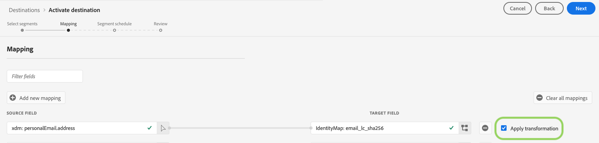

# [!DNL Facebook] extension

>[!IMPORTANT]
>
>Kundmigrering till de nya målversionerna pågår. Innan migreringen är klar visas endast de tillgängliga identiteterna [!UICONTROL EMAIL] och [!UICONTROL EMAIL_LC_SHA_256] för det här målet.

Aktivera profiler för [!DNL Facebook]-kampanjer för målgruppsanpassning, personalisering och nedtryckning baserat på hash-kodade e-postmeddelanden.

Du kan använda det här målet för målgrupper i [!DNL Facebook’s]-familjen med program som stöds av [!DNL Custom Audiences], inklusive [!DNL Facebook], [!DNL Instagram], [!DNL Audience Network] och [!DNL Messenger]. Det program som ni valt att köra kampanjen mot anges av placeringsnivån i [!DNL Facebook Ads Manager].

## Användningsexempel

För att du bättre ska förstå hur och när du ska använda målet [!DNL Facebook] finns det två exempel på användningsområden som Adobe Experience Platform-kunder kan lösa med den här funktionen.

### Användningsfall 1

En webbutik vill nå befintliga kunder via sociala plattformar och visa dem personaliserade erbjudanden baserat på deras tidigare order. Onlinebutiken kan importera e-postadresser från sin egen CRM till Adobe Experience Platform, bygga segment utifrån sina egna offlinedata och skicka dessa segment till den sociala plattformen [!DNL Facebook] för att optimera annonsutgifterna.

### Användningsfall nr 2

Ett flygbolag har olika kundnivåer (Bronze, Silver och Gold) och vill kunna erbjuda varje nivå personaliserade erbjudanden via sociala plattformar. Alla kunder använder dock inte flygbolagets mobilapp, och vissa av dem har inte loggat in på företagets webbplats. De enda identifierare företaget har för dessa kunder är medlems-ID och e-postadresser.

För att rikta in dem på sociala medier kan de lägga in kunddata från sina CRM i Adobe Experience Platform med e-postadresserna som identifierare.

Därefter kan de använda sina offlinedata, inklusive tillhörande medlemskaps-ID:n och kundnivåer, för att skapa nya målgruppssegment som de kan rikta sig mot via målet [!DNL Facebook].

## Målspecificeringar {#destination-specs}

### Datastyrning för [!DNL Facebook] mål {#data-governance}

>[!IMPORTANT]
>
>Data som skickas till [!DNL Facebook] får inte innehålla sammanslagna identiteter. Du ansvarar för att uppfylla denna skyldighet och kan göra det genom att se till att segment som markerats för aktivering inte använder ett sammanslagningsalternativ i sammanfogningspolicyn. Läs mer om [sammanfogningsprinciper](/help/profile/ui/merge-policies.md).

### Exporttyp {#export-type}

**Segmentexport**  - du exporterar alla medlemmar i ett segment (publik) med identifierarna (namn, telefonnummer osv.) används i Facebook-målet.

### Krav för Facebook-konto {#facebook-account-prerequisites}

Innan du kan skicka målgruppssegment till [!DNL Facebook] måste du kontrollera att du uppfyller följande krav:

- Ditt [!DNL Facebook]-användarkonto måste ha behörigheten **[!DNL Manage campaigns]** aktiverad för det annonskonto som du tänker använda.
- Företagskontot **Adobe Experience Cloud** måste läggas till som annonspartner i [!DNL Facebook Ad Account]. Använd `business ID=206617933627973`. Mer information finns i [Lägg till partner i din Business Manager](https://www.facebook.com/business/help/1717412048538897) i dokumentationen för Facebook.
   >[!IMPORTANT]
   >
   > När du konfigurerar behörigheter för Adobe Experience Cloud måste du aktivera behörigheten **Hantera kampanjer**. Det krävs för [!DNL Adobe Experience Platform]-integreringen.
- Läs och signera [!DNL Facebook Custom Audiences] användarvillkoren. Gör det genom att gå till `https://business.facebook.com/ads/manage/customaudiences/tos/?act=[accountID]`, där `accountID` är din [!DNL Facebook Ad Account ID].

### Krav för ID-matchning {#id-matching-requirements}

[!DNL Facebook] kräver att ingen personligt identifierbar information (PII) skickas klart. Därför kan målgrupper som är aktiverade för [!DNL Facebook] vara avstängda från *hash*-identifierare, till exempel e-postadresser eller telefonnummer.

Beroende på vilken typ av ID som du importerar till Adobe Experience Platform måste du följa deras motsvarande krav.

#### Kraven för hashning av telefonnummer {#phone-number-hashing-requirements}

Det finns två sätt att aktivera telefonnummer i [!DNL Facebook]:

- **Hämtar råtelefonnummer**: kan du importera råa telefonnummer i  [!DNL E.164] formatet till  [!DNL Platform], som automatiskt hashas när du aktiverar. Om du väljer det här alternativet måste du alltid importera dina raw-telefonnummer till namnutrymmet `Phone_E.164`.
- **Inmatning av hashade telefonnummer**: du kan förhash-koda dina telefonnummer innan du tar dig in i  [!DNL Platform]. Om du väljer det här alternativet måste du alltid importera dina hashade telefonnummer till namnutrymmet `Phone_SHA256`.

>[!NOTE]
>
>Telefonnummer som är inkapslade i namnområdet `Phone` kan inte aktiveras i [!DNL Facebook].

#### Krav för e-posthashning {#email-hashing-requirements}

Du kan välja att hash-koda e-postadresser innan du importerar dem till Adobe Experience Platform, eller så kan du välja att arbeta med e-postadresser i klartext i Experience Platform och låta algoritmen hash-koda dem när de aktiveras.

Om du vill veta mer om att importera e-postadresser i Experience Platform kan du läsa översikten [batchfrågor](/help/ingestion/batch-ingestion/overview.md) och översikten [steaming-frågor](/help/ingestion/streaming-ingestion/overview.md).

Om du väljer att hash-koda e-postadresserna själv måste du se till att uppfylla följande krav:

- Trimma alla inledande och avslutande blanksteg från e-poststrängen. exempel: `johndoe@example.com`, inte `<space>johndoe@example.com<space>`;
- När du hash-kodar e-poststrängarna ska du se till att hash-koda den gemena strängen.
   - Exempel: `example@email.com`, inte `EXAMPLE@EMAIL.COM`;
- Kontrollera att den hash-kodade strängen är i gemener
   - Exempel: `55e79200c1635b37ad31a378c39feb12f120f116625093a19bc32fff15041149`, inte `55E79200C1635B37AD31A378C39FEB12F120F116625093A19bC32FFF15041149`;
- Salt inte strängen.

Data från namnutrymmen som inte är hash-kodade hashas automatiskt av [!DNL Platform] vid aktiveringen.

Attributkälldata hashas inte automatiskt. När källfältet innehåller ohashade attribut bör du markera alternativet **[!UICONTROL Apply transformation]** så att [!DNL Platform] automatiskt hash-kodar data vid aktiveringen.

#### Använda anpassade namnutrymmen {#custom-namespaces}

Innan du kan använda namnutrymmet `Extern_ID` för att skicka data till [!DNL Facebook] måste du synkronisera dina egna identifierare med [!DNL Facebook Pixel]. Mer information finns i [den officiella dokumentationen](https://developers.facebook.com/docs/marketing-api/audiences/guides/custom-audiences/#external_identifiers).

## Anslut till målet {#connect-destination}

Mer information om hur du ansluter till [!DNL Facebook]-målet finns i [autentiseringsarbetsflöde för mål för sociala nätverk](./workflow.md).

## Aktivera segment till [!DNL Facebook] {#activate-segments}

Instruktioner om hur du aktiverar segment till [!DNL Facebook] finns i [Aktivera data till mål](../../ui/activate-destinations.md).

I steget **[!UICONTROL Segment schedule]** måste du ange [!UICONTROL Origin of audience] när du skickar segment till [!DNL Facebook Custom Audiences].

## Exporterade data {#exported-data}

För [!DNL Facebook] innebär en lyckad aktivering att en [!DNL Facebook] anpassad målgrupp skapas programmatiskt i [[!DNL Facebook Ads Manager]](https://www.facebook.com/adsmanager/manage/). Segmentmedlemskap i målgruppen skulle läggas till och tas bort eftersom användarna är kvalificerade eller diskvalificerade för de aktiverade segmenten.

>[!TIP]
>
>Integrationen mellan Adobe Experience Platform och [!DNL Facebook] har stöd för historiska efterfyllningar av målgrupper. Alla historiska segmentkvalifikationer skickas till [!DNL Facebook] när du aktiverar segmenten till målet.