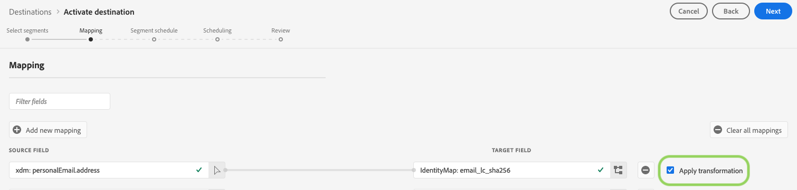

# [!DNL LinkedIn Matched Audience] anslutning

Aktivera profiler för era [!DNL LinkedIn]-kampanjer för målgruppsanpassning, personalisering och nedtryckning, baserat på hash-kodade e-postmeddelanden och mobil-ID:n.

## Användningsexempel

För att du bättre ska kunna förstå hur och när du ska använda målet [!DNL LinkedIn Matched Audience] finns det ett användningsexempel som Adobe Experience Platform-kunder kan lösa genom att använda den här funktionen.

Ett programvaruföretag organiserar en konferens och vill hålla kontakt med deltagarna och visa dem personliga erbjudanden baserat på deras konferensstatus. Företaget kan importera e-postadresser eller mobilenhets-ID:n från sina egna [!DNL CRM] till Adobe Experience Platform, skapa segment utifrån sina egna offlinedata och skicka dessa segment till den sociala plattformen [!DNL LinkedIn], vilket optimerar annonsutgifterna.

## Målspecificeringar {#destination-specs}

[!DNL LinkedIn Matched Audience] har stöd för aktivering av följande identiteter: hash emails,  [!DNL GAID]och  [!DNL IDFA].

### Exporttyp {#export-type}

**Segmentexport**  - du exporterar alla medlemmar i ett segment (publik) med identifierarna (namn, telefonnummer osv.) används i målet [!DNL LinkedIn Matched Audience].

### Krav för LinkedIn-konto {#LinkedIn-account-prerequisites}

Innan du kan använda målet [!UICONTROL LinkedIn Matched Audience] måste du kontrollera att ditt [!DNL LinkedIn Campaign Manager]-konto har behörighetsnivån [!DNL Creative Manager] eller högre.

Mer information om hur du redigerar dina [!DNL LinkedIn Campaign Manager]-användarbehörigheter finns i [Lägg till, redigera och ta bort användarbehörigheter för annonskonton](https://www.linkedin.com/help/lms/answer/5753) i dokumentationen för LinkedIn.

### Krav för ID-matchning {#id-matching-requirements}

[!DNL LinkedIn Matched Audience] kräver att ingen personligt identifierbar information (PII) skickas klart. Därför kan målgrupper som är aktiverade för [!DNL LinkedIn Matched Audience] vara avstängda från *hash*-identifierare, till exempel e-postadresser eller mobila enhets-ID:n.

Beroende på vilken typ av ID som du importerar till Adobe Experience Platform måste du följa deras motsvarande krav.

#### Krav för e-posthashning {#email-hashing-requirements}

Du kan välja att hash-koda e-postadresser innan du importerar dem till Adobe Experience Platform, eller så kan du välja att arbeta med e-postadresser i klartext i Experience Platform och låta algoritmen hash-koda dem när de aktiveras.

Om du vill veta mer om att importera e-postadresser i Experience Platform kan du läsa översikten [över gruppimporten](/help/ingestion/batch-ingestion/overview.md) och översikten [över direktuppspelningsförslag](/help/ingestion/streaming-ingestion/overview.md).

Om du väljer att hash-koda e-postadresserna själv måste du se till att uppfylla följande krav:

- Trimma alla inledande och avslutande blanksteg från e-poststrängen. Till exempel: `johndoe@example.com`, inte `<space>johndoe@example.com<space>`;
- När du hash-kodar e-poststrängarna ska du se till att hash-koda den gemena strängen.
   - Exempel: `example@email.com`, inte `EXAMPLE@EMAIL.COM`;
- Kontrollera att den hash-kodade strängen är i gemener
   - Exempel: `55e79200c1635b37ad31a378c39feb12f120f116625093a19bc32fff15041149`, inte `55E79200C1635B37AD31A378C39FEB12F120F116625093A19bC32FFF15041149`;
- Salt inte strängen.

>[!NOTE]
>
>Data från namnutrymmen som inte är hash-kodade hashas automatiskt av [!DNL Platform] vid aktiveringen.
> Attributkälldata hashas inte automatiskt.
> 
> Om källfältet innehåller ohstreckade attribut ska du under steget [Identitetsmappning](../../ui/activate-destinations.md#identity-mapping) kontrollera alternativet **[!UICONTROL Apply transformation]** så att [!DNL Platform] automatiskt hash-kodar data vid aktiveringen.
> 
> Alternativet **[!UICONTROL Apply transformation]** visas bara när du väljer attribut som källfält. Den visas inte när du väljer namnutrymmen.

## Anslut till målet {#connect-destination}

Mer information om hur du ansluter till [!DNL LinkedIn Matched Audience]-målet finns i [autentiseringsarbetsflöde för mål för sociala nätverk](./workflow.md).

## Aktivera segment till [!DNL LinkedIn Matched Audience] {#activate-segments}

Instruktioner om hur du aktiverar segment till [!DNL LinkedIn Matched Audience] finns i [Aktivera data till mål](../../ui/activate-destinations.md).

## Exporterade data {#exported-data}

En lyckad aktivering innebär att en [!DNL LinkedIn]-anpassad målgrupp skapas programmatiskt i [[!DNL LinkedIn Campaign Manager]](https://www.linkedin.com/campaignmanager/login). Segmentmedlemskap i målgruppen skulle läggas till och tas bort eftersom användarna är kvalificerade eller diskvalificerade för de aktiverade segmenten.

>[!TIP]
>
>Integrationen mellan Adobe Experience Platform och [!DNL LinkedIn Matched Audience] har stöd för historiska efterfyllningar av målgrupper. Alla historiska segmentkvalifikationer skickas till [!DNL LinkedIn] när du aktiverar segmenten till målet.