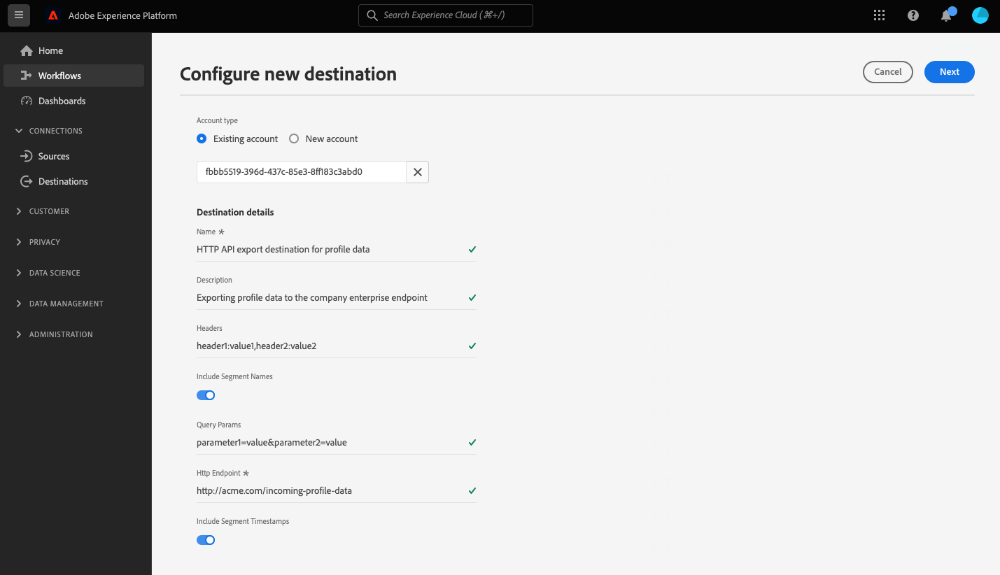

# HTTP API-anslutning

## Översikt {#overview}

>[!IMPORTANT]
>
> Det här målet är bara tillgängligt för [Adobe Real-Time Customer Data Platform Ultimate](https://helpx.adobe.com/se/legal/product-descriptions/real-time-customer-data-platform.html)-kunder.

HTTP API-målet är ett Experience Platform-mål för direktuppspelning som hjälper dig att skicka profildata till HTTP-slutpunkter från tredje part.

Om du vill skicka profildata till HTTP-slutpunkter måste du först [ansluta till målet](#connect-destination) i Experience Platform.

## Användningsfall {#use-cases}

Använd HTTP API-målet för att exportera XDM-profildata och målgrupper till generiska HTTP-slutpunkter. Där kan du köra egna analyser eller utföra andra åtgärder du kan behöva för profildata som exporterats från Experience Platform.

HTTP-slutpunkter kan antingen vara kundernas egna system eller tredjepartslösningar.

## Målgrupper {#supported-audiences}

I det här avsnittet beskrivs vilka typer av målgrupper du kan exportera till det här målet.

| Målgruppsursprung | Stöds | Beskrivning |
|---------|----------|----------|
| [!DNL Segmentation Service] | Ja | Publiker som genererats via Experience Platform [segmenteringstjänst](../../../segmentation/home.md). |
| Alla andra målgrupper kommer | Ja | Den här kategorin omfattar alla målgrupper som kommer utanför målgrupper som genereras via [!DNL Segmentation Service]. Läs om de [olika målgruppernas ursprung](/help/segmentation/ui/audience-portal.md#customize). Några exempel är: <ul><li> anpassade uppladdningsgrupper [importerade](../../../segmentation/ui/audience-portal.md#import-audience) till Experience Platform från CSV-filer,</li><li> lookalike-målgrupper, </li><li> federerade målgrupper, </li><li> målgrupper som har genererats i andra Experience Platform-appar som [!DNL Adobe Journey Optimizer], </li><li> med mera. </li></ul> |

{style="table-layout:auto"}

Målgrupper som stöds av olika typer av målgruppsdata:

| Typ av målgruppsdata | Stöds | Beskrivning | Användningsfall |
|--------------------|-----------|-------------|-----------|
| [Målgrupper](/help/segmentation/types/people-audiences.md) | Ja | Baserat på kundprofiler. Använd dem för att inrikta er på specifika grupper av människor för marknadsföringskampanjer. | Ofta köpare, övergivna varukorgar |
| [Kontomålgrupper](/help/segmentation/types/account-audiences.md) | Nej | Rikta er till individer inom specifika organisationer för kontobaserade marknadsföringsstrategier. | B2B-marknadsföring |
| [Prospektera målgrupper](/help/segmentation/types/prospect-audiences.md) | Nej | Rikta er till individer som ännu inte är kunder men som delar egenskaper med er målgrupp. | Prospektera med data från tredje part |
| [Datauppsättningsexport](/help/catalog/datasets/overview.md) | Nej | Samlingar med strukturerade data lagrade i datasjön [!DNL Adobe Experience Platform]. | Arbetsflöden för rapportering, datavetenskap |

{style="table-layout:auto"}


## Exportera typ och frekvens {#export-type-frequency}

Se tabellen nedan för information om exporttyp och frekvens för destinationen.

| Objekt | Typ | Anteckningar |
| ---------|----------|---------|
| Exporttyp | **[!UICONTROL Profile-based]** | Du exporterar alla medlemmar i en målgrupp tillsammans med de önskade schemafälten (t.ex. e-postadress, telefonnummer, efternamn), som de har valts på mappningsskärmen i arbetsflödet för [målaktivering](../../ui/activate-segment-streaming-destinations.md#mapping). |
| Exportfrekvens | **[!UICONTROL Streaming]** | Direktuppspelningsmål är alltid på API-baserade anslutningar. Så snart en profil uppdateras i Experience Platform baserat på målgruppsutvärdering skickar anslutningsprogrammet uppdateringen nedströms till målplattformen. Läs mer om [direktuppspelningsmål](/help/destinations/destination-types.md#streaming-destinations). |

{style="table-layout:auto"}

## Förutsättningar {#prerequisites}

Om du vill använda HTTP API-målet för att exportera data från Experience Platform måste du uppfylla följande krav:

* Du måste ha en HTTP-slutpunkt som stöder REST API.
* HTTP-slutpunkten måste ha stöd för Experience Platform-profilschemat. Ingen omvandling till ett nyttolastschema från tredje part stöds i HTTP API-målet. Se avsnittet [exporterade data](#exported-data) för ett exempel på Experience Platform utdataschema.
* HTTP-slutpunkten måste ha stöd för rubriker.
* HTTP-slutpunkten måste svara inom 2 sekunder för att säkerställa korrekt databearbetning och undvika timeoutfel.
* Om du tänker använda mTLS: TLS måste vara inaktiverat för din slutpunkt för datamottagning och endast mTLS aktiverat.

>[!TIP]
>
> Du kan också använda [Adobe Experience Platform Destination SDK](/help/destinations/destination-sdk/overview.md) för att konfigurera en integrering och skicka Experience Platform-profildata till en HTTP-slutpunkt.

## Stöd och certifikat för mTLS-protokoll {#mtls-protocol-support}

Du kan använda [!DNL Mutual Transport Layer Security] (mTLS) för att säkerställa förbättrad säkerhet i utgående anslutningar till HTTP API-målanslutningarna.

mTLS är ett protokoll för ömsesidig autentisering som ser till att båda parter delar information är de som gör anspråk på att vara innan data delas. mTLS innehåller ytterligare ett steg jämfört med standard-TLS, där servern också begär och verifierar klientens certifikat medan klienten verifierar serverns certifikat.

### mTLS-överväganden {#mtls-considerations}

mTLS-stöd för HTTP API-mål gäller **endast för den datamottagningsslutpunkt** där profilexporter skickas (fältet **[!UICONTROL HTTP Endpoint]** i [målinformationen](#destination-details)).

### Konfigurera mTLS för dataexport {#configuring-mtls}

Om du vill använda mTLS med HTTP API-mål måste TLS-protokoll vara inaktiverade på sidan **[!UICONTROL HTTP Endpoint]** (slutpunkt för datamottagning) som du konfigurerar på sidan [målinformation](#destination-details) och endast mTLS aktiverat. Om TLS 1.2-protokollet fortfarande är aktiverat på slutpunkten skickas inget certifikat för klientautentisering. Det innebär att om du vill använda mTLS med ditt HTTP API-mål, måste slutpunkten för datamottagningsservern vara en anslutningsslutpunkt som bara är aktiverad för mTLS.

### Hämta och inspektera certifikatinformation {#certificate}

Om du vill inspektera certifikatinformation som t.ex. Common Name (CN) och Subject Alternative Names (SAN) för ytterligare validering från tredje part använder du API:t för att hämta certifikatet och extrahera fälten från svaret.

Mer information finns i [dokumentationen för slutpunkten för det offentliga certifikatet](../../../data-governance/mtls-api/public-certificate-endpoint.md).

## IP-adress tillåtelselista {#ip-address-allowlist}

För att uppfylla kundernas säkerhets- och kompatibilitetskrav tillhandahåller Experience Platform en lista med statiska IP-adresser som du kan tillåtslista för HTTP API-destinationen. Se [IP-adressen tillåtelselista för direktuppspelningsmål](/help/destinations/catalog/streaming/ip-address-allow-list.md) för en fullständig lista över IP-adresser som ska tillåtslista.

## Autentiseringstyper som stöds {#supported-authentication-types}

HTTP API-målet stöder flera autentiseringstyper för HTTP-slutpunkten:

* HTTP-slutpunkt utan autentisering;
* Autentisering av innehavartoken;
* [OAuth 2.0-klientautentiseringsuppgifter](https://www.oauth.com/oauth2-servers/access-tokens/client-credentials/) autentiseras med brödtextformuläret, med [!DNL client ID], [!DNL client secret] och [!DNL grant type] i HTTP-begärans brödtext, vilket visas i exemplet nedan.

```shell
curl --location --request POST '<YOUR_API_ENDPOINT>' \
--header 'Content-Type: application/x-www-form-urlencoded' \
--data-urlencode 'grant_type=client_credentials' \
--data-urlencode 'client_id=<CLIENT_ID>' \
--data-urlencode 'client_secret=<CLIENT_SECRET>'
```

* [OAuth 2.0-klientautentiseringsuppgifter](https://www.oauth.com/oauth2-servers/access-tokens/client-credentials/) med grundläggande auktorisering, med en auktoriseringshuvud som innehåller URL-kodad [!DNL client ID] och [!DNL client secret].

```shell
curl --location --request POST 'https://some-api.com/token' \
--header 'Authorization: Basic base64(clientId:clientSecret)' \
--header 'Content-type: application/x-www-form-urlencoded; charset=UTF-8' \
--data-urlencode 'grant_type=client_credentials'
```

* [OAuth 2.0-lösenord &#x200B;](https://www.oauth.com/oauth2-servers/access-tokens/password-grant/).

## Anslut till målet {#connect-destination}

>[!IMPORTANT]
>
>Om du vill ansluta till målet behöver du behörigheterna **[!UICONTROL View Destinations]** och **[!UICONTROL Manage Destinations]** [åtkomstkontroll](/help/access-control/home.md#permissions). Läs [åtkomstkontrollsöversikten](/help/access-control/ui/overview.md) eller kontakta produktadministratören för att få den behörighet som krävs.

Om du vill ansluta till det här målet följer du stegen som beskrivs i självstudiekursen [för destinationskonfiguration](../../ui/connect-destination.md). När du ansluter till det här målet måste du ange följande information:

### Autentiseringsinformation {#authentication-information}

>[!CONTEXTUALHELP]
>id="platform_destinations_connect_http_clientcredentialstype"
>title="Autentiseringstyp för klient"
>abstract="Välj **Body Form Encoded** om du vill inkludera klient-ID och klienthemlighet i förfrågningens brödtext eller **Basic Authorization** om du vill inkludera klient-ID och klienthemlighet i auktoriseringshuvudet. Se exempel i dokumentationen."

#### Autentisering av innehavartoken {#bearer-token-authentication}

Om du väljer autentiseringstypen **[!UICONTROL Bearer token]** för att ansluta till HTTP-slutpunkten anger du informationen nedan och väljer **[!UICONTROL Connect to destination]**:

![HTTP API-autentiseringsskärmen med fältet [!UICONTROL Bearer token].](../../assets/catalog/http/http-api-authentication-bearer.png)

* **[!UICONTROL Bearer token]**: Ange bearer-token för att autentisera till din HTTP-plats.

#### Ingen autentisering {#no-authentication}

Om du väljer autentiseringstypen **[!UICONTROL None]** för att ansluta till HTTP-slutpunkten:

![HTTP API-autentiseringsskärmen med autentiseringstypen [!UICONTROL None] markerad.](../../assets/catalog/http/http-api-authentication-none.png)

När du väljer det här autentiseringsalternativet behöver du bara välja **[!UICONTROL Connect to destination]** och anslutningen till slutpunkten är upprättad.

#### Lösenordsautentisering för OAuth 2 {#oauth-2-password-authentication}

Om du väljer autentiseringstypen **[!UICONTROL OAuth 2 Password]** för att ansluta till HTTP-slutpunkten anger du informationen nedan och väljer **[!UICONTROL Connect to destination]**:

![HTTP API-autentiseringsskärmen med [!UICONTROL OAuth 2 Password] fält.](../../assets/catalog/http/http-api-authentication-oauth2-password.png)

* **[!UICONTROL Access Token URL]**: Den URL på din sida som utfärdar åtkomsttoken och, om du vill, uppdatera tokens.
* **[!UICONTROL Client ID]**: Den `client ID` som ditt system tilldelar Adobe Experience Platform.
* **[!UICONTROL Client Secret]**: Den `client secret` som ditt system tilldelar Adobe Experience Platform.
* **[!UICONTROL Username]**: Användarnamnet för att komma åt HTTP-slutpunkten.
* **[!UICONTROL Password]**: Lösenordet för att komma åt HTTP-slutpunkten.

#### Autentisering med OAuth 2-klientautentiseringsuppgifter {#oauth-2-client-credentials-authentication}

Om du väljer autentiseringstypen **[!UICONTROL OAuth 2 Client Credentials]** för att ansluta till HTTP-slutpunkten anger du informationen nedan och väljer **[!UICONTROL Connect to destination]**:

![HTTP API-autentiseringsskärmen med [!UICONTROL OAuth 2 Client Credentials] fält.](../../assets/catalog/http/http-api-authentication-oauth2-client-credentials.png)

>[!WARNING]
>
>När du använder [!UICONTROL OAuth 2 Client Credentials]-autentisering kan [!UICONTROL Access Token URL] ha högst en frågeparameter. Om du lägger till en [!UICONTROL Access Token URL] med fler frågeparametrar kan det leda till problem när du ansluter till slutpunkten.

* **[!UICONTROL Access Token URL]**: Den URL på din sida som utfärdar åtkomsttoken och, om du vill, uppdatera tokens.
* **[!UICONTROL Client ID]**: Den `client ID` som ditt system tilldelar Adobe Experience Platform.
* **[!UICONTROL Client Secret]**: Den `client secret` som ditt system tilldelar Adobe Experience Platform.
* **[!UICONTROL Client Credentials Type]**: Välj den typ av OAuth 2-klientautentiseringsuppgifter som stöds av din slutpunkt:
   * **[!UICONTROL Body Form Encoded]**: I det här fallet inkluderas `client ID` och `client secret` *i texten för den begäran* som skickas till ditt mål. Se till exempel avsnittet [Autentiseringstyper som stöds](#supported-authentication-types).
   * **[!UICONTROL Basic Authorization]**: I det här fallet inkluderas `client ID` och `client secret` *i en `Authorization` header* efter att base64-kodats och skickats till målet. Se till exempel avsnittet [Autentiseringstyper som stöds](#supported-authentication-types).

### Fyll i målinformation {#destination-details}

>[!CONTEXTUALHELP]
>id="platform_destinations_connect_http_headers"
>title="Sidhuvuden"
>abstract="Ange eventuella anpassade rubriker som du vill ska inkluderas i målanropen, enligt följande format: `header1:value1,header2:value2,...headerN:valueN`"

>[!CONTEXTUALHELP]
>id="platform_destinations_connect_http_endpoint"
>title="HTTP-slutpunkt"
>abstract="URL:en för HTTP-slutpunkten dit du vill skicka profildata. Detta är den slutpunkt för datamottagning som stöder mTLS om den är konfigurerad."

>[!CONTEXTUALHELP]
>id="platform_destinations_connect_http_includesegmentnames"
>title="Inkludera segmentnamn"
>abstract="Växla om du vill att dataexporten ska inkludera namnen på de målgrupper som du exporterar. Visa dokumentationen för ett dataexportexempel där det här alternativet är markerat."

>[!CONTEXTUALHELP]
>id="platform_destinations_connect_http_includesegmenttimestamps"
>title="Inkludera tidsstämplar för segment"
>abstract="Växla om du vill att dataexporten ska inkludera UNIX-tidsstämpeln när målgrupperna skapades och uppdaterades, samt UNIX-tidsstämpeln när målgrupperna mappades till målet för aktiveringen. Visa dokumentationen för ett dataexportexempel där det här alternativet är markerat."

>[!CONTEXTUALHELP]
>id="platform_destinations_connect_http_queryparameters"
>title="Frågeparametrar"
>abstract="Du kan också lägga till frågeparametrar till HTTP-slutpunkts-URL:en. Formatera de frågeparametrar som du använder så här: `parameter1=value&parameter2=value`."

Om du vill konfigurera information för målet fyller du i de obligatoriska och valfria fälten nedan. En asterisk bredvid ett fält i användargränssnittet anger att fältet är obligatoriskt.



* **[!UICONTROL Name]**: Ange ett namn som du känner igen det här målet med i framtiden.
* **[!UICONTROL Description]**: Ange en beskrivning som hjälper dig att identifiera det här målet i framtiden.
* **[!UICONTROL Headers]**: Ange eventuella anpassade rubriker som du vill ska inkluderas i målanropen, enligt följande format: `header1:value1,header2:value2,...headerN:valueN`.
* **[!UICONTROL HTTP Endpoint]**: URL:en för HTTP-slutpunkten dit du vill skicka profildata. Detta är slutpunkten för datamottagning. Om du använder mTLS måste TLS vara inaktiverat för den här slutpunkten och bara mTLS är aktiverat.
* **[!UICONTROL Query parameters]**: Om du vill kan du lägga till frågeparametrar till HTTP-slutpunkts-URL:en. Formatera de frågeparametrar som du använder så här: `parameter1=value&parameter2=value`.
* **[!UICONTROL Include Segment Names]**: Växla om du vill att dataexporten ska inkludera namnen på de målgrupper som du exporterar. **Obs!**: Målgruppsnamn inkluderas bara för målgrupper som är mappade till målet. Omappade målgrupper som visas i exporten kommer inte att innehålla fältet `name`. Ett exempel på en dataexport med det här alternativet markerat finns i avsnittet [Exporterade data](#exported-data) längre fram.
* **[!UICONTROL Include Segment Timestamps]**: Växla om du vill att dataexporten ska inkludera UNIX-tidsstämpeln när målgrupperna skapades och uppdaterades, samt UNIX-tidsstämpeln när målgrupperna mappades till målet för aktiveringen. Ett exempel på en dataexport med det här alternativet markerat finns i avsnittet [Exporterade data](#exported-data) längre fram.

### Aktivera aviseringar {#enable-alerts}

Du kan aktivera varningar för att få meddelanden om dataflödets status till ditt mål. Välj en avisering i listan om du vill prenumerera och få meddelanden om statusen för ditt dataflöde. Mer information om varningar finns i guiden om att [prenumerera på målvarningar med användargränssnittet](../../ui/alerts.md).

Välj **[!UICONTROL Next]** när du är klar med att ange information för målanslutningen.

## Aktivera målgrupper till det här målet {#activate}

>[!IMPORTANT]
>
>* För att aktivera data behöver du behörigheterna **[!UICONTROL View Destinations]**, **[!UICONTROL Activate Destinations]**, **[!UICONTROL View Profiles]** och **[!UICONTROL View Segments]** [åtkomstkontroll](/help/access-control/home.md#permissions). Läs [åtkomstkontrollsöversikten](/help/access-control/ui/overview.md) eller kontakta produktadministratören för att få den behörighet som krävs.
>* [Principutvärdering av samtycke](/help/data-governance/enforcement/auto-enforcement.md#consent-policy-evaluation) stöds för närvarande inte i exporter till HTTP API-målet. [Läs mer](/help/destinations/ui/activate-streaming-profile-destinations.md#consent-policy-evaluation).

Se [Aktivera målgruppsdata för att direktuppspela profilexportmål](../../ui/activate-streaming-profile-destinations.md) för instruktioner om hur du aktiverar målgrupper till det här målet.

### Målattribut {#attributes}

I steget [[!UICONTROL Select attributes]](../../ui/activate-streaming-profile-destinations.md#select-attributes) rekommenderar Adobe att du väljer en unik identifierare från ditt [union-schema](../../../profile/home.md#profile-fragments-and-union-schemas). Välj den unika identifieraren och eventuella andra XDM-fält som du vill exportera till målet.

## Beteende vid export av profiler {#profile-export-behavior}

Experience Platform optimerar beteendet för profilexport till ditt HTTP API-mål, så att endast data exporteras till API-slutpunkten när relevanta uppdateringar av en profil har gjorts efter målgruppsklassificering eller andra viktiga händelser. Profiler exporteras till ditt mål i följande situationer:

* Profiluppdateringen bestäms av en ändring av målgruppsmedlemskap för minst en av målgrupperna som är mappad till målet. Profilen har till exempel kvalificerats för en av de målgrupper som är mappade till målet eller har avslutat en av de målgrupper som är mappade till målet.
* Profiluppdateringen bestäms av en ändring i [identitetskartan](/help/xdm/field-groups/profile/identitymap.md). En profil som redan är kvalificerad för en av de målgrupper som är mappade till målet har fått en ny identitet tillagd i attributet för identitetskarta.
* Profiluppdateringen bestäms av en attributändring för minst ett av attributen som är mappade till målet. Ett av attributen som är mappade till målet i mappningssteget läggs till i en profil.

I alla de fall som beskrivs ovan exporteras endast de profiler där relevanta uppdateringar har gjorts till ditt mål. Om en målgrupp som mappats till målflödet till exempel har hundra medlemmar och fem nya profiler är kvalificerade för målgruppen, är exporten till målplatsen inkrementell och inkluderar bara de fem nya profilerna.

>[!NOTE]
>
>Alla mappade attribut exporteras för en profil, oavsett var ändringarna finns. I exemplet ovan exporteras alltså alla mappade attribut för de fem nya profilerna även om attributen inte har ändrats.

### Vad avgör en dataexport och vad som ingår i exporten {#what-determines-export-what-is-included}

När det gäller data som exporteras för en viss profil är det viktigt att förstå de två olika begreppen *vad som avgör en dataexport till HTTP API-målet* och *vilka data som inkluderas i exporten*.

| Vad avgör en målexport | Vad som ingår i målexporten |
|---------|----------|
| <ul><li>Kopplade attribut och målgrupper fungerar som referens för en målexport. Det innebär att om statusen `segmentMembership` för en profil ändras till `realized` eller `exiting` eller om alla mappade attribut uppdateras, kommer en målexport att startas om.</li><li>Eftersom identiteter för närvarande inte kan mappas till HTTP API-mål, bestämmer ändringar i en viss profil även målexporter.</li><li>En ändring för ett attribut definieras som en uppdatering för attributet, oavsett om det är samma värde eller inte. Det innebär att en överskrivning av ett attribut betraktas som en ändring även om värdet i sig inte har ändrats.</li></ul> | <ul><li>Objektet `segmentMembership` innehåller målgruppen som är mappad i aktiveringsdataflödet, för vilket profilens status har ändrats efter en kvalificerings- eller målgruppsavslutningshändelse. Observera att andra omappade målgrupper för vilka profilen är kvalificerad kan ingå i målexporten, om dessa målgrupper tillhör samma [sammanfogningsprincip](/help/profile/merge-policies/overview.md) som målgruppen som är mappad i aktiveringsdataflödet. <br> **Viktigt**: När alternativet **[!UICONTROL Include Segment Names]** är aktiverat inkluderas endast segmentnamn för målgrupper som är mappade till målet. Omappade målgrupper som visas i exporten kommer inte att inkludera fältet `name`, även om alternativet är aktiverat. </li><li>Alla identiteter i objektet `identityMap` ingår också (Experience Platform stöder för närvarande inte identitetsmappning i HTTP API-målet).</li><li>Endast de mappade attributen inkluderas i målexporten.</li></ul> |

{style="table-layout:fixed"}

Tänk dig till exempel det här dataflödet till ett HTTP-mål där tre målgrupper har valts i dataflödet och fyra attribut mappas till målet.


En profilexport till målet utlöses när en profil kvalificerar för eller avslutar en av de *tre mappade målgrupperna*. I dataexporten kan objektet `segmentMembership` (se [Exporterade data](#exported-data) nedan) även innehålla omappade målgrupper, om profilen är medlem av dem och de delar samma sammanfogningsprincip som målgruppen som utlöste exporten. Om en profil till exempel kvalificerar sig för målgruppen **Kund med DeLorean Cars** men även är medlem av filmerna **Bevakade&quot;Tillbaka till framtiden&quot;** och **Science fiction fans** , visas även dessa två målgrupper i objektet `segmentMembership` , förutsatt att de delar samma sammanslagningsprincip med **Kund med DeLorean Cars{8**} målgrupp.

När det gäller profilattribut kommer alla ändringar av de fyra attribut som mappas ovan att avgöra målexporten och alla de fyra mappade attributen som finns i profilen kommer att finnas i dataexporten.

## Bakgrundsfyllning av historiska data {#historical-data-backfill}

När du lägger till en ny målgrupp till ett befintligt mål, eller när du skapar ett nytt mål och mappar målgrupper till det, exporterar Experience Platform data om målgruppens historiska kvalifikationer till målet. Profiler som är kvalificerade för målgruppen *innan* målgruppen lades till i målet exporteras till målet inom ungefär en timme.

## Exporterade data {#exported-data}

Dina exporterade Experience Platform-data kommer in i ditt HTTP-mål i JSON-format. Exporten nedan innehåller till exempel en profil som har kvalificerats för en viss målgrupp, som är medlem av en annan målgrupp och som har lämnat en annan. Exporten innehåller också profilattributets förnamn, efternamn, födelsedatum och personlig e-postadress. Identiteterna för den här profilen är ECID och e-post.

```json
{
  "person": {
    "birthDate": "YYYY-MM-DD",
    "name": {
      "firstName": "John",
      "lastName": "Doe"
    }
  },
  "personalEmail": {
    "address": "john.doe@acme.com"
  },
  "segmentMembership": {
   "ups":{
      "7841ba61-23c1-4bb3-a495-00d3g5fe1e93":{
         "lastQualificationTime":"2022-01-11T21:24:39Z",
         "status":"exited"
      },
      "59bd2fkd-3c48-4b18-bf56-4f5c5e6967ae":{
         "lastQualificationTime":"2022-01-02T23:37:33Z",
         "status":"realized"
      },
      "947c1c46-008d-40b0-92ec-3af86eaf41c1":{
         "lastQualificationTime":"2021-08-25T23:37:33Z",
         "status":"realized"
      },
      "5114d758-ce71-43ba-b53e-e2a91d67b67f":{
         "lastQualificationTime":"2022-01-11T23:37:33Z",
         "status":"realized"
      }
   }
},
  "identityMap": {
    "ecid": [
      {
        "id": "14575006536349286404619648085736425115"
      },
      {
        "id": "66478888669296734530114754794777368480"
      }
    ],
    "email_lc_sha256": [
      {
        "id": "655332b5fa2aea4498bf7a290cff017cb4"
      },
      {
        "id": "66baf76ef9de8b42df8903f00e0e3dc0b7"
      }
    ]
  }
}
```

Nedan visas ytterligare exempel på exporterade data, beroende på vilka UI-inställningar du har valt i anslutningsmålflödet för alternativen **[!UICONTROL Include Segment Names]** och **[!UICONTROL Include Segment Timestamps]**:

+++ Exemplet på dataexport nedan innehåller publiknamn i avsnittet `segmentMembership`

```json
"segmentMembership": {
        "ups": {
          "5b998cb9-9488-4ec3-8d95-fa8338ced490": {
            "lastQualificationTime": "2019-04-15T02:41:50+0000",
            "status": "realized",
            "createdAt": 1648553325000,
            "updatedAt": 1648553330000,
            "mappingCreatedAt": 1649856570000,
            "mappingUpdatedAt": 1649856570000,
            "name": "First name equals John"
          },
          "354e086f-2e11-49a2-9e39-e5d9a76be683": {
            "lastQualificationTime": "2020-04-15T02:41:50+0000",
            "status": "realized"
          }
        }
      }
```

>[!NOTE]
>
>I det här exemplet mappas den första målgruppen (`5b998cb9-9488-4ec3-8d95-fa8338ced490`) till målet och innehåller fältet `name`. Den andra målgruppen (`354e086f-2e11-49a2-9e39-e5d9a76be683`) är inte mappad till målet och innehåller inte fältet `name`, även om alternativet **[!UICONTROL Include Segment Names]** är aktiverat.

+++

+++ Exemplet på dataexport nedan innehåller målgruppstidsstämplar i avsnittet `segmentMembership`

```json
"segmentMembership": {
        "ups": {
          "5b998cb9-9488-4ec3-8d95-fa8338ced490": {
            "lastQualificationTime": "2019-04-15T02:41:50+0000",
            "status": "realized",
            "createdAt": 1648553325000,
            "updatedAt": 1648553330000,
            "mappingCreatedAt": 1649856570000,
            "mappingUpdatedAt": 1649856570000
          }
        }
      }
```

+++

## Begränsningar och återförsöksprincip {#limits-retry-policy}

95 % av tiden försöker Experience Platform att erbjuda en genomströmningslatens på mindre än 10 minuter för skickade meddelanden med en hastighet på mindre än 10 000 begäranden per sekund för varje dataflöde till en HTTP-destination.

När begäranden till HTTP API-målet misslyckas, lagrar Experience Platform dem och försöker igen två gånger.

## Felsökning {#troubleshooting}

För att säkerställa tillförlitlig dataleverans och undvika timeoutproblem bör du kontrollera att HTTP-slutpunkten svarar på Experience Platform-förfrågningar inom 2 sekunder, enligt vad som anges i avsnittet [Krav](#prerequisites) . Svar som tar längre tid resulterar i timeoutfel.
