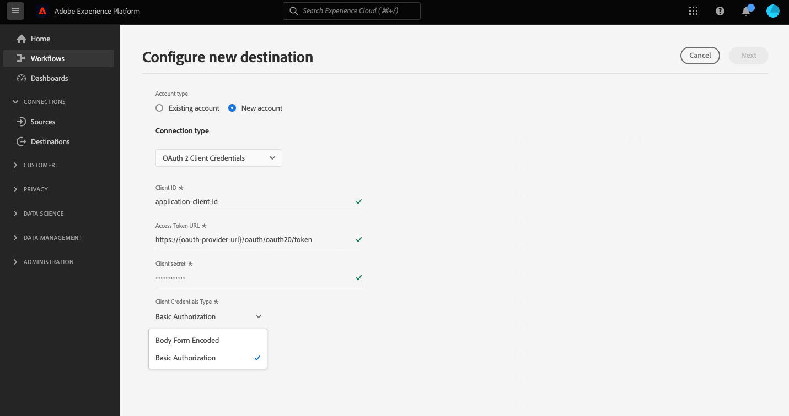

# HTTP API-anslutning

## Översikt {#overview}

>[!IMPORTANT]
>
> Det här målet är bara tillgängligt för [Adobe Real-time Customer Data Platform Ultimate](https://helpx.adobe.com/legal/product-descriptions/real-time-customer-data-platform.html) kunder.

HTTP API-målet är en [!DNL Adobe Experience Platform] direktuppspelningsmål som hjälper dig att skicka profildata till HTTP-slutpunkter från tredje part.

Om du vill skicka profildata till HTTP-slutpunkter måste du först [ansluta till målet](#connect-destination) in [!DNL Adobe Experience Platform].

## Användningsfall {#use-cases}

Med HTTP API-målet kan du exportera XDM-profildata och målgrupper till generiska HTTP-slutpunkter. Där kan du köra dina egna analyser eller utföra andra åtgärder du kan behöva för profildata som exporterats från Experience Platform.

HTTP-slutpunkter kan antingen vara kundernas egna system eller tredjepartslösningar.

## Målgrupper som stöds {#supported-audiences}

I det här avsnittet beskrivs alla målgrupper som du kan exportera till det här målet.

Alla destinationer stöder aktivering av målgrupper som genererats via Experience Platform [Segmenteringstjänst](../../../segmentation/home.md).

Dessutom stöder denna destination även aktivering av de målgrupper som beskrivs i tabellen nedan.

| Målgruppstyp | Beskrivning |
---------|----------|
| Anpassade överföringar | Målgrupper som importerats till Experience Platform från CSV-filer. |

{style="table-layout:auto"}

## Exportera typ och frekvens {#export-type-frequency}

Se tabellen nedan för information om exporttyp och frekvens för destinationen.

| Objekt | Typ | Anteckningar |
---------|----------|---------|
| Exporttyp | **[!UICONTROL Profile-based]** | Du exporterar alla medlemmar i ett segment tillsammans med önskade schemafält (till exempel: e-postadress, telefonnummer, efternamn), som du har valt på mappningsskärmen på [arbetsflöde för målaktivering](../../ui/activate-segment-streaming-destinations.md#mapping). |
| Exportfrekvens | **[!UICONTROL Streaming]** | Direktuppspelningsmål är alltid på API-baserade anslutningar. Så snart en profil uppdateras i Experience Platform baserat på målgruppsutvärdering skickar anslutningsprogrammet uppdateringen nedströms till målplattformen. Läs mer om [mål för direktuppspelning](/help/destinations/destination-types.md#streaming-destinations). |

{style="table-layout:auto"}

## Förutsättningar {#prerequisites}

Om du vill använda HTTP API-målet för att exportera data från Experience Platform måste du uppfylla följande krav:

* Du måste ha en HTTP-slutpunkt som stöder REST API.
* HTTP-slutpunkten måste ha stöd för Experience Platform-profilschemat. Ingen omvandling till ett nyttolastschema från tredje part stöds i HTTP API-målet. Se [exporterade data](#exported-data) för ett exempel på utdataschemat för Experience Platform.
* HTTP-slutpunkten måste ha stöd för rubriker.

>[!TIP]
>
> Du kan också använda [Adobe Experience Platform Destination SDK](/help/destinations/destination-sdk/overview.md) för att konfigurera en integrering och skicka Experience Platform-profildata till en HTTP-slutpunkt.

## IP-adress tillåtelselista {#ip-address-allowlist}

För att uppfylla kundernas säkerhets- och kompatibilitetskrav tillhandahåller Experience Platform en lista över statiska IP-adresser som du kan tillåtslista för HTTP API-destinationen. Se [IP-adress tillåtelselista för direktuppspelningsmål](/help/destinations/catalog/streaming/ip-address-allow-list.md) för den fullständiga listan över IP-adresser som ska tillåtslista.

## Autentiseringstyper som stöds {#supported-authentication-types}

HTTP API-målet stöder flera autentiseringstyper för HTTP-slutpunkten:

* HTTP-slutpunkt utan autentisering;
* Autentisering av innehavartoken;
* [Autentiseringsuppgifter för OAuth 2.0-klient](https://www.oauth.com/oauth2-servers/access-tokens/client-credentials/) autentisering med innehållsformuläret, med [!DNL client ID], [!DNL client secret] och [!DNL grant type] i HTTP-begärans brödtext, vilket visas i exemplet nedan.

```shell
curl --location --request POST '<YOUR_API_ENDPOINT>' \
--header 'Content-Type: application/x-www-form-urlencoded' \
--data-urlencode 'grant_type=client_credentials' \
--data-urlencode 'client_id=<CLIENT_ID>' \
--data-urlencode 'client_secret=<CLIENT_SECRET>'
```

* [Autentiseringsuppgifter för OAuth 2.0-klient](https://www.oauth.com/oauth2-servers/access-tokens/client-credentials/) med grundläggande auktorisering, med en auktoriseringshuvud som innehåller URL-kodad [!DNL client ID] och [!DNL client secret].

```shell
curl --location --request POST 'https://some-api.com/token' \
--header 'Authorization: Basic base64(clientId:clientSecret)' \
--header 'Content-type: application/x-www-form-urlencoded; charset=UTF-8' \
--data-urlencode 'grant_type=client_credentials'
```

* [OAuth 2.0-lösenord](https://www.oauth.com/oauth2-servers/access-tokens/password-grant/).

## Anslut till målet {#connect-destination}

>[!IMPORTANT]
> 
>Om du vill ansluta till målet behöver du **[!UICONTROL Manage Destinations]** [åtkomstkontrollbehörighet](/help/access-control/home.md#permissions). Läs [åtkomstkontroll - översikt](/help/access-control/ui/overview.md) eller kontakta produktadministratören för att få de behörigheter som krävs.

Om du vill ansluta till det här målet följer du stegen som beskrivs i [självstudiekurs om destinationskonfiguration](../../ui/connect-destination.md). När du ansluter till det här målet måste du ange följande information:

### Autentiseringsinformation {#authentication-information}

>[!CONTEXTUALHELP]
>id="platform_destinations_connect_http_clientcredentialstype"
>title="Autentiseringstyp för klient"
>abstract="Välj **Body Form Encoded** för att inkludera klient-ID och klienthemlighet i själva begäran eller **Grundläggande auktorisering** om du vill inkludera klient-ID och klienthemlighet i ett auktoriseringshuvud. Se exempel i dokumentationen."

#### Autentisering av innehavartoken {#bearer-token-authentication}

Om du väljer **[!UICONTROL Bearer token]** autentiseringstyp för att ansluta till HTTP-slutpunkten, ange fälten nedan och markera **[!UICONTROL Connect to destination]**:


* **[!UICONTROL Bearer token]**: infoga bearer-token för att autentisera till din HTTP-plats.

#### Ingen autentisering {#no-authentication}

Om du väljer **[!UICONTROL None]** autentiseringstyp för att ansluta till HTTP-slutpunkten:


När du har valt den här autentiseringen öppen behöver du bara välja **[!UICONTROL Connect to destination]** och anslutningen till slutpunkten har upprättats.

#### Lösenordsautentisering för OAuth 2 {#oauth-2-password-authentication}

Om du väljer **[!UICONTROL OAuth 2 Password]** autentiseringstyp för att ansluta till HTTP-slutpunkten, ange fälten nedan och markera **[!UICONTROL Connect to destination]**:


* **[!UICONTROL Access Token URL]**: Den URL på din sida som utfärdar åtkomsttoken och, om du vill, uppdatera tokens.
* **[!UICONTROL Client ID]**: The [!DNL client ID] som ditt system tilldelar Adobe Experience Platform.
* **[!UICONTROL Client Secret]**: The [!DNL client secret] som ditt system tilldelar Adobe Experience Platform.
* **[!UICONTROL Username]**: Användarnamnet som ger åtkomst till HTTP-slutpunkten.
* **[!UICONTROL Password]**: Lösenordet för att komma åt HTTP-slutpunkten.

#### Autentisering med OAuth 2-klientautentiseringsuppgifter {#oauth-2-client-credentials-authentication}

Om du väljer **[!UICONTROL OAuth 2 Client Credentials]** autentiseringstyp för att ansluta till HTTP-slutpunkten, ange fälten nedan och markera **[!UICONTROL Connect to destination]**:



* **[!UICONTROL Access Token URL]**: Den URL på din sida som utfärdar åtkomsttoken och, om du vill, uppdatera tokens.
* **[!UICONTROL Client ID]**: The [!DNL client ID] som ditt system tilldelar Adobe Experience Platform.
* **[!UICONTROL Client Secret]**: The [!DNL client secret] som ditt system tilldelar Adobe Experience Platform.
* **[!UICONTROL Client Credentials Type]**: Välj den typ av OAuth2-klientautentiseringsuppgifter som stöds av din slutpunkt:
   * **[!UICONTROL Body Form Encoded]**: I det här fallet [!DNL client ID] och [!DNL client secret] ingår *i själva begäran* skickas till ditt mål. Se till exempel [Autentiseringstyper som stöds](#supported-authentication-types) -avsnitt.
   * **[!UICONTROL Basic Authorization]**: I det här fallet [!DNL client ID] och [!DNL client secret] ingår *i en `Authorization` header* efter att base64-kodats och skickats till ditt mål. Se till exempel [Autentiseringstyper som stöds](#supported-authentication-types) -avsnitt.

### Fyll i målinformation {#destination-details}

>[!CONTEXTUALHELP]
>id="platform_destinations_connect_http_headers"
>title="Sidhuvuden"
>abstract="Ange eventuella anpassade rubriker som du vill ska ingå i målanropen, enligt följande format: `header1:value1,header2:value2,...headerN:valueN`"

>[!CONTEXTUALHELP]
>id="platform_destinations_connect_http_endpoint"
>title="HTTP-slutpunkt"
>abstract="URL:en för HTTP-slutpunkten dit du vill skicka profildata."

>[!CONTEXTUALHELP]
>id="platform_destinations_connect_http_includesegmentnames"
>title="Inkludera segmentnamn"
>abstract="Växla om du vill att dataexporten ska inkludera namnen på de målgrupper som du exporterar. Visa dokumentationen för ett dataexportexempel där det här alternativet är markerat."

>[!CONTEXTUALHELP]
>id="platform_destinations_connect_http_includesegmenttimestamps"
>title="Inkludera tidsstämplar för segment"
>abstract="Växla om du vill att dataexporten ska inkludera UNIX-tidsstämpeln när målgrupperna skapades och uppdaterades, samt UNIX-tidsstämpeln när målgrupperna mappades till målet för aktiveringen. Visa dokumentationen för ett dataexportexempel där det här alternativet är markerat."

>[!CONTEXTUALHELP]
>id="platform_destinations_connect_http_queryparameters"
>title="Frågeparametrar"
>abstract="Du kan också lägga till frågeparametrar till HTTP-slutpunkts-URL:en. Formatera de frågeparametrar som du använder så här: `parameter1=value&parameter2=value`."

Om du vill konfigurera information för målet fyller du i de obligatoriska och valfria fälten nedan. En asterisk bredvid ett fält i användargränssnittet anger att fältet är obligatoriskt.


* **[!UICONTROL Name]**: Ange ett namn som du känner igen det här målet med i framtiden.
* **[!UICONTROL Description]**: Ange en beskrivning som hjälper dig att identifiera det här målet i framtiden.
* **[!UICONTROL Headers]**: Ange eventuella anpassade rubriker som du vill ska ingå i målanropen, enligt följande format: `header1:value1,header2:value2,...headerN:valueN`.
* **[!UICONTROL HTTP Endpoint]**: URL:en för HTTP-slutpunkten dit du vill skicka profildata.
* **[!UICONTROL Query parameters]**: Du kan också lägga till frågeparametrar till HTTP-slutpunkts-URL:en. Formatera de frågeparametrar som du använder så här: `parameter1=value&parameter2=value`.
* **[!UICONTROL Include Segment Names]**: Växla om du vill att dataexporten ska inkludera namnen på de målgrupper som du exporterar. Ett exempel på en dataexport med det här alternativet markerat finns i [Exporterade data](#exported-data) vidare nedan.
* **[!UICONTROL Include Segment Timestamps]**: Växla om du vill att dataexporten ska inkludera UNIX-tidsstämpeln när målgrupperna skapades och uppdaterades, samt UNIX-tidsstämpeln när målgrupperna mappades till målet för aktiveringen. Ett exempel på en dataexport med det här alternativet markerat finns i [Exporterade data](#exported-data) vidare nedan.

### Aktivera aviseringar {#enable-alerts}

Du kan aktivera varningar för att få meddelanden om dataflödets status till ditt mål. Välj en avisering i listan om du vill prenumerera och få meddelanden om status för ditt dataflöde. Mer information om varningar finns i guiden [prenumerera på destinationsvarningar med hjälp av användargränssnittet](../../ui/alerts.md).

När du är klar med informationen för målanslutningen väljer du **[!UICONTROL Next]**.

## Aktivera målgrupper till det här målet {#activate}

>[!IMPORTANT]
> 
>Om du vill aktivera data måste du ha **[!UICONTROL Manage Destinations]**, **[!UICONTROL Activate Destinations]**, **[!UICONTROL View Profiles]** och **[!UICONTROL View Segments]** [behörigheter för åtkomstkontroll](/help/access-control/home.md#permissions). Läs [åtkomstkontroll - översikt](/help/access-control/ui/overview.md) eller kontakta produktadministratören för att få de behörigheter som krävs.

Se [Aktivera målgruppsdata till exportmål för direktuppspelningsprofiler](../../ui/activate-streaming-profile-destinations.md) för instruktioner om hur du aktiverar målgrupper till det här målet.

### Målattribut {#attributes}

I [[!UICONTROL Select attributes]](../../ui/activate-streaming-profile-destinations.md#select-attributes) Adobe rekommenderar att du väljer en unik identifierare från [union](../../../profile/home.md#profile-fragments-and-union-schemas). Välj den unika identifieraren och eventuella andra XDM-fält som du vill exportera till målet.

## Beteende vid export av profiler {#profile-export-behavior}

Experience Platform optimerar beteendet för profilexport till ditt HTTP API-mål, så att endast data exporteras till API-slutpunkten när relevanta uppdateringar av en profil har gjorts efter målgruppsklassificering eller andra viktiga händelser. Profiler exporteras till ditt mål i följande situationer:

* Profiluppdateringen bestäms av en ändring av målgruppsmedlemskap för minst en av målgrupperna som är mappad till målet. Profilen har till exempel kvalificerats för en av de målgrupper som är mappade till målet eller har avslutat en av de målgrupper som är mappade till målet.
* Profiluppdateringen bestäms av en ändring i [identitetskarta](/help/xdm/field-groups/profile/identitymap.md). En profil som redan är kvalificerad för en av de målgrupper som är mappade till målet har till exempel lagts till som en ny identitet i attributet för identitetskarta.
* Profiluppdateringen bestäms av en attributändring för minst ett av attributen som är mappade till målet. Ett av attributen som är mappade till målet i mappningssteget läggs till i en profil.

I alla de fall som beskrivs ovan exporteras endast de profiler där relevanta uppdateringar har gjorts till ditt mål. Om en målgrupp som mappats till målflödet till exempel har hundra medlemmar och fem nya profiler kvalificerar sig för segmentet, kommer exporten till målplatsen att vara inkrementell och endast innehålla de fem nya profilerna.

Observera att alla mappade attribut exporteras för en profil, oavsett var ändringarna finns. I exemplet ovan exporteras alltså alla mappade attribut för de fem nya profilerna även om attributen inte har ändrats.

### Vad avgör en dataexport och vad som ingår i exporten {#what-determines-export-what-is-included}

När det gäller data som exporteras för en viss profil är det viktigt att förstå de två olika begreppen i *vad som avgör en dataexport till HTTP API-målet* och *vilka data som inkluderas i exporten*.

| Vad avgör en målexport | Vad som ingår i målexporten |
|---------|----------|
| <ul><li>Kopplade attribut och målgrupper fungerar som referens för en målexport. Det innebär att om någon mappad publik ändrar tillstånd (från `null` till `realized` eller från `realized` till `exiting`) eller om mappade attribut uppdateras, kommer en målexport att startas.</li><li>Eftersom identiteter för närvarande inte kan mappas till HTTP API-mål, bestämmer ändringar i en viss profil även målexporter.</li><li>En ändring för ett attribut definieras som en uppdatering för attributet, oavsett om det är samma värde eller inte. Det innebär att en överskrivning av ett attribut betraktas som en ändring även om värdet i sig inte har ändrats.</li></ul> | <ul><li>The `segmentMembership` -objektet innehåller den målgrupp som mappas i aktiveringsdataflödet, för vilket profilens status har ändrats efter en kvalificerings- eller målgruppsavslutningshändelse. Observera att andra omappade målgrupper som profilen är kvalificerad för kan ingå i målexporten om dessa målgrupper tillhör samma [sammanfogningsprincip](/help/profile/merge-policies/overview.md) som målgruppen mappas i aktiveringsdataflödet. </li><li>Alla identiteter i `identityMap` -objekt ingår också (Experience Platform stöder för närvarande inte identitetsmappning i HTTP API-målet).</li><li>Endast mappade attribut inkluderas i målexporten.</li></ul> |

{style="table-layout:fixed"}

Tänk dig till exempel det här dataflödet till ett HTTP-mål där tre målgrupper har valts i dataflödet och fyra attribut mappas till målet.


En profilexport till målet kan bestämmas av en profil som kvalificerar för eller avslutar en av *tre mappade segment*. I dataexporten kan du dock `segmentMembership` objekt (se [Exporterade data](#exported-data) nedan) kan andra omappade målgrupper visas om den aktuella profilen är medlem av dem och om dessa delar samma sammanfogningsprincip som den målgrupp som utlöste exporten. Om en profil kvalificerar sig för **Kund med DeLorean Cars** men är även medlem i **Tittat på &quot;Tillbaka till framtiden&quot;** film och **Science fiction fans** segment, så kommer dessa två andra målgrupper också att vara närvarande i `segmentMembership` dataexportens objekt, även om dessa inte är mappade i dataflödet, om dessa delar samma sammanfogningsprincip med **Kund med DeLorean Cars** segment.

När det gäller profilattribut kommer alla ändringar av de fyra attribut som mappas ovan att avgöra målexporten och alla de fyra mappade attributen som finns i profilen kommer att finnas i dataexporten.

## Bakgrundsfyllning av historiska data {#historical-data-backfill}

När du lägger till en ny målgrupp till ett befintligt mål, eller när du skapar ett nytt mål och mappar målgrupper till det, exporterar Experience Platform historiska data om målgruppskvalificering till målet. Profiler som är kvalificerade för målgruppen *före* målgruppen lades till i målet och exporteras till målet inom ungefär en timme.

## Exporterade data {#exported-data}

Dina exporterade [!DNL Experience Platform] data får plats i [!DNL HTTP] mål i JSON-format. Exporten nedan innehåller till exempel en profil som har kvalificerats för ett visst segment, är medlem i ett annat segment och har avslutat ett annat segment. Exporten innehåller också profilattributets förnamn, efternamn, födelsedatum och personlig e-postadress. Identiteterna för den här profilen är ECID och e-post.

```json
{
  "person": {
    "birthDate": "YYYY-MM-DD",
    "name": {
      "firstName": "John",
      "lastName": "Doe"
    }
  },
  "personalEmail": {
    "address": "john.doe@acme.com"
  },
  "segmentMembership": {
   "ups":{
      "7841ba61-23c1-4bb3-a495-00d3g5fe1e93":{
         "lastQualificationTime":"2022-01-11T21:24:39Z",
         "status":"exited"
      },
      "59bd2fkd-3c48-4b18-bf56-4f5c5e6967ae":{
         "lastQualificationTime":"2022-01-02T23:37:33Z",
         "status":"realized"
      },
      "947c1c46-008d-40b0-92ec-3af86eaf41c1":{
         "lastQualificationTime":"2021-08-25T23:37:33Z",
         "status":"realized"
      },
      "5114d758-ce71-43ba-b53e-e2a91d67b67f":{
         "lastQualificationTime":"2022-01-11T23:37:33Z",
         "status":"realized"
      }
   }
},
  "identityMap": {
    "ecid": [
      {
        "id": "14575006536349286404619648085736425115"
      },
      {
        "id": "66478888669296734530114754794777368480"
      }
    ],
    "email_lc_sha256": [
      {
        "id": "655332b5fa2aea4498bf7a290cff017cb4"
      },
      {
        "id": "66baf76ef9de8b42df8903f00e0e3dc0b7"
      }
    ]
  }
}
```

Nedan visas ytterligare exempel på exporterade data, beroende på vilka användargränssnittsinställningar du har valt i anslutningsmålflödet för **[!UICONTROL Include Segment Names]** och **[!UICONTROL Include Segment Timestamps]** alternativ:

+++ Exemplet på dataexport nedan innehåller publiknamnen i `segmentMembership` section

```json
"segmentMembership": {
        "ups": {
          "5b998cb9-9488-4ec3-8d95-fa8338ced490": {
            "lastQualificationTime": "2019-04-15T02:41:50+0000",
            "status": "realized",
            "createdAt": 1648553325000,
            "updatedAt": 1648553330000,
            "mappingCreatedAt": 1649856570000,
            "mappingUpdatedAt": 1649856570000,
            "name": "First name equals John"
          }
        }
      }
```

+++

+++ Exemplet på dataexport nedan innehåller målgruppstidsstämplar i `segmentMembership` section

```json
"segmentMembership": {
        "ups": {
          "5b998cb9-9488-4ec3-8d95-fa8338ced490": {
            "lastQualificationTime": "2019-04-15T02:41:50+0000",
            "status": "realized",
            "createdAt": 1648553325000,
            "updatedAt": 1648553330000,
            "mappingCreatedAt": 1649856570000,
            "mappingUpdatedAt": 1649856570000,
          }
        }
      }
```

+++

## Begränsningar och återförsöksprincip {#limits-retry-policy}

På 95 % av tiden försöker Experience Platform att erbjuda en genomströmningslatens på mindre än 10 minuter för meddelanden som skickats utan fel med en hastighet på mindre än 10 000 begäranden per sekund för varje dataflöde till en HTTP-destination.

Om det uppstår misslyckade begäranden till HTTP API-målet, lagrar Experience Platform de misslyckade förfrågningarna och försöker skicka dem till slutpunkten två gånger.