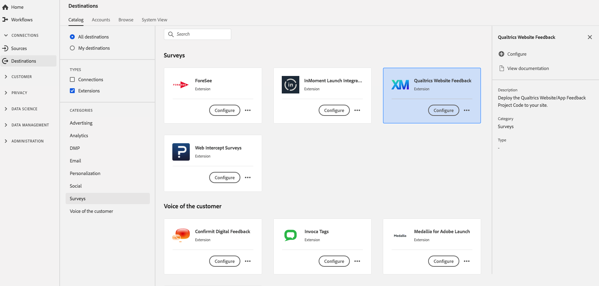

# [!DNL Qualtrics Website Feedback] extension {#qualtrics-extension}

## Översikt {#overview}

[!DNL Qualtrics Website Feedback] gör att ni kan engagera besökarna på webbplatsen med rätt budskap vid rätt tidpunkt. Oavsett om du vill förbättra besökarupplevelsen med webbplatsens feedbackenkäter eller öka konverteringsgraden är [!DNL Qualtrics Website Feedback] något som täcker in dig.

Skapa och distribuera välriktade, varumärkesanpassade webbmeddelanden på några minuter med ett intuitivt musstyrt gränssnitt. De data och insikter ni samlar in från er webbplats möts av kundfeedback i alla kanaler, vilket ger en fullständig bild av kundupplevelsen - allt på en och samma plattform.

[!DNL Qualtrics Website Feedback] är ett undersökningstillägg i Adobe Experience Platform. Mer information om tilläggsfunktioner finns på tilläggssidan på [Adobe Exchange](https://exchange.adobe.com/experiencecloud.details.101569.qualtrics-website-feedback.html).

Det här målet är ett Adobe Experience Platform Launch-tillägg. Mer information om hur tillägg till Platforma launcher fungerar i Platform finns i [Översikt över tillägg till Adobe Experience Platform Launch](../launch-extensions/overview.md).

## Förutsättningar {#prerequisites}

Det här tillägget är tillgängligt i [!DNL Destinations]-katalogen för alla kunder som har köpt Platform.

Om du vill använda det här tillägget måste du ha tillgång till Adobe Experience Platform Launch. platform launch erbjuds Adobe Experience Cloud-kunder som en inkluderad funktion som ger mervärde. Kontakta din organisations administratör för att få åtkomst till Platform launch och be dem att ge dig behörigheten **[!UICONTROL manage_properties]** så att du kan installera tillägg.

## Installera tillägg {#install-extension}

Så här installerar du tillägget [!DNL Qualtrics Website Feedback]:

Gå till **[!UICONTROL Destinations]** > **[!UICONTROL Catalog]** i [plattformsgränssnittet](http://platform.adobe.com/).

Välj tillägget i katalogen eller använd sökfältet.

Klicka på målet för att markera det och välj sedan **[!UICONTROL Configure]** i den högra listen. Om kontrollen **[!UICONTROL Configure]** är nedtonad saknar du behörigheten **[!UICONTROL manage_properties]**. Se [Förutsättningar](#prerequisites).

I fönstret **[!UICONTROL Select available Platform Launch property]** väljer du den Platform launch i vilken du vill installera tillägget. Du kan också skapa en ny egenskap i Platforma launchen. En egenskap är en samling regler, dataelement, konfigurerade tillägg, miljöer och bibliotek. Lär dig mer om egenskaper i avsnittet [Egenskaper](../../../tags/ui/administration/companies-and-properties.md#properties-page) i dokumentationen för Platforma launchen.

Arbetsflödet tar dig till Platforma launchen för att slutföra installationen.

Information om alternativ för tilläggskonfiguration och installationsstöd finns på [Qualtrics-webbplatsens feedbacksida på Adobe Exchange](https://exchange.adobe.com/experiencecloud.details.101569.qualtrics-website-feedback.html).

Du kan också installera tillägget direkt i [Adobe Experience Platform Launch-gränssnittet](https://launch.adobe.com/). Se [Lägg till ett nytt tillägg](../../../tags/ui/managing-resources/extensions/overview.md#add-a-new-extension) i dokumentationen för Platforma launchen.

## Så här använder du tillägget {#how-to-use}

När du har installerat tillägget kan du börja konfigurera regler för det direkt i Platforma launchen.

I Platform launch kan du konfigurera regler för de installerade tilläggen så att händelsedata skickas till tilläggsmålet endast i vissa situationer. Mer information om hur du konfigurerar regler för tillägg finns i [Regeldokumentation](../../../tags/ui/managing-resources/rules.md).

## Konfigurera, uppgradera och ta bort tillägg {#configure-upgrade-delete}

Du kan konfigurera, uppgradera och ta bort tillägg i Platforma launchens gränssnitt.

>[!TIP]
>
>Om tillägget redan är installerat på en av dina egenskaper visas fortfarande **[!UICONTROL Install]** som plattformsgränssnitt för tillägget. Starta installationsarbetsflödet enligt beskrivningen i [Installera tillägget](#install-extension) för att komma till Platforma launchen och konfigurera eller ta bort tillägget.

Mer information om hur du uppgraderar tillägget finns i [Tilläggsuppgradering](../../../tags/ui/managing-resources/extensions/extension-upgrade.md) i Platforma launchens dokumentation.
