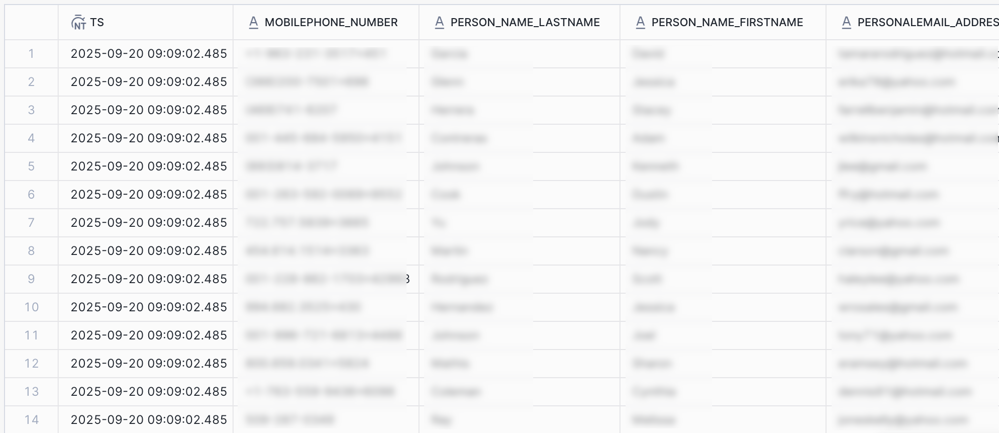

# Snowflake Batch-anslutning {#snowflake-destination}

## Översikt {#overview}

Använd det här målet för att skicka målgruppsdata till dynamiska tabeller i ditt Snowflake-konto. Dynamiska tabeller ger åtkomst till dina data utan att det krävs fysiska datakopior.

I följande avsnitt beskrivs hur Snowflake mål fungerar och hur data överförs mellan Adobe och Snowflake.

### Hur Snowflake datautbyte fungerar {#data-sharing}

Det här målet använder en [!DNL Snowflake]-dataresurs, vilket innebär att inga data exporteras fysiskt eller överförs till din egen Snowflake-instans. I stället ger Adobe skrivskyddad åtkomst till en livetabell som finns i Adobe Snowflake-miljö. Du kan fråga den här delade tabellen direkt från ditt Snowflake-konto, men du äger inte tabellen och kan inte ändra eller behålla den efter den angivna kvarhållningsperioden. Adobe hanterar den delade tabellens livscykel och struktur.

Första gången du har konfigurerat ett dataflöde från Adobe till ditt Snowflake-konto uppmanas du att godkänna den privata listan från Adobe.

### Datalagring och TTL (Time-to-Live) {#ttl}

Alla data som delas genom den här integreringen har en fast TTL-värde på sju dagar. Sju dagar efter den senaste exporten förfaller den dynamiska tabellen automatiskt och blir oåtkomlig, oavsett om dataflödet fortfarande är aktivt eller inte. Om du vill behålla data längre än sju dagar måste du kopiera innehållet till en tabell som du äger i din egen Snowflake-instans innan TTL-värdet går ut.

>[!IMPORTANT]
>
>Om du tar bort ett dataflöde i Experience Platform försvinner den dynamiska tabellen från ditt Snowflake-konto.

### Funktion för målgruppsuppdatering {#audience-update-behavior}

Om målgruppen utvärderas i [gruppläge](../../../segmentation/methods/batch-segmentation.md) uppdateras data i den delade tabellen var 24:e timme. Detta innebär att det kan bli en fördröjning på upp till 24 timmar mellan ändringar i målgruppsmedlemskap och när dessa ändringar återspeglas i den delade tabellen.

### Logik för batchdatadelning {#batch-data-sharing}

När ett dataflöde körs för en målgrupp för första gången utförs en bakåtfyllnad och alla aktuella kvalificerade profiler delas. Efter den här initiala bakåtfyllnaden tillhandahåller målet periodiska ögonblicksbilder av hela målgruppsmedlemskapet. Varje ögonblicksbild ersätter tidigare data i den delade tabellen, så att du alltid ser den senaste fullständiga bilden av målgruppen utan historiska data.

## Direktuppspelning jämfört med batchdelning av data {#batch-vs-streaming}

Experience Platform tillhandahåller två typer av Snowflake-mål: [Snowflake Streaming](snowflake.md) och [Snowflake Batch](snowflake-batch.md).

Även om båda destinationerna ger dig tillgång till dina data i Snowflake utan att fysiskt kopiera dem till ditt konto, finns det några rekommenderade metoder för användning för varje anslutning.

Tabellen nedan hjälper dig att avgöra vilken koppling som ska användas genom att beskriva de scenarier där varje datautdelningsmetod är lämpligast.

|  | Välj [Snowflake Batch](snowflake-batch.md) när du behöver | Välj [Snowflake Streaming](snowflake.md) när du behöver |
|--------|-------------------|----------------------|
| **Uppdateringsfrekvens** | Periodiska ögonblicksbilder | Kontinuerliga uppdateringar i realtid |
| **Datapresentation** | Fullständig målgruppsbild som ersätter tidigare data | Inkrementella uppdateringar baserade på profiländringar |
| **Använd skiftlägeskänslighet** | Analytiska/ML-arbetsbelastningar där latens inte är avgörande | Omedelbara åtgärdsscenarier som kräver uppdateringar i realtid |
| **Datahantering** | Visa alltid den senaste fullständiga fixeringen | Inkrementella uppdateringar baserade på förändringar av målgruppsmedlemskap |
| **Exempelscenarier** | Affärsrapportering, dataanalys, ML-modellutbildning | Förhindra marknadsföringskampanjer, personalisering i realtid |

Mer information om datadelning vid direktuppspelning finns i dokumentationen för [Snowflake Streaming Connection](snowflake.md).

## Användningsfall {#use-cases}

Batchdatadelning är idealiskt för scenarier där du behöver en fullständig ögonblicksbild av din målgrupp och det inte krävs några realtidsuppdateringar, till exempel:

* **Analytiska arbetsbelastningar**: Vid dataanalys, rapportering eller affärsintelligensaktiviteter som kräver en fullständig vy över målgruppsmedlemskapet
* **Maskinininlärningsarbetsflöden**: För utbildning av ML-modeller eller körning av prediktiv analys som drar nytta av fullständiga målgruppsbilder
* **Datalagerhantering**: När du behöver underhålla en aktuell kopia av målgruppsdata i din egen Snowflake-instans
* **Periodisk rapportering**: För regelbunden affärsrapportering där du behöver det senaste målgruppsläget utan historik för ändringsspårning
* **ETL-processer**: När du behöver omvandla eller bearbeta målgruppsdata i grupper

Batchdatadelning förenklar datahanteringen genom att tillhandahålla fullständiga ögonblicksbilder, vilket eliminerar behovet av att hantera inkrementella uppdateringar eller manuellt sammanfoga ändringar.

## Förhandskrav {#prerequisites}

Innan du konfigurerar din Snowflake-anslutning måste du kontrollera att följande krav uppfylls:

* Du har åtkomst till ett [!DNL Snowflake]-konto.
* Ditt Snowflake-konto prenumererar på privata listor. Du eller någon på ditt företag som har kontoadministratörsbehörighet för Snowflake kan konfigurera detta.
* Du kan Snowflake-kontots molnleverantör och region. Du måste ange båda när du ansluter till målet.

Läs [[!DNL Snowflake] dokumentationen](https://docs.snowflake.com/en/collaboration/consumer-listings-access#access-a-private-listing) om du vill ha mer information om de behörigheter som krävs.

>[!IMPORTANT]
>
>Den här destinationen stöder inte Snowflake-konton som finns bakom en brandvägg eller som använder [[!DNL Azure Private Link]](https://docs.snowflake.com/en/user-guide/privatelink-azure).

## Målgrupper {#supported-audiences}

I det här avsnittet beskrivs vilka typer av målgrupper du kan exportera till det här målet. De två tabellerna nedan visar vilka målgrupper som den här kopplingen stöder, per _målgruppsursprung_ och _profiltyper som ingår i målgruppen_:

| Målgruppsursprung | Stöds | Beskrivning |
|---------|----------|----------|
| [!DNL Segmentation Service] | ✓ | Publiker som genererats via Experience Platform [segmenteringstjänst](../../../segmentation/home.md). |
| Alla andra målgrupper kommer | ✓ | Den här kategorin omfattar alla målgrupper som kommer utanför målgrupper som genereras via [!DNL Segmentation Service]. Läs om de [olika målgruppernas ursprung](/help/segmentation/ui/audience-portal.md#customize). Några exempel är: <ul><li> anpassade uppladdningsgrupper [importerade](../../../segmentation/ui/audience-portal.md#import-audience) till Experience Platform från CSV-filer,</li><li> lookalike-målgrupper, </li><li> federerade målgrupper, </li><li> målgrupper som genererats i andra Experience Platform-appar som Adobe Journey Optimizer, </li><li> med mera. </li></ul> |

{style="table-layout:auto"}

Målgrupper som stöds av olika typer av målgruppsdata:

| Typ av målgruppsdata | Stöds | Beskrivning | Användningsfall |
|--------------------|-----------|-------------|-----------|
| [Målgrupper](/help/segmentation/types/people-audiences.md) | ✓ | Baserat på kundprofiler kan ni inrikta er på specifika grupper av människor för marknadsföringskampanjer. | Ofta köpare, övergivna varukorgar |
| [Kontomålgrupper](/help/segmentation/types/account-audiences.md) | Nej | Rikta er till individer inom specifika organisationer för kontobaserade marknadsföringsstrategier. | B2B-marknadsföring |
| [Prospektera målgrupper](/help/segmentation/types/prospect-audiences.md) | Nej | Rikta er till individer som ännu inte är kunder men som delar egenskaper med er målgrupp. | Prospektera med data från tredje part |
| [Datauppsättningsexport](/help/catalog/datasets/overview.md) | Nej | Samlingar med strukturerade data som lagras i Adobe Experience Platform Data Lake. | Arbetsflöden för rapportering, datavetenskap |

{style="table-layout:auto"}

## Exportera typ och frekvens {#export-type-frequency}

Se tabellen nedan för information om exporttyp och frekvens för destinationen.

| Objekt | Typ | Anteckningar |
|---------|----------|---------|
| Exporttyp | **[!UICONTROL Audience export]** | Du exporterar alla medlemmar i en målgrupp med identifierarna (namn, telefonnummer eller andra) som används i målet [!DNL Snowflake]. |
| Exportfrekvens | **[!UICONTROL Batch]** | Det här målet ger periodiska ögonblicksbilder av ett fullständigt målgruppsmedlemskap genom Snowflake datautbyte. Varje ögonblicksbild ersätter tidigare data och ser till att du alltid har den senaste fullständiga bilden av din publik. |

{style="table-layout:auto"}

## Anslut till målet {#connect}

>[!IMPORTANT]
> 
>Om du vill ansluta till målet behöver du behörigheterna **[!UICONTROL View Destinations]** och **[!UICONTROL Manage Destinations]** [åtkomstkontroll](/help/access-control/home.md#permissions). Läs [åtkomstkontrollsöversikten](/help/access-control/ui/overview.md) eller kontakta produktadministratören för att få den behörighet som krävs.

Om du vill ansluta till det här målet följer du stegen som beskrivs i självstudiekursen [för destinationskonfiguration](../../ui/connect-destination.md). I arbetsflödet för att konfigurera mål fyller du i fälten som listas i de två avsnitten nedan.

### Autentisera till mål {#authenticate}

Om du vill autentisera till målet väljer du **[!UICONTROL Connect to destination]** och anger ett kontonamn och, eventuellt, en kontobeskrivning.

### Fyll i målinformation {#destination-details}

>[!CONTEXTUALHELP]
>id="platform_destinations_snowflake_batch_accountid"
>title="Ange din Snowflake-kontoidentifierare för datadelning"
>abstract="Om ditt konto är länkat till en organisation använder du det här formatet: `OrganizationName.AccountName`   Om ditt konto inte är länkat till en organisation använder du det här formatet:`AccountName`"

Om du vill konfigurera information för målet fyller du i de obligatoriska och valfria fälten nedan. En asterisk bredvid ett fält i användargränssnittet anger att fältet är obligatoriskt.

* **[!UICONTROL Name]**: Ett namn som du känner igen det här målet med i framtiden.
* **[!UICONTROL Description]**: En beskrivning som hjälper dig att identifiera det här målet i framtiden.
* **[!UICONTROL Snowflake Account ID]**: Din [Snowflake-kontoidentifierare för datadelning](https://docs.snowflake.com/en/user-guide/admin-account-identifier#label-account-name-data-sharing). Använd följande format beroende på om ditt konto är länkat till en organisation:
   * Om ditt konto är länkat till en organisation: ange organisationens namn och kontonamn avgränsade med en **punkt** (`.`). Om ditt organisationsnamn till exempel är ACME och ditt kontonamn är AsienRegion anger du `ACME.AsiaRegion`.
   * Om ditt konto inte är länkat till en organisation: `AccountName`.
* **[!UICONTROL Snowflake Region]**: Välj den region där din Snowflake-instans har etablerats. Mer information om vilka molnregioner som stöds finns i Snowflake [dokumentation](https://docs.snowflake.com/en/user-guide/intro-regions).
* **[!UICONTROL Account acknowledgment]**: När du har angett **[!UICONTROL Snowflake Account ID]** väljer du **[!UICONTROL Yes]** i den här listrutan för att bekräfta att **[!UICONTROL Snowflake Account ID]** är korrekt och tillhör dig.

>[!IMPORTANT]
>
> Specialtecken som används i målnamnet och Experience Platform-sandlådans namn konverteras automatiskt till understreck (`_`) i Snowflake. Undvik förvirring genom att inte använda några specialtecken i mål- och sandlådans namn.

### Aktivera aviseringar {#enable-alerts}

Du kan aktivera varningar för att få meddelanden om dataflödets status till ditt mål. Välj en avisering i listan om du vill prenumerera och få meddelanden om statusen för ditt dataflöde. Mer information om varningar finns i guiden [prenumerera på destinationsvarningar med användargränssnittet](../../ui/alerts.md).

Välj **[!UICONTROL Next]** när du är klar med att ange information för målanslutningen.

## Aktivera målgrupper till det här målet {#activate}

>[!IMPORTANT]
> 
>* För att aktivera data behöver du behörigheterna **[!UICONTROL View Destinations]**, **[!UICONTROL Activate Destinations]**, **[!UICONTROL View Profiles]** och **[!UICONTROL View Segments]** [åtkomstkontroll](/help/access-control/home.md#permissions). Läs [åtkomstkontrollsöversikten](/help/access-control/ui/overview.md) eller kontakta produktadministratören för att få den behörighet som krävs.
>* Om du vill exportera *identiteter* måste du ha **[!UICONTROL View Identity Graph]** [åtkomstkontrollbehörighet](/help/access-control/home.md#permissions).   {width="100" zoomable="yes"}

Läs [Aktivera målgruppsdata för att batchprofilera exportmål](/help/destinations/ui/activate-batch-profile-destinations.md) om du vill ha instruktioner om hur du aktiverar målgrupper till det här målet.

### Mappningsattribut {#map}

Du kan exportera identiteter och profilattribut till det här målet.

Du kan använda kontrollen [&#x200B; för &#x200B;](../../ui/data-transformations-calculated-fields.md)beräknade fält för att exportera och utföra åtgärder på arrayer.

Målattributen skapas automatiskt i Snowflake med det attributnamn som du anger i fältet **[!UICONTROL Attribute name]**.

## Exporterade data/Validera dataexport {#exported-data}

Data läggs in i ditt Snowflake-konto via en dynamisk tabell. Kontrollera ditt Snowflake-konto för att bekräfta att data exporterades korrekt.

### Datastruktur {#data-structure}

Den dynamiska tabellen innehåller följande kolumner:

* **TS**: En tidsstämpelkolumn som anger när varje rad från den delade tabellen senast uppdaterades
* **Kopplingsprincip-ID**: ID:t för [sammanfogningsprincipen](../../../profile/merge-policies/overview.md) som målgruppen som aktiveras tillhör
* **Mappningsattribut**: Alla mappningsattribut som du väljer under aktiveringsarbetsflödet representeras som en kolumnrubrik i Snowflake
* **Målgruppsmedlemskap**: Medlemskap för alla målgrupper som är mappade till dataflödet anges via en `active` -post i motsvarande cell

 {align="center" zoomable="yes"}

## Dataanvändning och styrning {#data-usage-governance}

Alla [!DNL Adobe Experience Platform]-mål är kompatibla med dataanvändningsprinciper när data hanteras. Mer information om hur [!DNL Adobe Experience Platform] använder datastyrning finns i [Översikt över datastyrning](/help/data-governance/home.md).
