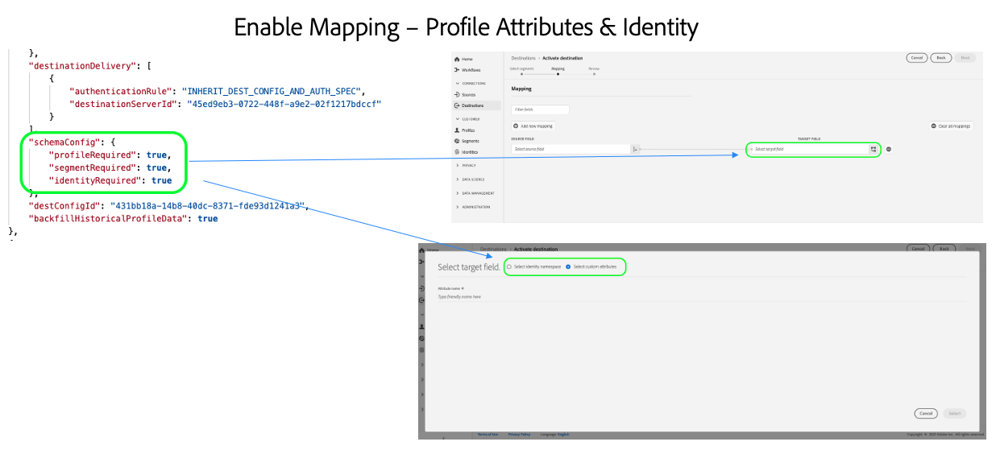
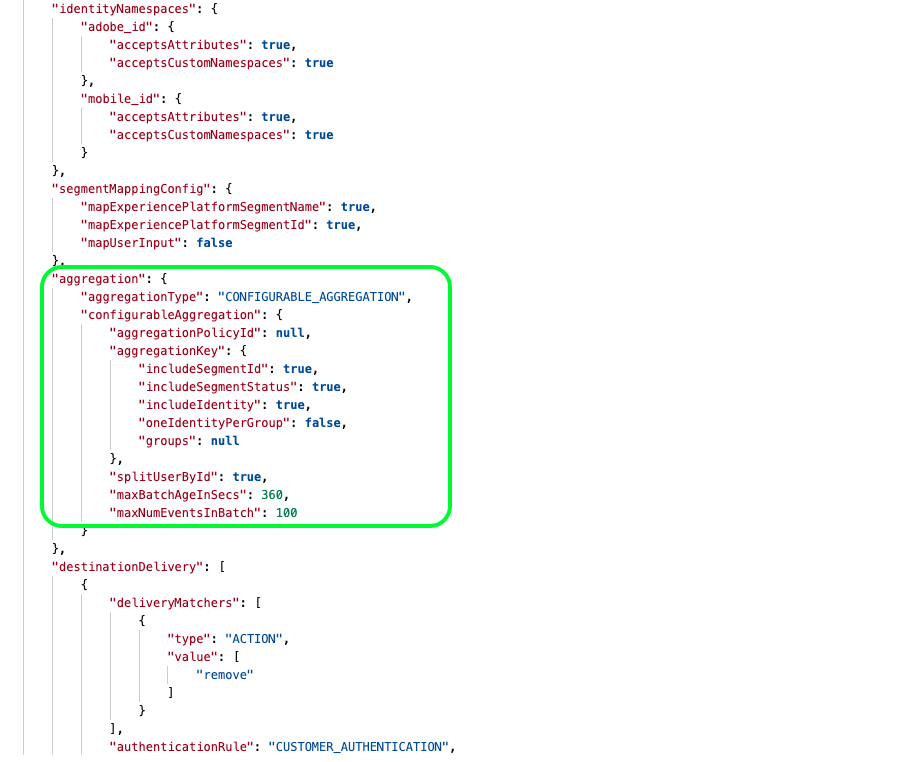

# Konfiguration för direktuppspelningsmål {#destination-configuration}

## Översikt {#overview}

Med den här konfigurationen kan du ange viktig information för ditt mål för direktuppspelning, som målnamn, kategori, beskrivning med mera. Inställningarna i den här konfigurationen avgör också hur Experience Platform-användare autentiserar till ditt mål, hur det visas i användargränssnittet i Experience Platform och vilka identiteter som kan exporteras till ditt mål.

Den här konfigurationen kopplar även de andra konfigurationer som krävs för att målet ska fungera - målserver och målgruppsmetadata - till den här konfigurationen. Läs om hur du kan referera till de två konfigurationerna i en [avsnitt längre nedan](./destination-configuration.md#connecting-all-configurations).

Du kan konfigurera funktionerna som beskrivs i det här dokumentet med hjälp av `/authoring/destinations` API-slutpunkt. Läs [Slutpunktsåtgärder för mål-API](./destination-configuration-api.md) för en fullständig lista över åtgärder som du kan utföra på slutpunkten.

## Exempel på direktuppspelningskonfiguration {#example-configuration}

Detta är ett exempel på konfiguration av ett fiktivt mål för direktuppspelning, Moviestar, som har slutpunkter på fyra platser i världen. Målet tillhör kategorin för mobila destinationer.

```json
{
   "name":"Moviestar",
   "description":"Moviestar is a fictional destination, used for this example.",
   "status":"TEST",
   "customerAuthenticationConfigurations":[
      {
         "authType":"BEARER"
      }
   ],
   "customerDataFields":[
      {
         "name":"endpointRegion",
         "type":"string",
         "title":"Select Endpoint",
         "description":"Moviestar manages several instances across the globe for REST endpoints that our customers are provisioned for. Select your endpoint in the dropdown list.",
         "isRequired":true,
         "enum":[
            "US",
            "EU",
            "APAC",
            "NZ"
         ]
      },
      {
         "name":"customerID",
         "type":"string",
         "title":"Moviestar Customer ID",
         "description":"Your customer ID in the Moviestar destination (e.g. abcdef).",
         "isRequired":true,
         "pattern":"^[A-Za-z]+$"
      }
   ],
   "uiAttributes":{
      "documentationLink":"http://www.adobe.com/go/destinations-moviestar-en",
      "category":"mobile",
      "connectionType":"Server-to-server",
      "frequency":"Streaming"
   },
   "identityNamespaces":{
      "external_id":{
         "acceptsAttributes":true,
         "acceptsCustomNamespaces":true,
         "acceptedGlobalNamespaces":{
            "Email":{
               
            }
         }
      },
      "another_id":{
         "acceptsAttributes":true,
         "acceptsCustomNamespaces":true
      }
   },
   "schemaConfig":{
      "profileRequired":false,
      "segmentRequired":true,
      "identityRequired":true
   },
   "destinationDelivery":[
      {
         "authenticationRule":"CUSTOMER_AUTHENTICATION",
         "destinationServerId":"9c77000a-4559-40ae-9119-a04324a3ecd4"
      }
   ],
   "segmentMappingConfig":{
      "mapExperiencePlatformSegmentName":false,
      "mapExperiencePlatformSegmentId":false,
      "mapUserInput":false,
      "audienceTemplateId":"cbf90a70-96b4-437b-86be-522fbdaabe9c"
   },
   "aggregation":{
      "aggregationType":"CONFIGURABLE_AGGREGATION",
      "configurableAggregation":{
         "splitUserById":true,
         "maxBatchAgeInSecs":2400,
         "maxNumEventsInBatch":5000,
         "aggregationKey":{
            "includeSegmentId":true,
            "includeSegmentStatus":true,
            "includeIdentity":true,
            "oneIdentityPerGroup":false,
            "groups":[
               {
                  "namespaces":[
                     "IDFA",
                     "GAID"
                  ]
               },
               {
                  "namespaces":[
                     "EMAIL"
                  ]
               }
            ]
         }
      }
   },
   "backfillHistoricalProfileData":true
}
```

| Parameter | Typ | Beskrivning |
|---------|----------|------|
| `name` | Sträng | Anger målets namn i Experience Platform-katalogen. |
| `description` | Sträng | Ange en beskrivning för destinationskortet i Experience Platform-katalogen. Rikta dig för högst 4-5 meningar. |
| `status` | Sträng | Anger målkortets livscykelstatus. Godkända värden är `TEST`, `PUBLISHED`och `DELETED`. Använd `TEST` när du först konfigurerar målet. |

{style=&quot;table-layout:auto&quot;}

## Konfigurationer för kundautentisering {#customer-authentication-configurations}

Det här avsnittet i destinationskonfigurationen genererar [Konfigurera nytt mål](/help/destinations/ui/connect-destination.md) i användargränssnittet i Experience Platform, där användare ansluter Experience Platform till konton som de har med ditt mål. Beroende på vilket autentiseringsalternativ du anger i dialogrutan `authType` -fältet, genereras Experience Platform-sidan för användarna enligt följande:

### Bärarautentisering

När du konfigurerar typen för innehavarautentisering måste användarna ange den innehavartoken som de får från ditt mål.


### OAuth 2-autentisering

Användarna väljer **[!UICONTROL Connect to destination]** för att utlösa OAuth 2-autentiseringsflödet till ditt mål, vilket visas i exemplet nedan för Twitter Custom Audiences-målet. Mer information om hur du konfigurerar OAuth 2-autentisering till målslutpunkten finns i den dedikerade [Destination SDK OAuth 2-autentiseringssida](./oauth2-authentication.md).


| Parameter | Typ | Beskrivning |
|---------|----------|------|
| `customerAuthenticationConfigurations` | Sträng | Anger den konfiguration som används för att autentisera Experience Platform-kunder mot servern. Se `authType` nedan för godkända värden. |
| `authType` | Sträng | Följande värden accepteras för direktuppspelningsmål:<ul><li>`BEARER`. Om målet har stöd för innehavarautentisering anger du `"authType":"Bearer"` och  `"authenticationRule":"CUSTOMER_AUTHENTICATION"` i [målleveransavsnitt](./destination-configuration.md).</li><li>`OAUTH2`. Om målet har stöd för OAuth 2-autentisering anger du `"authType":"OAUTH2"` och lägg till de obligatoriska fälten för OAuth 2, som visas i [Destination SDK OAuth 2-autentiseringssida](./oauth2-authentication.md). Dessutom, ange `"authenticationRule":"CUSTOMER_AUTHENTICATION"` i [målleveransavsnitt](./destination-configuration.md).</li> |

{style=&quot;table-layout:auto&quot;}

## Kunddatafält {#customer-data-fields}

Använd det här avsnittet för att be användare fylla i anpassade fält, som är specifika för ditt mål, när de ansluter till målet i användargränssnittet i Experience Platform. Konfigurationen återspeglas i autentiseringsflödet enligt nedan.


>[!TIP]
>
>Du kan komma åt och använda kundindata från kunddatafält i mallar. Använd makrot `{{customerData.name}}`. Om du till exempel ber användare att ange ett Kund-ID-fält, med namnet `userId`kan du använda makrot till att få åtkomst till den i mallar `{{customerData.userId}}`. Visa ett exempel på hur ett kunddatafält används i URL:en för API-slutpunkten i [målserverkonfiguration](/help/destinations/destination-sdk/server-and-template-configuration.md#server-specs).

| Parameter | Typ | Beskrivning |
|---------|----------|------|
| `name` | Sträng | Ange ett namn för det anpassade fält som du introducerar. |
| `type` | Sträng | Anger vilken typ av anpassat fält du introducerar. Godkända värden är `string`, `object`, `integer`. |
| `title` | Sträng | Anger fältets namn, så som det visas för kunder i användargränssnittet i Experience Platform. |
| `description` | Sträng | Ange en beskrivning för det anpassade fältet. |
| `isRequired` | Boolean | Anger om det här fältet är obligatoriskt i arbetsflödet för målkonfiguration. |
| `enum` | Sträng | Återger det anpassade fältet som en listruta och visar de alternativ som är tillgängliga för användaren. |
| `pattern` | Sträng | Tvingar fram ett mönster för det anpassade fältet, om det behövs. Använd reguljära uttryck för att framtvinga ett mönster. Om dina kund-ID:n inte innehåller siffror eller understreck anger du `^[A-Za-z]+$` i detta fält. |

{style=&quot;table-layout:auto&quot;}

## Gränssnittsattribut {#ui-attributes}

Det här avsnittet hänvisar till de gränssnittselement i konfigurationen ovan som Adobe ska använda för ditt mål i Adobe Experience Platform användargränssnitt. Se nedan:


| Parameter | Typ | Beskrivning |
|---------|----------|------|
| `documentationLink` | Sträng | Refererar till dokumentationssidan i [Målkatalog](https://experienceleague.adobe.com/docs/experience-platform/destinations/catalog/overview.html?lang=en#catalog) till destinationen. Använd `http://www.adobe.com/go/destinations-YOURDESTINATION-en`, där `YOURDESTINATION` är namnet på destinationen. För ett mål som heter Moviestar använder du `http://www.adobe.com/go/destinations-moviestar-en`. Observera att den här länken bara fungerar när Adobe har aktiverat målet och dokumentationen har publicerats. |
| `category` | Sträng | Hänvisar till den kategori som tilldelats ditt mål i Adobe Experience Platform. Mer information finns i [Målkategorier](https://experienceleague.adobe.com/docs/experience-platform/destinations/destination-types.html). Använd något av följande värden: `adobeSolutions, advertising, analytics, cdp, cloudStorage, crm, customerSuccess, database, dmp, ecommerce, email, emailMarketing, enrichment, livechat, marketingAutomation, mobile, personalization, protocols, social, streaming, subscriptions, surveys, tagManagers, voc, warehouses, payments`. <br> Observera att du för närvarande bara kan välja en kategori per mål. |
| `connectionType` | Sträng | `Server-to-server` är för närvarande det enda tillgängliga alternativet. |
| `frequency` | Sträng | Hänvisar till den typ av dataexport som stöds av målet. Värden som stöds: <ul><li>`Streaming`</li><li>`Batch`</li></ul> |

{style=&quot;table-layout:auto&quot;}

## Schemakonfiguration i mappningssteget {#schema-configuration}



Använd parametrarna i `schemaConfig` för att aktivera mappningssteget i arbetsflödet för målaktivering. Genom att använda de parametrar som beskrivs nedan kan du bestämma om användare av Experience Platform kan mappa profilattribut och/eller identiteter till det önskade schemat på målsidan.

| Parameter | Typ | Beskrivning |
|---------|----------|------|
| `profileFields` | Array | *Visas inte i exempelkonfigurationen ovan.* När du lägger till fördefinierade `profileFields`kan Experience Platform-användare mappa plattformsattribut till de fördefinierade attributen på målsidan. |
| `profileRequired` | Boolean | Använd `true` om användare ska kunna mappa profilattribut från Experience Platform till anpassade attribut på målsidan, vilket visas i exempelkonfigurationen ovan. |
| `segmentRequired` | Boolean | Använd alltid `segmentRequired:true`. |
| `identityRequired` | Boolean | Använd `true` om användare ska kunna mappa identitetsnamnutrymmen från Experience Platform till det önskade schemat. |

{style=&quot;table-layout:auto&quot;}

## Identiteter och attribut {#identities-and-attributes}

Parametrarna i det här avsnittet avgör vilka identiteter som ditt mål accepterar. Den här konfigurationen fyller även i målidentiteterna och -attributen i [mappningssteg](/help/destinations/ui/activate-segment-streaming-destinations.md#mapping) i användargränssnittet i Experience Platform, där användare mappar identiteter och attribut från sina XDM-scheman till schemat i målet.

Du måste ange vilken [!DNL Platform] identiteter som kunder kan exportera till ditt mål. Några exempel är [!DNL Experience Cloud ID], hashad e-post, enhets-ID ([!DNL IDFA], [!DNL GAID]). Dessa värden är [!DNL Platform] ID-namnutrymmen som kunder kan mappa till identitetsnamnutrymmen från destinationen. Du kan även ange om kunderna kan mappa anpassade namnutrymmen till identiteter som stöds av ditt mål (`acceptsCustomNamespaces: true`) och om kunderna kan mappa XDM-standardattribut till identiteter som stöds av ditt mål (`acceptsAttributes: true`).

Identitetsnamnutrymmen kräver ingen 1-till-1-korrespondens mellan [!DNL Platform] och destinationen.
Kunder kan till exempel mappa en [!DNL Platform] [!DNL IDFA] namnutrymme till ett [!DNL IDFA] namnutrymme från målet eller så kan de mappa samma [!DNL Platform] [!DNL IDFA] namnutrymme till en [!DNL Customer ID] namnutrymme i målet.

Läs mer om identiteter i [Översikt över namnområde för identitet](/help/identity-service/namespaces.md).


| Parameter | Typ | Beskrivning |
|---------|----------|------|
| `acceptsAttributes` | Boolean | Anger om kunder kan mappa standardprofilattribut till identiteten som du konfigurerar. |
| `acceptsCustomNamespaces` | Boolean | Anger om kunderna kan ställa in anpassade namnutrymmen i målet. |
| `transformation` | Sträng | *Visas inte i exempelkonfigurationen*. Används till exempel när [!DNL Platform] kunden har oformaterade e-postadresser som attribut och din plattform accepterar bara hashkodade e-postmeddelanden. I det här objektet kan du använda den omformning som ska användas (till exempel omvandla e-postmeddelandet till gemener och sedan hash). Ett exempel finns i `requiredTransformation` i [API-referens för destinationskonfiguration](./destination-configuration-api.md#update). |
| `acceptedGlobalNamespaces` | – | Anger vilken [standardidentitetsnamnutrymmen](/help/identity-service/namespaces.md#standard) (till exempel IDFA)-kunder kan mappa till identiteten som du konfigurerar. <br> När du använder `acceptedGlobalNamespaces`kan du använda `"requiredTransformation":"sha256(lower($))"` till gemener och hash-adresser eller telefonnummer. |

{style=&quot;table-layout:auto&quot;}

## Destinationsleverans {#destination-delivery}

| Parameter | Typ | Beskrivning |
|---------|----------|------|
| `authenticationRule` | Sträng | Anger hur [!DNL Platform] kunderna ansluter till er destination. Godkända värden är `CUSTOMER_AUTHENTICATION`, `PLATFORM_AUTHENTICATION`, `NONE`. <br> <ul><li>Använd `CUSTOMER_AUTHENTICATION` om plattformskunder loggar in på ditt system via ett användarnamn och lösenord, en innehavartoken eller någon annan autentiseringsmetod. Du kan t.ex. markera det här alternativet om du också har markerat `authType: OAUTH2` eller `authType:BEARER` in `customerAuthenticationConfigurations`. </li><li> Använd `PLATFORM_AUTHENTICATION` om det finns ett globalt autentiseringssystem mellan Adobe och destinationen och [!DNL Platform] Kunden behöver inte ange några autentiseringsuppgifter för att ansluta till ditt mål. I det här fallet måste du skapa ett autentiseringsobjekt med [Autentiseringsuppgifter](./credentials-configuration-api.md) konfiguration. </li><li>Använd `NONE` om ingen autentisering krävs för att skicka data till målplattformen. </li></ul> |
| `destinationServerId` | Sträng | The `instanceId` i [målserverkonfiguration](./destination-server-api.md) används för detta mål. |

{style=&quot;table-layout:auto&quot;}

## Konfiguration av segmentmappning {#segment-mapping}


Det här avsnittet av målkonfigurationen gäller hur segmentmetadata, som segmentnamn eller ID:n, ska delas mellan Experience Platform och målet.

Via `audienceTemplateId`är det här avsnittet också kopplat den här konfigurationen till [konfiguration av målets metadata](./audience-metadata-management.md).

Parametrarna som visas i konfigurationen ovan beskrivs i [API-referens för destinationsslutpunkt](./destination-configuration-api.md).

## Samlingsprincip {#aggregation}



I det här avsnittet kan du ange de sammanställningsprofiler som Experience Platform ska använda när data exporteras till ditt mål.

En sammanställningsprofil avgör hur de exporterade profilerna kombineras i dataexporten. Tillgängliga alternativ är:
* Bästa ansträngningsaggregering
* Konfigurerbar aggregering (visas i konfigurationen ovan)

Läs avsnittet om [använda mall](./message-format.md#using-templating) och [exempel på aggregeringsnyckel](./message-format.md#template-aggregation-key) om du vill veta hur du inkluderar aggregeringsprincipen i din meddelandetransformeringsmall baserat på din valda aggregeringsprincip.

### Bästa ansträngningsaggregering {#best-effort-aggregation}

>[!TIP]
>
>Använd det här alternativet om API-slutpunkten accepterar färre än 100 profiler per API-anrop.

Det här alternativet fungerar bäst för mål som föredrar färre profiler per begäran och som hellre vill ta fler förfrågningar med färre data än färre förfrågningar med fler data.

Använd `maxUsersPerRequest` -parameter som anger det maximala antalet profiler som destinationen kan ta i en begäran.

### Konfigurerbar aggregering {#configurable-aggregation}

Det här alternativet fungerar bäst om du hellre vill ta stora grupper med tusentals profiler på samma samtal. Med det här alternativet kan du också sammanfoga de exporterade profilerna baserat på komplexa sammanställningsregler.

Med det här alternativet kan du:

* Ange maximal tid och maximalt antal profiler som ska samlas innan ett API-anrop görs till målet.
* Sammanställ de exporterade profilerna som är mappade till målet baserat på:
   * Segment-ID;
   * Segmentstatus;
   * Identitet eller grupper av identiteter.

>[!NOTE]
>
>När du använder det konfigurerbara aggregeringsalternativet för ditt mål ska du tänka på minimi- och maximivärdena som du kan använda för de två parametrarna `maxBatchAgeInSecs` (minst 1 800 och högst 3 600) och `maxNumEventsInBatch` (minst 1 000, högst 10 000).

Detaljerade förklaringar av aggregeringsparametrarna finns i [Slutpunktsåtgärder för mål-API](./destination-configuration-api.md) referenssida, där varje parameter beskrivs.

## Krav på historisk profil {#profile-backfill}

Du kan använda `backfillHistoricalProfileData` -parametern i destinationskonfigurationen för att avgöra om historiska profilkvalifikationer ska exporteras till destinationen.

| Parameter | Typ | Beskrivning |
|---------|----------|------|
| `backfillHistoricalProfileData` | Boolean | Anger om historiska profildata exporteras när segment aktiveras till målet. <br> <ul><li> `true`: [!DNL Platform] skickar de historiska användarprofiler som är kvalificerade för segmentet innan segmentet aktiveras. </li><li> `false`: [!DNL Platform] innehåller endast användarprofiler som är kvalificerade för segmentet efter att segmentet har aktiverats. </li></ul> |

{style=&quot;table-layout:auto&quot;}

## Så här ansluter den här konfigurationen all nödvändig information för ditt mål {#connecting-all-configurations}

Vissa av målinställningarna måste konfigureras via [målserver](./server-and-template-configuration.md) eller [konfiguration av målets metadata](./audience-metadata-management.md). Målkonfigurationen som beskrivs här kopplar samman alla dessa inställningar genom att referera till de två andra konfigurationerna enligt följande:

* Använd `destinationServerId` för att referera till målservern och mallkonfigurationen som har konfigurerats för ditt mål.
* Använd `audienceMetadataId` för att referera till målgruppens metadatakonfiguration.