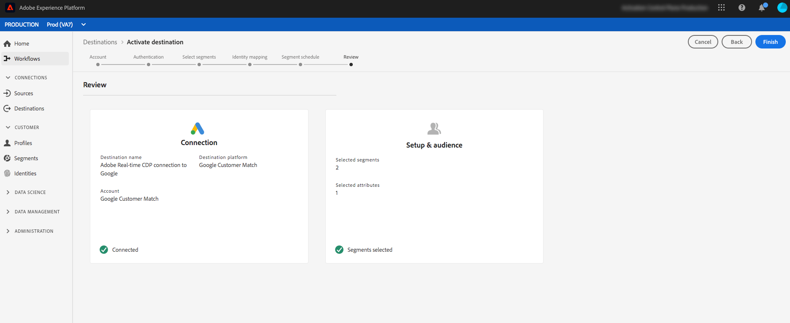

# YOURDESTINATION {#your-destination}

*När du går igenom den här mallen ersätter eller tar du bort alla stycken i kursiv stil (med början från det här).*

*Börja med att uppdatera metadata (rubrik och beskrivning) högst upp på sidan. Ignorera alla instanser av UICONTROL på den här sidan. Det här är en tagg som hjälper våra maskinöversättningsprocesser att översätta sidan korrekt till flera språk som stöds. Vi lägger till taggar i dokumentationen när du har skickat den.*

## Översikt {#overview}

*Ge en kort översikt för ditt företag, inklusive det värde det ger kunderna. Ta med en länk till din produktdokumentationswebbplats för ytterligare läsning.*

>[!IMPORTANT]
>
>Den här dokumentationssidan skapades av *YOURDESTINATION*-teamet. Om du har frågor eller uppdateringsfrågor kontaktar du dem direkt på *Infoga länk eller e-postadress där du kan komma åt uppdateringar*

## Förutsättningar {#prerequisites}

*Lägg till information i det här avsnittet om allt som kunderna behöver känna till innan de börjar konfigurera målet i Adobe Experience Platform användargränssnitt. Det här kan vara om:*

* *behöver läggas till tillåtelselista*
* *krav för e-posthashning*
* *kontoinformation på din sida*
* *hur du får en API-nyckel för att ansluta till din plattform*

*Du kan länka till relevant dokumentation om det skulle vara användbart för kunderna.*

## Identiteter som stöds {#supported-identities}

*Lägg till information i det här avsnittet om de identiteter som stöds av ditt mål. Vi har förfyllt tabellen med några standardvärden. Ta bort de värden som inte gäller för målet och de värden som inte är förifyllda.*

*YOURDESTINATION* stöder aktivering av identiteter som beskrivs i tabellen nedan. Läs mer om [identiteter](https://experienceleague.adobe.com/docs/experience-platform/identity/namespaces.html?lang=en#getting-started).

| Målidentitet | Beskrivning | Överväganden |
|---|---|---|
| GAID | Google Advertising ID | Välj målidentiteten för GAID när källidentiteten är ett GAID-namnområde. |
| IDFA | Apple ID för annonsörer | Välj IDFA-målidentitet när din källidentitet är ett IDFA-namnutrymme. |
| ECID | Experience Cloud ID | Ett namnutrymme som representerar ECID. Detta namnutrymme kan även refereras till av följande alias: &quot;Adobe Marketing Cloud ID&quot;, &quot;Adobe Experience Cloud ID&quot;, &quot;Adobe Experience Platform ID&quot;. Mer information finns i följande dokument på [ECID](https://experienceleague.adobe.com/docs/experience-platform/identity/ecid.html). |
| phone_sha256 | Telefonnummer hashas med SHA256-algoritmen | Både oformaterad text och SHA256-hashade telefonnummer stöds av Adobe Experience Platform. När källfältet innehåller ohashade attribut bör du markera alternativet **[!UICONTROL Apply transformation]** så att [!DNL Platform] automatiskt hash-kodar data vid aktiveringen. |
| email_lc_sha256 | E-postadresser som hash-kodats med SHA256-algoritmen | Både oformaterad text och SHA256-hashade e-postadresser stöds av Adobe Experience Platform. När källfältet innehåller ohashade attribut bör du markera alternativet **[!UICONTROL Apply transformation]** så att [!DNL Platform] automatiskt hash-kodar data vid aktiveringen. |
| extern_id | Anpassade användar-ID:n | Välj den här målidentiteten när källidentiteten är ett anpassat namnutrymme. |

{style=&quot;table-layout:auto&quot;}

## Exporttyp {#export-type}

**Segmentexport**  - du exporterar alla medlemmar i ett segment (publik) med de identifierare (namn, telefonnummer eller andra) som används i  ** YOURDESTINATIONdestination.

## Användningsfall

För att du bättre ska kunna förstå hur och när du ska använda målet *YOURDESTINATION* finns det några exempel på användningsområden som Adobe Experience Platform-kunder kan lösa genom att använda det här målet.

### Använd skiftläge 1

*För plattformar för mobilmeddelanden:*

*En hemuthyrnings- och försäljningsplattform vill skicka mobilmeddelanden till kundernas Android- och iOS-enheter för att meddela dem att det finns 100 uppdaterade listor i det område där de tidigare sökte efter en uthyrning.*

### Använd skiftläge 2

*För plattformar för sociala nätverk:*

*Ett sportklädmärke vill nå befintliga kunder via sina konton för sociala medier. Kläddervarumärket kan importera e-postadresser från sin egen CRM till Adobe Experience Platform, bygga segment utifrån sina egna offlinedata och skicka dessa segment till YOURDESTINATION för att visa annonser i sina kunders sociala medier.*

## Anslut till målet {#connect}

Om du vill ansluta till det här målet följer du stegen som beskrivs i självstudiekursen [för målkonfiguration](https://experienceleague.adobe.com/docs/experience-platform/destinations/ui/connect-destination.html).

### Anslutningsparametrar {#parameters}

När du [konfigurerar](https://experienceleague.adobe.com/docs/experience-platform/destinations/ui/connect-destination.html) det här målet måste du ange följande information:

*Lägg till de fält som kunderna måste fylla i när de konfigurerar ett nytt mål. Dessa fält är målspecifika och beroende på din konfiguration i mål-SDK. Målets fält kanske inte är samma som de som anges nedan.*

* **[!UICONTROL Name]**: Ett namn som du känner igen det här målet med i framtiden.
* **[!UICONTROL Description]**: En beskrivning som hjälper dig att identifiera det här målet i framtiden.
* **[!UICONTROL Account ID]**: Ditt  ** konto-ID.


<!--

*Replace YOURDESTINATION with your destination name and TOBEFILLEDIN with the category that your destination belongs to.*

1. In **[!UICONTROL Destinations]** > **[!UICONTROL Catalog]**, scroll to the ***TOBEFILLEDIN*** category. Select ***YOURDESTINATION***, then select **[!UICONTROL Configure]**.


    >[!NOTE]
    >
    >If a connection with this destination already exists, you can see an **[!UICONTROL Activate]** button on the destination card. For more information about the difference between **[!UICONTROL Activate]** and **[!UICONTROL Configure]**, refer to the [Catalog](https://experienceleague.adobe.com/docs/experience-platform/destinations/ui/destinations-workspace.html#catalog) section of the destination workspace documentation.  

    

2. In the **Account** step, if you had previously set up a connection to your *YOURDESTINATION* destination, select **[!UICONTROL Existing Account]** and select your existing connection. Or, you can select **[!UICONTROL New Account]** to set up a new connection to *YOURDESTINATION*. Select **[!UICONTROL Connect to destination]** to log in and connect Adobe Experience Cloud to your *YOURDESTINATION* account.

    >[!NOTE]
    >
    >Adobe Experience Platform supports credentials validation in the authentication process and displays an error message if you input incorrect credentials to your ***YOURDESTINATION*** account. This ensures that you don't complete the workflow with incorrect credentials.

3. Once your credentials are confirmed and Adobe Experience Cloud is connected to your ***YOURDESTINATION*** account, you can select **[!UICONTROL Next]** to proceed to the **[!UICONTROL Setup]** step.

4. In the **[!UICONTROL Authentication]** step, enter a **[!UICONTROL Name]** and a **[!UICONTROL Description]** for your activation flow and fill your account ID. <br> Also in this step, you can select any marketing action that should apply to this destination. Marketing actions indicate the intent for which data will be exported to the destination. You can select from Adobe-defined marketing actions or you can create your own marketing action. For more information about marketing actions, see the [Data usage policies overview](https://experienceleague.adobe.com/docs/experience-platform/data-governance/policies/overview.html).

    

5. Your destination is now created. You can select **[!UICONTROL Save & Exit]** if you want to activate segments later on or you can select **[!UICONTROL Next]** to continue the workflow and select segments to activate. In either case, see the next section, [Activate segments](#activate-segments), for the rest of the workflow.

-->

## Aktivera segment till den här destinationen {#activate}

Läs [Aktivera profiler och segment för att direktuppspela segmentets exportmål](https://experienceleague.adobe.com/docs/experience-platform/destinations/ui/activate/activate-segment-streaming-destinations.html?lang=en) om du vill ha instruktioner om hur du aktiverar målgruppssegment till det här målet.

<!--

To activate segments to *YOURDESTINATION*, follow the steps below: 

1. In **[!UICONTROL Destinations > Browse]**, select the *YOURDESTINATION* destination where you want to activate your segments.

2. Click the name of the destination. This takes you to the Activate flow.
    
    Note that if an activation flow already exists for a destination, you can see the segments that are currently being sent to the destination. Select **[!UICONTROL Edit activation]** in the right rail and follow the steps below to modify the activation details.
3. Select **[!UICONTROL Activate]**;
4. In the **[!UICONTROL Activate destination]** workflow, on the **[!UICONTROL Select Segments]** page, select which segments to send to *YOURDESTINATION*.
    
5.  In the **[!UICONTROL Mapping]** step, select which attributes and identities from the source XDM schema to map to the target schema. Select **[!UICONTROL Add new mapping]** and browse your schema, select identity namespaces and map them to the corresponding target identity.  
 <br>&nbsp;
   *Plain text email address as primary identity*: If you have plain text (unhashed) email addresses as primary identity in your schema, select the email field in your **[!UICONTROL Source Attributes]** and map to the Email field in the right column under **[!UICONTROL Target Identities]**, as shown below. Set up a mapping between any other attributes you plan to use.
    <br>&nbsp;
6. On the **[!UICONTROL Segment schedule]** page, you can set the start date for sending data to the destination.
7. On the **[!UICONTROL Review]** page, you can see a summary of your selection. Select **[!UICONTROL Cancel]** to break up the flow, **[!UICONTROL Back]** to modify your settings, or **[!UICONTROL Finish]** to confirm your selection and start sending data to the destination.

>[!IMPORTANT]
>
>In this step, Adobe Experience Platform checks for data usage policy violations. Shown below is an example where a policy is violated. You cannot complete the segment activation workflow until you have resolved the violation. For information on how to resolve policy violations, see [Policy enforcement](https://experienceleague.adobe.com/docs/experience-platform/data-governance/enforcement/auto-enforcement.html#enforcement) in the data governance documentation section.
 


If no policy violations have been detected, select **[!UICONTROL Finish]** to confirm your selection and start sending data to the destination.



-->

## Exporterade data {#exported-data}

*Lägg till en anteckning om hur data exporteras till målet. Detta hjälper kunden att se till att de är korrekt integrerade med er destination. Du kan till exempel ange ett exempel på en JSON som den nedan.*

```
{
  "person": {
    "email": "yourstruly@adobe.con"
  },
  "segmentMembership": {
    "ups": {
      "7841ba61-23c1-4bb3-a495-00d3g5fe1e93": {
        "lastQualificationTime": "2020-05-25T21:24:39Z",
        "status": "exited"
      },
      "59bd2fkd-3c48-4b18-bf56-4f5c5e6967ae": {
        "lastQualificationTime": "2020-05-25T23:37:33Z",
        "status": "existing"
      }
    }
  },
  "identityMap": {
    "ecid": [
      {
        "id": "14575006536349286404619648085736425115"
      },
      {
        "id": "66478888669296734530114754794777368480"
      }
    ],
    "email_lc_sha256": [
      {
        "id": "655332b5fa2aea4498bf7a290cff017cb4"
      },
      {
        "id": "66baf76ef9de8b42df8903f00e0e3dc0b7"
      }
    ]
  }
}
```

## Dataanvändning och styrning {#data-usage-governance}

Alla [!DNL Adobe Experience Platform]-mål är kompatibla med dataanvändningsprinciper när data hanteras. Mer information om hur [!DNL Adobe Experience Platform] framtvingar datastyrning finns i [översikten över datastyrning](https://experienceleague.adobe.com/docs/experience-platform/data-governance/home.html).

## Ytterligare resurser {#additional-resources}

*Du kan tillhandahålla ytterligare länkar till din produktdokumentation eller andra resurser som du anser vara viktiga för att kunden ska lyckas.*
