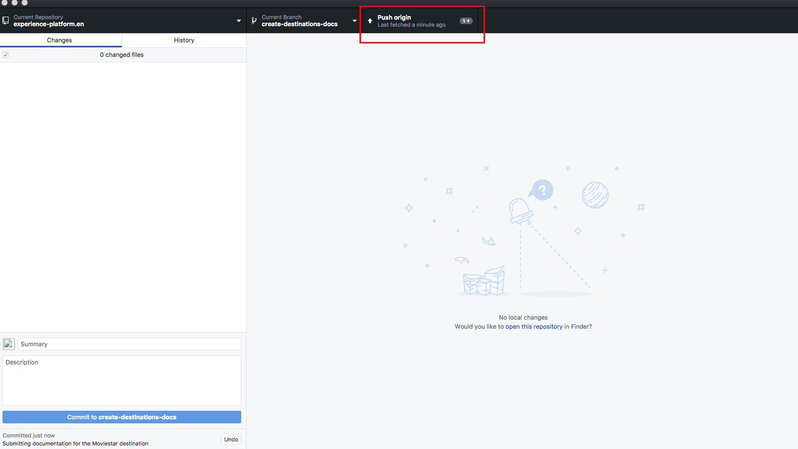

# Skapa en måldokumentationssida med en textredigerare i den lokala miljön {#local-authoring}

Instruktionerna på den här sidan visar hur du använder en textredigerare för att arbeta i din lokala miljö för att skapa dokumentation och skicka en pull-begäran (PR). Innan du går igenom de steg som anges här bör du kontrollera att du läser [Dokumentera destinationen i Adobe Experience Platform Destinations](./documentation-instructions.md).

>[!TIP]
>
>Se även supportdokumentationen i Adobe Contributor Guide:
>* [Installera Git- och Markdown Authoring tools](https://experienceleague.adobe.com/docs/contributor/contributor-guide/setup/install-tools.html?lang=en)
>* [Konfigurera Git-databasen lokalt för dokumentation](https://experienceleague.adobe.com/docs/contributor/contributor-guide/setup/local-repo.html?lang=en)
>* [Arbetsflöde för GitHub-bidrag för större ändringar](https://experienceleague.adobe.com/docs/contributor/contributor-guide/setup/full-workflow.html?lang=en).

## Anslut till GitHub och konfigurera din lokala redigeringsmiljö {#set-up-environment}

1. I webbläsaren går du till `https://github.com/AdobeDocs/experience-platform.en`
2. Till [gaffel](https://experienceleague.adobe.com/docs/contributor/contributor-guide/setup/local-repo.html?lang=en#fork-the-repository) databasen klickar du på **Gaffel** enligt nedan. Detta skapar en kopia av databasen Experience Platform i ditt eget GitHub-konto.

   

3. Klona databasen till din lokala dator. Välj **Code > HTTPS > Open with GitHub Desktop**, vilket visas nedan. Se till att du har [GitHub Desktop](https://desktop.github.com/) installerade. Läs mer här: [Skapa en lokal klon av databasen](https://experienceleague.adobe.com/docs/contributor/contributor-guide/setup/local-repo.html?lang=en#create-a-local-clone-of-the-repository) i Adobe Contributor-guiden.

   

4. I den lokala filstrukturen går du till `experience-platform.en/help/destinations/catalog/[...]`, där `[...]` är den önskade kategorin för destinationen. Om du till exempel lägger till ett anpassningsmål till Experience Platform väljer du `personalization` mapp.

## Skriv dokumentationssidan för ditt mål {#author-documentation}

1. Dokumentationssidan är baserad på [mall för självbetjäningsmål](../docs-framework/self-service-template.md). Ladda ned [målmall](../assets/docs-framework/yourdestination-template.zip). Zippa upp den och extrahera filen `yourdestination-template.md` till den katalog som nämns i steg 4 ovan.  Byt namn på filen `YOURDESTINATION.md`, där YOURDESTINATION är namnet på destinationen i Adobe Experience Platform. Om ditt företag till exempel heter Moviestar skulle du namnge filen `moviestar.md`.
2. Öppna den nya filen i [valfri textredigerare](https://experienceleague.adobe.com/docs/contributor/contributor-guide/setup/install-tools.html?lang=en#understand-markdown-editors). Adobe rekommenderar att du använder [Visual Studio Code](https://code.visualstudio.com/) och installera tillägget Adobe Markdown Authoring. Om du vill installera tillägget öppnar du Visual Studio Code och väljer **[!DNL Extensions]** till vänster på skärmen och sök efter `adobe markdown authoring`. Markera tillägget och klicka på **[!DNL Install]**.
   
3. Redigera mallen med relevant information om destinationen. Följ instruktionerna i mallen.
4. För skärmbilder som du planerar att lägga till i dokumentationen går du till `GitHub/experience-platform.en/help/destinations/assets/catalog/[...]`, där `[...]` är den önskade kategorin för destinationen. Om du till exempel lägger till ett anpassningsmål till Experience Platform väljer du `personalization` mapp. Skapa en ny mapp för destinationen och spara bilderna här. Du måste länka till dem från sidan som du redigerar. Se [anvisningar om hur du länkar till bilder](https://experienceleague.adobe.com/docs/contributor/contributor-guide/writing-essentials/linking.html?lang=en#link-to-images).
5. När du är klar sparar du filen som du arbetar med.

## Skicka in din dokumentation för granskning {#submit-review}

>[!TIP]
>
>Observera att det inte finns något du kan bryta här. Genom att följa instruktionerna i det här avsnittet föreslår du bara en uppdatering av dokumentationen. Den föreslagna uppdateringen kommer att godkännas eller redigeras av Adobe Experience Platform dokumentationsteam.

1. I GitHub Desktop skapar du en arbetsgren för dina uppdateringar och väljer **Publicera gren** för att publicera grenen på GitHub.

1. I GitHub Desktop, [bekräfta](https://docs.github.com/en/free-pro-team@latest/github/getting-started-with-github/github-glossary#commit) ditt arbete, vilket visas nedan.

   

1. I GitHub Desktop, [push](https://docs.github.com/en/free-pro-team@latest/github/getting-started-with-github/github-glossary#push) ditt arbete till [fjärr](https://docs.github.com/en/free-pro-team@latest/github/getting-started-with-github/github-glossary#remote) gren, enligt nedan.

   

1. Öppna en pull-begäran (PR) i GitHub-webbgränssnittet för att sammanfoga din arbetsgren med den överordnad grenen i dokumentationsdatabasen för Adobe. Se till att grenen du arbetade med är markerad och väljer **Contribute > Öppna pull-begäran**.

   

1. Kontrollera att bas- och jämförelsegrenarna är korrekta. Lägg till en anteckning till PR, som beskriver uppdateringen och välj **Skapa pull-begäran**. Då öppnas en PR som sammanfogar arbetsgrenen i din gaffel till den överordnad grenen i Adobe-databasen.
   >[!TIP]
   >
   >Lämna **Tillåt redigeringar av underhållare** kryssrutan markerad så att dokumentationsteamet på Adobe kan göra ändringar i PR.

   

1. Nu visas ett meddelande som uppmanar dig att signera Adobe Contributor License Agreement (CLA). Detta är ett obligatoriskt steg. När du har signerat CLA-avtalet uppdaterar du PR-sidan och skickar pull-begäran.

1. Du kan bekräfta att pull-begäran har skickats genom att granska **Dra in begäranden** tabba in `https://github.com/AdobeDocs/experience-platform.en`.

1. Tack! Dokumentationsteamet på Adobe kommer att nå ut i PR om det skulle behövas ändringar och informera dig om när dokumentationen kommer att publiceras.

>[!TIP]
>
>Om du vill lägga till bilder och länkar till din dokumentation och om du vill ha andra frågor om Markdown läser du [Använda markering](https://experienceleague.adobe.com/docs/contributor/contributor-guide/writing-essentials/markdown.html?lang=en) i Adobe samarbetsvägledning.
