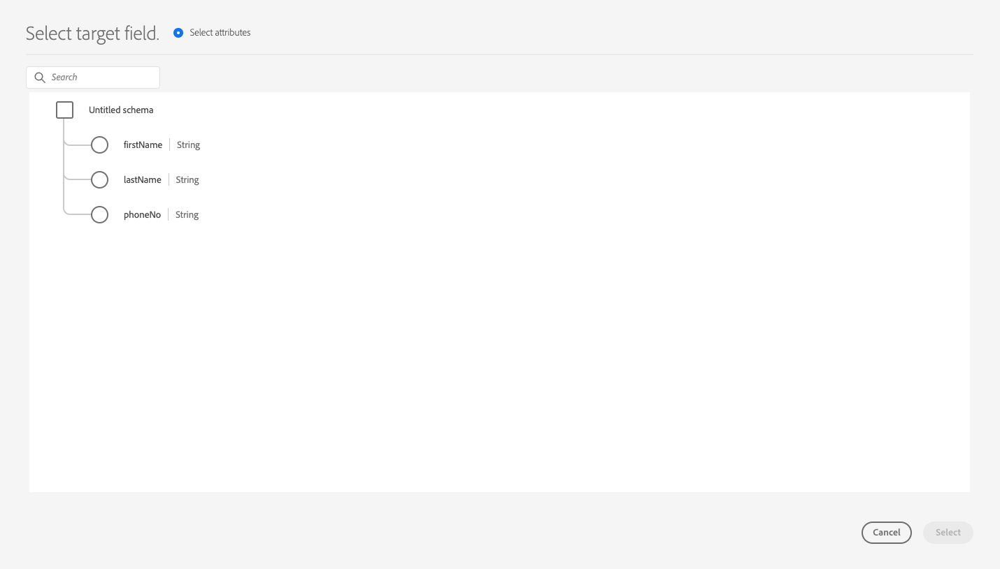

# Konfiguration av partnerschema

Experience Platform använder scheman för att beskriva datastrukturen på ett konsekvent och återanvändbart sätt. När data hämtas till Platform struktureras de enligt ett XDM-schema. Mer information om schemakompositionsmodellen, inklusive designprinciper och bästa praxis, finns i [grunderna för schemakomposition](../../../../xdm/schema/composition.md).

När du skapar ett mål med Destination SDK kan du definiera ett eget partnerschema som ska användas av målplattformen. Detta ger användarna möjlighet att mappa profilattribut från Plattform till specifika fält som målplattformen känner igen, allt inom plattformens användargränssnitt.

När du konfigurerar partnerschemat för målet kan du finjustera den fältmappning som stöds av målplattformen, till exempel:

* Tillåt användare att mappa en `phoneNumber` XDM-attribut till en `phone` attribut som stöds av målplattformen.
* Skapa dynamiska partnerscheman som Experience Platform kan anropa dynamiskt för att hämta en lista över alla attribut som stöds i destinationen.
* Definiera obligatoriska fältmappningar som målplattformen kräver.

Mer information om var den här komponenten passar in i en integrering som skapas med Destination SDK finns i diagrammet i [konfigurationsalternativ](../configuration-options.md) eller se guiden om hur du [använd Destination SDK för att konfigurera ett filbaserat mål](../../guides/configure-file-based-destination-instructions.md#create-server-file-configuration).

Du kan konfigurera dina schemainställningar via `/authoring/destinations` slutpunkt. På följande API-referenssidor finns detaljerade API-anropsexempel där du kan konfigurera komponenterna som visas på den här sidan.

* [Skapa en målkonfiguration](../../authoring-api/destination-configuration/create-destination-configuration.md)
* [Uppdatera en målkonfiguration](../../authoring-api/destination-configuration/update-destination-configuration.md)

I den här artikeln beskrivs alla schemakonfigurationsalternativ som stöds och som du kan använda för ditt mål. Här visas vad kunderna kommer att se i plattformsgränssnittet.

>[!IMPORTANT]
>
>Alla parameternamn och värden som stöds av Destinationen SDK är **skiftlägeskänslig**. Undvik skiftlägeskänslighetsfel genom att använda parameternamn och värden exakt som de visas i dokumentationen.

## Integrationstyper som stöds {#supported-integration-types}

Se tabellen nedan för mer ingående information om vilka typer av integreringar som stöder de funktioner som beskrivs på den här sidan.

| Integrationstyp | Stöder funktioner |
|---|---|
| Integrering i realtid (direktuppspelning) | Ja |
| Filbaserade (batch) integreringar | Ja |

## Schemakonfiguration som stöds {#supported-schema-types}

Destinationen SDK stöder flera schemakonfigurationer:

* Statiska scheman definieras via `profileFields` i `schemaConfig` -avsnitt. I ett statiskt schema definierar du alla målattribut som ska visas i användargränssnittet för Experience Platform i `profileFields` array. Om du behöver uppdatera ditt schema måste du [uppdatera målkonfigurationen](../../authoring-api/destination-configuration/update-destination-configuration.md).
* Dynamiska scheman använder ytterligare en målservertyp, som kallas [dynamisk schemaserver](../../authoring-api/destination-server/create-destination-server.md#dynamic-schema-servers), för att dynamiskt hämta de målattribut som stöds och generera scheman baserat på ditt eget API. Dynamiska scheman använder inte `profileFields` array. Om du behöver uppdatera schemat behöver du inte [uppdatera målkonfigurationen](../../authoring-api/destination-configuration/update-destination-configuration.md). I stället hämtar den dynamiska schemaservern det uppdaterade schemat från ditt API.
* I schemakonfigurationen kan du lägga till obligatoriska (eller fördefinierade) mappningar. Det här är mappningar som användare kan visa i plattformsgränssnittet, men de kan inte ändra dem när de konfigurerar en anslutning till ditt mål. Du kan t.ex. framtvinga att e-postadressfältet alltid skickas till målet.

The `schemaConfig` -avsnittet använder flera konfigurationsparametrar, beroende på vilken typ av schema du behöver, vilket visas i avsnitten nedan.

## Skapa ett statiskt schema {#attributes-schema}

Om du vill skapa ett statiskt schema med profilattribut definierar du målattributen i `profileFields` som visas nedan.

```json
"schemaConfig":{
      "profileFields":[
           {
              "name":"phoneNo",
              "title":"phoneNo",
              "description":"This is a fixed attribute on your destination side that customers can map profile attributes to. For example, the mobilePhone.number value in Experience Platform could be phoneNo on your side.",
              "type":"string",
              "isRequired":false,
              "readOnly":false,
              "hidden":false
           },
                      {
              "name":"firstName",
              "title":"firstName",
              "description":"This is a fixed attribute on your destination side that customers can map profile attributes to. For example, the person.name.firstName value in Experience Platform could be firstName on your side.",
              "type":"string",
              "isRequired":false,
              "readOnly":false,
              "hidden":false
           },
                      {
              "name":"lastName",
              "title":"lastName",
              "description":"This is a fixed attribute on your destination side that customers can map profile attributes to. For example, the person.name.lastName value in Experience Platform could be phoneNo on your side.",
              "type":"string",
              "isRequired":false,
              "readOnly":false,
              "hidden":false
           }
        ],
      "useCustomerSchemaForAttributeMapping":false,
      "profileRequired":true,
      "segmentRequired":true,
      "identityRequired":true,
      "segmentNamespaceAllowList": ["someNamespace"],
      "segmentNamespaceDenyList": ["someOtherNamespace"]

}
```

| Parameter | Typ | Obligatoriskt/valfritt | Beskrivning |
|---------|----------|------|---|
| `profileFields` | Array | Valfritt | Definierar den array med målattribut som accepteras av målplattformen och som kunderna kan mappa sina profilattribut till. När en `profileFields` kan du utesluta `useCustomerSchemaForAttributeMapping` parametern helt. |
| `useCustomerSchemaForAttributeMapping` | Boolean | Valfritt | Aktiverar eller inaktiverar mappning av attribut från kundschemat till de attribut som du definierar i `profileFields` array. <ul><li>Om inställt på `true`, visas bara källkolumnen i mappningsfältet. `profileFields` är inte tillämpliga i detta fall.</li><li>Om inställt på `false`, kan användare mappa källattribut från sitt schema till de attribut du har definierat i `profileFields` array.</li></ul> Standardvärdet är `false`. |
| `profileRequired` | Boolean | Valfritt | Använd `true` om användare ska kunna mappa profilattribut från Experience Platform till anpassade attribut på målplattformen. |
| `segmentRequired` | Boolean | Obligatoriskt | Den här parametern krävs av Destinationen SDK och ska alltid anges till `true`. |
| `identityRequired` | Boolean | Obligatoriskt | Ange till `true` om användare ska kunna mappa [identitetstyper](identity-namespace-configuration.md) från Experience Platform till de attribut du definierade i dialogrutan `profileFields` array. |
| `segmentNamespaceAllowList` | Array | Valfritt | Definierar specifika målgruppsnamnutrymmen från vilka användare kan mappa målgrupper till målet. Använd den här parametern för att begränsa plattformsanvändare så att de bara kan exportera målgrupper från de målgruppsnamnutrymmen som du definierar i arrayen. Den här parametern kan inte användas tillsammans med `segmentNamespaceDenyList`.<br> <br> Exempel: `"segmentNamespaceAllowList": ["AudienceManager"]` tillåter användare att endast kartlägga målgrupper från `AudienceManager` namnutrymme till detta mål. <br> <br> Om du vill tillåta användare att exportera alla målgrupper till ditt mål, kan du ignorera den här parametern. <br> <br> Om båda `segmentNamespaceAllowList` och `segmentNamespaceDenyList` saknas i din konfiguration kan användare bara exportera målgrupper som kommer från [Segmenteringstjänst](../../../../segmentation/home.md). |
| `segmentNamespaceDenyList` | Array | Valfritt | Begränsar användare från att mappa målgrupper till målet från de målgruppsnamnutrymmen som definieras i arrayen. Kan inte användas tillsammans med `segmentNamespaceAllowed`. <br> <br> Exempel: `"segmentNamespaceDenyList": ["AudienceManager"]` blockerar användare från att mappa målgrupper från `AudienceManager` namnutrymme till detta mål. <br> <br> Om du vill tillåta användare att exportera alla målgrupper till ditt mål, kan du ignorera den här parametern. <br> <br> Om båda `segmentNamespaceAllowed` och `segmentNamespaceDenyList` saknas i din konfiguration kan användare bara exportera målgrupper som kommer från [Segmenteringstjänst](../../../../segmentation/home.md). <br> <br> Om du vill tillåta export av alla målgrupper, oavsett ursprung, anger du `"segmentNamespaceDenyList":[]`. |

{style="table-layout:auto"}

Den slutliga användarupplevelsen visas i bilderna nedan.

När användarna väljer målmappning kan de se fälten som definierats i `profileFields` array.



När attributen har markerats kan de se dem i målfältskolumnen.


## Skapa ett dynamiskt schema {#dynamic-schema-configuration}

Destination SDK stöder skapande av dynamiska partnerscheman. I motsats till ett statiskt schema använder ett dynamiskt schema inte ett `profileFields` array. I stället använder dynamiska scheman en dynamisk schemaserver som ansluter till din egen API från den plats där schemakonfigurationen hämtas.

>[!IMPORTANT]
>
>Innan du skapar ett dynamiskt schema måste du [skapa en dynamisk schemaserver](../../authoring-api/destination-server/create-destination-server.md#dynamic-schema-servers).

I en dynamisk schemakonfiguration `profileFields` arrayen ersätts med `dynamicSchemaConfig` som visas nedan.

```json
"schemaConfig":{
   "dynamicSchemaConfig":{
      "dynamicEnum": {
         "authenticationRule":"CUSTOMER_AUTHENTICATION",
         "destinationServerId":"DYNAMIC_SCHEMA_SERVER_ID",
         "value": "Schema Name",
         "responseFormat": "SCHEMA"
      }
   },
   "profileRequired":true,
   "segmentRequired":true,
   "identityRequired":true
}
```

| Parameter | Typ | Obligatoriskt/valfritt | Beskrivning |
|---------|----------|------|---|
| `dynamicEnum.authenticationRule` | Sträng | Obligatoriskt | Anger hur [!DNL Platform] kunderna ansluter till er destination. Godkända värden är `CUSTOMER_AUTHENTICATION`, `PLATFORM_AUTHENTICATION`, `NONE`. <br> <ul><li>Använd `CUSTOMER_AUTHENTICATION` om plattformskunder loggar in i systemet med någon av de autentiseringsmetoder som beskrivs [här](customer-authentication.md). </li><li> Använd `PLATFORM_AUTHENTICATION` om det finns ett globalt autentiseringssystem mellan Adobe och destinationen och [!DNL Platform] Kunden behöver inte ange några autentiseringsuppgifter för att ansluta till ditt mål. I det här fallet måste du [skapa ett autentiseringsobjekt](../../credentials-api/create-credential-configuration.md) med API:t för autentiseringsuppgifter. </li><li>Använd `NONE` om ingen autentisering krävs för att skicka data till målplattformen. </li></ul> |
| `dynamicEnum.destinationServerId` | Sträng | Obligatoriskt | The `instanceId` av din dynamiska schemaserver. Målservern innehåller API-slutpunkten som Experience Platform ska anropa för att hämta det dynamiska schemat. |
| `dynamicEnum.value` | Sträng | Obligatoriskt | Namnet på det dynamiska schemat, enligt definitionen i den dynamiska schemaserverkonfigurationen. |
| `dynamicEnum.responseFormat` | Sträng | Obligatoriskt | Alltid inställt på `SCHEMA` när du definierar ett dynamiskt schema. |
| `profileRequired` | Boolean | Valfritt | Använd `true` om användare ska kunna mappa profilattribut från Experience Platform till anpassade attribut på målplattformen. |
| `segmentRequired` | Boolean | Obligatoriskt | Den här parametern krävs av Destinationen SDK och ska alltid anges till `true`. |
| `identityRequired` | Boolean | Obligatoriskt | Ange till `true` om användare ska kunna mappa [identitetstyper](identity-namespace-configuration.md) från Experience Platform till de attribut du definierade i dialogrutan `profileFields` array. |

{style="table-layout:auto"}

## Obligatoriska mappningar {#required-mappings}

I schemakonfigurationen kan du, förutom ditt statiska eller dynamiska schema, lägga till nödvändiga (eller fördefinierade) mappningar. Det här är mappningar som användare kan visa i plattformsgränssnittet, men de kan inte ändra dem när de konfigurerar en anslutning till ditt mål.

Du kan t.ex. framtvinga att e-postadressfältet alltid skickas till målet.

>[!NOTE]
>
>Följande kombinationer av obligatoriska mappningar stöds för närvarande:
>* Du kan konfigurera ett obligatoriskt källfält och ett obligatoriskt målfält. I det här fallet kan användare inte redigera eller markera något av de två fälten och bara visa markeringen.
>* Du kan bara konfigurera ett obligatoriskt målfält. I det här fallet kan användarna välja ett källfält som ska kopplas till målet.
>
> Konfigurering av endast ett obligatoriskt källfält pågår *not* stöds.

Se två exempel nedan på en schemakonfiguration med obligatoriska mappningar och hur dessa ser ut i mappningssteget i [aktivera data till batchmålarbetsflöde](../../../ui/activate-batch-profile-destinations.md).


>[!BEGINTABS]

>[!TAB Obligatoriska käll- och målmappningar]

I exemplet nedan visas både obligatoriska käll- och målmappningar. När både käll- och målfält anges som obligatoriska mappningar kan användare inte markera eller redigera något av de två fälten och bara visa den fördefinierade markeringen.

```json
"schemaConfig": {
    "requiredMappingsOnly": true,
    "requiredMappings": [
      {
        "sourceType": "text/x.schema-path",
        "source": "personalEmail.address",
        "destination": "personalEmail.address"
      }
    ] 
}
```

| Parameter | Typ | Obligatoriskt/valfritt | Beskrivning |
|---|---|---|---|
| `requiredMappingsOnly` | Boolean | Valfritt | Om värdet är true kan användare inte mappa andra attribut och identiteter i aktiveringsflödet, förutom de mappningar som du anger i dialogrutan `requiredMappings` array. |
| `requiredMappings.sourceType` | Sträng | Obligatoriskt | Anger typen av `source` fält. Värden som stöds: <ul><li>`text/x.schema-path`: Använd det här värdet när `source` fältet är ett profilattribut från ett XDM-schema.</li><li>`text/x.aep-xl`: Använd det här värdet när `source` -fältet definieras av ett reguljärt uttryck. Exempel: `iif(segmentMembership.ups.aep_seg_id.status==\"exited\", \"1\", \"0\")`</li><li>`text/plain`: Använd det här värdet när `source` -fältet definieras av en makromall. För närvarande är den enda makromall som stöds `metadata.segment.alias`.</li></ul> |
| `requiredMappings.source` | Sträng | Obligatoriskt | Anger värdet för källfältet. Värdetyper som stöds: <ul><li>XDM-profilattribut. Exempel: `personalEmail.address`. När källattributet är ett XDM-profilattribut anger du `sourceType` parameter till `text/x.schema-path`.</li><li>Reguljära uttryck. Exempel: `iif(segmentMembership.ups.aep_seg_id.status==\"exited\", \"1\", \"0\")`. När källattributet är ett reguljärt uttryck anger du `sourceType` parameter till `text/x.aep-xl`.</li><li>Makromallar. Exempel:`metadata.segment.alias`. När källattributet är en makromall anger du `sourceType` parameter till `text/plain`. För närvarande är den enda makromall som stöds `metadata.segment.alias`.</li></ul> |
| `requiredMappings.destination` | Sträng | Obligatoriskt | Anger målfältets värde. När både käll- och målfält har angetts som obligatoriska mappningar kan användare inte markera eller redigera något av de två fälten och bara visa markeringen. |

{style="table-layout:auto"}

Detta resulterar i att både **[!UICONTROL Source field]** och **[!UICONTROL Target field]** -avsnitt i plattformsgränssnittet är nedtonade.


>[!TAB Obligatorisk målmappning]

I exemplet nedan visas en nödvändig målmappning. Om bara målfältet anges som obligatoriskt kan användarna välja vilket källfält som ska kopplas till det.

```json
"schemaConfig": {
    "requiredMappingsOnly": true,
    "requiredMappings": [
      {
        "destination": "identityMap.ExamplePartner_ID",
        "mandatoryRequired": true,
        "primaryKeyRequired": true
      }
    ] 
}
```

| Parameter | Typ | Obligatoriskt/valfritt | Beskrivning |
|---|---|---|---|
| `requiredMappingsOnly` | Boolean | Valfritt | Om värdet är true kan användare inte mappa andra attribut och identiteter i aktiveringsflödet, förutom de mappningar som du anger i dialogrutan `requiredMappings` array. |
| `requiredMappings.destination` | Sträng | Obligatoriskt | Anger målfältets värde. När endast målfältet är angivet kan användarna välja ett källfält som ska kopplas till målet. |
| `mandatoryRequired` | Boolean | Valfritt | Anger om mappningen ska markeras som en [obligatoriskt attribut](../../../ui/activate-batch-profile-destinations.md#mandatory-attributes). |
| `primaryKeyRequired` | Boolean | Valfritt | Anger om mappningen ska markeras som en [dedupliceringsnyckel](../../../ui/activate-batch-profile-destinations.md#deduplication-keys). |

{style="table-layout:auto"}

Resultatet blev att **[!UICONTROL Target field]** -avsnittet i plattformsgränssnittet är nedtonat, medan **[!UICONTROL Source field]** -avsnittet är aktivt och användarna kan interagera med det. The **[!UICONTROL Mandatory key]** och **[!UICONTROL Deduplication key]** är aktiva och användarna kan inte ändra dem.


>[!ENDTABS]

## Nästa steg {#next-steps}

När du har läst den här artikeln bör du få en bättre förståelse för vilka schematyper som stöds av Destinationen SDK och hur du kan konfigurera ditt schema.

Mer information om de andra målkomponenterna finns i följande artiklar:

* [Kundautentisering](customer-authentication.md)
* [OAuth2-auktorisering](oauth2-authorization.md)
* [Gränssnittsattribut](ui-attributes.md)
* [Kunddatafält](customer-data-fields.md)
* [Konfiguration av namnutrymme för identitet](identity-namespace-configuration.md)
* [Mappningskonfigurationer som stöds](supported-mapping-configurations.md)
* [Destinationsleverans](destination-delivery.md)
* [Konfiguration av målgruppsmetadata](audience-metadata-configuration.md)
* [Samlingsprincip](aggregation-policy.md)
* [Batchkonfiguration](batch-configuration.md)
* [Krav på historisk profil](historical-profile-qualifications.md)
