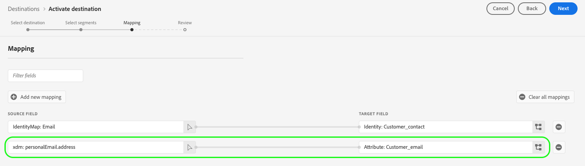

# Mappningskonfigurationer som stöds

Destinationer som skapats med Destination SDK stöder specifika konfigurationer för identitetsnamn och attributmappning, baserat på måltypen.

I den här artikeln beskrivs alla mappningskonfigurationer som stöds och som du kan använda när du konfigurerar målet.

>[!WARNING]
>
>Alla mappningskonfigurationer som inte beskrivs i den här artikeln stöds inte av Destinationen SDK.

När du skapar ditt mål konfigurerar du ditt schema och dina identitetsnamnutrymmen enligt en av mappningskonfigurationerna som beskrivs på den här sidan.

>[!IMPORTANT]
>
>Alla parameternamn och värden som stöds av Destinationen SDK är **skiftlägeskänslig**. Undvik skiftlägeskänslighetsfel genom att använda parameternamn och värden exakt som de visas i dokumentationen.

## Mappningar som stöds för direktuppspelningsmål {#streaming-mappings}

Mål för realtidsströmning som byggts med Destination SDK stöder de mappningskonfigurationer som beskrivs i tabellen nedan.

| Källfält | Målfält |
| --- | --- |
| XDM-attribut | Eget attribut |
| Namnutrymme för identitet | Namnutrymme för identitet |

I konfigurationsexemplet nedan kan kunderna använda båda mappningarna i tabellen ovan.

```json
"schemaConfig":{
   "profileRequired":true,
   "segmentRequired":true,
   "identityRequired":true
},
"identityNamespaces":{
   "Customer_contact":{
      "acceptsAttributes":false,
      "acceptsCustomNamespaces":true,
      "acceptedGlobalNamespaces":{
         "Email":{
            
         },
         "Phone":{
            
         }
      }
   }
},
```

### Mappa XDM-attribut till anpassade attribut {#streaming-xdm-to-custom}

Användare kan mappa attribut från sin XDM-källprofil till anpassade attribut på målsidan.

Användarna måste ange namnet på det anpassade målattributet manuellt när de väljer målfältsmappningen.


Den resulterande gränssnittsupplevelsen visas i bilden nedan.



### Mappa identitetsnamnutrymmen till partneridentitetsnamnutrymmen {#streaming-identity-to-identity}

Användare kan mappa anpassade eller globala identitetsnamnutrymmen från plattformen till identitetsnamnutrymmen som du har definierat.

Den resulterande gränssnittsupplevelsen visas i bilden nedan.


## Mappningar som stöds för filbaserade mål {#batch-mappings}

Filbaserade mål som skapats med Destination SDK stöder mappningskonfigurationerna som beskrivs i tabellen nedan. I nästa avsnitt finns detaljerade mappningsexempel.

| Källfält | Målfält |
| --- | --- |
| XDM-attribut | Attribut/anpassat attribut |
| Namnutrymme för identitet | Attribut/anpassat attribut |
| Namnutrymme för identitet | Namnutrymme för identitet |

I konfigurationsexemplet nedan kan kunderna använda alla mappningar från tabellen ovan.

```json
"schemaConfig":{
   "profileRequired":true,
   "segmentRequired":true,
   "identityRequired":true
},
"identityNamespaces":{
   "Customer_contact":{
      "acceptsAttributes":false,
      "acceptsCustomNamespaces":true,
      "acceptedGlobalNamespaces":{
         "Email":{
         },
         "Phone":{
         }
      }
   }
},
```

### Mappa XDM-attribut till anpassade attribut {#batch-xdm-to-custom}

Användare kan mappa attribut från sin XDM-källprofil till anpassade attribut på målsidan.

För filbaserade mål fylls målfältet automatiskt i med ett standardattribut med samma namn som källfältet.

Den resulterande gränssnittsupplevelsen visas i bilden nedan.


Användare kan lämna standardnamnet på plats eller ange ett eget attributnamn på urvalsskärmen för målfält.


### Mappa identitetsnamnutrymmen till anpassade attribut {#batch-identity-to-custom}

Användare kan mappa anpassade eller globala identitetsnamnutrymmen från Plattform till anpassade attribut på målsidan.

När du väljer ett identitetsnamnutrymme som ett källfält fylls målfältet automatiskt i med ett motsvarande identitetsnamnutrymme. Om du vill ersätta målfältet med ett anpassat attribut måste användaren ange ett anpassat attributnamn på målfältets markeringsskärm.


Den resulterande gränssnittsupplevelsen visas i bilden nedan.


### Mappa identitetsnamnutrymmen till partneridentitetsnamnutrymmen {#batch-identity-to-identity}

Användare kan mappa anpassade eller globala identitetsnamnutrymmen från Plattform till motsvarande identitetsnamnutrymmen.

När du väljer ett identitetsnamnutrymme som ett källfält fylls målfältet automatiskt i med ett motsvarande identitetsnamnutrymme.

Den resulterande gränssnittsupplevelsen visas i bilden nedan.


## Nästa steg {#next-steps}

När du har läst den här artikeln bör du få en bättre förståelse för vilka mappningar som stöds av mål som skapats med Destination SDK.

Mer information om de andra målkomponenterna finns i följande artiklar:

* [Kundautentisering](customer-authentication.md)
* [OAuth2-autentisering](oauth2-authentication.md)
* [Kunddatafält](customer-data-fields.md)
* [Gränssnittsattribut](ui-attributes.md)
* [Schemakonfiguration](schema-configuration.md)
* [Konfiguration av namnutrymme för identitet](identity-namespace-configuration.md)
* [Destinationsleverans](destination-delivery.md)
* [Konfiguration av målgruppsmetadata](audience-metadata-configuration.md)
* [Samlingsprincip](aggregation-policy.md)
* [Batchkonfiguration](batch-configuration.md)
* [Krav på historisk profil](historical-profile-qualifications.md)