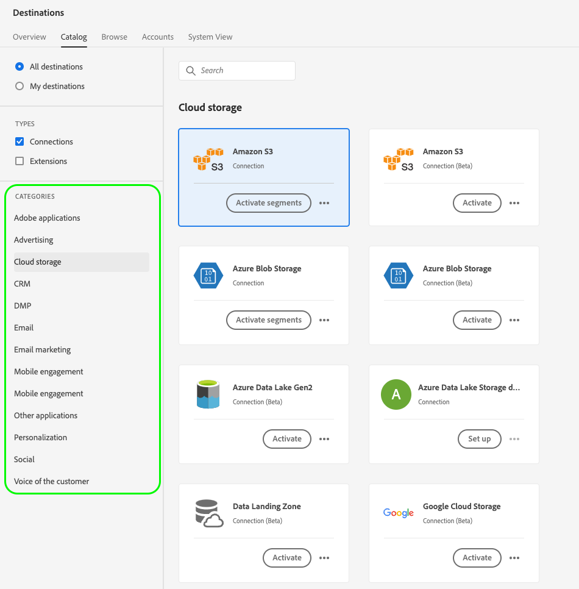

# Gränssnittsattribut

Gränssnittsattributen definierar de visuella element som Adobe ska visa för ditt målkort i Adobe Experience Platform användargränssnitt, till exempel logotypen för målplattformen, en länk till dokumentationssidan, en målbeskrivning samt kategori och typ för målkortet.

Mer information om var den här komponenten passar in i en integrering som skapas med Destination SDK finns i diagrammet i [konfigurationsalternativ](../configuration-options.md) eller se följande sidor med översikt över målkonfigurationen:

* [Använd Destination SDK för att konfigurera ett direktuppspelningsmål](../../guides/configure-destination-instructions.md#create-destination-configuration)
* [Använd Destination SDK för att konfigurera ett filbaserat mål](../../guides/configure-file-based-destination-instructions.md#create-destination-configuration)

När [skapa ett mål](../../authoring-api/destination-configuration/create-destination-configuration.md) via Destination SDK, `uiAttributes` -avsnittet definierar följande visuella egenskaper för målkortet:

* URL:en till måldokumentationssidan i [målkatalog](../../../catalog/overview.md).
* Den URL där du var värd för ikonen som ska visas på målkatalogkortet.
* Den kategori som ditt mål ska visas under i plattformsgränssnittet.
* Dataexportfrekvensen för destinationen.
* Målanslutningstypen, t.ex. Amazon S3, Azure Blob.

Du kan konfigurera gränssnittsattribut via `/authoring/destinations` slutpunkt. På följande API-referenssidor finns detaljerade API-anropsexempel där du kan konfigurera komponenterna som visas på den här sidan.

* [Skapa en målkonfiguration](../../authoring-api/destination-configuration/create-destination-configuration.md)
* [Uppdatera en målkonfiguration](../../authoring-api/destination-configuration/update-destination-configuration.md)

I den här artikeln beskrivs alla gränssnittsattribut som stöds och som du kan använda för ditt mål. Här visas vad kunderna kommer att se i användargränssnittet för Experience Platform.


>[!IMPORTANT]
>
>Alla parameternamn och värden som stöds av Destinationen SDK är **skiftlägeskänslig**. Undvik skiftlägeskänslighetsfel genom att använda parameternamn och värden exakt som de visas i dokumentationen.

## Integrationstyper som stöds {#supported-integration-types}

Se tabellen nedan för mer ingående information om vilka typer av integreringar som stöder de funktioner som beskrivs på den här sidan.

| Integrationstyp | Stöder funktioner |
|---|---|
| Integrering i realtid (direktuppspelning) | Ja |
| Filbaserade (batch) integreringar | Ja |

## parametrar som stöds {#supported-parameters}

```json
"uiAttributes":{
      "documentationLink":"http://www.adobe.com/go/YOURDESTINATION-en",
      "category":"cloudStorage",
      "connectionType":"S3",
      "frequency":"batch",
      "isBeta":"true"
   }
```

### `documentationLink` {#documentation-link}

`documentationLink` är en strängparameter som refererar till dokumentationssidan i [Målkatalog](../../../catalog/overview.md) till destinationen. Alla produktioner i Adobe Experience Platform måste ha en motsvarande dokumentationssida. [Lär dig hur du skapar en dokumentationssida för målet](../../docs-framework/documentation-instructions.md) till destinationen. Observera att detta inte krävs för privata/anpassade destinationer.

Använd följande format: `http://www.adobe.com/go/destinations-YOURDESTINATION-en`, där `YOURDESTINATION` är namnet på destinationen. För ett mål som heter Moviestar använder du `http://www.adobe.com/go/destinations-moviestar-en`.

Användarna kan se och besöka din dokumentationslänk från målkatalogsidan i användargränssnittet. De behöver bläddra till ditt målkort och sedan välja **[!UICONTROL More actions]** och sedan **[!UICONTROL View documentation]**, vilket visas i bilden nedan.


>[!NOTE]
>
>Länken fungerar bara när Adobe har aktiverat destinationen och dokumentationen har publicerats.

### `category` {#category}

`category` är en strängparameter som refererar till den kategori som tilldelats ditt mål i Adobe Experience Platform. Mer information finns i [Målkategorier](../../../destination-types.md). Använd något av följande värden: `adobeSolutions, advertising, analytics, cdp, cloudStorage, crm, customerSuccess, database, dmp, ecommerce, email, emailMarketing, enrichment, livechat, marketingAutomation, mobile, personalization, protocols, social, streaming, subscriptions, surveys, tagManagers, voc, warehouses, payments`.

Användarna kan se listan över målkategorier till vänster på skärmen i målkatalogen, som visas i bilden nedan.



<!-- ### `iconUrl` {#icon-url}

`iconUrl` is a string parameter that refers to the URL where you hosted the icon to be displayed in the destinations catalog card. For private custom integrations, this is not required. For productized configurations, you need to share an icon with the Adobe team when you [submit the destination for review](../../guides/submit-destination.md#logo).

Users can see the icon on your destination card, as shown in the image below.

 -->

### `connectionType` {#connection-type}

`connectionType` är en strängparameter som refererar till anslutningstypen, beroende på målet. Värden som stöds: <ul><li>`Server-to-server`</li><li>`Cloud storage`</li><li>`Azure Blob`</li><li>`Azure Data Lake Storage`</li><li>`S3`</li><li>`SFTP`</li><li>`DLZ`</li></ul>

Användarna kan se målanslutningstypen i [Bläddra](../../../ui/destinations-workspace.md#browse) -fliken i målarbetsytan.


### `frequency` {#frequency}

`frequency` är en strängparameter som refererar till den typ av dataexport som stöds av ditt mål. Ange till `Streaming` för API-baserade integreringar, eller `Batch` när du exporterar filer till dina mål.

Användare kan se frekvenstypen i **[!UICONTROL Dataflow runs]** sida för varje målanslutning.


### `isBeta` {#isbeta}

Om det mål som du skapar med Destination SDK är tillgängligt för ett begränsat antal kunder kan du markera målkortet från målkatalogen som beta.

Om du vill göra det kan du använda `isBeta: "true"` i delen UI-attribut i målkonfigurationen för att markera målkortet på rätt sätt.


## Nästa steg {#next-steps}

När du har läst den här artikeln bör du få en bättre förståelse för vilka gränssnittsattribut du kan konfigurera för ditt mål och var användarna ser dem i plattformsgränssnittet.

Mer information om de andra målkomponenterna finns i följande artiklar:

* [Kundautentisering](customer-authentication.md)
* [OAuth2-auktorisering](oauth2-authorization.md)
* [Kunddatafält](customer-data-fields.md)
* [Schemakonfiguration](schema-configuration.md)
* [Konfiguration av namnutrymme för identitet](identity-namespace-configuration.md)
* [Destinationsleverans](destination-delivery.md)
* [Konfiguration av målgruppsmetadata](audience-metadata-configuration.md)
* [Samlingsprincip](aggregation-policy.md)
* [Batchkonfiguration](batch-configuration.md)
* [Krav på historisk profil](historical-profile-qualifications.md)
