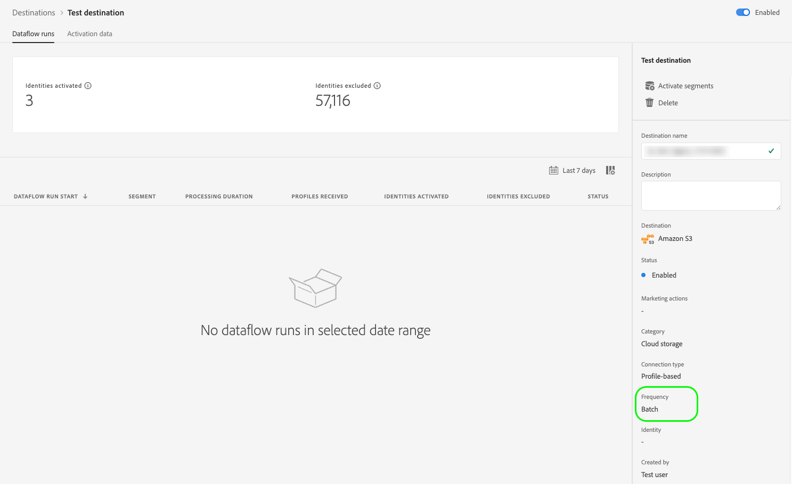

# Gränssnittsattribut

Gränssnittsattribut definierar de visuella element som Adobe ska visa för ditt målkort i Adobe Experience Platform användargränssnitt, till exempel en logotyp, en länk till dokumentationssidan, en målbeskrivning samt dess kategori och typ.

Om du vill veta var den här komponenten passar in i en integrering som skapats med Destination SDK kan du läsa diagrammet i dokumentationen för [konfigurationsalternativ](../configuration-options.md) eller följande sidor med en översikt över målkonfigurationen:

* [Använd Destination SDK för att konfigurera ett direktuppspelningsmål](../../guides/configure-destination-instructions.md#create-destination-configuration)
* [Använd Destination SDK för att konfigurera ett filbaserat mål](../../guides/configure-file-based-destination-instructions.md#create-destination-configuration)

När [skapar ett mål](../../authoring-api/destination-configuration/create-destination-configuration.md) via Destination SDK, definierar avsnittet `uiAttributes` följande visuella egenskaper för målkortet:

* URL-adressen till måldokumentationssidan i [målkatalogen](../../../catalog/overview.md).
* Den kategori som ditt mål ska visas under i plattformsgränssnittet.
* Dataexportfrekvensen för destinationen.
* Målanslutningstypen, t.ex. Amazon S3, Azure Blob.
* Den URL där du var värd för ikonen som ska visas på målkatalogkortet.

Du kan konfigurera gränssnittsattribut via slutpunkten `/authoring/destinations`. På följande API-referenssidor finns detaljerade API-anropsexempel där du kan konfigurera komponenterna som visas på den här sidan.

* [Skapa en målkonfiguration](../../authoring-api/destination-configuration/create-destination-configuration.md)
* [Uppdatera en målkonfiguration](../../authoring-api/destination-configuration/update-destination-configuration.md)

I den här artikeln beskrivs alla gränssnittsattribut som stöds och som du kan använda för ditt mål. Här visas vad kunderna kommer att se i användargränssnittet för Experience Platform.


>[!IMPORTANT]
>
>Alla parameternamn och värden som stöds av Destinationen SDK är **skiftlägeskänsliga**. Undvik skiftlägeskänslighetsfel genom att använda parameternamn och värden exakt som de visas i dokumentationen.

## Integrationstyper som stöds {#supported-integration-types}

Se tabellen nedan för mer ingående information om vilka typer av integreringar som stöder de funktioner som beskrivs på den här sidan.

| Integrationstyp | Stöder funktioner |
|---|---|
| Integrering i realtid (direktuppspelning) | Ja |
| Filbaserade (batch) integreringar | Ja |

## parametrar som stöds {#supported-parameters}

```json
"uiAttributes":{
      "documentationLink":"http://www.adobe.com/go/YOURDESTINATION-en",
      "category":"cloudStorage",
      "connectionType":"S3",
      "frequency":"batch",
      "isBeta":"true"
   }
```

### `documentationLink` {#documentation-link}

`documentationLink` är en strängparameter som refererar till dokumentationssidan i [målkatalogen](../../../catalog/overview.md) för ditt mål. Alla produktioner i Adobe Experience Platform måste ha en motsvarande dokumentationssida. [Lär dig hur du skapar en måldokumentationssida](../../docs-framework/documentation-instructions.md) för ditt mål. Observera att detta inte krävs för privata/anpassade destinationer.

Använd följande format: `http://www.adobe.com/go/destinations-YOURDESTINATION-en`, där `YOURDESTINATION` är namnet på målet. För ett mål som heter Moviestar använder du `http://www.adobe.com/go/destinations-moviestar-en`.

Användarna kan se och besöka din dokumentationslänk från målkatalogsidan i användargränssnittet. De måste bläddra till ditt målkort, sedan välja **[!UICONTROL More actions]** och sedan **[!UICONTROL View documentation]**, vilket visas i bilden nedan.


>[!NOTE]
>
>Länken fungerar bara när Adobe har aktiverat destinationen och dokumentationen har publicerats.

### `category` {#category}

`category` är en strängparameter som refererar till den kategori som tilldelats ditt mål i Adobe Experience Platform. Mer information finns i [Målkategorier](../../../destination-types.md). Använd ett av följande värden: `adobeSolutions, advertising, analytics, cdp, cloudStorage, crm, customerSuccess, database, dmp, ecommerce, email, emailMarketing, enrichment, livechat, marketingAutomation, mobile, personalization, protocols, social, streaming, subscriptions, surveys, tagManagers, voc, warehouses, payments`.

Användarna kan se listan över målkategorier till vänster på skärmen i målkatalogen, som visas i bilden nedan.


### `connectionType` {#connection-type}

`connectionType` är en strängparameter som refererar till anslutningstypen, beroende på målet. Värden som stöds: <ul><li>`Server-to-server`</li><li>`Cloud storage`</li><li>`Azure Blob`</li><li>`Azure Data Lake Storage`</li><li>`S3`</li><li>`SFTP`</li><li>`DLZ`</li></ul>

Användarna kan se målanslutningstypen på fliken [Bläddra](../../../ui/destinations-workspace.md#browse) på arbetsytan för mål.


### `frequency` {#frequency}

`frequency` är en strängparameter som refererar till den typ av dataexport som stöds av ditt mål. Ange `Streaming` för API-baserade integreringar eller `Batch` när du exporterar filer till dina mål.

Användare kan se frekvenstypen på sidan **[!UICONTROL Dataflow runs]** för varje målanslutning.



### `isBeta` {#isbeta}

Om det mål som du skapar med Destination SDK är tillgängligt för ett begränsat antal kunder kan du markera målkortet från målkatalogen som beta.

För att göra detta kan du använda parametern `isBeta: "true"` i avsnittet Gränssnittsattribut i målkonfigurationen för att markera målkortet korrekt.


### `icon` {#icon}

Du kan lägga till en logotypikon till målet, vilket visas i bilden nedan.


Om du vill lägga till en logotyp på målkortet måste du dela den önskade bilden med Adobe-teamet när du [skickar in målet för granskning](../../guides/submit-destination.md#logo).

## Nästa steg {#next-steps}

När du har läst den här artikeln bör du få en bättre förståelse för vilka gränssnittsattribut du kan konfigurera för ditt mål och var användarna ser dem i plattformsgränssnittet.

Mer information om de andra målkomponenterna finns i följande artiklar:

* [Kundautentisering](customer-authentication.md)
* [OAuth2-auktorisering](oauth2-authorization.md)
* [Kunddatafält](customer-data-fields.md)
* [Schemakonfiguration](schema-configuration.md)
* [Konfiguration av namnutrymme för identitet](identity-namespace-configuration.md)
* [Destinationsleverans](destination-delivery.md)
* [Konfiguration av målgruppsmetadata](audience-metadata-configuration.md)
* [Samlingsprincip](aggregation-policy.md)
* [Batchkonfiguration](batch-configuration.md)
* [Krav på historisk profil](historical-profile-qualifications.md)
