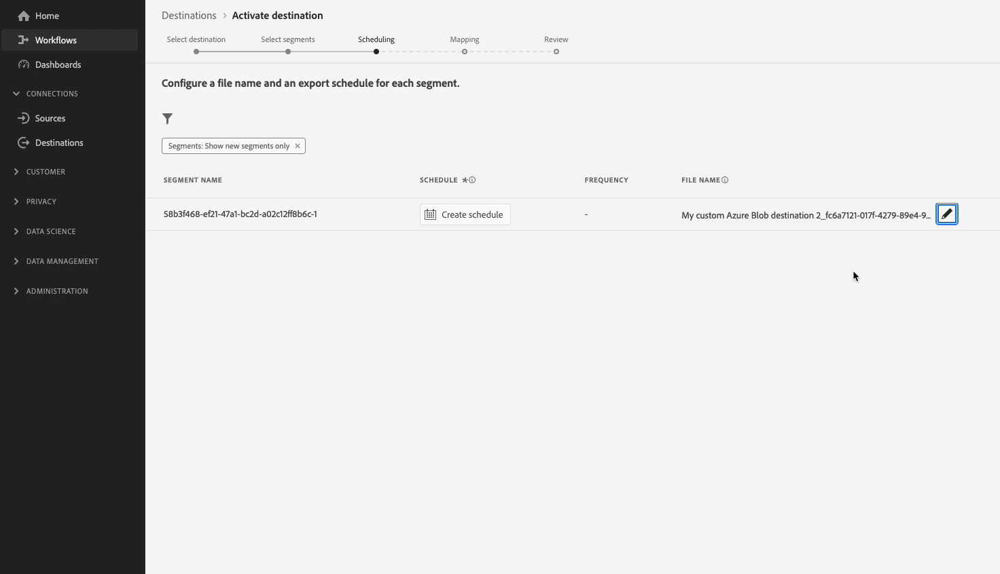

# Konfigurera ett Amazon S3-mål med anpassade filnamn och formateringsalternativ

## Översikt {#overview}

På den här sidan beskrivs hur du använder Destination SDK för att konfigurera ett Amazon S3-mål med anpassade [filformateringsalternativ](configure-file-formatting-options.md) och en anpassad [filnamnskonfiguration](../../functionality/destination-configuration/batch-configuration.md#file-name-configuration).

På den här sidan visas alla konfigurationsalternativ som är tillgängliga för Amazon S3-destinationer. Du kan redigera konfigurationerna som visas i stegen nedan eller ta bort vissa delar av konfigurationerna efter behov.

Detaljerade beskrivningar av parametrarna som används nedan finns i [konfigurationsalternativ i Destinations SDK](../../functionality/configuration-options.md).

## Förhandskrav {#prerequisites}

Innan du går vidare till stegen som beskrivs nedan bör du läsa sidan [Komma igång för Destination SDK](../../getting-started.md) för att få information om hur du får de autentiseringsuppgifter för Adobe I/O och andra krav som krävs för att arbeta med Destination SDK-API:er.

## Steg 1: Skapa en server- och filkonfiguration {#create-server-file-configuration}

Börja med att använda slutpunkten `/destination-server` för att [skapa en server- och filkonfiguration](../../authoring-api/destination-server/create-destination-server.md).

**API-format**

```http
POST platform.adobe.io/data/core/activation/authoring/destination-servers
```

**Begäran**

Följande begäran skapar en ny målserverkonfiguration, konfigurerad med parametrarna som anges i nyttolasten.
Nyttolasten nedan innehåller en allmän Amazon S3-konfiguration med anpassade [CSV-filformateringsparametrar](../../functionality/destination-server/file-formatting.md) som användare kan definiera i användargränssnittet för Experience Platform.

```shell
curl -X POST https://platform.adobe.io/data/core/activation/authoring/destination-server \
 -H 'Authorization: Bearer {ACCESS_TOKEN}' \
 -H 'Content-Type: application/json' \
 -H 'x-gw-ims-org-id: {ORG_ID}' \
 -H 'x-api-key: {API_KEY}' \
 -H 'x-sandbox-name: {SANDBOX_NAME}' \
 -d ' {
   "name":"Amazon S3 destination server with custom file formatting options",
   "destinationServerType":"FILE_BASED_S3",
   "fileBasedS3Destination":{
      "bucket":{
         "templatingStrategy":"PEBBLE_V1",
         "value":"{{customerData.bucketName}}"
      },
      "path":{
         "templatingStrategy":"PEBBLE_V1",
         "value":"{{customerData.path}}"
      }
   },
   "fileConfigurations":{
      "compression":{
         "templatingStrategy":"PEBBLE_V1",
         "value":"{{customerData.compression}}"
      },
      "fileType":{
         "templatingStrategy":"PEBBLE_V1",
         "value":"{{customerData.fileType}}"
      },
      "csvOptions":{
         "sep":{
            "templatingStrategy":"PEBBLE_V1",
            "value":"{{customerData.sep}}"
         },
         "encoding":{
            "templatingStrategy":"PEBBLE_V1",
            "value":"{{customerData.encoding}}"
         },
         "quote":{
            "templatingStrategy":"PEBBLE_V1",
            "value":"{{customerData.quote}}"
         },
         "quoteAll":{
            "templatingStrategy":"PEBBLE_V1",
            "value":"{{customerData.quoteAll}}"
         },
         "escape":{
            "templatingStrategy":"PEBBLE_V1",
            "value":"{{customerData.escape}}"
         },
         "escapeQuotes":{
            "templatingStrategy":"PEBBLE_V1",
            "value":"{{customerData.escapeQuotes}}"
         },
         "header":{
            "templatingStrategy":"PEBBLE_V1",
            "value":"{{customerData.header}}"
         },
         "ignoreLeadingWhiteSpace":{
            "templatingStrategy":"PEBBLE_V1",
            "value":"{{customerData.ignoreLeadingWhiteSpace}}"
         },
         "nullValue":{
            "templatingStrategy":"PEBBLE_V1",
            "value":"{{customerData.nullValue}}"
         },
         "dateFormat":{
            "templatingStrategy":"PEBBLE_V1",
            "value":"{{customerData.dateFormat}}"
         },
         "charToEscapeQuoteEscaping":{
            "templatingStrategy":"PEBBLE_V1",
            "value":"{{customerData.charToEscapeQuoteEscaping}}"
         },
         "emptyValue":{
            "templatingStrategy":"PEBBLE_V1",
            "value":"{{customerData.dateFormat}}"
         }
      }
   }
}'
```

Ett lyckat svar returnerar den nya målserverkonfigurationen, inklusive konfigurationens unika identifierare (`instanceId`). Lagra det här värdet som det ska i nästa steg.

## Steg 2: Skapa målkonfiguration {#create-destination-configuration}

När du har skapat målservern och filformateringskonfigurationen i föregående steg kan du nu använda API-slutpunkten `/destinations` för att skapa en målkonfiguration.

Om du vill ansluta serverkonfigurationen i [steg 1](#create-server-file-configuration) till den här målkonfigurationen ersätter du värdet `destinationServerId` i API-begäran nedan med värdet som du fick när du skapade målservern i [steg 1](#create-server-file-configuration).

**API-format**

```http
POST platform.adobe.io/data/core/activation/authoring/destinations
```

**Begäran**

```shell
curl -X POST https://platform.adobe.io/data/core/activation/authoring/destinations \
 -H 'Authorization: Bearer {ACCESS_TOKEN}' \
 -H 'Content-Type: application/json' \
 -H 'x-gw-ims-org-id: {ORG_ID}' \
 -H 'x-api-key: {API_KEY}' \
 -H 'x-sandbox-name: {SANDBOX_NAME}' \
 -d '
{
   "name":"Amazon S3 destination with custom file formatting options and custom file name configuration",
   "description":"Amazon S3 destination with custom file formatting options and custom file name configuration",
   "status":"TEST",
   "customerAuthenticationConfigurations":[
      {
         "authType":"S3"
      }
   ],
   "customerEncryptionConfigurations":[
      
   ],
   "customerDataFields":[
      {
         "name":"bucketName",
         "title":"Enter the name of your Amazon S3 bucket",
         "description":"Amazon S3 bucket name",
         "type":"string",
         "isRequired":true,
         "pattern": "(?=^.{3,63}$)(?!^(\\d+\\.)+\\d+$)(^(([a-z0-9]|[a-z0-9][a-z0-9\\-]*[a-z0-9])\\.)*([a-z0-9]|[a-z0-9][a-z0-9\\-]*[a-z0-9])$)",
         "readOnly":false,
         "hidden":false
      },
      {
         "name":"path",
         "title":"Enter the path to your S3 bucket folder",
         "description":"Enter the path to your S3 bucket folder",
         "type":"string",
         "isRequired":true,
         "pattern": "^[0-9a-zA-Z\\/\\!\\-_\\.\\*\\''\\(\\)]*((\\%SEGMENT_(NAME|ID)\\%)?\\/?)+$",
         "readOnly":false,
         "hidden":false
      },
      {
         "name":"sep",
         "title":"Enter your desired separator for each field and value",
         "description":"Enter your desired separator for each field and value",
         "type":"string",
         "isRequired":false,
         "readOnly":false,
         "hidden":false
      },
      {
         "name":"encoding",
         "title":"Select the desired CSV file encoding",
         "description":"Select the desired CSV file encoding",
         "type":"string",
         "enum":[
            "UTF-8",
            "UTF-16"
         ],
         "isRequired":false,
         "readOnly":false,
         "hidden":false
      },
      {
         "name":"quote",
         "title":"Quoted values escape character",
         "description":"Enter the desired character to be used for escaping quoted values.",
         "type":"string",
         "isRequired":false,
         "readOnly":false,
         "hidden":false
      },
      {
         "name":"quoteAll",
         "title":"Escape all quoted values",
         "description":"Select whether to escape all quoted values.",
         "type":"string",
         "enum":[
            "true",
            "false"
         ],
         "default":"true",
         "isRequired":true,
         "readOnly":false,
         "hidden":false
      },
      {
         "name":"escape",
         "title":"Quote escaping character",
         "description":"Enter the desired character to be used for escaping quotes inside an already quoted value.",
         "type":"string",
         "isRequired":false,
         "readOnly":false,
         "hidden":false
      },
      {
         "name":"escapeQuotes",
         "title":"Enclose quoted values within quotes",
         "description":"Select whether values containing quotes should always be enclosed in quotes.",
         "type":"string",
         "enum":[
            "true",
            "false"
         ],
         "isRequired":false,
         "default":"true",
         "readOnly":false,
         "hidden":false
      },
      {
         "name":"header",
         "title":"Generate file header.",
         "description":"Select whether to write the names of columns as the first line of the exported files.",
         "type":"string",
         "isRequired":false,
         "enum":[
            "true",
            "false"
         ],
         "readOnly":false,
         "default":"true",
         "hidden":false
      },
      {
         "name":"ignoreLeadingWhiteSpace",
         "title":"Ignore leading white space",
         "description":"Select whether leading whitespaces should be trimmed from exported values.",
         "type":"string",
         "isRequired":false,
         "enum":[
            "true",
            "false"
         ],
         "readOnly":false,
         "default":"true",
         "hidden":false
      },
      {
         "name":"nullValue",
         "title":"NULL value string format",
         "description":"Enter the string representation of a NULL value. ",
         "type":"string",
         "isRequired":false,
         "readOnly":false,
         "hidden":false
      },
      {
         "name":"dateFormat",
         "title":"Date format",
         "description":"Enter the desired date format. ",
         "type":"string",
         "default":"yyyy-MM-dd",
         "isRequired":false,
         "readOnly":false,
         "hidden":false
      },
      {
         "name":"charToEscapeQuoteEscaping",
         "title":"Quote escaping escape character",
         "description":"Enter the desired character to be used for escaping the escaping of a quote character.",
         "type":"string",
         "isRequired":false,
         "readOnly":false,
         "hidden":false
      },
      {
         "name":"emptyValue",
         "title":"Empty value string format",
         "description":"Enter the string representation of an empty value.",
         "type":"string",
         "isRequired":false,
         "readOnly":false,
         "default":"",
         "hidden":false
      },
      {
         "name":"compression",
         "title":"Compression format",
         "description":"Select the desired file compression format.",
         "type":"string",
         "isRequired":true,
         "readOnly":false,
         "enum":[
            "SNAPPY",
            "GZIP",
            "DEFLATE",
            "NONE"
         ]
      },
      {
         "name":"fileType",
         "title":"File type",
         "description":"Select the exported file type.",
         "type":"string",
         "isRequired":true,
         "readOnly":false,
         "hidden":false,
         "enum":[
            "csv",
            "json",
            "parquet"
         ],
         "default":"csv"
      }
   ],
   "uiAttributes":{
      "documentationLink":"https://www.adobe.com/go/destinations-amazon-s3-en",
      "category":"cloudStorage",
      "connectionType":"S3",
      "flowRunsSupported":true,
      "monitoringSupported":true,
      "frequency":"Batch"
   },
   "destinationDelivery":[
      {
         "deliveryMatchers":[
            {
               "type":"SOURCE",
               "value":[
                  "batch"
               ]
            }
         ],
         "authenticationRule":"CUSTOMER_AUTHENTICATION",
         "destinationServerId":"{{destinationServerId}}"
      }
   ],
   "schemaConfig":{
      "profileRequired":true,
      "segmentRequired":true,
      "identityRequired":true
   },
   "batchConfig":{
      "allowMandatoryFieldSelection":true,
      "allowDedupeKeyFieldSelection":true,
      "defaultExportMode":"DAILY_FULL_EXPORT",
      "allowedExportMode":[
         "DAILY_FULL_EXPORT",
         "FIRST_FULL_THEN_INCREMENTAL"
      ],
      "allowedScheduleFrequency":[
         "DAILY",
         "EVERY_3_HOURS",
         "EVERY_6_HOURS",
         "EVERY_8_HOURS",
         "EVERY_12_HOURS",
         "ONCE"
      ],
      "defaultFrequency":"DAILY",
      "defaultStartTime":"00:00",
      "filenameConfig":{
         "allowedFilenameAppendOptions":[
            "SEGMENT_NAME",
            "DESTINATION_INSTANCE_ID",
            "DESTINATION_INSTANCE_NAME",
            "ORGANIZATION_NAME",
            "SANDBOX_NAME",
            "DATETIME",
            "CUSTOM_TEXT"
         ],
         "defaultFilenameAppendOptions":[
            "DATETIME"
         ],
         "defaultFilename":"%DESTINATION%_%SEGMENT_ID%"
      },
      "backfillHistoricalProfileData":true
   }
}'
```

Ett lyckat svar returnerar den nya målkonfigurationen, inklusive konfigurationens unika identifierare (`instanceId`). Lagra det här värdet som det är nödvändigt om du behöver göra ytterligare HTTP-begäranden för att uppdatera målkonfigurationen.

## Steg 3: Verifiera användargränssnittet i Experience Platform {#verify-ui}

Baserat på ovanstående konfigurationer kommer Experience Platform-katalogen nu att visa ett nytt privat destinationskort som du kan använda.


Observera hur alternativen i [aktiveringsarbetsflödet för filbaserade mål](../../../ui/activate-batch-profile-destinations.md) i bilderna och inspelningarna nedan matchar alternativen som du valde i målkonfigurationen.

När du fyller i information om målet bör du tänka på hur fälten som visas är anpassade datafält som du ställer in i konfigurationen.

>[!TIP]
>
>Den ordning i vilken du lägger till anpassade datafält i målkonfigurationen visas inte i användargränssnittet. De anpassade datafälten visas alltid i den ordning som visas i skärminspelningen nedan.


När du schemalägger exportintervall bör du observera hur fälten som visas är de fält som du har konfigurerat i `batchConfig`-konfigurationen.


När du visar konfigurationsalternativen för filnamn bör du observera hur fälten som visas representerar de `filenameConfig`-alternativ som du har konfigurerat i konfigurationen.


Om du vill justera något av fälten ovan upprepar du [steg ett](#create-server-file-configuration) och [två](#create-destination-configuration) för att ändra konfigurationerna efter dina behov.

## Steg 4: (Valfritt) Publish ditt mål {#publish-destination}

>[!NOTE]
>
>Det här steget är inte nödvändigt om du skapar ett privat mål för eget bruk och inte vill publicera det i målkatalogen för andra kunder.

När du har konfigurerat målet kan du använda [API:t för målpublicering](../../publishing-api/create-publishing-request.md) för att skicka konfigurationen till Adobe för granskning.

## Steg 5: (Valfritt) Dokumentera destinationen {#document-destination}

>[!NOTE]
>
>Det här steget är inte nödvändigt om du skapar ett privat mål för eget bruk och inte vill publicera det i målkatalogen för andra kunder.

Om du är en oberoende programvaruleverantör (ISV) eller systemintegratör (SI) som skapar en [tillverkad integrering](../../overview.md#productized-custom-integrations) använder du [självbetjäningsdokumentationsprocessen](../../docs-framework/documentation-instructions.md) för att skapa en produktdokumentationssida för destinationen i [Experience Platform-målkatalogen](../../../catalog/overview.md).

## Nästa steg {#next-steps}

Genom att läsa den här artikeln kan du nu skapa ett anpassat [!DNL Amazon S3]-mål med hjälp av Destination SDK. Därefter kan ditt team använda [aktiveringsarbetsflödet för filbaserade mål](../../../ui/activate-batch-profile-destinations.md) för att exportera data till målet.
