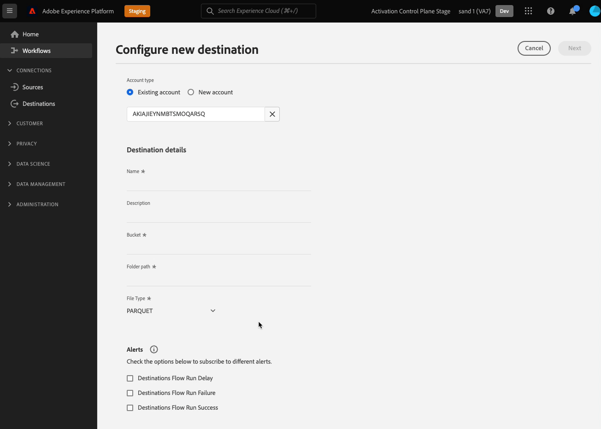

# Konfigurera filformateringsalternativ för filbaserade mål

## Översikt {#overview}

Med Destination SDK kan du i stor utsträckning justera formaterings- och komprimeringsalternativen för de exporterade filerna så att de matchar eventuella senare krav i lagringsplatsen.

På den här sidan beskrivs hur du använder Destination SDK för att konfigurera filformateringsalternativ för filbaserade mål.

## Förhandskrav {#prerequisites}

Innan du går vidare till stegen som beskrivs nedan bör du läsa sidan [Komma igång för Destination SDK](../../getting-started.md) för att få information om hur du får de autentiseringsuppgifter för Adobe I/O och andra krav som krävs för att arbeta med Destination SDK-API:er.

Adobe rekommenderar också att du läser och bekanta dig med följande dokumentation innan du fortsätter:

* Alla tillgängliga filformateringsalternativ beskrivs utförligt i avsnittet [filformateringskonfiguration](../../functionality/destination-server/file-formatting.md).
* Slutför stegen för att [konfigurera ett filbaserat mål](../../guides/configure-file-based-destination-instructions.md) med Destination SDK.

## Skapa en server- och filkonfiguration {#create-server-file-configuration}

Börja med att använda slutpunkten `/destination-server` för att avgöra vilka filformateringsalternativ du vill ställa in för de exporterade filerna.

Nedan visas ett exempel på en målserverkonfiguration för ett [!DNL Amazon S3]-mål, med flera filformateringsalternativ markerade.

**API-format**

```http
POST platform.adobe.io/data/core/activation/authoring/destination-servers
```

**Begäran**

```shell
curl -X POST https://platform.adobe.io/data/core/activation/authoring/destination-server \
 -H 'Authorization: Bearer {ACCESS_TOKEN}' \
 -H 'Content-Type: application/json' \
 -H 'x-gw-ims-org-id: {ORG_ID}' \
 -H 'x-api-key: {API_KEY}' \
 -H 'x-sandbox-name: {SANDBOX_NAME}' \
 -d '
{
{
  "name": "Amazon S3 Server with several CSV Options",
  "destinationServerType": "FILE_BASED_S3",
  "fileBasedS3Destination": {
    "bucket": {
      "templatingStrategy": "PEBBLE_V1",
      "value": "{{customerData.bucket}}"
    },
    "path": {
      "templatingStrategy": "PEBBLE_V1",
      "value": "{{customerData.path}}"
    }
  },
  "fileConfigurations": {
    "compression": {
      "templatingStrategy": "PEBBLE_V1",
      "value": "{{customerData.compression}}NONE"
    },
    "fileType": {
      "templatingStrategy": "PEBBLE_V1",
      "value": "{{customerData.fileType}}"
    },
    "csvOptions": {
      "sep": {
        "templatingStrategy": "PEBBLE_V1",
        "value": "{{customerData.csvOptions.delimiter}},"
      },
      "quote": {
        "templatingStrategy": "PEBBLE_V1",
        "value": "{{customerData.csvOptions.quote}}\""
      },
      "escape": {
        "templatingStrategy": "PEBBLE_V1",
        "value": "{{customerData.csvOptions.escape}}\\"
      },
      "nullValue": {
        "templatingStrategy": "PEBBLE_V1",
        "value": "{{customerData.csvOptions.nullValue}}null"
      },
      "emptyValue": {
        "templatingStrategy": "PEBBLE_V1",
        "value": "{{customerData.csvOptions.emptyValue}}"
      }
    }
  }
}
}'
```

## Lägg till filformateringsalternativen i målkonfigurationen {#create-destination-configuration}

>[!TIP]
>
>**Verifiera användargränssnittet för Experience Platform**. När du konfigurerar filformateringsalternativen med de konfigurationer som visas i avsnitten nedan, bör du kontrollera hur dessa alternativ återges i användargränssnittet i Experience Platform.

När du har lagt till önskade filformateringsalternativ till målservern och filformateringskonfigurationen i föregående steg, kan du nu använda API-slutpunkten `/destinations` för att lägga till önskade fält som kunddatafält i målkonfigurationen.

>[!IMPORTANT]
>
>Det här steget är valfritt och avgör bara vilket av filformateringsalternativen som ska visas för användare i användargränssnittet i Experience Platform. Om du inte anger filformateringsalternativ som kunddatafält fortsätter filexporten med standardvärdena som konfigurerats i [server- och filkonfigurationen](#create-server-file-configuration).

I det här steget kan du gruppera de visade alternativen i vilken ordning du vill, du kan skapa anpassade grupperingar, listrutefält och villkorliga grupperingar baserat på de valda filtyperna. Alla dessa inställningar visas i inspelningen och i avsnitten längre fram nedan.


### Ordna filformateringsalternativen {#ordering}

Den ordning i vilken du lägger till filformateringsalternativen som kunddatafält i målkonfigurationen återspeglas i användargränssnittet. Konfigurationen nedan återspeglas till exempel i användargränssnittet, där alternativen visas i ordningen **[!UICONTROL Delimiter]**, **[!UICONTROL Quote Character]**, **[!UICONTROL Escape Character]**, **[!UICONTROL Empty Value]**, **[!UICONTROL Null Value]**.


```json
        {
            "name": "csvOptions",
            "title": "CSV Options",
            "description": "Select your CSV options",
            "type": "object",
            "properties": [
                {
                    "name": "delimiter",
                    "title": "Delimiter",
                    "description": "Select your Delimiter",
                    "type": "string",
                    "isRequired": false,
                    "default": ",",
                    "namedEnum": [
                        {
                            "name": "Comma (,)",
                            "value": ","
                        },
                        {
                            "name": "Tab (\\t)",
                            "value": "\t"
                        }
                    ],
                    "readOnly": false,
                    "hidden": false
                },
                {
                    "name": "quote",
                    "title": "Quote Character",
                    "description": "Select your Quote character",
                    "type": "string",
                    "isRequired": false,
                    "default": "\u0000",
                    "namedEnum": [
                        {
                            "name": "Double Quotes (\")",
                            "value": "\""
                        },
                        {
                            "name":"Null Character (\u0000)",
                            "value": ""
                        }
                    ],
                    "readOnly": false,
                    "hidden": false
                },
                {
                    "name": "escape",
                    "title": "Escape Character",
                    "description": "Select your Escape character",
                    "type": "string",
                    "isRequired": false,
                    "default": "\\",
                    "namedEnum": [
                        {
                            "name": "Back Slash (\\)",
                            "value": "\\"
                        },
                        {
                            "name": "Single Quote (')",
                            "value": "'"
                        }
                    ],
                    "readOnly": false,
                    "hidden": false
                },
                {
                    "name": "emptyValue",
                    "title": "Empty Value",
                    "description": "Select the output value of blank fields",
                    "type": "string",
                    "isRequired": false,
                    "default": "",
                    "namedEnum": [
                        {
                            "name": "Empty String",
                            "value": ""
                        },
                        {
                            "name": "\"\"",
                            "value": "\"\""
                        },
                        {
                            "name": "null",
                            "value": "null"
                        }
                    ],
                    "readOnly": false,
                    "hidden": false
                },
                {
                    "name": "nullValue",
                    "title": "Null Value",
                    "description": "Select the output value of 'null' fields",
                    "type": "string",
                    "isRequired": false,
                    "default": "null",
                    "namedEnum": [
                        {
                            "name": "Empty String",
                            "value": ""
                        },
                        {
                            "name": "\"\"",
                            "value": "\"\""
                        },
                        {
                            "name": "null",
                            "value": "null"
                        }
                    ],
                    "readOnly": false,
                    "hidden": false
                }
```

### Gruppera filformateringsalternativen {#grouping}

Du kan gruppera flera filformateringsalternativ i ett avsnitt. När du konfigurerar anslutningen till målet i användargränssnittet kan användaren se och dra nytta av en visuell gruppering av liknande fält.

Det gör du genom att använda `"type": "object"` för att skapa gruppen och samla in de önskade filformateringsalternativen i en `properties` -parameter, vilket visas i exemplet nedan, där grupperingen **[!UICONTROL CSV Options]** är markerad.

```json {line-numbers="true" start-number="100" highlight="106-128"}
"customerDataFields":[
[...]
{
   "name":"csvOptions",
   "title":"CSV Options",
   "description":"Select your CSV options",
   "type":"object",
   "properties":[
      {
         "name":"delimiter",
         "title":"Delimiter",
         "description":"Select your Delimiter",
         "type":"string",
         "isRequired":false,
         "default":",",
         "namedEnum":[
            {
               "name":"Comma (,)",
               "value":","
            },
            {
               "name":"Tab (\\t)",
               "value":"\t"
            }
         ],
         "readOnly":false,
         "hidden":false
      },
      [...]
   ]
}
[...]
]
```


### Skapa listruteväljare för filformateringsalternativen {#dropdown-selectors}

I situationer där du vill att användarna ska kunna välja mellan flera alternativ, t.ex. vilket tecken som ska användas för att avgränsa fälten i CSV-filer, kan du lägga till nedrullningsbara fält i användargränssnittet.

Om du vill göra det använder du objektet `namedEnum` så som visas nedan och konfigurerar ett `default`-värde för de alternativ som användaren kan välja.

```json {line-numbers="true" start-number="100" highlight="114-124"}
[...]
"customerDataFields":[
[...]
{
   "name":"csvOptions",
   "title":"CSV Options",
   "description":"Select your CSV options",
   "type":"object",
   "properties":[
      {
         "name":"delimiter",
         "title":"Delimiter",
         "description":"Select your Delimiter",
         "type":"string",
         "isRequired":false,
         "default":",",
         "namedEnum":[
            {
               "name":"Comma (,)",
               "value":","
            },
            {
               "name":"Tab (\\t)",
               "value":"\t"
            }
         ],
         "readOnly":false,
         "hidden":false
      },
      [...]
   ]
}
[...]
]
```


### Skapa formateringsalternativ för villkorsstyrda filer {#conditional-options}

Du kan skapa alternativ för villkorsstyrd filformatering, som bara visas i aktiveringsarbetsflödet när användaren väljer en viss filtyp för export. I konfigurationen nedan skapas till exempel en villkorsstyrd gruppering för CSV-filalternativ. CSV-filalternativen visas bara när användaren väljer CSV som önskad filtyp för export.

Om du vill ange ett fält som villkorligt använder du parametern `conditional` enligt nedan:

```json
            "conditional": {
                "field": "fileType",
                "operator": "EQUALS",
                "value": "CSV"
            }
```

I ett större sammanhang kan du se att fältet `conditional` används i målkonfigurationen nedan, tillsammans med strängen `fileType` och objektet `csvOptions` som det definierats i.

```json
        {
            "name": "fileType",
            "title": "File Type",
            "description": "Select your file type",
            "type": "string",
            "isRequired": true,
            "enum": [
                "PARQUET",
                "CSV",
                "JSON"
            ],
            "readOnly": false,
            "hidden": false
        },
        {
            "name": "csvOptions",
            "title": "CSV Options",
            "description": "Select your CSV options",
            "type": "object",
            "conditional": {
                "field": "fileType",
                "operator": "EQUALS",
                "value": "CSV"
            },            
            "properties": [
                {
                    "name": "delimiter",
                    "title": "Delimiter",
                    "description": "Select your Delimiter",
                    "type": "string",
                    "isRequired": false,
                    "default": ",",
                    "namedEnum": [
                        {
                            "name": "Comma (,)",
                            "value": ","
                        },
                        {
                            "name": "Tab (\\t)",
                            "value": "\t"
                        }
                    ],
                    "readOnly": false,
                    "hidden": false
                },
                {
                    "name": "quote",
                    "title": "Quote Character",
                    "description": "Select your Quote character",
                    "type": "string",
                    "isRequired": false,
                    "default": "",
                    "namedEnum": [
                        {
                            "name": "Double Quotes (\")",
                            "value": "\""
                        },
                        {
                            "name":"Null Character (\u0000)",
                            "value": "\u0000"
                        }
                    ],
                    "readOnly": false,
                    "hidden": false
                },
                {
                    "name": "escape",
                    "title": "Escape Character",
                    "description": "Select your Escape character",
                    "type": "string",
                    "isRequired": false,
                    "default": "\\",
                    "namedEnum": [
                        {
                            "name": "Back Slash (\\)",
                            "value": "\\"
                        },
                        {
                            "name": "Single Quote (')",
                            "value": "'"
                        }
                    ],
                    "readOnly": false,
                    "hidden": false
                },
                {
                    "name": "emptyValue",
                    "title": "Empty Value",
                    "description": "Select the output value of blank fields",
                    "type": "string",
                    "isRequired": false,
                    "default": "",
                    "namedEnum": [
                        {
                            "name": "Empty String",
                            "value": ""
                        },
                        {
                            "name": "\"\"",
                            "value": "\"\""
                        },
                        {
                            "name": "null",
                            "value": "null"
                        }
                    ],
                    "readOnly": false,
                    "hidden": false
                },
                {
                    "name": "nullValue",
                    "title": "Null Value",
                    "description": "Select the output value of 'null' fields",
                    "type": "string",
                    "isRequired": false,
                    "default": "null",
                    "namedEnum": [
                        {
                            "name": "Empty String",
                            "value": ""
                        },
                        {
                            "name": "\"\"",
                            "value": "\"\""
                        },
                        {
                            "name": "null",
                            "value": "null"
                        }
                    ],
                    "readOnly": false,
                    "hidden": false
                }
            ],
            "isRequired": false,
            "readOnly": false,
            "hidden": false
        }
```

Nedan visas den resulterande gränssnittsskärmen baserat på konfigurationen ovan. När användaren väljer filtypen CSV visas ytterligare filformateringsalternativ som refererar till CSV-filtypen i användargränssnittet.



### Fullständig API-begäran som innehåller alla alternativ som visas ovan

API-begäran nedan kombinerar i en konfiguration alla alternativ som beskrivs i avsnitten ovan.

**Begäran**

```shell
curl -X POST https://platform.adobe.io/data/core/activation/authoring/destinations \
 -H 'Authorization: Bearer {ACCESS_TOKEN}' \
 -H 'Content-Type: application/json' \
 -H 'x-gw-ims-org-id: {ORG_ID}' \
 -H 'x-api-key: {API_KEY}' \
 -H 'x-sandbox-name: {SANDBOX_NAME}' \
 -d '
{
  "name": "My S3 Destination",
  "description": "Test destination",
  "status": "TEST",
  "sources": [
    "UNIFIED_PROFILE"
  ],
  "customerAuthenticationConfigurations": [
    {
      "authType": "S3"
    }
  ],
  "customerDataFields": [
    {
      "name": "bucket",
      "type": "string",
      "title": "Bucket",
      "description": "Enter your S3 Bucket",
      "isRequired": true
    },
    {
      "name": "path",
      "type": "string",
      "title": "Path",
      "description": "Enter your S3 Path",
      "isRequired": true
    },
    {
      "name": "fileType",
      "type": "string",
      "enum": [
        "CSV",
        "JSON",
        "PARQUET"
      ],
      "title": "File Type",
      "description": "Select your file type",
      "isRequired": true
    },
    {
      "name": "csvOptions",
      "type": "object",
      "title": "CSV Options",
      "description": "Select your CSV options",
      "conditional": {
        "field": "fileType",
        "operator": "EQUALS",
        "value": "CSV"
      },
      "properties": [
        {
          "name": "delimiter",
          "type": "string",
          "title": "Delimiter",
          "description": "Select your Delimiter",
          "namedEnum": [
            {
              "name": "Comma (,)",
              "value": ","
            },
            {
              "name": "Tab (\\t)",
              "value": "\t"
            }
          ],
          "default": ","
        },
        {
          "name": "quote",
          "type": "string",
          "title": "Quote Character",
          "description": "Select your Quote character",
          "namedEnum": [
            {
              "name": "Double Quotes (\")",
              "value": "\""
            },
            {
              "name": "Null Character (\\u0000)",
              "value": "\u0000"
            }
          ],
          "default": "\u0000"
        },
        {
          "name": "escape",
          "type": "string",
          "title": "Escape Character",
          "description": "Select your Escape character",
          "namedEnum": [
            {
              "name": "Back Slash (\\)",
              "value": "\\"
            },
            {
              "name": "Single Quote (')",
              "value": "'"
            }
          ],
          "default": "\\"
        },
        {
          "name": "emptyValue",
          "type": "string",
          "title": "Empty Value",
          "description": "Select the output value of blank fields",
          "namedEnum": [
            {
              "name": "null",
              "value": "null"
            },
            {
              "name": "Empty String",
              "value": ""
            },
            {
              "name": "\"\"",
              "value": "\"\""
            }
          ],
          "default": ""
        },
        {
          "name": "nullValue",
          "type": "string",
          "title": "Null Value",
          "description": "Select the output value of 'null' fields",
          "namedEnum": [
            {
              "name": "null",
              "value": "null"
            },
            {
              "name": "Empty String",
              "value": ""
            },
            {
              "name": "\"\"",
              "value": "\"\""
            }
          ],
          "default": "null"
        }
      ]
    }
  ],
  "uiAttributes": {
    "documentationLink": "https://www.adobe.com/go/aep",
    "category": "cloudStorage",
    "connectionType": "Server-to-server",
    "frequency": "Batch",
    "monitoringSupported": true,
    "flowRunsSupported": true
  },
  "schemaConfig": {
    "profileRequired": true,
    "segmentRequired": true,
    "identityRequired": true
  },
  "batchConfig": {
    "allowMandatoryFieldSelection": true,
    "allowDedupeKeyFieldSelection": true,
    "defaultExportMode": "DAILY_FULL_EXPORT",
    "allowedExportMode": [
      "DAILY_FULL_EXPORT",
      "FIRST_FULL_THEN_INCREMENTAL"
    ],
    "allowedScheduleFrequency": [
      "DAILY",
      "EVERY_3_HOURS",
      "EVERY_6_HOURS",
      "EVERY_8_HOURS",
      "EVERY_12_HOURS",
      "ONCE"
    ],
    "defaultFrequency": "DAILY",
    "defaultStartTime": "00:00",
    "filenameConfig": {
      "allowedFilenameAppendOptions": [
        "SEGMENT_NAME",
        "DESTINATION_INSTANCE_ID",
        "DESTINATION_INSTANCE_NAME",
        "ORGANIZATION_NAME",
        "SANDBOX_NAME",
        "DATETIME",
        "CUSTOM_TEXT"
      ],
      "defaultFilenameAppendOptions": [
        "DATETIME"
      ],
      "defaultFilename": "%DESTINATION%_%SEGMENT_ID%"
    }
  },
  "destinationDelivery": [
    {
      "deliveryMatchers": [
        {
          "type": "SOURCE",
          "value": [
            "batch"
          ]
        }
      ],
      "authenticationRule": "CUSTOMER_AUTHENTICATION",
      "destinationServerId": "<server-id>"
    }
  ]
}'
```

Ett lyckat svar returnerar målkonfigurationen, inklusive den unika identifieraren (`instanceId`) för konfigurationen.

## Kända begränsningar {#known-limitations}

En viss kombination av filformateringsalternativ kan leda till oönskade filexportresultat.
Adobe rekommenderar att du inte väljer följande kombination av CSV-alternativ:

```
nullValue -> ""
quote -> "
emptyValue -> ""
```

Om du vill belysa begränsningen bör du överväga att exportera en fil med följande värden:

| förnamn | efternamn | land | läge |
|---------|----------|---------|--------|
| Michael | ros | USA | NY |
| James | Smith |  | noll |

{style="table-layout:auto"}

Detta resulterar i utdata enligt nedan. Observera hur null-värdet från tabellen felaktigt exporteras som ett escape-citattecken.

```csv
Michael,Rose,USA,NY 
James,Smith,"","\"\""
```

## Nästa steg {#next-steps}

Genom att läsa den här artikeln kan du nu ange egna filformateringsalternativ för de exporterade filerna med hjälp av Destination SDK. Därefter kan ditt team använda [aktiveringsarbetsflödet för filbaserade mål](../../../ui/activate-batch-profile-destinations.md) för att exportera data till målet.
