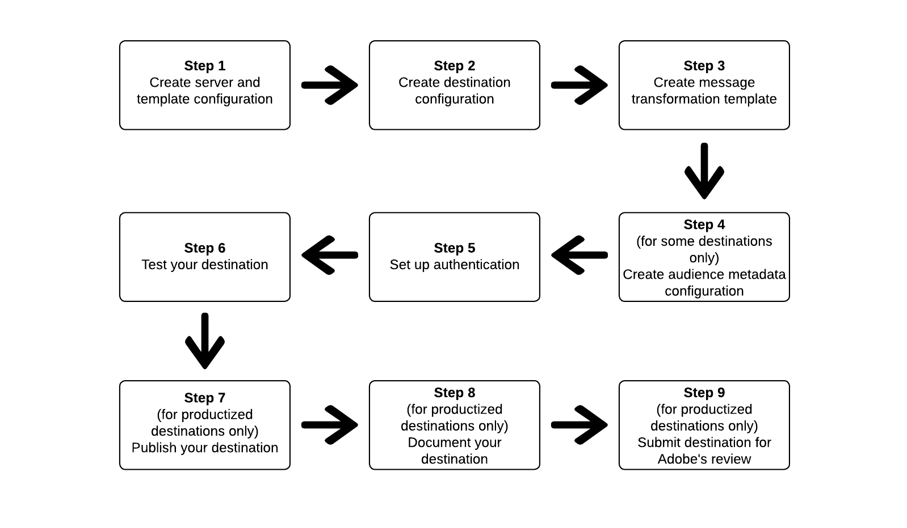

# Använd Destination SDK för att konfigurera ett direktuppspelningsmål

## Översikt {#overview}

På den här sidan beskrivs hur du använder informationen i [Konfigurationsalternativen i Destinations SDK](../functionality/configuration-options.md) och i andra Destinationer SDK och API-referensdokument för att konfigurera ett [direktuppspelningsmål](../../destination-types.md#streaming-destinations). Stegen beskrivs i sekventiell ordning nedan.

## Förhandskrav {#prerequisites}

Innan du går vidare till stegen som visas nedan bör du läsa sidan [Komma igång för Destination SDK](../getting-started.md) för att få information om hur du får de autentiseringsuppgifter för Adobe I/O och andra krav som krävs för att arbeta med Destination SDK-API:er. Detta förutsätter att du har slutfört villkoren för partnerskap och behörighet och är redo att börja utveckla ditt mål.

## Steg för att använda konfigurationsalternativen i Destinationen SDK för att konfigurera destinationen {#steps}



## Steg 1: Skapa en server- och mallkonfiguration {#create-server-template-configuration}

Börja med att [skapa en server- och mallkonfiguration](../authoring-api/destination-server/create-destination-server.md) med slutpunkten `/destinations-server`.

Nedan visas ett exempel på en konfiguration. Observera att meddelandeomformningsmallen i parametern `requestBody.value` behandlas i steg 3, [Skapa omformningsmall](#create-transformation-template).

```shell
POST platform.adobe.io/data/core/activation/authoring/destination-servers
```

```json {line-numbers="true" highlight="14"}
{
   "name":"Moviestar destination server",
   "destinationServerType":"URL_BASED",
   "urlBasedDestination":{
      "url":{
         "templatingStrategy":"PEBBLE_V1",
         "value":"https://api.moviestar.com/data/{{customerData.region}}/items"
      }
   },
   "httpTemplate":{
      "httpMethod":"POST",
      "requestBody":{
         "templatingStrategy":"PEBBLE_V1",
         "value":"insert after you create a template in step 3"
      },
      "contentType":"application/json"
   }
}
```

## Steg 2: Skapa målkonfiguration {#create-destination-configuration}

Nedan visas ett exempel på en konfiguration för en målmall som skapats med API-slutpunkten `/destinations`. Mer information finns i [Skapa en målkonfiguration](../authoring-api/destination-configuration/create-destination-configuration.md).

Om du vill ansluta server- och mallkonfigurationen i steg 1 till den här målkonfigurationen lägger du till instans-ID:t för servern och mallkonfigurationen som `destinationServerId` här.

>[!IMPORTANT]
>
>Om du vill skapa ett korrekt konfigurerat mål för realtid (direktuppspelning) *måste* lägga till minst en målidentitet i `identityNamespaces`, vilket visas nedan. Om ingen målidentitet har konfigurerats kan användarna inte fortsätta förbi [mappningssteget](../../ui/activate-segment-streaming-destinations.md#mapping) i aktiveringsarbetsflödet.

```shell
POST platform.adobe.io/data/core/activation/authoring/destinations
```

```json {line-numbers="true" highlight="74"}
{
   "name":"Moviestar",
   "description":"Moviestar is a fictional destination, used for this example.",
   "status":"TEST",
   "customerAuthenticationConfigurations":[
      {
         "authType":"BEARER"
      }
   ],
   "customerDataFields":[
      {
         "name":"endpointsInstance",
         "type":"string",
         "title":"Select Endpoint",
         "description":"Moviestar manages several instances across the globe for REST endpoints that our customers are provisioned for. Select your endpoint in the dropdown list.",
         "isRequired":true,
         "enum":[
            "US",
            "EU",
            "APAC",
            "NZ"
         ]
      },
      {
         "name":"customerID",
         "type":"string",
         "title":"Moviestar Customer ID",
         "description":"Your customer ID in the Moviestar destination (e.g. abcdef).",
         "isRequired":true,
         "pattern":""
      }
   ],
   "uiAttributes":{
      "documentationLink":"http://www.adobe.com/go/destinations-moviestar-en",
      "category":"mobile",
      "connectionType":"Server-to-server",
      "frequency":"Streaming"
   },
   "identityNamespaces":{
      "external_id":{
         "acceptsAttributes":true,
         "acceptsCustomNamespaces":true
      },
      "another_id":{
         "acceptsAttributes":true,
         "acceptsCustomNamespaces":true
      }
   },
   "audienceMetadataConfig":{
      "mapExperiencePlatformSegmentName":false,
      "mapExperiencePlatformSegmentId":false,
      "mapUserInput":false,
      "audienceTemplateId":"cbf90a70-96b4-437b-86be-522fbdaabe9c"
   },   
   "aggregation":{
      "aggregationType":"CONFIGURABLE_AGGREGATION",
      "configurableAggregation":{
         "aggregationPolicyId":null,
         "aggregationKey":{
            "includeSegmentId":true,
            "includeSegmentStatus":true,
            "includeIdentity":true,
            "oneIdentityPerGroup":true,
            "groups":null
         },
         "splitUserById":true,
         "maxBatchAgeInSecs":2400,
         "maxNumEventsInBatch":5000
      }
   },
   "destinationDelivery":[
      {
         "authenticationRule":"CUSTOMER_AUTHENTICATION",
         "destinationServerId":"9c77000a-4559-40ae-9119-a04324a3ecd4"
      }
   ]
}
```

## Steg 3: Skapa mall för meddelandeomvandling - använd mallspråk för att ange meddelandets utdataformat {#create-transformation-template}

Beroende på vilka nyttolaster målet har stöd för måste du skapa en mall som omformar formatet för exporterade data från Adobe XDM-formatet till ett format som stöds av målet. Se mallexempel i avsnittet [Använda ett mallspråk för omvandlingar av identitet, attribut och målgruppsmedlemskap](../functionality/destination-server/message-format.md#using-templating) och använd [mallutvecklingsverktyget](../testing-api/streaming-destinations/create-template.md) från Adobe.

När du har skapat en meddelandeomformningsmall som fungerar för dig lägger du till den i server- och mallkonfigurationen som du skapade i steg 1.

```json {line-numbers="true" highlight="13-14"}
{
   "name":"Moviestar destination server",
   "destinationServerType":"URL_BASED",
   "urlBasedDestination":{
      "url":{
         "templatingStrategy":"PEBBLE_V1",
         "value":"https://api.moviestar.com/data/{{customerData.region}}/items"
      }
   },
   "httpTemplate":{
      "requestBody":{
         "templatingStrategy":"PEBBLE_V1",
         "value":"{\n    \"users\": [\n        \n            {{profile|raw}},\n        \n    ]\n}"
      },
      "contentType":"application/json"
   }
}
```

## Steg 4: Skapa konfiguration av målgruppsmetadata {#create-audience-metadata-configuration}

För vissa destinationer kräver Destinationen SDK att du konfigurerar en målgruppsmetadatakonfiguration för att skapa, uppdatera eller ta bort målgrupper i målgruppen. Mer information om när du behöver konfigurera konfigurationen och hur du gör den finns i [Hantering av målgruppsmetadata](../functionality/audience-metadata-management.md).

Om du använder en konfiguration för målgruppsmetadata måste du ansluta den till målkonfigurationen som du skapade i steg 2. Lägg till instans-ID för målgruppens metadatakonfiguration i målkonfigurationen som `audienceTemplateId`.

```json {line-numbers="true" highlight="53"}
{
   "name":"Moviestar",
   "description":"Moviestar is a fictional destination, used for this example.",
   "status":"TEST",
   "customerAuthenticationConfigurations":[
      {
         "authType":"BEARER"
      }
   ],
   "customerDataFields":[
      {
         "name":"endpointsInstance",
         "type":"string",
         "title":"Select Endpoint",
         "description":"Moviestar manages several instances across the globe for REST endpoints that our customers are provisioned for. Select your endpoint in the dropdown list.",
         "isRequired":true,
         "enum":[
            "US",
            "EU",
            "APAC",
            "NZ"
         ]
      },
      {
         "name":"customerID",
         "type":"string",
         "title":"Moviestar Customer ID",
         "description":"Your customer ID in the Moviestar destination (e.g. abcdef).",
         "isRequired":true,
         "pattern":""
      }
   ],
   "uiAttributes":{
      "documentationLink":"http://www.adobe.com/go/destinations-moviestar-en",
      "category":"mobile",
      "connectionType":"Server-to-server",
      "frequency":"Streaming"
   },
   "identityNamespaces":{
      "external_id":{
         "acceptsAttributes":true,
         "acceptsCustomNamespaces":true
      },
      "another_id":{
         "acceptsAttributes":true,
         "acceptsCustomNamespaces":true
      }
   },
   "audienceMetadataConfig":{
      "mapExperiencePlatformSegmentName":false,
      "mapExperiencePlatformSegmentId":false,
      "mapUserInput":false,
      "audienceTemplateId":"cbf90a70-96b4-437b-86be-522fbdaabe9c"
   },   
   "aggregation":{
      "aggregationType":"CONFIGURABLE_AGGREGATION",
      "configurableAggregation":{
         "aggregationPolicyId":null,
         "aggregationKey":{
            "includeSegmentId":true,
            "includeSegmentStatus":true,
            "includeIdentity":true,
            "oneIdentityPerGroup":true,
            "groups":null
         },
         "splitUserById":true,
         "maxBatchAgeInSecs":2400,
         "maxNumEventsInBatch":5000
      }
   },
   "destinationDelivery":[
      {
         "authenticationRule":"CUSTOMER_AUTHENTICATION",
         "destinationServerId":"9c77000a-4559-40ae-9119-a04324a3ecd4"
      }
   ]
}
```


## Steg 5: Konfigurera autentisering {#set-up-authentication}

Beroende på om du anger `"authenticationRule": "CUSTOMER_AUTHENTICATION"` eller `"authenticationRule": "PLATFORM_AUTHENTICATION"` i målkonfigurationen ovan, kan du konfigurera autentisering för ditt mål med hjälp av `/destination` eller `/credentials`-slutpunkten.

>[!NOTE]
>
>`CUSTOMER_AUTHENTICATION` är det vanligaste av de två autentiseringsreglerna och det är det som ska användas om du kräver att användarna tillhandahåller någon form av autentisering till ditt mål innan de kan konfigurera en anslutning och exportera data.

Läs [OAuth 2-autentisering](../functionality/destination-configuration/oauth2-authorization.md) om du valde `"authenticationRule": "CUSTOMER_AUTHENTICATION"` i målkonfigurationen och målet stöder autentiseringsmetoden OAuth 2.

Om du valde `"authenticationRule": "PLATFORM_AUTHENTICATION"` måste du skapa en [autentiseringskonfiguration](../credentials-api/create-credential-configuration.md).

## Steg 6: Testa destinationen {#test-destination}

När du har konfigurerat ditt mål med hjälp av konfigurationsslutpunkterna i föregående steg kan du använda [måltestningsverktyget](../testing-api/streaming-destinations/streaming-destination-testing-overview.md) för att testa integrationen mellan Adobe Experience Platform och ditt mål.

Som en del av processen för att testa destinationen måste du använda användargränssnittet i Experience Platform för att skapa segment, som du aktiverar för destinationen. Se de två resurserna nedan för instruktioner om hur du skapar målgrupper i Experience Platform:

* [Skapa en publikdokumentationssida](/help/segmentation/ui/audience-portal.md#create-audience)
* [Skapa en genomgång av en målgruppsvideo](https://experienceleague.adobe.com/docs/platform-learn/tutorials/segments/create-segments.html)

## Steg 7: Publish ditt mål {#publish-destination}

>[!NOTE]
>
>Det här steget är inte nödvändigt om du skapar ett privat mål för eget bruk och inte vill publicera det i målkatalogen för andra kunder.

När du har konfigurerat och testat målet kan du använda [API:t för målpublicering](../publishing-api/create-publishing-request.md) för att skicka konfigurationen till Adobe för granskning.

## Steg 8: Dokumentera destinationen {#document-destination}

>[!NOTE]
>
>Det här steget är inte nödvändigt om du skapar ett privat mål för eget bruk och inte vill publicera det i målkatalogen för andra kunder.

Om du är en oberoende programvaruleverantör (ISV) eller systemintegratör (SI) som skapar en [tillverkad integrering](../overview.md#productized-custom-integrations) använder du [självbetjäningsdokumentationsprocessen](../docs-framework/documentation-instructions.md) för att skapa en produktdokumentationssida för destinationen i [Experience Platform-målkatalogen](/help/destinations/catalog/overview.md).

## Steg 9: Skicka mål för Adobe granskning {#submit-for-review}

>[!NOTE]
>
>Det här steget är inte nödvändigt om du skapar ett privat mål för eget bruk och inte vill publicera det i målkatalogen för andra kunder.

Innan destinationen kan publiceras i Experience Platform-katalogen och vara synlig för alla Experience Platform-kunder måste du skicka in destinationen för Adobe granskning officiellt. Hitta fullständig information om hur du [skickar för granskning av ett produkterat mål som har skapats i Destinationen SDK ](../guides/submit-destination.md).
