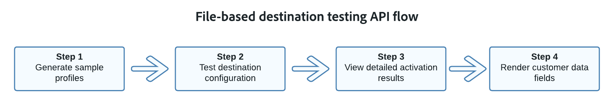

# Översikt över API för filbaserad destinationstestning

Det filbaserade API:t för måltestning är en uppsättning slutpunkter som du kan använda för att validera konfigurationen av de filbaserade mål som skapats genom Destinationen SDK.

Vi rekommenderar att du använder de här verktygen för att validera konfigurationen innan [du skickar](../../guides/submit-destination.md) ditt mål för granskning till Adobe.

För bästa testresultat rekommenderar vi att du använder denna API baserat på flödesdiagrammet nedan.

I avsnitten nedan finns en kort översikt över vad varje slutpunkt kan göra.

## Generera exempelprofiler {#generate-sample-profiles}

Använd API-slutpunkten `/sample-profiles` för att generera exempelprofiler baserat på ditt befintliga källschema.

Exempelprofiler kan hjälpa dig att förstå JSON-strukturen för en profil. Dessutom får du ett standardvärde som du kan anpassa med dina egna profildata för ytterligare destinationstestning.

Läs den [dedikerade dokumentationen](file-based-sample-profile-generation-api.md) om du vill veta mer om hur du genererar exempelprofiler.

## Testa målkonfiguration {#test-destination-configuration}

Använd API-slutpunkten `/testing/destinationInstance` för att testa om ditt filbaserade mål är korrekt konfigurerat och för att verifiera dataflödenas integritet till det konfigurerade målet.

Du kan göra förfrågningar till testslutpunkten med eller utan att lägga till [exempelprofiler](file-based-sample-profile-generation-api.md) i anropet. Om du inte skickar några profiler på begäran genererar API:t en exempelprofil automatiskt och lägger till den i begäran.

Läs den [dedikerade dokumentationen](file-based-destination-testing-api.md) om du vill lära dig hur du testar målkonfigurationen med exempelprofiler.

## Visa detaljerade aktiveringsresultat {#view-detailed-activation-results}

Använd API-slutpunkten `/testing/destinationInstance` om du vill visa fullständig information om filbaserade måltestningsresultat.

Denna API-slutpunkt returnerar samma resultat som du skulle få när du använde [Flow Service API](../../../api/update-destination-dataflows.md) för att övervaka dataflöden.

Läs den [dedikerade dokumentationen](file-based-destination-results-api.md) om du vill veta mer om hur du får detaljerade aktiveringsresultat.

## Återge kunddatafält {#render-customer-data-fields}

Använd API-slutpunkten `/authoring/testing/template/render` för att visualisera hur de mallsidiga [kunddatafälten](../../functionality/destination-configuration/customer-data-fields.md) som definieras i målkonfigurationen skulle se ut.

API-slutpunkten genererar slumpmässiga värden för kunddatafälten och returnerar dem i svaret. Detta hjälper dig att validera den semantiska strukturen i kunddatafält som t.ex. bucketnamn eller mappsökvägar.

Läs den [dedikerade dokumentationen](file-based-render-template-api.md) om du vill veta hur du genererar och visualiserar värden för dina kunddatafält.
