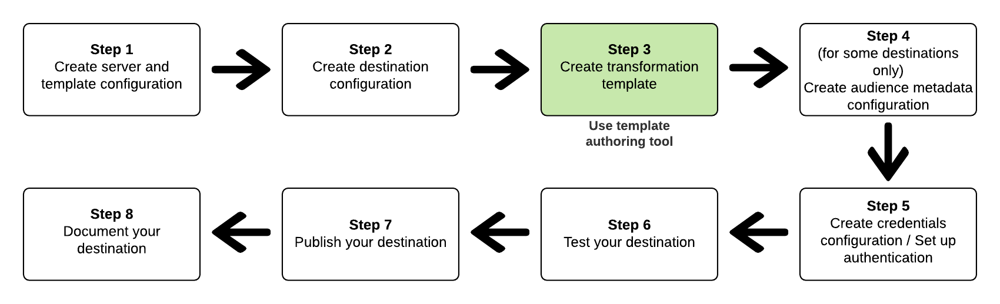

# Skapa och testa en meddelandeomformningsmall {#create-template}

## Översikt {#overview}

Som en del av Destination SDK har Adobe utvecklarverktyg som hjälper dig att konfigurera och testa destinationen. Den här sidan beskriver hur du skapar och testar en meddelandeomformningsmall. Mer information om hur du testar målet finns i [Testa målkonfigurationen](streaming-destination-testing-overview.md).

Om du vill **skapa och testa en meddelandeomformningsmall** mellan målschemat i [!DNL Adobe Experience Platform] och det meddelandeformat som stöds av ditt mål använder du *mallutvecklingsverktyget* som beskrivs nedan.  Läs mer om dataomvandlingen mellan käll- och målschemat i [meddelandeformatdokumentet](../../functionality/destination-server/message-format.md#using-templating).

Nedan visas hur du skapar och testar en meddelandetransformeringsmall passar in i [målkonfigurationsarbetsflödet](../../guides/configure-destination-instructions.md) i Destination SDK:



## Varför du måste skapa och testa en meddelandeomformningsmall {#why-create-message-transformation-template}

Ett av de första stegen i att skapa ditt mål i Destination SDK är att tänka på hur dataformatet för målgruppsmedlemskap, identiteter och profilattribut ändras när de exporteras från [!DNL Adobe Experience Platform] till ditt mål. Hitta information om omvandlingen mellan Adobe XDM-schemat och målschemat i [meddelandeformatdokumentet](../../functionality/destination-server/message-format.md#using-templating).

För att omvandlingen ska lyckas måste du skapa en omformningsmall som liknar det här exemplet: [Skapa en mall som skickar segment, identiteter och profilattribut](../../functionality/destination-server/message-format.md#segments-identities-attributes).

Adobe tillhandahåller ett mallverktyg för att skapa och testa meddelandemallen som transformerar data från Adobe XDM-formatet till det format som stöds av ditt mål. Verktyget har två API-slutpunkter som du kan använda:

* Använd *exempelmallens API* för att hämta en exempelmall.
* Använd *återgivningsmallens API* för att återge exempelmallen så att du kan jämföra resultatet med målets förväntade dataformat. När du har jämfört exporterade data med det dataformat som förväntas av målet kan du redigera mallen. På så sätt matchar de exporterade data som du genererar det dataformat som förväntas av målet.

## Steg som ska slutföras innan mallen skapas {#prerequisites}

Innan du är redo att skapa mallen måste du slutföra stegen nedan:

1. [Skapa en målserverkonfiguration](../../authoring-api/destination-server/create-destination-server.md). Mallen som du genererar skiljer sig åt, baserat på det värde som du anger för parametern `maxUsersPerRequest`.
   * Använd `maxUsersPerRequest=1` om du vill att ett API-anrop till ditt mål ska innehålla en enda profil, tillsammans med målgruppens kvalifikationer, identiteter och profilattribut.
   * Använd `maxUsersPerRequest` med ett större värde än ett om du vill att ett API-anrop till målet ska innehålla flera profiler, tillsammans med målgruppernas kvalifikationer, identiteter och profilattribut.
2. [Skapa en målkonfiguration](../../authoring-api/destination-configuration/create-destination-configuration.md) och lägg till ID:t för målserverkonfigurationen i `destinationDelivery.destinationServerId`.
3. [Hämta ID:t för målkonfigurationen](../../authoring-api/destination-configuration/retrieve-destination-configuration.md) som du nyss skapade, så att du kan använda det i mallskaparverktyget.
4. Förstå [vilka funktioner och filter du kan använda](../../functionality/destination-server/supported-functions.md) i meddelandeomformningsmallen.

## Använda exempelmallens API och återge mall-API för att skapa en mall för ditt mål {#iterative-process}

>[!TIP]
>
>Innan du skapar och redigerar din meddelandeomformningsmall kan du börja med att anropa [återgivningsmallens API-slutpunkt](../../testing-api/streaming-destinations/render-template-api.md#render-exported-data) med en enkel mall som exporterar dina Raw-profiler utan att tillämpa några omformningar. Syntaxen för den enkla mallen är: <br> `"template": "{{profile|raw}}}"`

Processen att hämta och testa mallen är iterativ. Upprepa stegen nedan tills de exporterade profilerna matchar målets förväntade dataformat.

1. [Hämta först en exempelmall](../../testing-api/streaming-destinations/create-template.md#sample-template-api).
2. Använd exempelmallen som utgångspunkt för att skapa ett eget utkast.
3. Anropa [återgivningsmallens API-slutpunkt](../../testing-api/streaming-destinations/create-template.md#render-template-api) med din egen mall. Adobe genererar exempelprofiler baserat på ditt schema och returnerar resultatet eller eventuella påträffade fel.
4. Jämför exporterade data med det dataformat som du förväntar dig av målet. Redigera mallen om det behövs.
5. Upprepa den här processen tills de exporterade profilerna matchar målets förväntade dataformat.

## Hämta en exempelmall med exempelmalls-API {#sample-template-api}

>[!NOTE]
>
>Fullständig API-referensdokumentation finns i [Hämta API-åtgärder för exempelmallar](../../testing-api/streaming-destinations/sample-template-api.md).

Lägg till ett mål-ID till anropet, så som visas nedan, så returnerar svaret ett mallexempel som motsvarar mål-ID:t.

```shell
curl --location --request GET 'https://platform.adobe.io/data/core/activation/authoring/testing/template/sample/5114d758-ce71-43ba-b53e-e2a91d67b67f' \
--header 'Content-Type: application/json' \
--header 'Accept: application/json' \
--header 'x-api-key: {API_KEY}' \
--header 'Authorization: Bearer {ACCESS_TOKEN}' \
--header 'x-gw-ims-org-id: {ORG_ID}' \
--header 'x-sandbox-name: {SANDBOX_NAME}' \
```

Om det mål-ID som du anger motsvarar en målkonfiguration med [bästa ansträngningsaggregering](../../functionality/destination-configuration/aggregation-policy.md#best-effort-aggregation) och `maxUsersPerRequest=1` i aggregeringsprincipen returnerar begäran en exempelmall som liknar den här:

```python
{#- THIS is an example template for a single profile -#}
{#- A '-' at the beginning or end of a tag removes all whitespace on that side of the tag. -#}
{
    "identities": [
    
    
        
        {
            "type": "{{ namespace }}",
            "id": "{{ identity.id }}"
        },
        ,
    
    ],
    "AdobeExperiencePlatformSegments": {
        "add": [
        
            "{{ segment.key }}",
        
        ],
        "remove": [
        {#- Alternative syntax for filtering audiences by status: -#}
        
            "{{ segment.key }}",
        
        ]
    }
}
```

Om det mål-ID som du anger motsvarar en målservermall med [konfigurerbar aggregering](../../functionality/destination-configuration/aggregation-policy.md#configurable-aggregation) eller [bästa ansträngningsaggregering](../../functionality/destination-configuration/aggregation-policy.md#best-effort-aggregation) med `maxUsersPerRequest` större än en, returnerar begäran en exempelmall som liknar denna:

```python
{#- THIS is an example template for multiple profiles -#}
{#- A '-' at the beginning or end of a tag removes all whitespace on that side of the tag. -#}
{
    "profiles": [
    
        {
            "identities": [
            
            
                
                {
                    "type": "{{ namespace }}",
                    "id": "{{ identity.id }}"
                },
                ,
            
            ],
            "AdobeExperiencePlatformSegments": {
                "add": [
                
                    "{{ segment.key }}",
                
                ],
                "remove": [
                {#- Alternative syntax for filtering audiences by status: -#}
                
                    "{{ segment.key }}",
                
                ]
            }
        },
    
    ]
}
```

## Tecken-undgå din mall {#character-escape-template}

Innan du använder mallen för att återge profiler som matchar målets förväntade format, måste du undvika mallen som i skärminspelningen nedan.


Du kan använda ett onlineverktyg för teckenigenkänning. I demonstrationen ovan används [JSON Escape-formateraren](https://jsonformatter.org/json-escape).

## Återge mall-API {#render-template-api}

När du har skapat en meddelandeomformningsmall med [exempelmallens API](create-template.md#sample-template-api) kan du [återge mallen](render-template-api.md) och generera exporterade data baserat på den. Använd detta för att verifiera om de profiler som [!DNL Adobe Experience Platform] skulle exportera till ditt mål matchar målets förväntade format.

Se API-referensen för exempel på anrop som du kan göra:

* [Återge en mall utan profiler som skickats i brödtexten](render-template-api.md#best-effort)
* [Återge en mall med profiler som skickats i brödtexten](render-template-api.md#configurable-aggregation)

Redigera mallen och anropa återgivningsmallens API-slutpunkt tills de exporterade profilerna matchar målets förväntade dataformat.

## Lägg till mallen för escape-konverteringar i målserverkonfigurationen {#add-template-to-server-config}

När du är nöjd med mallen för meddelandetransformering lägger du till den i [målserverkonfigurationen](../../authoring-api/destination-server/create-destination-server.md) i `httpTemplate.requestBody.value`.
