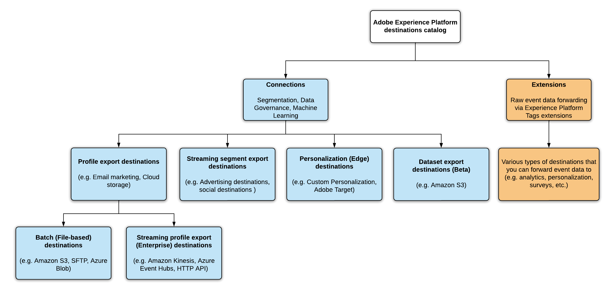

# Måltyper och -kategorier

Läs den här sidan om du vill veta mer om de olika typerna och kategorierna av Adobe Experience Platform-mål.

## Måltyper

I Adobe Experience Platform skiljer vi mellan två måltyper - anslutningar och tillägg. Det finns två typer av anslutningsmål: Profilexportmål och Segmentexportmål.

## Anslutningar {#connections}

**[!UICONTROL Profile Export]** och  **[!UICONTROL Segment Export]** destinationer i Adobe Experience Platform samlar in händelsedata, kombinerar dem med andra datakällor för att skapa kundprofilen [ i ](../profile/home.md)realtid, tillämpa segmentering samt exportera segment och kvalificerade profiler till destinationer.

## Profilexportdestinationer

Profilexportdestinationer genererar en fil som innehåller profiler och/eller attribut. Dessa mål använder rådata, ofta med e-postadress som primärnyckel. [Amazon S3-molnlagringsmålet](./catalog/cloud-storage/amazon-s3.md) är ett exempel på destinationen där du kan sätta in filer som innehåller profilexporter.

## Segmentexportdestinationer

Destinationer för segmentexport skickar profilerna och de segment de är kvalificerade för till målplattformarna. Dessa mål använder segment-ID eller användar-ID. Annonsmål som [[!DNL Google Display & Video 360]](./catalog/advertising/google-dv360.md) eller [[!DNL Google Ads]](./catalog/advertising/google-ads-destination.md) är exempel på dessa typer av destinationer.

## Destinationer för profilexport och segmentexport - videoöversikt

I videon nedan beskrivs de två typerna av destinationer:

>[!VIDEO](https://video.tv.adobe.com/v/29707?quality=12)

## Tillägg {#extensions}

Plattformen utnyttjar tagghanteringens kraft och flexibilitet, vilket gör att du kan konfigurera taggtillägg i användargränssnittet för datainsamling.

>[!TIP]
>
>Detaljerad information om taggtillägg, inklusive användningsexempel och hur du hittar dem i gränssnittet, finns i [översikten över taggtillägg](./catalog/launch-extensions/overview.md).

Med taggtillägg vidarebefordras råa händelsedata till flera typer av mål. Tänk på tillägg som en **typ av händelsespårning**-typ av mål. Detta är en enklare typ av integrering med målplattformar, som bara vidarebefordrar råhändelsedata. Exempel på sådana är [tillägget för Gainsight-anpassning](./catalog/personalization/gainsight.md) eller [Bekräfta röst för kundtillägget](./catalog/voice/confirmit-digital-feedback.md).

## När anslutningar och tillägg ska användas

Som marknadsförare kan du använda en kombination av anslutningar och tillägg för att hantera dina användningsfall.

Anslutningar är användbara när det är nödvändigt att utnyttja en fullständig centraliserad kundprofil eller ett kundsegment för aktivering. Använd till exempel anslutningar om du kopplar beteendedata från ett analyssystem med överförda CRM-data för att kvalificera en användare för ett visst segment innan du levererar ett anpassat meddelande till användaren.

Tillägg är användbara när händelsedata används för att utlösa en åtgärd eller för att utföra segmentering i en extern miljö. Om beteendedata till exempel behöver vidarebefordras till ett externt system utan att kopplas till andra datakällor i filen för en viss användare.

## Målkategorier

Anslutningarna och tilläggen i [målkatalogen](https://platform.adobe.com/destination/catalog) grupperas efter målkategori (**Advertising**, **Cloud storage**, **Survey platforms**, **Email marketing**, osv.), beroende på vilken marknadsföringsåtgärd de hjälper dig att utföra. Mer information om var och en av kategorierna, samt vilka mål som ingår i varje kategori, finns i dokumentationen till [målkatalogen](./catalog/overview.md).

