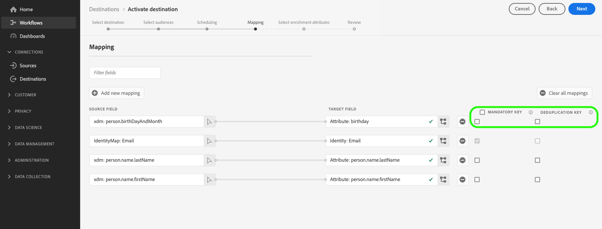

# Aktivera målgrupper för att batchprofilera exportmål

>[!IMPORTANT]
> 
> * Så här aktiverar du målgrupper och aktiverar [mappningssteg](#mapping) i arbetsflödet behöver du **[!UICONTROL Manage Destinations]**, **[!UICONTROL Activate Destinations]**, **[!UICONTROL View Profiles]** och **[!UICONTROL View Segments]** [behörigheter för åtkomstkontroll](/help/access-control/home.md#permissions).
> * Så här aktiverar du målgrupper utan att gå igenom [mappningssteg](#mapping) i arbetsflödet behöver du **[!UICONTROL Manage Destinations]**, **[!UICONTROL Activate Segment without Mapping]**, **[!UICONTROL View Profiles]** och **[!UICONTROL View Segments]** [behörigheter för åtkomstkontroll](/help/access-control/home.md#permissions).
>* Exportera *identiteter* behöver du **[!UICONTROL View Identity Graph]** [behörighet för åtkomstkontroll](/help/access-control/home.md#permissions). <br> {width="100" zoomable="yes"}
> 
> Läs [åtkomstkontroll - översikt](/help/access-control/ui/overview.md) eller kontakta produktadministratören för att få de behörigheter som krävs.

## Översikt {#overview}

I den här artikeln förklaras det arbetsflöde som krävs för att aktivera målgrupper i Adobe Experience Platform batchprofilbaserade destinationer, som molnlagring och e-postmarknadsföring.

## Förutsättningar {#prerequisites}

Om du vill aktivera målgrupper till mål måste du ha lyckats [ansluten till ett mål](./connect-destination.md). Om du inte redan har gjort det går du till [målkatalog](../catalog/overview.md), bläddra bland de mål som stöds och konfigurera det mål som du vill använda.

### Filformat som stöds för export {#supported-file-formats-export}

Följande filformat stöds vid export av målgrupper:

* CSV
* JSON
* Parquet

Observera att när du exporterar CSV-filer får du större flexibilitet när det gäller hur du vill strukturera de exporterade filerna. Läs mer om [filformatskonfiguration för CSV-filer](/help/destinations/ui/batch-destinations-file-formatting-options.md#file-configuration).

Välj önskat filformat för export när [skapa en anslutning till det filbaserade målet](/help/destinations/ui/connect-destination.md).

## Välj mål {#select-destination}

1. Gå till **[!UICONTROL Connections > Destinations]** och väljer **[!UICONTROL Catalog]** -fliken.

   

1. Välj **[!UICONTROL Activate audiences]** på kortet som motsvarar destinationen där du vill aktivera målgrupperna, vilket visas i bilden nedan.

   

1. Välj den målanslutning som du vill använda för att aktivera dina målgrupper och välj sedan **[!UICONTROL Next]**.

   

1. Gå till nästa avsnitt till [välj era målgrupper](#select-audiences).

## Välj målgrupper {#select-audiences}

Om du vill välja vilka målgrupper du vill aktivera för målet använder du kryssrutorna till vänster om målgruppsnamnen och väljer sedan **[!UICONTROL Next]**.

Du kan välja mellan flera typer av målgrupper, beroende på deras ursprung:

* **[!UICONTROL Segmentation Service]**: Målgrupper som genererats i Experience Platform av segmenteringstjänsten. Se [segmenteringsdokumentation](../../segmentation/ui/overview.md) för mer information.
* **[!UICONTROL Custom upload]**: Publiker som genererats utanför Experience Platform och överförts till Platform som CSV-filer. Mer information om externa målgrupper finns i dokumentationen om [importera en publik](../../segmentation/ui/overview.md#import-audience).
* Andra typer av målgrupper som härrör från andra Adobe-lösningar, t.ex. [!DNL Audience Manager].


>[!TIP]
>
>Välja målgrupper som kommer från **[!UICONTROL Custom uploads]** aktiverar automatiskt [Välj anrikningsattribut](#select-enrichment-attributes) steg.

## Schemalägg målgruppsexport {#scheduling}

>[!CONTEXTUALHELP]
>id="platform_destinations_activate_schedule"
>title="Schema"
>abstract="Använd pennikonen för att ange filexportformat (fullständiga eller stegvisa filer) och exportfrekvens."

[!DNL Adobe Experience Platform] exporterar data för e-postmarknadsföring och molnlagringsdestinationer i form av [!DNL CSV] filer. I **[!UICONTROL Scheduling]** kan du konfigurera schemat och filnamnen för varje publik som du exporterar. Det är obligatoriskt att konfigurera schemat, men det är valfritt att konfigurera filnamnet.

>[!IMPORTANT]
>
>[!DNL Adobe Experience Platform] delar automatiskt upp exportfilerna i 5 miljoner poster (rader) per fil. Varje rad representerar en profil.
>
>Delade filnamn läggs till med en siffra som anger att filen är en del av en större export: `filename.csv`, `filename_2.csv`, `filename_3.csv`.

Välj **[!UICONTROL Create schedule]** som motsvarar målgruppen som du vill skicka till målet.


### Exportera fullständiga filer {#export-full-files}

>[!CONTEXTUALHELP]
>id="platform_destinations_activate_exportoptions"
>title="Alternativ för filexport"
>abstract="Välj **Exportera fullständiga filer** om du vill exportera en fullständig ögonblicksbild av alla profiler som är tillgängliga för målgruppen. Välj **Exportera inkrementella filer** om du bara vill exportera de profiler som har anpassats till målgruppen sedan den senaste exporten. <br> Den första stegvisa filexporten innehåller alla profiler som kvalificerar sig för målgruppen och fungerar som en bakgrundsfyllning. Framtida inkrementella filer innehåller endast de profiler som är kvalificerade för målgruppen sedan den första inkrementella filexporten."
>additional-url="https://experienceleague.adobe.com/docs/experience-platform/destinations/ui/activate/activate-batch-profile-destinations.html#export-incremental-files" text="Exportera inkrementella filer"

>[!CONTEXTUALHELP]
>id="platform_destinations_activationchaining_aftersegmentevaluation"
>title="Aktivera efter målgruppsutvärdering"
>abstract="Aktiveringen körs omedelbart efter det dagliga segmenteringsjobbet. Detta garanterar att de senaste profilerna exporteras."

>[!CONTEXTUALHELP]
>id="platform_destinations_activationchaining_scheduled"
>title="Schemalagd aktivering"
>abstract="Aktiveringen körs vid en fast tidpunkt på dagen."

Välj **[!UICONTROL Export full files]** för att utlösa export av en fil som innehåller en fullständig ögonblicksbild av alla profilkvalifikationer för den valda publiken.


1. Använd **[!UICONTROL Frequency]** för att välja exportfrekvens:

   * **[!UICONTROL Once]**: schemalägg en enda gång vid behov av fullständig filexport.
   * **[!UICONTROL Daily]**: schemalägg fullständig filexport en gång om dagen, varje dag, vid den tidpunkt du anger.

1. Använd **[!UICONTROL Time]** för att välja om exporten ska ske omedelbart efter målgruppsutvärderingen eller enligt schema, vid en viss tidpunkt. När du väljer **[!UICONTROL Scheduled]** kan du använda väljaren för att välja tid på dygnet, i [!DNL UTC] format, när exporten ska ske.

   >[!NOTE]
   >
   >The **[!UICONTROL After segment evaluation]** det alternativ som beskrivs nedan är endast tillgängligt för utvalda Beta-kunder.

   Använd **[!UICONTROL After segment evaluation]** Möjlighet att låta aktiveringsjobbet köras omedelbart efter det dagliga batchsegmenteringsjobbet för plattformen. Med det här alternativet exporteras de senaste profilerna till målet när aktiveringsjobbet körs.

   <!-- Batch segmentation currently runs at {{insert time of day}} and lasts for an average {{x hours}}. Adobe reserves the right to modify this schedule. -->

   
Använd **[!UICONTROL Scheduled]** möjlighet att köra aktiveringsjobbet på en fast tidpunkt. Med det här alternativet exporteras Experience Platform-profildata vid samma tidpunkt varje dag. De profiler du exporterar kanske inte är de mest aktuella, beroende på om gruppsegmenteringsjobbet har slutförts innan aktiveringsjobbet startar.

   

1. Använd **[!UICONTROL Date]** för att välja dag eller intervall när exporten ska ske. För daglig export är det bästa sättet att ställa in start- och slutdatum så att de motsvarar kampanjernas längd i era nedströmsplattformar.

   >[!IMPORTANT]
   >
   > När du väljer ett exportintervall inkluderas inte den sista dagen i intervallet i exporten. Om du till exempel väljer intervallet 4-11 januari kommer den sista filexporten att äga rum 10 januari.

1. Välj **[!UICONTROL Create]** för att spara schemat.

### Exportera inkrementella filer {#export-incremental-files}

Välj **[!UICONTROL Export incremental files]** för att starta en export där den första filen är en fullständig ögonblicksbild av alla profilkvalifikationer för den valda målgruppen, och efterföljande filer är stegvisa profilkvalifikationer sedan den föregående exporten.

>[!IMPORTANT]
>
>Den första exporterade inkrementella filen innehåller alla profiler som kvalificerar sig för en målgrupp och fungerar som en bakgrundsfyllning.


1. Använd **[!UICONTROL Frequency]** för att välja exportfrekvens:

   * **[!UICONTROL Daily]**: schemalägg inkrementell filexport en gång om dagen, varje dag, vid den tidpunkt du anger.
   * **[!UICONTROL Hourly]**: schemalägg stegvis filexport var 3, 6, 8 eller 12:e timme.

1. Använd **[!UICONTROL Time]** väljaren för att välja tid på dygnet, i [!DNL UTC] format, när exporten ska ske.

1. Använd **[!UICONTROL Date]** för att välja intervallet när exporten ska ske. Det bästa sättet är att ställa in start- och slutdatumet så att det passar kampanjernas längd på era nedströmsplattformar.

   >[!IMPORTANT]
   >
   >Den sista dagen i intervallet inkluderas inte i exporten. Om du till exempel väljer intervallet 4-11 januari kommer den sista filexporten att äga rum 10 januari.

1. Välj **[!UICONTROL Create]** för att spara schemat.

### Konfigurera filnamn {#file-names}

>[!CONTEXTUALHELP]
>id="platform_destinations_activate_filename"
>title="Konfigurera filnamn"
>abstract="För filbaserade mål genereras ett unikt filnamn per målgrupp. Använd filnamnsredigeraren för att skapa och redigera ett unikt filnamn eller behåll standardnamnet."

För de flesta mål består standardfilnamnen av målnamn, målgrupps-ID och en datum- och tidsindikator. Du kan till exempel redigera de exporterade filnamnen för att skilja mellan olika kampanjer eller för att lägga till tiden för dataexport till filerna. Observera att vissa målutvecklare kan välja att visa olika alternativ för standardfilnamnstillägg för sina mål.

Om du vill öppna ett modalt fönster och redigera filnamnen väljer du pennikonen . Filnamn får innehålla högst 255 tecken.

>[!NOTE]
>
>Bilden nedan visar hur filnamn kan redigeras för [!DNL Amazon S3] mål men processen är identisk för alla batchdestinationer (till exempel SFTP, [!DNL Azure Blob Storage], eller [!DNL Google Cloud Storage]).


I filnamnsredigeraren kan du välja olika komponenter att lägga till i filnamnet.


Målnamnet och målgrupps-ID:t kan inte tas bort från filnamn. Förutom dessa alternativ kan du lägga till följande alternativ:

| Filnamnsalternativ | Beskrivning |
|---------|----------|
| **[!UICONTROL Audience name]** | Namnet på den exporterade publiken. |
| **[!UICONTROL Date and time]** | Välj mellan att lägga till en `MMDDYYYY_HHMMSS` eller en UNIX 10-siffrig tidsstämpel som anger när filerna genereras. Välj ett av dessa alternativ om du vill att ett dynamiskt filnamn ska skapas för varje stegvis export. |
| **[!UICONTROL Custom text]** | All egen text som du vill lägga till i filnamnen. |
| **[!UICONTROL Destination ID]** | ID:t för måldataflödet som du använder för att exportera målgruppen. |
| **[!UICONTROL Destination name]** | Namnet på måldataflödet som du använder för att exportera målgruppen. |
| **[!UICONTROL Organization name]** | Organisationens namn i Experience Platform. |
| **[!UICONTROL Sandbox name]** | ID:t för sandlådan som du använder för att exportera målgruppen. |

{style="table-layout:auto"}

Välj **[!UICONTROL Apply changes]** för att bekräfta ditt val.

>[!IMPORTANT]
> 
>Om du inte markerar **[!UICONTROL Date and Time]** -komponenten kommer filnamnen att vara statiska och den nya exporterade filen kommer att skriva över den tidigare filen på lagringsplatsen vid varje export. När du kör ett återkommande importjobb från en lagringsplats till en e-postmarknadsföringsplattform rekommenderas detta.

När du är klar med konfigurationen av alla målgrupper väljer du **[!UICONTROL Next]** för att fortsätta.

## Mappning {#mapping}

I det här steget måste du välja de profilattribut som du vill lägga till i filerna som exporteras till målmålet. Så här väljer du profilattribut och identiteter för export:

1. I **[!UICONTROL Mapping]** sida, markera **[!UICONTROL Add new field]**.

   

1. Markera pilen till höger om **[!UICONTROL Source field]** post.

   

1. I **[!UICONTROL Select source field]** väljer du de profilattribut och identiteter som du vill inkludera i de exporterade filerna till målet och väljer sedan **[!UICONTROL Select]**.

   >[!TIP]
   > 
   >Du kan använda sökfältet för att begränsa urvalet, vilket visas i bilden nedan.

   


1. Fältet som du valde för export visas nu i mappningsvyn. Om du vill kan du redigera namnet på rubriken i den exporterade filen. Det gör du genom att markera ikonen i målfältet.

   

1. I **[!UICONTROL Select target field]** skriver du in sidhuvudet i den exporterade filen och väljer **[!UICONTROL Select]**.

   

1. Fältet som du har valt för export visas nu i mappningsvyn och det redigerade huvudet i den exporterade filen visas.

   

1. (Valfritt) Du kan välja att det exporterade fältet ska vara en [obligatorisk nyckel](#mandatory-keys) eller en [dedupliceringsnyckel](#deduplication-keys).

   

1. Om du vill lägga till fler fält för export upprepar du stegen ovan.

### Obligatoriska attribut {#mandatory-attributes}

>[!CONTEXTUALHELP]
>id="platform_destinations_activate_mandatorykey"
>title="Om obligatoriska attribut"
>abstract="Välj de XDM-schemaattribut som alla exporterade profiler ska inkludera. Profiler utan den obligatoriska nyckeln exporteras inte till målet. Om du inte markerar en obligatorisk nyckel exporteras alla kvalificerade profiler oavsett deras attribut."

Ett obligatoriskt attribut är en användaraktiverad kryssruta som ser till att alla profilposter innehåller det valda attributet. Till exempel innehåller alla exporterade profiler en e-postadress. &#x200B;

Du kan markera attribut som obligatoriska för att se till att [!DNL Platform] exporterar bara de profiler som innehåller det specifika attributet. Det innebär att den kan användas som en extra form av filtrering. Markera ett attribut som obligatoriskt är **not** krävs.

Om du inte väljer ett obligatoriskt attribut exporteras alla kvalificerade profiler oavsett deras attribut.

Vi rekommenderar att ett av attributen [unik identifierare](../../destinations/catalog/email-marketing/overview.md#identity) från ditt schema. Mer information om obligatoriska attribut finns i avsnittet om identitet i [E-postmarknadsföringsmål](../../destinations/catalog/email-marketing/overview.md#identity) dokumentation.

### Dedupliceringsnycklar {#deduplication-keys}

>[!CONTEXTUALHELP]
>id="platform_destinations_activate_deduplicationkey"
>title="Om dedupliceringsnycklar"
>abstract="Eliminera flera poster med samma profil i exportfilerna genom att välja en dedupliceringsnyckel. Välj ett namnutrymme eller upp till två XDM-schemaattribut som en dedupliceringsnyckel. Om du inte väljer en dedupliceringsnyckel kan det leda till dubblettprofilposter i exportfilerna."

En dedupliceringsnyckel är en användardefinierad primärnyckel som avgör identiteten som användarna vill att deras profiler ska dedupliceras med. &#x200B;

Avdupliceringsnycklar eliminerar möjligheten att ha flera poster med samma profil i en exportfil.

Det finns tre sätt att använda dedupliceringstangenter på [!DNL Platform]:

* Använda ett enskilt ID-namnutrymme som [!UICONTROL deduplication key]
* Använda ett profilattribut från ett [!DNL XDM] profil som [!UICONTROL deduplication key]
* Använda en kombination av två profilattribut från en [!DNL XDM] profil som sammansatt nyckel

>[!IMPORTANT]
>
> Du kan exportera ett enskilt ID-namnutrymme till ett mål, och namnutrymmet anges automatiskt som en dedupliceringsnyckel. Det går inte att skicka flera namnutrymmen till ett mål.
> 
> Du kan inte använda en kombination av ID-namnutrymmen och profilattribut som dedupliceringsnycklar.

### Exempel på borttagning av dubbletter {#deduplication-example}

I det här exemplet visas hur borttagning av dubbletter fungerar, beroende på de valda dedupliceringstangenterna.

Låt oss titta på följande två profiler.

**Profil A**

```json
{
  "identityMap": {
    "Email": [
      {
        "id": "johndoe_1@example.com"
      },
      {
        "id": "johndoe_2@example.com"
      }
    ]
  },
  "segmentMembership": {
    "ups": {
      "fa5c4622-6847-4199-8dd4-8b7c7c7ed1d6": {
        "status": "realized",
        "lastQualificationTime": "2021-03-10 10:03:08"
      }
    }
  },
  "person": {
    "name": {
      "lastName": "Doe",
      "firstName": "John"
    }
  },
  "personalEmail": {
    "address": "johndoe@example.com"
  }
}
```

**Profil B**

```json
{
  "identityMap": {
    "Email": [
      {
        "id": "johndoe_1@example.com"
      },
      {
        "id": "johndoe_2@example.com"
      }
    ]
  },
  "segmentMembership": {
    "ups": {
      "fa5c4622-6847-4199-8dd4-8b7c7c7ed1d6": {
        "status": "realized",
        "lastQualificationTime": "2021-04-10 11:33:28"
      }
    }
  },
  "person": {
    "name": {
      "lastName": "D",
      "firstName": "John"
    }
  },
  "personalEmail": {
    "address": "johndoe@example.com"
  }
}
```

### Användning av borttagning av dubbletter, fall 1: ingen borttagning av dubbletter {#deduplication-use-case-1}

Om du inte använder borttagning av dubbletter innehåller exportfilen följande poster.

| personalEmail | firstName | lastName |
|---|---|---|
| johndoe@example.com | John | Doe |
| johndoe@example.com | John | D |


### Användning av deduplicering, fall 2: deduplicering baserad på identitetsnamnutrymme {#deduplication-use-case-2}

Anta borttagning av dubbletter av [!DNL Email] -namnutrymmet innehåller exportfilen följande poster. Profil B är den senaste som är kvalificerad för målgruppen, så det är den enda som exporteras.

| E-post* | personalEmail | firstName | lastName |
|---|---|---|---|
| johndoe_1@example.com | johndoe@example.com | John | D |
| johndoe_2@example.com | johndoe@example.com | John | D |

### Användning av deduplicering, exempel 3: deduplicering baserad på ett enda profilattribut {#deduplication-use-case-3}

Anta borttagning av dubbletter av `personal Email` skulle exportfilen innehålla följande post. Profil B är den senaste som är kvalificerad för målgruppen, så det är den enda som exporteras.

| personalEmail* | firstName | lastName |
|---|---|---|
| johndoe@example.com | John | D |


### Användning av deduplicering, fall 4: deduplicering baserad på två profilattribut {#deduplication-use-case-4}

Anta borttagning av dubbletter med den sammansatta nyckeln `personalEmail + lastName`, skulle exportfilen innehålla följande poster.

| personalEmail* | lastName* | firstName |
|---|---|---|
| johndoe@example.com | D | John |
| johndoe@example.com | Doe | John |

Adobe rekommenderar att du väljer ett identitetsnamnutrymme som [!DNL CRM ID] eller e-postadress som en dedupliceringsnyckel för att säkerställa att alla profilposter identifieras unikt.

>[!NOTE]
> 
>Om några dataanvändningsetiketter har tillämpats på vissa fält i en datauppsättning (i stället för på hela datauppsättningen), tillämpas dessa fältetiketter vid aktiveringen på följande villkor:
>
>* Fälten används i målgruppsdefinitionen.
>* Fälten konfigureras som projicerade attribut för målmålet.
>
> Om till exempel fältet `person.name.firstName` har vissa dataanvändningsetiketter som är i konflikt med målets marknadsföringsåtgärd, visas en överträdelse av dataanvändningspolicyn i granskningssteget. Mer information finns i [Datastyrning i Adobe Experience Platform](../../rtcdp/privacy/data-governance-overview.md#destinations).

### [!BADGE Beta]{type=Informative} Exportera arrayer via beräknade fält {#export-arrays-calculated-fields}

Vissa betakunder kan exportera arrayobjekt från Experience Platform till molnlagringsplatser. Läs mer om [exportera arrayer och beräknade fält](/help/destinations/ui/export-arrays-calculated-fields.md) och kontakta Adobe för att få tillgång till funktionerna.

### Kända begränsningar {#known-limitations}

Den nya **[!UICONTROL Mapping]** sidan har följande kända begränsningar:

#### Målgruppsmedlemskapsattributet kan inte väljas via mappningsarbetsflödet

På grund av en känd begränsning kan du inte använda **[!UICONTROL Select field]** fönster att lägga till `segmentMembership.status` till din filexport. I stället måste du klistra in värdet manuellt `xdm: segmentMembership.status` till schemafältet, som visas nedan.


Filexporter varierar på följande sätt, beroende på om `segmentMembership.status` är markerat:
* Om `segmentMembership.status` fältet är markerat, exporterade filer innehåller **[!UICONTROL Active]** medlemmar i den första fullständiga ögonblicksbilden och nyligen **[!UICONTROL Active]** och **[!UICONTROL Expired]** medlemmar i efterföljande stegvisa exporter.
* Om `segmentMembership.status` fältet är inte markerat, exporterade filer innehåller endast **[!UICONTROL Active]** medlemmar i den första fullständiga ögonblicksbilden och i efterföljande stegvisa exporter.

Läs mer om [profilexportbeteende för filbaserade mål](/help/destinations/how-destinations-work/profile-export-behavior.md#file-based-destinations).

#### Identitetsnamnutrymmen kan för närvarande inte väljas för export

Det går inte att markera identitetsnamnutrymmen för export, vilket visas i bilden nedan. Om du väljer ett identitetsnamnutrymme för export visas ett fel i **[!UICONTROL Review]** steg.


Som en tillfällig lösning kan du antingen:
* Använd de gamla molnlagringsmålen för dataflödena där du vill inkludera identitetsnamnutrymmen i exporter
* Överför identiteter som attribut till Experience Platform och exportera dem sedan till dina molnlagringsplatser.

## Välj profilattribut {#select-attributes}

>[!IMPORTANT]
> 
Alla molnlagringsmål i katalogen kan visa en förbättrad [[!UICONTROL Mapping] steg](#mapping) som ersätter **[!UICONTROL Select attributes]** som beskrivs i det här avsnittet.
>
Detta **[!UICONTROL Select attributes]** visas fortfarande för e-postmarknadsföringsmålen Adobe Campaign, Oracle Responsys, Oracle Eloqua och Salesforce Marketing Cloud.

För profilbaserade mål måste du välja de profilattribut som du vill skicka till målmålet.

1. I **[!UICONTROL Select attributes]** sida, markera **[!UICONTROL Add new field]**.

   

2. Markera pilen till höger om **[!UICONTROL Schema field]** post.

   

3. I **[!UICONTROL Select field]** markerar du de XDM-attribut eller identitetsnamnutrymmen som du vill skicka till målet och väljer sedan **[!UICONTROL Select]**.

   

4. Om du vill lägga till fler mappningar upprepar du steg ett till tre.

>[!NOTE]
>
Adobe Experience Platform fyller markeringen i förväg med fyra rekommenderade attribut från ditt schema: `person.name.firstName`, `person.name.lastName`, `personalEmail.address`, `segmentMembership.status`.


>[!IMPORTANT]
>
På grund av en känd begränsning kan du inte använda **[!UICONTROL Select field]** fönster att lägga till `segmentMembership.status` till din filexport. I stället måste du klistra in värdet manuellt `xdm: segmentMembership.status` till schemafältet, som visas nedan.
>


Filexporter varierar på följande sätt, beroende på om `segmentMembership.status` är markerat:
* Om `segmentMembership.status` fältet är markerat, exporterade filer innehåller **[!UICONTROL Active]** medlemmar i den första fullständiga ögonblicksbilden och **[!UICONTROL Active]** och **[!UICONTROL Expired]** medlemmar i efterföljande stegvisa exporter.
* Om `segmentMembership.status` fältet är inte markerat, exporterade filer innehåller endast **[!UICONTROL Active]** medlemmar i den första fullständiga ögonblicksbilden och i efterföljande stegvisa exporter.

## Välj anrikningsattribut {#select-enrichment-attributes}

[!CONTEXTUALHELP]
id="platform_destinations_activate_exclude_enrichment_attributes"
title="Uteslut anrikningsattribut"
abstract="Aktivera det här alternativet om du vill exportera profilerna från de valda anpassade överförda målgrupperna till ditt mål, samtidigt som alla deras attribut utesluts."
additional-url="https://experienceleague.adobe.com/docs/experience-platform/destinations/ui/activate/activate-batch-profile-destinations.html#select-enrichment-attributes" text="Läs mer i dokumentationen"

>[!IMPORTANT]
>
Det här steget visas bara om du har valt **[!UICONTROL Custom upload]** målgrupper under [målgruppsval](#select-audiences) steg.

Anrikningsattribut motsvarar anpassade överförda målgrupper som importerats i Experience Platform som **[!UICONTROL Custom uploads]**. I det här steget kan du välja vilka attribut du vill exportera till målet, för varje vald extern publik.


Följ stegen nedan för att välja anrikningsattribut för varje extern målgrupp:

1. I **[!UICONTROL Enrichment attributes]** kolumn väljer du  (Redigera).
2. Välj **[!UICONTROL Add enrichment attribute]**. Ett nytt tomt schemafält visas.
   
3. Klicka på knappen till höger om det tomma fältet för att öppna fältvalsskärmen.
4. Välj de attribut du vill exportera för målgruppen.
   
5. När du har lagt till alla attribut som du vill exportera väljer du **[!UICONTROL Save and close]**.
6. Upprepa dessa steg för varje extern publik.

Om du vill aktivera externa målgrupper till dina mål utan att exportera något attribut aktiverar du **[!UICONTROL Exclude enrichment attributes]** växla. Med det här alternativet exporteras profilerna från de externa målgrupperna, men inga av deras motsvarande attribut skickas till ditt mål.


Välj **[!UICONTROL Next]** för att gå till [Granska](#review) steg.

## Granska {#review}

På **[!UICONTROL Review]** kan du se en sammanfattning av markeringen. Välj **[!UICONTROL Cancel]** för att bryta upp flödet, **[!UICONTROL Back]** för att ändra dina inställningar, eller **[!UICONTROL Finish]** för att bekräfta ditt val och börja skicka data till målet.


### Principutvärdering av samtycke {#consent-policy-evaluation}

[!CONTEXTUALHELP]
id="platform_governance_policies_viewApplicableConsentPolicies"
title="Visa tillämpliga policyer för samtycke"
abstract="Om din organisation har köpt **Adobe Healthcare Shield** eller **Adobe Privacy &amp; Security Shield**, markera **[!UICONTROL View applicable consent policies]** för att se vilka regler för samtycke som tillämpas och hur många profiler som inkluderas i aktiveringen till följd av dessa. Den här kontrollen inaktiveras om ditt företag inte har tillgång till de SKU:er som nämns ovan."

Om din organisation har köpt **Adobe Healthcare Shield** eller **Adobe Privacy &amp; Security Shield**, markera **[!UICONTROL View applicable consent policies]** för att se vilka regler för samtycke som tillämpas och hur många profiler som inkluderas i aktiveringen till följd av dessa. Läs om [utvärdering av godkännandepolicy](/help/data-governance/enforcement/auto-enforcement.md#consent-policy-evaluation) för mer information.

### Kontroller av policyer för dataanvändning {#data-usage-policy-checks}

I **[!UICONTROL Review]** Experience Platform kontrollerar också om dataanvändningspolicyn har överträtts. Nedan visas ett exempel där en princip överträds. Du kan inte slutföra arbetsflödet för målgruppsaktivering förrän du har löst överträdelsen. Mer information om hur du löser policyöverträdelser finns i [brott mot dataanvändningsprinciper](/help/data-governance/enforcement/auto-enforcement.md#data-usage-violation) i dokumentationsavsnittet för datastyrning.


### Filtrera målgrupper {#filter-audiences}

I det här steget kan du även använda de tillgängliga filtren på sidan för att visa endast de målgrupper vars schema eller mappning har uppdaterats som en del av det här arbetsflödet. Du kan också växla vilka tabellkolumner som du vill se.


Om du är nöjd med ditt val och inga policyöverträdelser har identifierats väljer du **[!UICONTROL Finish]** för att bekräfta ditt val och börja skicka data till målet.

## Verifiera målgruppsaktivering {#verify}

När målgrupper exporteras till molnlagringsmål skapar Adobe Experience Platform en `.csv`, `.json`, eller `.parquet` filen på lagringsplatsen som du angav. Förvänta dig att en ny fil ska skapas på lagringsplatsen enligt det schema som du angav i arbetsflödet. Standardfilformatet visas nedan, men du kan [redigera komponenterna i filnamnet](#file-names):
`<destinationName>_segment<segmentID>_<timestamp-yyyymmddhhmmss>.csv`

Om du till exempel har valt en daglig exportfrekvens kan filerna som du får tre dagar i följd se ut så här:

```console
Salesforce_Marketing_Cloud_segment12341e18-abcd-49c2-836d-123c88e76c39_20200408061804.csv
Salesforce_Marketing_Cloud_segment12341e18-abcd-49c2-836d-123c88e76c39_20200409052200.csv
Salesforce_Marketing_Cloud_segment12341e18-abcd-49c2-836d-123c88e76c39_20200410061130.csv
```

De här filerna finns på lagringsplatsen och du har fått en bekräftelse på att aktiveringen har slutförts. För att förstå hur de exporterade filerna är strukturerade kan du [hämta en CSV-exempelfil](../assets/common/sample_export_file_segment12341e18-abcd-49c2-836d-123c88e76c39_20200408061804.csv). Den här exempelfilen innehåller profilattributen `person.firstname`, `person.lastname`, `person.gender`, `person.birthyear`och `personalEmail.address`.
