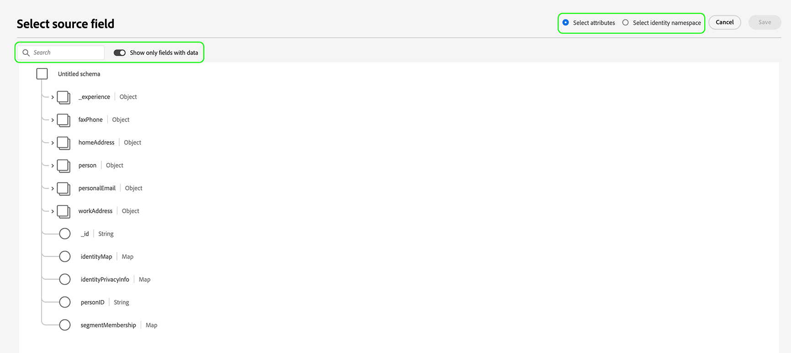
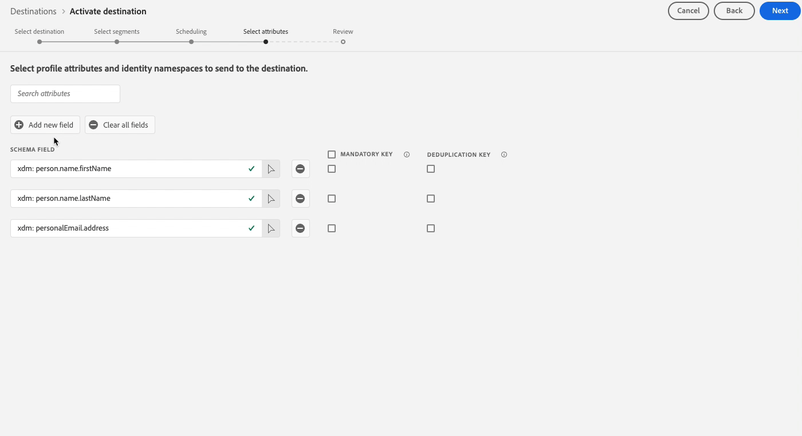
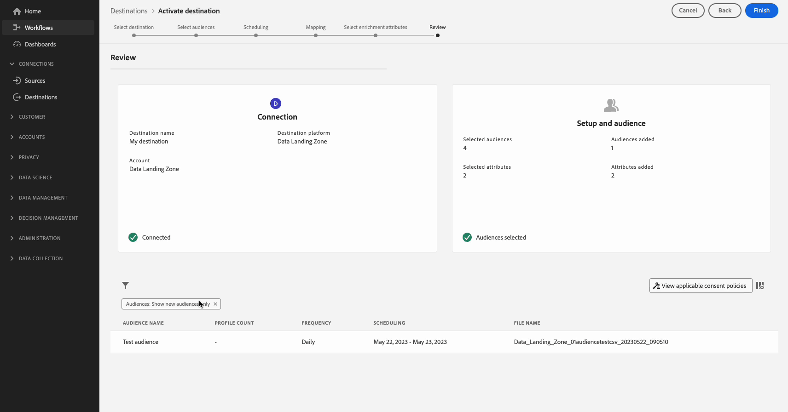

# Aktivera målgrupper för att batchprofilera exportmål

>[!IMPORTANT]
> 
> * Om du vill aktivera målgrupper och aktivera [mappningssteget](#mapping) i arbetsflödet behöver du behörigheterna **[!UICONTROL View Destinations]**, **[!UICONTROL Activate Destinations]**, **[!UICONTROL View Profiles]** och **[!UICONTROL View Segments]** [åtkomstkontroll](/help/access-control/home.md#permissions).
> * Om du vill aktivera målgrupper utan att gå igenom [mappningssteget](#mapping) i arbetsflödet behöver du behörigheterna **[!UICONTROL View Destinations]**, **[!UICONTROL Activate Segment without Mapping]**, **[!UICONTROL View Profiles]** och **[!UICONTROL View Segments]** [åtkomstkontroll](/help/access-control/home.md#permissions).
>* Om du vill exportera *identiteter* måste du ha **[!UICONTROL View Identity Graph]** [åtkomstkontrollbehörighet](/help/access-control/home.md#permissions). <br> {width="100" zoomable="yes"}
> 
> Läs [åtkomstkontrollsöversikten](/help/access-control/ui/overview.md) eller kontakta produktadministratören för att få den behörighet som krävs.

## Översikt {#overview}

I den här artikeln förklaras det arbetsflöde som krävs för att aktivera målgrupper i Adobe Experience Platform till batchprofilfilsbaserade mål, som molnlagring och e-postmarknadsföringsmål.

## Förhandskrav {#prerequisites}

Om du vill aktivera målgrupper till mål måste du ha [anslutit till ett mål](./connect-destination.md). Om du inte redan har gjort det går du till [målkatalogen](../catalog/overview.md), bläddrar bland de mål som stöds och konfigurerar det mål som du vill använda.

## Filformat som stöds för export {#supported-file-formats-export}

>[!CONTEXTUALHELP]
>id="dataset_dataflow_needs_schedule_end_date_header"
>title="Uppdatera slutdatumet för det här dataflödet"
>abstract="Uppdatera slutdatumet för det här dataflödet"

>[!CONTEXTUALHELP]
>id="dataset_dataflow_needs_schedule_end_date_body"
>title="Uppdatera slutdatumet för det här dataflödet"
>abstract="På grund av de senaste uppdateringarna av det här målet krävs ett slutdatum för dataflödet. Adobe har angett ett standardslutdatum till 1 mars 2025. Uppdatera till önskat slutdatum, annars avbryts dataexporten på standarddatumet."

>[!CONTEXTUALHELP]
>id="destinations_folder_name_template"
>title="Redigera mappsökväg"
>abstract="Använd flera angivna makron för att anpassa mappsökvägen där datauppsättningen exporteras."

>[!CONTEXTUALHELP]
>id="destinations_folder_name_template_preview"
>title="Förhandsgranskning av sökväg för datauppsättningsmapp"
>abstract="Få en förhandsgranskning av mappstrukturen som skapas på lagringsplatsen baserat på de makron som du har lagt till i det här fönstret."

Följande filformat stöds vid export av målgrupper:

* CSV
* JSON
* Parquet

Observera att när du exporterar CSV-filer får du större flexibilitet när det gäller hur du vill strukturera de exporterade filerna. Läs mer om [filformateringskonfiguration för CSV-filer](/help/destinations/ui/batch-destinations-file-formatting-options.md#file-configuration).

Välj önskat filformat för export när du [skapar en anslutning till det filbaserade målet](/help/destinations/ui/connect-destination.md).

## Välj mål {#select-destination}

1. Gå till **[!UICONTROL Connections > Destinations]** och välj fliken **[!UICONTROL Catalog]**.

   

1. Välj **[!UICONTROL Activate audiences]** på det kort som motsvarar målet där du vill aktivera målgrupperna, vilket visas i bilden nedan.

   

1. Markera målanslutningen som du vill använda för att aktivera målgrupperna och välj sedan **[!UICONTROL Next]**.

   

1. Gå till nästa avsnitt för att [välja dina målgrupper](#select-audiences).

## Välj målgrupper {#select-audiences}

Om du vill välja vilka målgrupper du vill aktivera för målet använder du kryssrutorna till vänster om målgruppsnamnen och väljer sedan **[!UICONTROL Next]**.

Du kan välja mellan flera typer av målgrupper, beroende på deras ursprung:

* **[!UICONTROL Segmentation Service]**: Publiker som genererats i Experience Platform av segmenteringstjänsten. Mer information finns i [segmenteringsdokumentationen](../../segmentation/ui/overview.md).
* **[!UICONTROL Custom upload]**: Publiker som genererats utanför Experience Platform och överförts till Platform som CSV-filer. Mer information om externa målgrupper finns i dokumentationen om att [importera en målgrupp](../../segmentation/ui/audience-portal.md#import-audience).
* Andra typer av målgrupper som kommer från andra Adobe-lösningar, till exempel [!DNL Audience Manager].


>[!TIP]
>
>Om du väljer målgrupper som kommer från **[!UICONTROL Custom uploads]** aktiveras steget [Välj anrikningsattribut](#select-enrichment-attributes) automatiskt.

>[!TIP]
>
>Du kan ta bort målgrupper från befintliga aktiveringsflöden från sidan **[!UICONTROL Activation data]**. Mer information finns i den [dedikerade dokumentationen](../ui/destination-details-page.md#bulk-remove).

## Schemalägg målgruppsexport {#scheduling}

>[!CONTEXTUALHELP]
>id="platform_destinations_activate_schedule"
>title="Schema"
>abstract="Använd pennikonen för att ange filexportformat (fullständiga eller stegvisa filer) och exportfrekvens."

[!DNL Adobe Experience Platform] exporterar data för e-postmarknadsföring och molnlagringsmål som [olika filtyper](#supported-file-formats-export). På sidan **[!UICONTROL Scheduling]** kan du konfigurera schemat och filnamnen för varje målgrupp som du exporterar.

Experience Platform anger automatiskt ett standardschema för varje filexport. Du kan ändra standardschemat efter behov genom att välja pennikonen bredvid varje schema och definiera ett anpassat schema.


>[!TIP]
>
>Du kan redigera målgruppsaktiveringsplaner för befintliga aktiveringsflöden från sidan **[!UICONTROL Activation data]**. Mer information finns i dokumentationen om [massredigeringsscheman](../ui/destination-details-page.md#bulk-edit-schedule).

>[!IMPORTANT]
>
>[!DNL Adobe Experience Platform] delar automatiskt upp exportfilerna i 5 miljoner poster (rader) per fil. Varje rad representerar en profil.
>
>Delade filnamn läggs till med ett nummer som anger att filen är en del av en större export, till exempel: `filename.csv`, `filename_2.csv`, `filename_3.csv`.

### Exportera fullständiga filer {#export-full-files}

>[!CONTEXTUALHELP]
>id="platform_destinations_activate_exportoptions"
>title="Alternativ för filexport"
>abstract="Välj **Exportera fullständiga filer** om du vill exportera en fullständig ögonblicksbild av alla profiler som är kvalificerade för målgruppen. Välj **Exportera inkrementella filer** om du bara vill exportera de profiler som är kvalificerade för målgruppen sedan den senaste exporten. <br> Den första stegvisa filexporten innehåller alla profiler som kvalificerar sig för målgruppen och fungerar som en bakgrundsfyllning. Framtida inkrementella filer innehåller endast de profiler som är kvalificerade för målgruppen sedan den första inkrementella filexporten."
>additional-url="https://experienceleague.adobe.com/docs/experience-platform/destinations/ui/activate/activate-batch-profile-destinations.html#export-incremental-files" text="Exportera inkrementella filer"

>[!CONTEXTUALHELP]
>id="platform_destinations_activationchaining_aftersegmentevaluation"
>title="Aktivera efter målgruppsutvärdering"
>abstract="Aktiveringen körs omedelbart efter det dagliga segmenteringsjobbet. Detta garanterar att de senaste profilerna exporteras."

>[!CONTEXTUALHELP]
>id="platform_destinations_activationchaining_scheduled"
>title="Schemalagd aktivering"
>abstract="Aktiveringen körs vid en fast tidpunkt på dagen."

Välj **[!UICONTROL Export full files]** om du vill utlösa exporten av en fil som innehåller en fullständig ögonblicksbild av alla profilkvalifikationer för den valda målgruppen.


1. Använd **[!UICONTROL Frequency]**-väljaren för att välja exportfrekvens:

   * **[!UICONTROL Once]**: schemalägg en enda gång fullständig filexport på begäran.
   * **[!UICONTROL Daily]**: schemalägg fullständig filexport en gång om dagen, varje dag, vid den tidpunkt du anger.

2. Använd växlingsknappen **[!UICONTROL Time]** för att välja om exporten ska ske omedelbart efter målgruppsutvärderingen eller på schemalagd basis vid en angiven tidpunkt. När du väljer alternativet **[!UICONTROL Scheduled]** kan du använda väljaren för att välja tidpunkten på dagen, i formatet [!DNL UTC], när exporten ska ske.

   >[!NOTE]
   >
   >Alternativet **[!UICONTROL After segment evaluation]** som beskrivs nedan är bara tillgängligt för vissa Beta-kunder.

   Använd alternativet **[!UICONTROL After segment evaluation]** om du vill att aktiveringsjobbet ska köras direkt när det dagliga batchsegmenteringsjobbet för plattformen har slutförts. Med det här alternativet exporteras de senaste profilerna till målet när aktiveringsjobbet körs.

   <!-- Batch segmentation currently runs at {{insert time of day}} and lasts for an average {{x hours}}. Adobe reserves the right to modify this schedule. -->

   
Använd alternativet **[!UICONTROL Scheduled]** om du vill att aktiveringsjobbet ska köras med en fast tidpunkt. Med det här alternativet exporteras Experience Platform-profildata vid samma tidpunkt varje dag. De profiler du exporterar kanske inte är de mest aktuella, beroende på om gruppsegmenteringsjobbet har slutförts innan aktiveringsjobbet startar.

   

3. Använd väljaren **[!UICONTROL Date]** för att välja dag eller intervall när exporten ska ske. För daglig export är det bästa sättet att ställa in start- och slutdatum så att de motsvarar kampanjernas längd i era nedströmsplattformar.

   >[!IMPORTANT]
   >
   > När du väljer ett exportintervall inkluderas inte den sista dagen i intervallet i exporten. Om du till exempel väljer intervallet 4-11 januari kommer den sista filexporten att äga rum 10 januari.

4. Välj **[!UICONTROL Create]** om du vill spara schemat.

### Exportera inkrementella filer

>[!CONTEXTUALHELP]
>id="platform_destinations_activate_something"
>title="Konfigurera filnamn"
>abstract="För filbaserade mål genereras ett unikt filnamn per målgrupp. Använd filnamnsredigeraren för att skapa och redigera ett unikt filnamn eller behåll standardnamnet."

Välj **[!UICONTROL Export incremental files]** om du vill utlösa en export där den första filen är en fullständig ögonblicksbild av alla profilkvalifikationer för den valda målgruppen, och efterföljande filer är stegvisa profilkvalifikationer sedan den föregående exporten.

>[!IMPORTANT]
>
>Den första exporterade inkrementella filen innehåller alla profiler som kvalificerar sig för en målgrupp och fungerar som en bakgrundsfyllning.


1. Använd **[!UICONTROL Frequency]**-väljaren för att välja exportfrekvens:

   * **[!UICONTROL Daily]**: schemalägg inkrementell filexport en gång om dagen, varje dag, vid den tidpunkt du anger.
   * **[!UICONTROL Hourly]**: schemalägg stegvis filexport var 3, 6, 8 eller 12:e timme.

2. Använd väljaren **[!UICONTROL Time]** för att välja tidpunkten på dagen, i formatet [!DNL UTC], när exporten ska ske.

3. Använd **[!UICONTROL Date]**-väljaren för att välja intervallet när exporten ska äga rum. Det bästa sättet är att ställa in start- och slutdatumet så att det passar kampanjernas längd på era nedströmsplattformar.

   >[!IMPORTANT]
   >
   >Den sista dagen i intervallet inkluderas inte i exporten. Om du till exempel väljer intervallet 4-11 januari kommer den sista filexporten att äga rum 10 januari.

4. Välj **[!UICONTROL Create]** om du vill spara schemat.

### Konfigurera filnamn

>[!CONTEXTUALHELP]
>id="platform_destinations_activate_filename"
>title="Konfigurera filnamn"
>abstract="För filbaserade mål genereras ett unikt filnamn per målgrupp. Använd filnamnsredigeraren för att skapa och redigera ett unikt filnamn eller behåll standardnamnet."

För de flesta mål består standardfilnamnen av målnamn, målgrupps-ID och en datum- och tidsindikator. Du kan till exempel redigera de exporterade filnamnen för att skilja mellan olika kampanjer eller för att lägga till tiden för dataexport till filerna. Observera att vissa målutvecklare kan välja att visa olika alternativ för standardfilnamnstillägg för sina mål.

Om du vill öppna ett modalt fönster och redigera filnamnen väljer du pennikonen . Filnamn får innehålla högst 255 tecken.

>[!NOTE]
>
>Bilden nedan visar hur filnamn kan redigeras för [!DNL Amazon S3] mål, men processen är identisk för alla gruppmål (till exempel SFTP, [!DNL Azure Blob Storage] eller [!DNL Google Cloud Storage]).


I filnamnsredigeraren kan du välja olika komponenter att lägga till i filnamnet.


Målnamnet och målgrupps-ID:t kan inte tas bort från filnamn. Förutom dessa alternativ kan du lägga till följande alternativ:

| Filnamnsalternativ | Beskrivning |
|---------|----------|
| **[!UICONTROL Audience name]** | Namnet på den exporterade publiken. |
| **[!UICONTROL Date and time]** | Välj mellan att lägga till ett `MMDDYYYY_HHMMSS`-format eller en 10-siffrig UNIX-tidsstämpel för den tidpunkt då filerna genereras. Välj ett av dessa alternativ om du vill att ett dynamiskt filnamn ska skapas för varje stegvis export. |
| **[!UICONTROL Custom text]** | All egen text som du vill lägga till i filnamnen. |
| **[!UICONTROL Destination ID]** | ID:t för måldataflödet som du använder för att exportera målgruppen. |
| **[!UICONTROL Destination name]** | Namnet på måldataflödet som du använder för att exportera målgruppen. |
| **[!UICONTROL Organization name]** | Organisationens namn i Experience Platform. |
| **[!UICONTROL Sandbox name]** | ID:t för sandlådan som du använder för att exportera målgruppen. |

{style="table-layout:auto"}

Välj **[!UICONTROL Apply changes]** för att bekräfta ditt val.

>[!IMPORTANT]
> 
>Om du inte markerar komponenten **[!UICONTROL Date and Time]** kommer filnamnen att vara statiska och den nya exporterade filen kommer att skriva över den tidigare filen på din lagringsplats vid varje export. När du kör ett återkommande importjobb från en lagringsplats till en e-postmarknadsföringsplattform rekommenderas detta.

När du har konfigurerat alla dina målgrupper väljer du **[!UICONTROL Next]** för att fortsätta.

## Mappning {#mapping}

I det här steget måste du välja de profilattribut som du vill lägga till i filerna som exporteras till målmålet. Så här väljer du profilattribut och identiteter för export:

1. Välj **[!UICONTROL Add new mapping]** på sidan **[!UICONTROL Mapping]**.

   

1. Markera pilen till höger om posten **[!UICONTROL Source field]**.

   

1. På sidan **[!UICONTROL Select source field]** markerar du de profilattribut och identiteter som du vill ta med i de exporterade filerna till målet och väljer sedan **[!UICONTROL Select]**.

   >[!TIP]
   > 
   >Du kan använda sökfältet för att begränsa urvalet, vilket visas i bilden nedan.

   Använd växlingsknappen **[!UICONTROL Show only fields with data]** om du bara vill visa schemafält med värden. Som standard visas endast ifyllda schemafält.

   


1. Fältet som du valde för export visas nu i mappningsvyn. Om du vill kan du redigera namnet på rubriken i den exporterade filen. Det gör du genom att markera ikonen i målfältet.

   

1. På sidan **[!UICONTROL Select target field]** skriver du in det önskade namnet på sidhuvudet i den exporterade filen och väljer sedan **[!UICONTROL Select]**.

   

1. Fältet som du har valt för export visas nu i mappningsvyn och det redigerade huvudet i den exporterade filen visas.

   

1. (Valfritt) Ordningen på de mappade fälten i användargränssnittet återspeglas i ordningen på kolumnerna i den exporterade CSV-filen, uppifrån och ned, där den översta raden är den vänstra kolumnen i CSV-filen. Du kan ändra ordningen på mappade fält på vilket sätt du vill genom att dra och släppa mappningsraderna enligt nedan.

   >[!NOTE]
   >
   >Den här funktionen är i betaversion och endast tillgänglig för vissa kunder. Kontakta din Adobe-representant om du vill få tillgång till den här funktionen.

   

1. (Valfritt) Du kan välja att det exporterade fältet ska vara en [obligatorisk nyckel](#mandatory-keys) eller en [dedupliceringsnyckel](#deduplication-keys).

   

1. Om du vill lägga till fler fält för export upprepar du stegen ovan.

### Obligatoriska attribut {#mandatory-attributes}

>[!CONTEXTUALHELP]
>id="platform_destinations_activate_mandatorykey"
>title="Om obligatoriska attribut"
>abstract="Välj de XDM-schemaattribut som alla exporterade profiler ska inkludera. Profiler utan den obligatoriska nyckeln exporteras inte till målet. Om du inte markerar en obligatorisk nyckel exporteras alla kvalificerade profiler oavsett deras attribut."

Ett obligatoriskt attribut är en användaraktiverad kryssruta som ser till att alla profilposter innehåller det valda attributet. Till exempel innehåller alla exporterade profiler en e-postadress. &#x200B;

Du kan markera attribut som obligatoriska för att se till att [!DNL Platform] bara exporterar de profiler som innehåller det specifika attributet. Det innebär att den kan användas som en extra form av filtrering. Det krävs **inte** för att markera ett attribut som obligatoriskt.

Om du inte väljer ett obligatoriskt attribut exporteras alla kvalificerade profiler oavsett deras attribut.

Vi rekommenderar att ett av attributen är en [unik identifierare](../../destinations/catalog/email-marketing/overview.md#identity) från ditt schema. Mer information om obligatoriska attribut finns i avsnittet om identitet i dokumentationen för [e-postmarknadsföringsmål](../../destinations/catalog/email-marketing/overview.md#identity).

### Dedupliceringsnycklar {#deduplication-keys}

>[!CONTEXTUALHELP]
>id="platform_destinations_activate_deduplicationkey"
>title="Om dedupliceringsnycklar"
>abstract="Eliminera flera poster med samma profil i exportfilerna genom att välja en dedupliceringsnyckel. Välj ett namnutrymme eller upp till två XDM-schemaattribut som en dedupliceringsnyckel. Om du inte väljer en dedupliceringsnyckel kan det leda till dubblettprofilposter i exportfilerna."

En dedupliceringsnyckel är en användardefinierad primärnyckel som avgör identiteten som användarna vill att deras profiler ska dedupliceras med. &#x200B;

Avdupliceringsnycklar eliminerar möjligheten att ha flera poster med samma profil i en exportfil.

Det finns tre sätt att använda dedupliceringsnycklar i [!DNL Platform]:

* Använda ett enskilt identitetsnamnutrymme som [!UICONTROL deduplication key]
* Använda ett profilattribut från en [!DNL XDM]-profil som [!UICONTROL deduplication key]
* Använda en kombination av två profilattribut från en [!DNL XDM]-profil som en sammansatt nyckel

>[!IMPORTANT]
>
> Du kan exportera ett enskilt ID-namnutrymme till ett mål, och namnutrymmet anges automatiskt som en dedupliceringsnyckel. Det går inte att skicka flera namnutrymmen till ett mål.
> 
> Du kan inte använda en kombination av ID-namnutrymmen och profilattribut som dedupliceringsnycklar.

### Exempel på borttagning av dubbletter {#deduplication-example}

I det här exemplet visas hur borttagning av dubbletter fungerar, beroende på de valda dedupliceringstangenterna.

Låt oss titta på följande två profiler.

**Profil A**

```json
{
  "identityMap": {
    "Email": [
      {
        "id": "johndoe_1@example.com"
      },
      {
        "id": "doejohn_1@example.com"
      }
    ]
  },
  "segmentMembership": {
    "ups": {
      "fa5c4622-6847-4199-8dd4-8b7c7c7ed1d6": {
        "status": "realized",
        "lastQualificationTime": "2021-03-10 10:03:08"
      }
    }
  },
  "person": {
    "name": {
      "lastName": "Doe",
      "firstName": "John"
    }
  },
  "personalEmail": {
    "address": "johndoe@example.com"
  }
}
```

**Profil B**

```json
{
  "identityMap": {
    "Email": [
      {
        "id": "johndoe_2@example.com"
      },
      {
        "id": "doejohn_2@example.com"
      }
    ]
  },
  "segmentMembership": {
    "ups": {
      "fa5c4622-6847-4199-8dd4-8b7c7c7ed1d6": {
        "status": "realized",
        "lastQualificationTime": "2021-04-10 11:33:28"
      }
    }
  },
  "person": {
    "name": {
      "lastName": "D",
      "firstName": "John"
    }
  },
  "personalEmail": {
    "address": "johndoe@example.com"
  }
}
```

### Användning av borttagning av dubbletter, fall 1: ingen borttagning av dubbletter {#deduplication-use-case-1}

Om du inte använder borttagning av dubbletter innehåller exportfilen följande poster.

| personalEmail | firstName | lastName |
|---|---|---|
| johndoe@example.com | John | Doe |
| johndoe@example.com | John | D |


### Användning av deduplicering, fall 2: deduplicering baserad på identitetsnamnutrymme {#deduplication-use-case-2}

Om deduplicering anges av namnutrymmet [!DNL Email] innehåller exportfilen följande poster. Profil B är den senaste som är kvalificerad för målgruppen, så det är den enda som exporteras.

| E-post* | personalEmail | firstName | lastName |
|---|---|---|---|
| johndoe_2@example.com | johndoe@example.com | John | D |
| doejohn_2@example.com | johndoe@example.com | John | D |

### Användning av deduplicering, exempel 3: deduplicering baserad på ett enda profilattribut {#deduplication-use-case-3}

Om deduplicering anges av attributet `personal Email` innehåller exportfilen följande post. Profil B är den senaste som är kvalificerad för målgruppen, så det är den enda som exporteras.

| personalEmail* | firstName | lastName |
|---|---|---|
| johndoe@example.com | John | D |


### Användning av deduplicering, fall 4: deduplicering baserad på två profilattribut {#deduplication-use-case-4}

Om den sammansatta nyckeln `personalEmail + lastName` tar bort dubbletter innehåller exportfilen följande poster.

| personalEmail* | lastName* | firstName |
|---|---|---|
| johndoe@example.com | D | John |
| johndoe@example.com | Doe | John |

Adobe rekommenderar att du väljer ett identitetsnamnutrymme som [!DNL CRM ID] eller en e-postadress som en dedupliceringsnyckel för att se till att alla profilposter identifieras unikt.

>[!NOTE]
> 
>Om några dataanvändningsetiketter har tillämpats på vissa fält i en datauppsättning (i stället för på hela datauppsättningen), tillämpas dessa fältetiketter vid aktiveringen på följande villkor:
>
>* Fälten används i målgruppsdefinitionen.
>* Fälten konfigureras som projicerade attribut för målmålet.
>
> Om till exempel fältet `person.name.firstName` har vissa etiketter för dataanvändning som är i konflikt med målets marknadsföringsåtgärd, visas en överträdelse av dataanvändningsprincipen i granskningssteget. Mer information finns i [Datastyrning i Adobe Experience Platform](../../rtcdp/privacy/data-governance-overview.md#destinations).

### [!BADGE Beta]{type=Informative} Exportera arrayer via beräknade fält {#export-arrays-calculated-fields}

Vissa betakunder kan exportera arrayobjekt från Experience Platform till molnlagringsplatser. Läs mer om [att exportera arrayer och beräknade fält](/help/destinations/ui/export-arrays-calculated-fields.md) och kontakta din Adobe-representant för att få tillgång till funktionen.

### Kända begränsningar {#known-limitations}

Den nya **[!UICONTROL Mapping]**-sidan har följande kända begränsningar:

#### Målgruppsmedlemskapsattributet kan inte väljas via mappningsarbetsflödet

På grund av en känd begränsning kan du för närvarande inte använda fönstret **[!UICONTROL Select field]** för att lägga till `segmentMembership.seg_namespace.seg_id.status` i din filexport. I stället måste du klistra in värdet `xdm: segmentMembership.seg_namespace.seg_id.status` manuellt i schemafältet, vilket visas nedan.


>[!NOTE]
>
För molnlagringsmål läggs följande attribut till i mappningen som standard:
>
* `segmentMembership.seg_namespace.seg_id.status`
* `segmentMembership.seg_namespace.seg_id.lastQualificationTime`

Filexporter varierar på följande sätt, beroende på om `segmentMembership.seg_namespace.seg_id.status` har valts:

* Om fältet `segmentMembership.seg_namespace.seg_id.status` är markerat innehåller de exporterade filerna **[!UICONTROL Active]** medlemmar i den första fullständiga ögonblicksbilden och nyligen **[!UICONTROL Active]**- och **[!UICONTROL Expired]**-medlemmar i efterföljande stegvisa exporter.
* Om fältet `segmentMembership.seg_namespace.seg_id.status` inte är markerat innehåller exporterade filer bara **[!UICONTROL Active]** medlemmar i den första fullständiga ögonblicksbilden och i efterföljande stegvisa exporter.

Läs mer om [profilexportbeteende för filbaserade mål](/help/destinations/how-destinations-work/profile-export-behavior.md#file-based-destinations).

#### Identitetsnamnutrymmen kan för närvarande inte väljas för export

Det går inte att markera identitetsnamnutrymmen för export, vilket visas i bilden nedan. Om du väljer ett identitetsnamnutrymme för export genereras ett fel i steget **[!UICONTROL Review]**.


Som en tillfällig lösning kan du antingen:
* Använd de gamla molnlagringsmålen för dataflödena där du vill inkludera identitetsnamnutrymmen i exporter
* Överför identiteter som attribut till Experience Platform och exportera dem sedan till dina molnlagringsplatser.

## Välj profilattribut {#select-attributes}

>[!IMPORTANT]
> 
Alla molnlagringsmål i katalogen kan visa ett förbättrat [[!UICONTROL Mapping]-steg ](#mapping) som ersätter det **[!UICONTROL Select attributes]**-steg som beskrivs i det här avsnittet.
>
Det här **[!UICONTROL Select attributes]** steget visas fortfarande för e-postmarknadsföringsmålen Adobe Campaign, Oracle Responsys, Oracle Eloqua och Salesforce Marketing Cloud.

För profilbaserade mål måste du välja de profilattribut som du vill skicka till målmålet.

1. Välj **[!UICONTROL Add new field]** på sidan **[!UICONTROL Select attributes]**.

   

2. Markera pilen till höger om posten **[!UICONTROL Schema field]**.

   

3. På sidan **[!UICONTROL Select field]** markerar du de XDM-attribut eller identitetsnamnutrymmen som du vill skicka till målet och väljer sedan **[!UICONTROL Select]**.

   

4. Om du vill lägga till fler mappningar upprepar du steg ett till tre.

>[!NOTE]
>
Adobe Experience Platform fyller markeringen i förväg med fyra rekommenderade attribut från schemat: `person.name.firstName`, `person.name.lastName`, `personalEmail.address`, `segmentMembership.seg_namespace.seg_id.status`.


>[!IMPORTANT]
>
På grund av en känd begränsning kan du för närvarande inte använda fönstret **[!UICONTROL Select field]** för att lägga till `segmentMembership.seg_namespace.seg_id.status` i din filexport. I stället måste du klistra in värdet `xdm: segmentMembership.seg_namespace.seg_id.status` manuellt i schemafältet, vilket visas nedan.
>


Filexporter varierar på följande sätt, beroende på om `segmentMembership.seg_namespace.seg_id.status` har valts:
* Om fältet `segmentMembership.seg_namespace.seg_id.status` är markerat innehåller exporterade filer **[!UICONTROL Active]** medlemmar i den första fullständiga ögonblicksbilden och **[!UICONTROL Active]**- och **[!UICONTROL Expired]**-medlemmar i efterföljande stegvisa exporter.
* Om fältet `segmentMembership.seg_namespace.seg_id.status` inte är markerat innehåller exporterade filer bara **[!UICONTROL Active]** medlemmar i den första fullständiga ögonblicksbilden och i efterföljande stegvisa exporter.

## Välj anrikningsattribut {#select-enrichment-attributes}

[!CONTEXTUALHELP]
id="platform_destinations_activate_exclude_enrichment_attributes"
title="Uteslut anrikningsattribut"
abstract="Aktivera det här alternativet om du vill exportera profilerna från de valda anpassade överförda målgrupperna till ditt mål, samtidigt som alla deras attribut utesluts."

>[!IMPORTANT]
>
Det här steget visas bara om du valde **[!UICONTROL Custom upload]** målgrupper under steget [målgruppsval](#select-audiences).

Anrikningsattribut motsvarar anpassade överförda målgrupper som kapslats i Experience Platform som **[!UICONTROL Custom uploads]**. I det här steget kan du välja vilka attribut du vill exportera till målet, för varje vald extern publik.


Följ stegen nedan för att välja anrikningsattribut för varje extern målgrupp:

1. I kolumnen **[!UICONTROL Enrichment attributes]** väljer du knappen  (Redigera).
1. Välj **[!UICONTROL Add enrichment attribute]**.  Ett nytt tomt schemafält visas.
   
1. Klicka på knappen till höger om det tomma fältet för att öppna fältvalsskärmen.
1. Välj de attribut du vill exportera för målgruppen.
   
1. När du har lagt till alla attribut som du vill exportera väljer du **[!UICONTROL Save and close]**.
1. Upprepa dessa steg för varje extern publik.

Om du vill aktivera externa målgrupper till dina mål utan att exportera något attribut aktiverar du växlingsknappen **[!UICONTROL Exclude enrichment attributes]**. Med det här alternativet exporteras profilerna från de externa målgrupperna, men inga av deras motsvarande attribut skickas till ditt mål.


Välj **[!UICONTROL Next]** om du vill gå till steget [Granska](#review).

## Granska {#review}

På sidan **[!UICONTROL Review]** kan du se en sammanfattning av ditt val. Välj **[!UICONTROL Cancel]** om du vill dela upp flödet, **[!UICONTROL Back]** om du vill ändra inställningarna eller **[!UICONTROL Finish]** om du vill bekräfta ditt val och börja skicka data till målet.


### Principutvärdering av samtycke {#consent-policy-evaluation}

[!CONTEXTUALHELP]
id="platform_governance_policies_viewApplicableConsentPolicies"
title="Visa tillämpliga policyer för samtycke"
abstract="Om din organisation har köpt **Adobe Healthcare Shield** eller **Adobe Privacy &amp; Security Shield** väljer du **[!UICONTROL View applicable consent policies]** för att se vilka medgivandepolicyer som tillämpas och hur många profiler som inkluderas i aktiveringen som ett resultat av dem. Den här kontrollen inaktiveras om ditt företag inte har tillgång till de SKU:er som nämns ovan."

Om din organisation har köpt **Adobe Healthcare Shield** eller **Adobe Privacy &amp; Security Shield** väljer du **[!UICONTROL View applicable consent policies]** för att se vilka medgivandepolicyer som tillämpas och hur många profiler som inkluderas i aktiveringen som ett resultat av dem. Läs mer om [utvärdering av medgivandeprincip](/help/data-governance/enforcement/auto-enforcement.md#consent-policy-evaluation).

### Kontroller av policyer för dataanvändning {#data-usage-policy-checks}

I steget **[!UICONTROL Review]** söker Experience Platform även efter överträdelser av dataanvändningsprinciper. Nedan visas ett exempel där en princip överträds. Du kan inte slutföra arbetsflödet för målgruppsaktivering förrän du har löst överträdelsen. Mer information om hur du löser policyöverträdelser finns i [brott mot dataanvändningsprinciper](/help/data-governance/enforcement/auto-enforcement.md#data-usage-violation) i dokumentationsavsnittet för datastyrning.


### Filtrera målgrupper {#filter-audiences}

I det här steget kan du även använda de tillgängliga filtren på sidan för att visa endast de målgrupper vars schema eller mappning har uppdaterats som en del av det här arbetsflödet. Du kan också växla vilka tabellkolumner som du vill se.



Om du är nöjd med ditt val och inga principöverträdelser har identifierats, markerar du **[!UICONTROL Finish]** för att bekräfta ditt val och börja skicka data till målet.

## Verifiera målgruppsaktivering {#verify}

När du exporterar målgrupper till molnlagringsmål skapar Adobe Experience Platform en `.csv`-, `.json`- eller `.parquet`-fil på den angivna lagringsplatsen. Förvänta dig att en ny fil ska skapas på lagringsplatsen enligt det schema som du angav i arbetsflödet. Standardfilformatet visas nedan, men du kan [redigera komponenterna för filnamnet](#file-names):
`<destinationName>_segment<segmentID>_<timestamp-yyyymmddhhmmss>.csv`

Om du till exempel har valt en daglig exportfrekvens kan filerna som du får tre dagar i följd se ut så här:

```console
Salesforce_Marketing_Cloud_segment12341e18-abcd-49c2-836d-123c88e76c39_20200408061804.csv
Salesforce_Marketing_Cloud_segment12341e18-abcd-49c2-836d-123c88e76c39_20200409052200.csv
Salesforce_Marketing_Cloud_segment12341e18-abcd-49c2-836d-123c88e76c39_20200410061130.csv
```

De här filerna finns på lagringsplatsen och du har fått en bekräftelse på att aktiveringen har slutförts. Om du vill veta hur de exporterade filerna är strukturerade kan du [hämta en csv-exempelfil](../assets/common/sample_export_file_segment12341e18-abcd-49c2-836d-123c88e76c39_20200408061804.csv). Den här exempelfilen innehåller profilattributen `person.firstname`, `person.lastname`, `person.gender`, `person.birthyear` och `personalEmail.address`.
