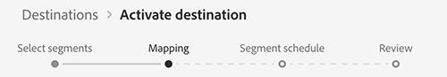
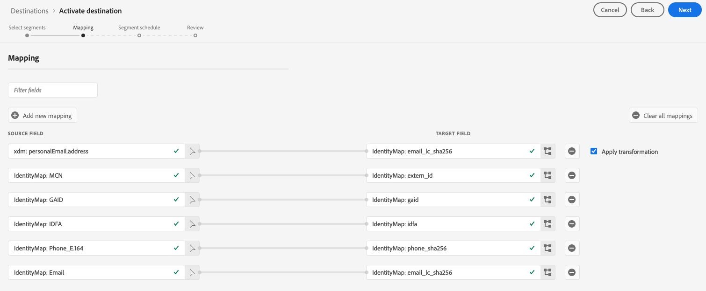
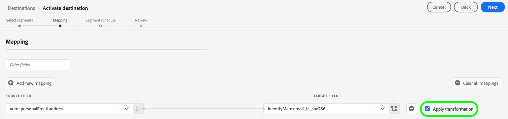

# Aktivera profiler och segment till ett mål

## Översikt {#overview}

Aktivera de data du har i [!DNL Adobe Experience Platform] genom att mappa segment till mål. Följ stegen nedan för att uppnå detta.

## Förutsättningar {#prerequisites}

Om du vill aktivera data till mål måste du ha [anslutit ett mål](./connect-destination.md). Om du inte redan har gjort det går du till [målkatalogen](../catalog/overview.md), bläddrar bland de mål som stöds och ställer in ett eller flera mål.

## Aktivera data {#activate-data}

Stegen i aktiveringsarbetsflödet varierar något mellan måltyperna. Det fullständiga arbetsflödet för alla måltyper beskrivs nedan.

## Välj vilket mål som data ska aktiveras till {#select-destination}

Gäller för: Alla destinationer

I Adobe Experience Platform-användargränssnittet går du till **[!UICONTROL Destinations]** > **[!UICONTROL Browse]** och klickar på knappen **[!UICONTROL Activate]** för det mål där du vill aktivera dina segment, vilket visas i bilden nedan.


Följ stegen i nästa avsnitt för att markera de segment som du vill aktivera.

## [!UICONTROL Select Segments] steg {#select-segments}

Gäller för: Alla destinationer


På sidan **[!UICONTROL Activate destination]** i arbetsflödet väljer du ett eller flera segment som ska aktiveras för målet på **[!UICONTROL Select Segments]**-sidan. Välj **[!UICONTROL Next]** för att fortsätta till nästa steg.


## [!UICONTROL Mapping] steg {#mapping}

>[!CONTEXTUALHELP]
>id="platform_destinations_activate_applytransformation"
>title="Använd omformning"
>abstract="Markera det här alternativet om du vill att Adobe Experience Platform automatiskt ska hash-koda dem vid aktiveringen när du använder ohashed-källfält."

Gäller för: sociala mål och Google Customer Match-annonsmål



För sociala mål måste du välja källattribut eller identitetsnamnutrymmen som ska mappas som målidentiteter i målet.

## Exempel: aktivera målgruppsdata i [!DNL Facebook Custom Audience] {#example-facebook}

Nedan visas ett exempel på korrekt identitetsmappning när målgruppsdata aktiveras i [!DNL Facebook].

Välja källfält:

* Välj namnutrymmet `Email` som källidentitet om de e-postadresser du använder inte hashas.
* Välj namnutrymmet `Email_LC_SHA256` som källidentitet om du hashade kundens e-postadresser vid dataöverföring i [!DNL Platform], enligt [!DNL Facebook] [e-posthashkrav](../catalog/social/facebook.md#email-hashing-requirements).
* Välj namnutrymmet `PHONE_E.164` som källidentitet om dina data består av icke-hash-kodade telefonnummer. [!DNL Platform] kommer att hash-koda telefonnumren så att de uppfyller  [!DNL Facebook] kraven.
* Välj namnutrymmet `Phone_SHA256` som källidentitet om du hashade telefonnummer vid dataöverföring till [!DNL Platform], enligt [!DNL Facebook] [krav på telefonnummer som hash-kodar](../catalog/social/facebook.md#phone-number-hashing-requirements).
* Välj namnutrymmet `IDFA` som källidentitet om dina data består av [!DNL Apple] enhets-ID:n.
* Välj namnutrymmet `GAID` som källidentitet om dina data består av [!DNL Android] enhets-ID:n.
* Välj namnutrymmet `Custom` som källidentitet om dina data består av andra typer av identifierare.

Markera målfält:

* Välj namnutrymmet `Email_LC_SHA256` som målidentitet när källnamnutrymmena är antingen `Email` eller `Email_LC_SHA256`.
* Välj namnutrymmet `Phone_SHA256` som målidentitet när källnamnutrymmena är antingen `PHONE_E.164` eller `Phone_SHA256`.
* Välj namnutrymmena `IDFA` eller `GAID` som mål-ID när källnamnutrymmena är `IDFA` eller `GAID`.
* Välj namnutrymmet `Extern_ID` som målidentitet när källnamnutrymmet är ett anpassat namnutrymme.



Data från namnutrymmen som inte är hash-kodade hashas automatiskt av [!DNL Platform] vid aktiveringen.

Attributkälldata hashas inte automatiskt. När källfältet innehåller ohashade attribut bör du markera alternativet **[!UICONTROL Apply transformation]** så att [!DNL Platform] automatiskt hash-kodar data vid aktiveringen.


 

## Exempel: aktivera målgruppsdata i [!DNL Google Customer Match] {#example-gcm}

Detta är ett exempel på korrekt identitetsmappning när målgruppsdata aktiveras i [!DNL Google Customer Match].

Välja källfält:

* Välj namnutrymmet `Email` som källidentitet om de e-postadresser du använder inte hashas.
* Välj namnutrymmet `Email_LC_SHA256` som källidentitet om du hashade kundens e-postadresser vid dataöverföring i [!DNL Platform], enligt [!DNL Google Customer Match] [e-posthashkrav](../catalog/social/../advertising/google-customer-match.md).
* Välj namnutrymmet `PHONE_E.164` som källidentitet om dina data består av icke-hash-kodade telefonnummer. [!DNL Platform] kommer att hash-koda telefonnumren så att de uppfyller  [!DNL Google Customer Match] kraven.
* Välj namnutrymmet `Phone_SHA256_E.164` som källidentitet om du hashade telefonnummer vid dataöverföring till [!DNL Platform], enligt [!DNL Facebook] [krav på telefonnummer som hash-kodar](../catalog/social/../advertising/google-customer-match.md).
* Välj namnutrymmet `IDFA` som källidentitet om dina data består av [!DNL Apple] enhets-ID:n.
* Välj namnutrymmet `GAID` som källidentitet om dina data består av [!DNL Android] enhets-ID:n.
* Välj namnutrymmet `Custom` som källidentitet om dina data består av andra typer av identifierare.

Markera målfält:

* Välj namnutrymmet `Email_LC_SHA256` som målidentitet när källnamnutrymmena är antingen `Email` eller `Email_LC_SHA256`.
* Välj namnutrymmet `Phone_SHA256_E.164` som målidentitet när källnamnutrymmena är antingen `PHONE_E.164` eller `Phone_SHA256_E.164`.
* Välj namnutrymmena `IDFA` eller `GAID` som mål-ID när källnamnutrymmena är `IDFA` eller `GAID`.
* Välj namnutrymmet `User_ID` som målidentitet när källnamnutrymmet är ett anpassat namnutrymme.


Data från namnutrymmen som inte är hash-kodade hashas automatiskt av [!DNL Platform] vid aktiveringen.

Attributkälldata hashas inte automatiskt. När källfältet innehåller ohashade attribut bör du markera alternativet **[!UICONTROL Apply transformation]** så att [!DNL Platform] automatiskt hash-kodar data vid aktiveringen.


## **[!UICONTROL Scheduling]** steg {#scheduling}

Gäller för: Destinationer för e-postmarknadsföring och molnlagring


[!DNL Adobe Experience Platform] exporterar data för e-postmarknadsföring och molnlagringsdestinationer i form av  [!DNL CSV] filer. I steget **[!UICONTROL Scheduling]** kan du konfigurera schemat och filnamnen för varje segment som du exporterar. Det är obligatoriskt att konfigurera schemat, men det är valfritt att konfigurera filnamnet.

>[!IMPORTANT]
> 
>[!DNL Adobe Experience Platform] delar automatiskt upp exportfilerna i 5 miljoner poster (rader) per fil. Varje rad representerar en profil.
>
>Delade filnamn läggs till med en siffra som anger att filen är en del av en större export: `filename.csv`, `filename_2.csv`, `filename_3.csv`.

Välj knappen **[!UICONTROL Create schedule]** för det segment som du vill skicka till målet.


### Exportera fullständiga filer {#export-full-files}

Välj **[!UICONTROL Export full files]** om du vill att de exporterade filerna ska innehålla en fullständig ögonblicksbild av alla profiler som är kvalificerade för det segmentet.


1. Använd **[!UICONTROL Frequency]**-väljaren för att välja mellan engångsexporter (**[!UICONTROL Once]**) eller **[!UICONTROL Daily]**. Vid export av en fullständig fil **[!UICONTROL Daily]** exporteras filen varje dag från startdatumet till slutdatumet kl. 12:00 UTC (7:00 EST).
2. Använd **[!UICONTROL Time]**-väljaren för att välja tidpunkten på dagen, i [!DNL UTC]-format, när exporten ska ske. När du exporterar en fil **[!UICONTROL Daily]** exporteras filen varje dag från startdatumet till slutdatumet vid den tidpunkt du väljer.

   >[!IMPORTANT]
   >
   >Alternativet att exportera filer vid en viss tidpunkt finns för närvarande i betaversion och är bara tillgängligt för ett visst antal kunder.
   ><br> <br> På grund av det sätt som interna Experience Platform-processer konfigureras kanske den första inkrementella eller fullständiga filexporten inte innehåller alla nödvändiga data för bakåtfyllnad.  <br> <br> För att säkerställa en fullständig och mest aktuell dataexport med bakåtfyllnad för både fullständiga och inkrementella filer rekommenderar vi att du ställer in den första filexporttiden efter 12 PM GMT följande dag. Detta är en begränsning som kommer att åtgärdas i framtida versioner.

3. Använd **[!UICONTROL Date]**-väljaren för att välja dag eller intervall när exporten ska ske.
4. Välj **[!UICONTROL Create]** om du vill spara schemat.


### Exportera inkrementella filer {#export-incremental-files}

Välj **[!UICONTROL Export incremental files]** om du vill att de exporterade filerna bara ska innehålla de profiler som är kvalificerade för det segmentet sedan den senaste exporten.

>[!IMPORTANT]
>
>Den första exporterade stegvisa filen innehåller alla profiler som kvalificerar sig för ett segment och fungerar som en bakgrundsfyllning.


1. Använd **[!UICONTROL Frequency]**-väljaren för att välja mellan **[!UICONTROL Daily]** eller **[!UICONTROL Hourly]**-exporter. Vid export av en inkrementell fil **[!UICONTROL Daily]** exporteras filen varje dag från startdatumet till slutdatumet kl. 12:00 UTC (07:00 EST).
   * När du väljer **[!UICONTROL Hourly]** använder du **[!UICONTROL Every]**-väljaren för att välja mellan alternativen **[!UICONTROL 3]**, **[!UICONTROL 6]**, **[!UICONTROL 8]** och **[!UICONTROL 12]** timme.

      >[!IMPORTANT]
      >
      >Alternativet att exportera inkrementella filer var 3, 6, 8 eller 12:e timme finns för närvarande i betaversionen och är bara tillgängligt för ett visst antal kunder. Kunder som inte är beta kan exportera inkrementella filer en gång om dagen.

2. Använd **[!UICONTROL Time]**-väljaren för att välja tidpunkten på dagen, i [!DNL UTC]-format, när exporten ska ske.

   >[!IMPORTANT]
   >
   >Alternativet att välja tid på dagen för exporten är bara tillgängligt för ett visst antal kunder. <br> <br> På grund av det sätt som interna Experience Platform-processer konfigureras kanske den första inkrementella eller fullständiga filexporten inte innehåller alla nödvändiga data för bakåtfyllnad.  <br> <br> För att säkerställa en fullständig och mest aktuell dataexport med bakåtfyllnad för både fullständiga och inkrementella filer rekommenderar vi att du ställer in den första filexporttiden efter 12 PM GMT följande dag. Detta är en begränsning som kommer att åtgärdas i framtida versioner.

3. Använd **[!UICONTROL Date]**-väljaren för att välja dag eller intervall när exporten ska ske.
4. Välj **[!UICONTROL Create]** om du vill spara schemat.

### Konfigurera filnamn {#file-names}

Standardfilnamnen består av målnamn, segment-ID och datum- och tidsindikator. Du kan till exempel redigera de exporterade filnamnen för att skilja mellan olika kampanjer eller för att lägga till tiden för dataexport till filerna.

Välj pennikonen för att öppna ett modalt fönster och redigera filnamnen. Filnamn får innehålla högst 255 tecken.


I filnamnsredigeraren kan du välja olika komponenter att lägga till i filnamnet.


Målnamnet och segment-ID kan inte tas bort från filnamn. Utöver dessa kan du lägga till följande:

* **[!UICONTROL Segment name]**: Du kan lägga till segmentnamnet till filnamnet.
* **[!UICONTROL Date and time]**: Välj mellan att lägga till ett  `MMDDYYYY_HHMMSS` format eller en Unix 10-siffrig tidsstämpel för den tidpunkt då filerna genereras. Välj ett av dessa alternativ om du vill att ett dynamiskt filnamn ska skapas för varje stegvis export.
* **[!UICONTROL Custom text]**: Lägg till egen text i filnamnen.

Välj **[!UICONTROL Apply changes]** för att bekräfta ditt val.

>[!IMPORTANT]
> 
>Om du inte markerar komponenten **[!UICONTROL Date and Time]** kommer filnamnen att vara statiska och den nya exporterade filen kommer att skriva över den tidigare filen på lagringsplatsen vid varje export. Detta är det rekommenderade alternativet när du kör ett återkommande importjobb från en lagringsplats till en e-postmarknadsföringsplattform.

När du har konfigurerat alla segment väljer du **[!UICONTROL Next]** för att fortsätta.

## **[!UICONTROL Segment schedule]** steg {#segment-schedule}

Gäller för: reklamdestinationer, sociala destinationer


På sidan **[!UICONTROL Segment schedule]** kan du ange startdatum för att skicka data till målet och hur ofta data ska skickas till målet.

>[!IMPORTANT]
>
>För sociala mål måste du välja målgruppens ursprung i det här steget. Du kan bara fortsätta till nästa steg efter att du har valt något av alternativen i bilden nedan.


>[!IMPORTANT]
>
>För Google Customer Match måste du ange [!UICONTROL App ID] i det här steget när du aktiverar segmenten [!DNL IDFA] eller [!DNL GAID].


## **[!UICONTROL Select attributes]** steg {#select-attributes}

Gäller för: mål för e-postmarknadsföring och molnlagring


På sidan **[!UICONTROL Select attributes]** väljer du **[!UICONTROL Add new field]** och väljer de attribut som du vill skicka till målet.

>[!NOTE]
>
> Adobe Experience Platform fyller markeringen i förväg med fyra rekommenderade attribut från ditt schema: `person.name.firstName`, `person.name.lastName`, `personalEmail.address`, `segmentMembership.status`.

Filexporter varierar på följande sätt, beroende på om `segmentMembership.status` är markerat:
* Om fältet `segmentMembership.status` är markerat innehåller exporterade filer **[!UICONTROL Active]**-medlemmar i den första fullständiga ögonblicksbilden och **[!UICONTROL Active]**- och **[!UICONTROL Expired]**-medlemmar i efterföljande stegvisa exporter.
* Om fältet `segmentMembership.status` inte är markerat innehåller exporterade filer endast **[!UICONTROL Active]** medlemmar i den första fullständiga ögonblicksbilden och i efterföljande stegvisa exporter.


### Obligatoriska attribut {#mandatory-attributes}

>[!CONTEXTUALHELP]
>id="platform_destinations_activate_mandatorykey"
>title="Om obligatoriska attribut"
>abstract="Välj de XDM-schemaattribut som alla exporterade profiler ska inkludera. Profiler utan den obligatoriska nyckeln exporteras inte till målet. Om du inte väljer en obligatorisk nyckel exporteras alla kvalificerade profiler oavsett deras attribut."
>additional-url="http://www.adobe.com/go/destinations-mandatory-attributes-en" text="Läs mer i dokumentationen"

Du kan markera attribut som obligatoriska för att vara säker på att [!DNL Platform] bara exporterar de profiler som innehåller det specifika attributet. Det innebär att den kan användas som en extra form av filtrering. Det är **inte** obligatoriskt att markera ett attribut som obligatoriskt.

Om du inte väljer ett obligatoriskt attribut exporteras alla kvalificerade profiler oavsett deras attribut.

Vi rekommenderar att ett av attributen är en [unik identifierare](../../destinations/catalog/email-marketing/overview.md#identity) från ditt schema. Mer information om obligatoriska attribut finns i avsnittet om identitet i [E-postmarknadsföringsmål](../../destinations/catalog/email-marketing/overview.md#identity)-dokumentationen.

### Dedupliceringsnycklar {#deduplication-keys}

>[!CONTEXTUALHELP]
>id="platform_destinations_activate_deduplicationkey"
>title="Om dedupliceringsnycklar"
>abstract="Eliminera flera poster med samma profil i exportfilerna genom att välja en dedupliceringsnyckel. Välj ett namnutrymme eller upp till två XDM-schemaattribut som en dedupliceringsnyckel. Om du inte väljer en dedupliceringsnyckel kan det leda till dubblettprofilposter i exportfilerna."
>additional-url="http://www.adobe.com/go/destinations-deduplication-keys-en" text="Läs mer i dokumentationen"

>[!IMPORTANT]
>
>Alternativet att använda dedupliceringsnycklar finns för närvarande i betaversion och är bara tillgängligt för ett visst antal kunder.

Avdupliceringsnycklar eliminerar möjligheten att ha flera poster med samma profil i en exportfil.

Det finns tre sätt att använda dedupliceringsnycklar i [!DNL Platform]:

* Använda ett enskilt identitetsnamnutrymme som [!UICONTROL deduplication key]
* Använda ett profilattribut från en [!DNL XDM]-profil som [!UICONTROL deduplication key]
* Använda en kombination av två profilattribut från en [!DNL XDM]-profil som en sammansatt nyckel

>[!IMPORTANT]
>
> Du kan exportera ett enskilt ID-namnutrymme till ett mål, och namnutrymmet anges automatiskt som en dedupliceringsnyckel. Det går inte att skicka flera namnutrymmen till ett mål.
> 
> Du kan inte använda en kombination av ID-namnutrymmen och profilattribut som dedupliceringsnycklar.

### Exempel på borttagning av dubbletter {#deduplication-example}

I det här exemplet visas hur borttagning av dubbletter fungerar, beroende på de valda dedupliceringstangenterna.

Låt oss titta på följande två profiler.

**Profil A**

```json
{
  "identityMap": {
    "Email": [
      {
        "id": "johndoe_1@example.com"
      },
      {
        "id": "johndoe_2@example.com"
      }
    ]
  },
  "segmentMembership": {
    "ups": {
      "fa5c4622-6847-4199-8dd4-8b7c7c7ed1d6": {
        "status": "existing",
        "lastQualificationTime": "2021-03-10 10:03:08"
      }
    }
  },
  "person": {
    "name": {
      "lastName": "Doe",
      "firstName": "John"
    }
  },
  "personalEmail": {
    "address": "johndoe@example.com"
  }
}
```

**Profil B**

```json
{
  "identityMap": {
    "Email": [
      {
        "id": "johndoe_1@example.com"
      },
      {
        "id": "johndoe_2@example.com"
      }
    ]
  },
  "segmentMembership": {
    "ups": {
      "fa5c4622-6847-4199-8dd4-8b7c7c7ed1d6": {
        "status": "existing",
        "lastQualificationTime": "2021-04-10 11:33:28"
      }
    }
  },
  "person": {
    "name": {
      "lastName": "D",
      "firstName": "John"
    }
  },
  "personalEmail": {
    "address": "johndoe@example.com"
  }
}
```

### Användning av borttagning av dubbletter, fall 1: ingen deduplicering

Om du inte använder borttagning av dubbletter innehåller exportfilen följande poster.

| personalEmail | firstName | lastName |
|---|---|---|
| johndoe@example.com | John | Doe |
| johndoe@example.com | John | D |


### Användning vid borttagning av dubbletter, fall 2: deduplicering baserad på ID-namnutrymme

Om du utgår från borttagning av dubbletter av namnutrymmet [!DNL Email] innehåller exportfilen följande poster. Profil B är den senaste som kvalificerar sig för segmentet, så det är den enda som exporteras.

| E-post* | personalEmail | firstName | lastName |
|---|---|---|---|
| johndoe_1@example.com | johndoe@example.com | John | D |
| johndoe_2@example.com | johndoe@example.com | John | D |

### Användning av borttagning av dubbletter, exempel 3: deduplicering baserad på ett enda profilattribut

Om attributet `personal Email` tar bort dubbletter innehåller exportfilen följande post. Profil B är den senaste som kvalificerar sig för segmentet, så det är den enda som exporteras.

| personalEmail* | firstName | lastName |
|---|---|---|
| johndoe@example.com | John | D |


### Användning vid borttagning av dubbletter - fall 4: deduplicering baserad på två profilattribut (sammansatt dedupliceringsnyckel)

Om den sammansatta nyckeln `personalEmail + lastName` tar bort dubbletter innehåller exportfilen följande poster.

| personalEmail* | lastName* | firstName |
|---|---|---|
| johndoe@example.com | D | John |
| johndoe@example.com | Doe | John |


Adobe rekommenderar att du väljer ett identitetsnamnutrymme som [!DNL CRM ID] eller en e-postadress som en dedupliceringsnyckel för att se till att alla profilposter identifieras unikt.

>[!NOTE]
> 
>Om några dataanvändningsetiketter har tillämpats på vissa fält i en datauppsättning (i stället för på hela datauppsättningen), tillämpas dessa fältetiketter vid aktiveringen på följande villkor:
>
>* Fälten används i segmentdefinitionen.
>* Fälten konfigureras som projicerade attribut för målmålet.

>
> 
Om till exempel fältet `person.name.firstName` har vissa etiketter för dataanvändning som är i konflikt med målets marknadsföringsåtgärd, visas en överträdelse av dataanvändningsprincipen i granskningssteget. Mer information finns i [Datastyrning i Adobe Experience Platform](../../rtcdp/privacy/data-governance-overview.md#destinations).

## **[!UICONTROL Review]** steg {#review}

Gäller för: alla destinationer


På sidan **[!UICONTROL Review]** visas en sammanfattning av ditt val. Välj **[!UICONTROL Cancel]** om du vill dela upp flödet, **[!UICONTROL Back]** om du vill ändra inställningarna eller **[!UICONTROL Finish]** om du vill bekräfta valet och börja skicka data till målet.

>[!IMPORTANT]
>
>I det här steget söker Adobe Experience Platform efter brott mot dataanvändningspolicyn. Nedan visas ett exempel där en princip överträds. Du kan inte slutföra arbetsflödet för segmentaktivering förrän du har löst konflikten. Mer information om hur du löser policyöverträdelser finns i [Politiska åtgärder](../../rtcdp/privacy/data-governance-overview.md#enforcement) i dokumentationsavsnittet för datastyrning.


Om inga principöverträdelser har identifierats markerar du **[!UICONTROL Finish]** för att bekräfta ditt val och börja skicka data till målet.


## Verifiera att segmentaktiveringen lyckades {#verify-activation}

### Destinationer för e-postmarknadsföring och molnlagring {#esp-and-cloud-storage}

För e-postmarknadsföringsmål och molnlagringsmål skapar Adobe Experience Platform en tabbavgränsad `.csv`-fil på den lagringsplats som du angav. Förvänta dig att en ny fil ska skapas på din lagringsplats varje dag. Standardfilformatet är:
`<destinationName>_segment<segmentID>_<timestamp-yyyymmddhhmmss>.csv`

De filer du får tre dagar i följd kan se ut så här:

```console
Salesforce_Marketing_Cloud_segment12341e18-abcd-49c2-836d-123c88e76c39_20200408061804.csv
Salesforce_Marketing_Cloud_segment12341e18-abcd-49c2-836d-123c88e76c39_20200409052200.csv
Salesforce_Marketing_Cloud_segment12341e18-abcd-49c2-836d-123c88e76c39_20200410061130.csv
```

De här filerna finns på lagringsplatsen och du har fått en bekräftelse på att aktiveringen har slutförts. Om du vill veta hur de exporterade filerna är strukturerade kan du [hämta en csv-exempelfil](../assets/common/sample_export_file_segment12341e18-abcd-49c2-836d-123c88e76c39_20200408061804.csv). Den här exempelfilen innehåller profilattributen `person.firstname`, `person.lastname`, `person.gender`, `person.birthyear` och `personalEmail.address`.

## Annonsmål

Kontrollera ditt konto på respektive annonsmål att du aktiverar dina data. Om aktiveringen lyckades, fylls målgrupperna i er annonsplattform.

## Sociala destinationer

För [!DNL Facebook] innebär en lyckad aktivering att en [!DNL Facebook] anpassad målgrupp skapas programmatiskt i [[!UICONTROL Facebook Ads Manager]](https://www.facebook.com/adsmanager/manage/). Segmentmedlemskap i målgruppen skulle läggas till och tas bort eftersom användarna är kvalificerade eller diskvalificerade för de aktiverade segmenten.

>[!TIP]
>
>Integrationen mellan Adobe Experience Platform och [!DNL Facebook] har stöd för historiska efterfyllningar av målgrupper. Alla historiska segmentkvalifikationer skickas till [!DNL Facebook] när du aktiverar segmenten till målet.

## Inaktivera aktivering {#disable-activation}

Följ stegen nedan för att inaktivera ett befintligt aktiveringsflöde:

1. Välj **[!UICONTROL Destinations]** i det vänstra navigeringsfältet, klicka sedan på fliken **[!UICONTROL Browse]** och klicka på målnamnet.
2. Klicka på kontrollen **[!UICONTROL Enabled]** till höger för att ändra aktiveringsflödets tillstånd.
3. I fönstret **Uppdatera dataflöde** väljer du **Bekräfta** för att inaktivera aktiveringsflödet.
