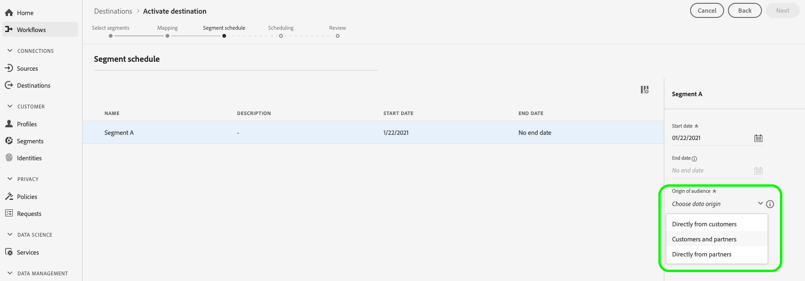

# Aktivera profiler och segment till ett mål

Aktivera data i Adobe Experience Platform genom att mappa segment till mål. Följ stegen nedan för att uppnå detta.

## Förutsättningar {#prerequisites}

Om du vill aktivera data till mål måste du ha [anslutit ett mål](./connect-destination.md). Om du inte redan har gjort det går du till [målkatalogen](../catalog/overview.md), bläddrar bland de mål som stöds och ställer in ett eller flera mål.

## Aktivera data {#activate-data}

Stegen i aktiveringsarbetsflödet varierar något mellan måltyperna. Det fullständiga arbetsflödet för alla måltyper beskrivs nedan.

### Välj vilket mål som data ska aktiveras till {#select-destination}

Gäller för: Alla destinationer

I Adobe Experience Platform-användargränssnittet går du till **[!UICONTROL Destinations]** > **[!UICONTROL Browse]** och väljer det mål där du vill aktivera dina segment.


Välj namnet på målet för att navigera till aktiveringsarbetsflödet.


Observera att om det redan finns ett aktiveringsarbetsflöde för ett mål, kan du se vilka segment som för närvarande aktiveras för målet. Välj **[!UICONTROL Edit activation]** till höger och följ stegen nedan för att ändra aktiveringsinformationen.

När du har valt ett mål väljer du **[!UICONTROL Activate]**.

### [!UICONTROL Select Segments] steg  {#select-segments}

Gäller för: Alla destinationer


På sidan **[!UICONTROL Activate destination]** i arbetsflödet väljer du ett eller flera segment som ska aktiveras för målet på **[!UICONTROL Select Segments]**-sidan. Välj **[!UICONTROL Next]** för att fortsätta till nästa steg.


### [!UICONTROL Identity mapping] steg  {#identity-mapping}

Gäller för: sociala mål och Google Customer Match-annonsmål


För sociala mål måste du välja källattribut eller identitetsnamnutrymmen som ska mappas som målidentiteter i målet.

#### Exempel: aktivera målgruppsdata i [!DNL Facebook] {#example-facebook}

Detta är ett exempel på korrekt identitetsmappning när målgruppsdata aktiveras i [!DNL Facebook].

Välja källfält:

* Välj namnutrymmet `Email` som källidentitet om de e-postadresser du använder inte hashas.
* Välj namnutrymmet `Email_LC_SHA256` som källidentitet om du hashade kundens e-postadresser vid dataöverföring i [!DNL Platform], enligt [!DNL Facebook] [e-posthashkrav](../catalog/social/facebook.md#email-hashing-requirements).
* Välj namnutrymmet `PHONE_E.164` som källidentitet om dina data består av icke-hash-kodade telefonnummer. [!DNL Platform] kommer att hash-koda telefonnumren så att de uppfyller  [!DNL Facebook] kraven.
* Välj namnutrymmet `Phone_SHA256` som källidentitet om du hashade telefonnummer vid dataöverföring till [!DNL Platform], enligt [!DNL Facebook] [krav på telefonnummer som hash-kodar](../catalog/social/facebook.md#phone-number-hashing-requirements).
* Välj namnutrymmet `IDFA` som källidentitet om dina data består av [!DNL Apple] enhets-ID:n.
* Välj namnutrymmet `GAID` som källidentitet om dina data består av [!DNL Android] enhets-ID:n.
* Välj namnutrymmet `Custom` som källidentitet om dina data består av andra typer av identifierare.

Markera målfält:

* Välj namnutrymmet `Email_LC_SHA256` som målidentitet när källnamnutrymmena är antingen `Email` eller `Email_LC_SHA256`.
* Välj namnutrymmet `Phone_SHA256` som målidentitet när källnamnutrymmena är antingen `PHONE_E.164` eller `Phone_SHA256`.
* Välj namnutrymmena `IDFA` eller `GAID` som mål-ID när källnamnutrymmena är `IDFA` eller `GAID`.
* Välj namnutrymmet `Extern_ID` som målidentitet när källnamnutrymmet är ett anpassat namnutrymme.


Data från namnutrymmen som inte är hash-kodade hashas automatiskt av [!DNL Platform] vid aktiveringen.

Attributkälldata hashas inte automatiskt. När källfältet innehåller ohashade attribut bör du markera alternativet **[!UICONTROL Apply transformation]** så att [!DNL Platform] automatiskt hash-kodar data vid aktiveringen.


 

#### Exempel: aktivera målgruppsdata i [!DNL Google Customer Match] {#example-gcm}

Detta är ett exempel på korrekt identitetsmappning när målgruppsdata aktiveras i [!DNL Google Customer Match].

Välja källfält:

* Välj namnutrymmet `Email` som källidentitet om de e-postadresser du använder inte hashas.
* Välj namnutrymmet `Email_LC_SHA256` som källidentitet om du hashade kundens e-postadresser vid dataöverföring i [!DNL Platform], enligt [!DNL Google Customer Match] [e-posthashkrav](../catalog/social/../advertising/google-customer-match.md).
* Välj namnutrymmet `PHONE_E.164` som källidentitet om dina data består av icke-hash-kodade telefonnummer. [!DNL Platform] kommer att hash-koda telefonnumren så att de uppfyller  [!DNL Google Customer Match] kraven.
* Välj namnutrymmet `Phone_SHA256_E.164` som källidentitet om du hashade telefonnummer vid dataöverföring till [!DNL Platform], enligt [!DNL Facebook] [krav på telefonnummer som hash-kodar](../catalog/social/../advertising/google-customer-match.md).
* Välj namnutrymmet `IDFA` som källidentitet om dina data består av [!DNL Apple] enhets-ID:n.
* Välj namnutrymmet `GAID` som källidentitet om dina data består av [!DNL Android] enhets-ID:n.
* Välj namnutrymmet `Custom` som källidentitet om dina data består av andra typer av identifierare.

Markera målfält:

* Välj namnutrymmet `Email_LC_SHA256` som målidentitet när källnamnutrymmena är antingen `Email` eller `Email_LC_SHA256`.
* Välj namnutrymmet `Phone_SHA256_E.164` som målidentitet när källnamnutrymmena är antingen `PHONE_E.164` eller `Phone_SHA256_E.164`.
* Välj namnutrymmena `IDFA` eller `GAID` som mål-ID när källnamnutrymmena är `IDFA` eller `GAID`.
* Välj namnutrymmet `User_ID` som målidentitet när källnamnutrymmet är ett anpassat namnutrymme.


Data från namnutrymmen som inte är hash-kodade hashas automatiskt av [!DNL Platform] vid aktiveringen.

Attributkälldata hashas inte automatiskt. När källfältet innehåller ohashade attribut bör du markera alternativet **[!UICONTROL Apply transformation]** så att [!DNL Platform] automatiskt hash-kodar data vid aktiveringen.


<!-- 
`IDFA` IDs will be mapped to:

* [MADID](https://developers.facebook.com/docs/marketing-api/audiences/guides/custom-audiences#hash) if you are activating audiences in [[!DNL Facebook]](../../destinations/catalog/social/facebook.md).
* [mobileId](https://developers.google.com/adwords/api/docs/reference/v201809/AdwordsUserListService.Member#mobileid) if you are activating audiences in [[!DNL Google Customer Match]](../../destinations/catalog/advertising/google-customer-match.md).

Select `GAID` as target identity if your data consists of Android device IDs. `GAID` IDs will be mapped to:

* [MADID](https://developers.facebook.com/docs/marketing-api/audiences/guides/custom-audiences#hash) if you are activating audiences in [[!DNL Facebook]](../../destinations/catalog/social/facebook.md).
* [mobileId](https://developers.google.com/adwords/api/docs/reference/v201809/AdwordsUserListService.Member#mobileid) if you are activating audiences in [[!DNL Google Customer Match]](../../destinations/catalog/advertising/google-customer-match.md).

If you are using another ID, such as "Rewards ID" or "Loyalty ID", as primary identity in your schema, you need to map it to the following target identities:

* [EXTERN_ID](https://developers.facebook.com/docs/marketing-api/audiences/guides/custom-audiences#external_identifiers) if you are activating audiences in [[!DNL Facebook]](../../destinations/catalog/social/facebook.md).
* [USER_ID](https://developers.google.com/adwords/api/docs/reference/v201809/AdwordsUserListService.Member#userid) if you are activating audiences in [[!DNL Google Customer Match]](../../destinations/catalog/advertising/google-customer-match.md). -->

### **[!UICONTROL Configure]** steg  {#configure}

Gäller för: Destinationer för e-postmarknadsföring och molnlagring


I steget **[!UICONTROL Configure]** kan du konfigurera schemat och filnamnen för varje segment som du exporterar. Det är obligatoriskt att konfigurera schemat, men det är valfritt att konfigurera filnamnet.

Om du vill lägga till ett schema för segmentet väljer du **[!UICONTROL Create schedule]**.


En pover visas med alternativ för att skapa segmentschemat.

* **Filexport**: Du kan antingen exportera hela eller inkrementella filer. När du exporterar en fullständig fil publiceras en fullständig ögonblicksbild av alla profiler som är kvalificerade för det segmentet. När du exporterar en inkrementell fil publiceras det delta i profiler som är kvalificerade för det segmentet sedan den senaste exporten.
* **Frekvens**: Om du  **[!UICONTROL Export full files]** väljer det här alternativet kan du exportera  **[!UICONTROL Once]** eller  **[!UICONTROL Daily]**. Om **[!UICONTROL Export incremental files]** är markerat kan du bara exportera **[!UICONTROL Daily]**. När du exporterar en fil **[!UICONTROL Once]** exporteras filen en gång. Vid export av en fil **[!UICONTROL Daily]** exporteras filen varje dag från startdatumet till slutdatumet kl. 12:00 UTC (7:00 EST) om fullständiga filer har valts och kl. 12:00 UTC (7:00 EST) om inkrementella filer har valts.
* **Datum**: Om du  **[!UICONTROL Once]** väljer det här alternativet kan du välja datumet för engångsexporten. Om **[!UICONTROL Daily]** är markerat kan du välja start- och slutdatum för exporten.


Standardfilnamnen består av målnamn, segment-ID och datum- och tidsindikator. Du kan till exempel redigera de exporterade filnamnen för att skilja mellan olika kampanjer eller för att lägga till tiden för dataexport till filerna.

Välj pennikonen för att öppna ett modalt fönster och redigera filnamnen. Observera att filnamn är begränsade till 255 tecken.


I filnamnsredigeraren kan du välja olika komponenter att lägga till i filnamnet. Målnamnet och segment-ID kan inte tas bort från filnamn. Utöver dessa kan du lägga till följande:

* **[!UICONTROL Segment name]**: Du kan lägga till segmentnamnet till filnamnet.
* **[!UICONTROL Date and time]**: Välj mellan att lägga till ett  `MMDDYYYY_HHMMSS` format eller en Unix 10-siffrig tidsstämpel för den tidpunkt då filerna genereras. Välj ett av dessa alternativ om du vill att ett dynamiskt filnamn ska skapas för varje stegvis export.
* **[!UICONTROL Custom text]**: Lägg till egen text i filnamnen.

Välj **[!UICONTROL Apply changes]** för att bekräfta ditt val.

>[!IMPORTANT]
> 
>Om du inte markerar komponenten **[!UICONTROL Date and Time]** kommer filnamnen att vara statiska och den nya exporterade filen kommer att skriva över den tidigare filen på lagringsplatsen vid varje export. Detta är det rekommenderade alternativet när du kör ett återkommande importjobb från en lagringsplats till en e-postmarknadsföringsplattform.


När du är klar med konfigurationen av alla segment väljer du **[!UICONTROL Next]** för att fortsätta.

### **[!UICONTROL Segment schedule]** steg  {#segment-schedule}

Gäller för: reklamdestinationer, sociala destinationer


På sidan **[!UICONTROL Segment schedule]** kan du ange startdatum för att skicka data till målet samt hur ofta data ska skickas till målet.

>[!IMPORTANT]
>
>För sociala mål måste du välja målgruppens ursprung i det här steget. Du kan bara fortsätta till nästa steg efter att du har valt något av alternativen i bilden nedan.



>[!IMPORTANT]
>
>För Google Customer Match måste du ange [!UICONTROL App ID] i det här steget när du aktiverar segmenten [!DNL IDFA] eller [!DNL GAID].


### **[!UICONTROL Scheduling]** steg  {#scheduling}

Gäller för: mål för e-postmarknadsföring och molnlagring


På sidan **[!UICONTROL Scheduling]** kan du se startdatumet för att skicka data till målet samt hur ofta data skickas till målet. Dessa värden kan inte redigeras.

### **[!UICONTROL Select attributes]** steg  {#select-attributes}

Gäller för: mål för e-postmarknadsföring och molnlagring


På sidan **[!UICONTROL Select attributes]** väljer du **[!UICONTROL Add new field]** och väljer de attribut som du vill skicka till målet.

>[!NOTE]
>
> Adobe Experience Platform fyller markeringen i förväg med fyra rekommenderade attribut från ditt schema: `person.name.firstName`, `person.name.lastName`, `personalEmail.address`, `segmentMembership.status`.

Filexporter varierar på följande sätt, beroende på om `segmentMembership.status` är markerat:
* Om fältet `segmentMembership.status` är markerat innehåller de exporterade filerna **[!UICONTROL Active]**-medlemmar i den första fullständiga ögonblicksbilden och **[!UICONTROL Active]**- och **[!UICONTROL Expired]**-medlemmar i efterföljande stegvisa exporter.
* Om fältet `segmentMembership.status` inte är markerat innehåller exporterade filer endast **[!UICONTROL Active]** medlemmar i den första fullständiga ögonblicksbilden och i efterföljande stegvisa exporter.


Dessutom kan du markera olika attribut som obligatoriska. Om du markerar ett attribut som obligatoriskt innebär det att det exporterade segmentet måste innehålla det attributet. Det innebär att den kan användas som en extra form av filtrering. Det är **inte** obligatoriskt att markera ett attribut som obligatoriskt.

Vi rekommenderar att ett av attributen är en [unik identifierare](../../destinations/catalog/email-marketing/overview.md#identity) från ditt schema. Mer information om obligatoriska attribut finns i avsnittet om identitet i [E-postmarknadsföringsmål](../../destinations/catalog/email-marketing/overview.md#identity)-dokumentationen.

>[!NOTE]
> 
>Om några dataanvändningsetiketter har tillämpats på vissa fält i en datauppsättning (i stället för på hela datauppsättningen), tillämpas dessa fältetiketter vid aktiveringen på följande villkor:
>* Fälten används i segmentdefinitionen.
>* Fälten konfigureras som projicerade attribut för målmålet.

>
> 
Om till exempel fältet `person.name.firstName` har vissa etiketter för dataanvändning som är i konflikt med målets användningsfall för marknadsföring, visas en överträdelse av dataanvändningsprincipen i granskningssteget. Mer information finns i [Datastyrning i Adobe Experience Platform](../../rtcdp/privacy/data-governance-overview.md#destinations).

### **[!UICONTROL Review]** steg  {#review}

Gäller för: alla destinationer


På sidan **[!UICONTROL Review]** visas en sammanfattning av ditt val. Välj **[!UICONTROL Cancel]** om du vill dela upp flödet, **[!UICONTROL Back]** om du vill ändra inställningarna eller **[!UICONTROL Finish]** om du vill bekräfta valet och börja skicka data till målet.

>[!IMPORTANT]
>
>I det här steget söker Adobe Experience Platform efter brott mot dataanvändningspolicyn. Nedan visas ett exempel där en princip överträds. Du kan inte slutföra arbetsflödet för segmentaktivering förrän du har löst konflikten. Mer information om hur du löser policyöverträdelser finns i [Politiska åtgärder](../../rtcdp/privacy/data-governance-overview.md#enforcement) i dokumentationsavsnittet för datastyrning.


Om inga principöverträdelser har identifierats markerar du **[!UICONTROL Finish]** för att bekräfta ditt val och börja skicka data till målet.


## Redigera aktivering {#edit-activation}

Följ stegen nedan för att redigera de befintliga aktiveringsflödena i Adobe Experience Platform:

1. Välj **[!UICONTROL Destinations]** i det vänstra navigeringsfältet, klicka sedan på fliken **[!UICONTROL Browse]** och klicka på målnamnet.
2. Välj **[!UICONTROL Edit activation]** i den högra listen för att ändra vilka segment som ska skickas till målet.

## Verifiera att segmentaktiveringen lyckades {#verify-activation}

### Destinationer för e-postmarknadsföring och molnlagringsmål {#esp-and-cloud-storage}

För e-postmarknadsföringsmål och molnlagringsmål skapar Adobe Experience Platform en tabbavgränsad `.csv`- eller `.txt`-fil på den angivna lagringsplatsen. Förvänta dig att en ny fil ska skapas på din lagringsplats varje dag. Standardfilformatet är:
`<destinationName>_segment<segmentID>_<timestamp-yyyymmddhhmmss>.csv|txt`

Observera att du kan redigera filformatet. Mer information finns i [Konfigurera](#configure)-steget för molnlagringsmål och mål för e-postmarknadsföring.

Med standardfilformatet kan de filer du får tre dagar i följd se ut så här:

```console
Salesforce_Marketing_Cloud_segment12341e18-abcd-49c2-836d-123c88e76c39_20200408061804.csv
Salesforce_Marketing_Cloud_segment12341e18-abcd-49c2-836d-123c88e76c39_20200409052200.csv
Salesforce_Marketing_Cloud_segment12341e18-abcd-49c2-836d-123c88e76c39_20200410061130.csv
```

De här filerna finns på lagringsplatsen och du har fått en bekräftelse på att aktiveringen har slutförts. Om du vill veta hur de exporterade filerna är strukturerade kan du [hämta en csv-exempelfil](../assets/common/sample_export_file_segment12341e18-abcd-49c2-836d-123c88e76c39_20200408061804.csv). Den här exempelfilen innehåller profilattributen `person.firstname`, `person.lastname`, `person.gender`, `person.birthyear` och `personalEmail.address`.

### Annonsmål

Kontrollera ditt konto på respektive annonsmål att du aktiverar dina data. Om aktiveringen lyckades, fylls målgrupperna i er annonsplattform.

### Målgrupper i sociala nätverk

För [!DNL Facebook] innebär en lyckad aktivering att en [!DNL Facebook] anpassad målgrupp skapas programmatiskt i [[!UICONTROL Facebook Ads Manager]](https://www.facebook.com/adsmanager/manage/). Segmentmedlemskap i målgruppen skulle läggas till och tas bort eftersom användarna är kvalificerade eller diskvalificerade för de aktiverade segmenten.

>[!TIP]
>
>Integrationen mellan Adobe Experience Platform och [!DNL Facebook] har stöd för historiska efterfyllningar av målgrupper. Alla historiska segmentkvalifikationer skickas till [!DNL Facebook] när du aktiverar segmenten till målet.

## Inaktivera aktivering {#disable-activation}

Följ stegen nedan för att inaktivera ett befintligt aktiveringsflöde:

1. Välj **[!UICONTROL Destinations]** i det vänstra navigeringsfältet, klicka sedan på fliken **[!UICONTROL Browse]** och klicka på målnamnet.
2. Klicka på kontrollen **[!UICONTROL Enabled]** till höger för att ändra aktiveringsflödets tillstånd.
3. I fönstret **Uppdatera dataflöde** väljer du **Bekräfta** för att inaktivera aktiveringsflödet.
