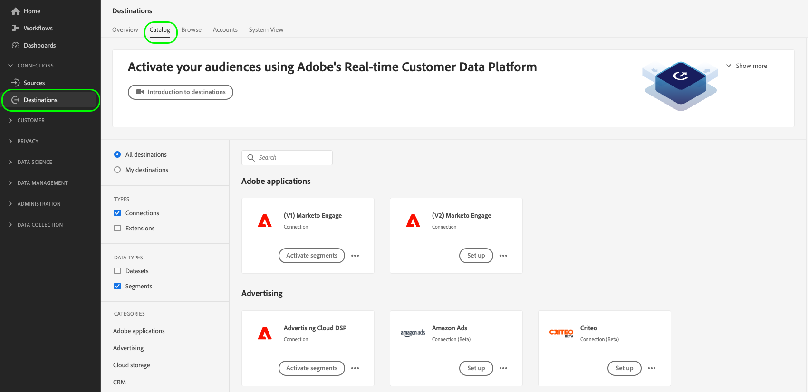
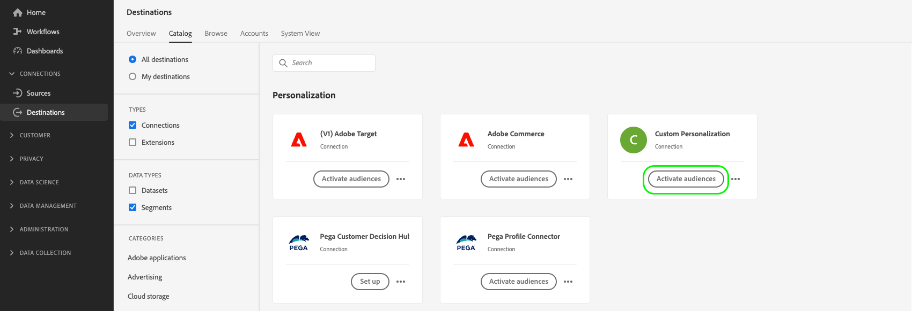

# Söka efter profilattribut i kanten i realtid

Adobe Experience Platform använder [Real-Time Customer Profile](../../profile/home.md) som enda källa till sanning för alla profildata. För snabb datahämtning i realtid används [edge-profiler](../../profile/edge-profiles.md), som är enkla profiler som distribueras i hela [Edge Network](../../collection/home.md#edge). Detta möjliggör snabb personalisering i realtid.

## Användningsfall {#use-cases}

Nedan visas två användningsområden där sökningar efter kantprofiler kan vara till hjälp.

* **Real-Time Personalization**: Hämta snabbt profilinformation från edge-profilen för att anpassa en användares upplevelse på webbplatsen.
* **Kundsupport**: Hämta profilinformation i realtid när en kund ringer en supportcenteragent.

På den här sidan beskrivs de steg som du måste följa för att söka efter edge-profildata i realtid, för att leverera personaliseringsupplevelser eller för att informera beslutsregler via program längre fram i kedjan.

## Terminologi och förutsättningar {#prerequisites}

När du konfigurerar det användningsfall som beskrivs på den här sidan använder du följande plattformskomponenter:

* [Datastreams](../../datastreams/overview.md): En datastream tar emot inkommande händelsedata från Web SDK och svarar med edge-profildata.
* [Sammanslagningsprinciper](../../segmentation/ui/segment-builder.md#merge-policies): Du skapar en [!UICONTROL Active-On-Edge] sammanfogningsprincip för att se till att kantprofilerna använder rätt profildata.
* [Anpassad Personalization-anslutning](../catalog/personalization/custom-personalization.md): Du konfigurerar en ny anpassad personaliseringsanslutning som skickar profilattributen till Edge Network.
* [Edge Network-API](../../server-api/overview.md): Du använder Edge Network-API:t [interaktiv datainsamling](../../server-api/interactive-data-collection.md) för att snabbt hämta profilattribut från kantprofilerna.

## Prestandaskydd {#guardrails}

Användningsexempel för Edge-profilsökning beror på de specifika säkerhetsbeskrivningar som beskrivs i tabellen nedan. Mer information om Edge Network API-skyddsutkast finns på [dokumentationssidan](https://developer.adobe.com/data-collection-apis/docs/getting-started/guardrails/).

| Tjänsten Edge Network | Edge Segmentering | Begäranden per sekund |
|---------|----------|---------|
| [Anpassat anpassningsmål](../catalog/personalization/custom-personalization.md) via [Edge Network API](https://developer.adobe.com/data-collection-apis/docs/api/) | Ja | 1500 |
| [Anpassat anpassningsmål](../catalog/personalization/custom-personalization.md) via [Edge Network API](https://developer.adobe.com/data-collection-apis/docs/api/) | Nej | 1500 |

## Steg 1: Skapa och konfigurera ett datastream {#create-datastream}

Följ stegen i dokumentationen för [datastream-konfigurationen](../../datastreams/configure.md#create-a-datastream) för att skapa ett nytt datastream med följande **[!UICONTROL Service]**-inställningar:

* **[!UICONTROL Service]**: [!UICONTROL Adobe Experience Platform]
* **[!UICONTROL Personalization Destinations]**: Aktiverad
* **[!UICONTROL Edge Segmentation]**: Aktivera det här alternativet om du behöver kantsegmentering. Om du bara är intresserad av att leta upp profilattribut på kanten, men inte vill segmentera baserat på kantprofilerna, låter du det här alternativet vara inaktiverat.


  <!-- >[!IMPORTANT]
    >
    >Enabling edge segmentation limits the maximum number of lookup requests to 1500 request per second. If you need a higher request throughput, disable edge segmentation for your datastream. See the [guardrails documentation](../guardrails.md#edge-destinations-activation) for detailed information. -->

  


## Steg 2: Konfigurera era målgrupper för edge-utvärdering {#audience-edge-evaluation}

Om du vill söka efter profilattribut i kanten måste målgrupperna konfigureras för kantutvärdering.

Kontrollera att [Active-on-Edge Merge Policy](../../segmentation/ui/segment-builder.md#merge-policies) har angetts som standard för de målgrupper som du tänker aktivera. Sammanslagningsprincipen [!DNL Active-On-Edge] säkerställer att målgrupperna hela tiden utvärderas [ vid sidan om ](../../segmentation/ui/edge-segmentation.md) och är tillgängliga för personalisering i realtid.

Följ instruktionerna på [skapa en sammanfogningsprincip](../../profile/merge-policies/ui-guide.md#create-a-merge-policy) och se till att aktivera alternativet **[!UICONTROL Active-On-Edge Merge Policy]**.

>[!IMPORTANT]
>
>Om era målgrupper använder en annan sammanfogningsprincip kan du inte hämta profilattribut från kanten och du kan inte utföra sökningar efter kantprofiler.

## Steg 3: Skicka profilattributsdata till Edge Network{#configure-custom-personalization-connection}

För att kunna slå upp kantprofiler, inklusive attribut och data om målgruppsmedlemskap, i realtid måste data göras tillgängliga på Edge Network. Därför måste du skapa en anslutning till ett **[!UICONTROL Custom Personalization With Attributes]**-mål och aktivera målgrupperna, inklusive de attribut som du vill söka efter kantprofilerna.

+++ Konfigurera en anpassad Personalization med attributanslutning

Följ självstudiekursen [för att skapa en målanslutning](../ui/connect-destination.md) om du vill ha mer information om hur du skapar en ny målanslutning.

När du konfigurerar det nya målet markerar du datastream som du skapade i [steg 1](#create-datastream) i fältet **[!UICONTROL Datastream ID]**. För **[!UICONTROL Integration alias]** kan du använda vilket värde som helst som hjälper dig att identifiera den här målanslutningen i framtiden, till exempel målnamnet.


+++

+++Aktivera dina målgrupper för anpassade Personalization med attributanslutningar

När du har skapat en **[!UICONTROL Custom Personalization With Attributes]**-anslutning kan du nu skicka profildata till Edge Network.

>[!IMPORTANT]
> 
> * Om du vill aktivera data och aktivera [mappningssteget](#mapping) för arbetsflödet behöver du behörigheterna **[!UICONTROL View Destinations]**, **[!UICONTROL Activate Destinations]**, **[!UICONTROL View Profiles]** och **[!UICONTROL View Segments]** [åtkomstkontroll](/help/access-control/home.md#permissions).
> 
> Läs [åtkomstkontrollsöversikten](/help/access-control/ui/overview.md) eller kontakta produktadministratören för att få den behörighet som krävs.

1. Gå till **[!UICONTROL Connections > Destinations]** och välj fliken **[!UICONTROL Catalog]**.

   

1. Hitta målkortet **[!UICONTROL Custom Personalization With Attributes]** och välj sedan **[!UICONTROL Activate audiences]**, så som visas i bilden nedan.

   

1. Markera målanslutningen som du tidigare konfigurerade och välj sedan **[!UICONTROL Next]**.

   

1. Välj målgrupper. Använd kryssrutorna till vänster om målgruppsnamnen för att välja de målgrupper som du vill aktivera för målet och välj sedan **[!UICONTROL Next]**.

   Du kan välja mellan flera typer av målgrupper, beroende på deras ursprung:

   * **[!UICONTROL Segmentation Service]**: Publiker som genererats i Experience Platform av segmenteringstjänsten. Mer information finns i [segmenteringsdokumentationen](../../segmentation/ui/overview.md).
   * **[!UICONTROL Custom upload]**: Publiker som genererats utanför Experience Platform och överförts till Platform som CSV-filer. Mer information om externa målgrupper finns i dokumentationen om att [importera en målgrupp](../../segmentation/ui/overview.md#import-audience).
   * Andra typer av målgrupper som kommer från andra Adobe-lösningar, till exempel [!DNL Audience Manager].

     

1. Välj de profilattribut som du vill ska vara tillgängliga för kantprofilerna.

   * **Välj källattribut**. Om du vill lägga till källattribut väljer du kontrollen **[!UICONTROL Add new field]** i kolumnen **[!UICONTROL Source field]** och söker efter eller navigerar till det önskade XDM-attributfältet, vilket visas nedan.

     

   * **Välj målattribut**. Om du vill lägga till målattribut markerar du kontrollen **[!UICONTROL Add new field]** i kolumnen **[!UICONTROL Target field]** och skriver in det anpassade attributnamnet som du vill mappa källattributet till.

     


När du är klar med mappningen av profilattribut väljer du **[!UICONTROL Next]**.

På sidan **[!UICONTROL Review]** kan du se en sammanfattning av ditt val. Välj **[!UICONTROL Cancel]** om du vill dela upp flödet, **[!UICONTROL Back]** om du vill ändra inställningarna eller **[!UICONTROL Finish]** om du vill bekräfta ditt val och börja skicka profildata till Edge Network.


+++

+++Godkänn principutvärdering

Om din organisation har köpt **Adobe Healthcare Shield** eller **Adobe Privacy &amp; Security Shield** väljer du **[!UICONTROL View applicable consent policies]** för att se vilka medgivandepolicyer som tillämpas och hur många profiler som inkluderas i aktiveringen som ett resultat av dem. Läs mer om [utvärdering av medgivandeprincip](/help/data-governance/enforcement/auto-enforcement.md#consent-policy-evaluation).

**Principkontroller av dataanvändning**

I steget **[!UICONTROL Review]** söker Experience Platform även efter överträdelser av dataanvändningsprinciper. Nedan visas ett exempel där en princip överträds. Du kan inte slutföra arbetsflödet för målgruppsaktivering förrän du har löst överträdelsen. Mer information om hur du löser policyöverträdelser finns i [brott mot dataanvändningsprinciper](/help/data-governance/enforcement/auto-enforcement.md#data-usage-violation) i dokumentationsavsnittet för datastyrning.


+++

+++Filter målgrupper

I steget **[!UICONTROL Review]** kan du använda de tillgängliga filtren på sidan för att endast visa de målgrupper vars schema eller mappning har uppdaterats som en del av det här arbetsflödet. Du kan också växla vilka tabellkolumner som du vill se.


Om du är nöjd med ditt val och inga principöverträdelser har identifierats, kan du bekräfta ditt val genom att välja **[!UICONTROL Finish]**.

+++

## Steg 4: Slå upp profilattributen på kanten {#configure-edge-profile-lookup}

Nu bör du ha [konfigurerat din datastream](#create-datastream), [skapat en ny anpassad Personalization med attributmålanslutning](#configure-destination) och du har använt den här anslutningen för att [skicka profilattributen](#activate-audiences) som du kan söka efter i Edge Network.

Nästa steg är att konfigurera din personaliseringslösning för att hämta profilattribut från edge-profilerna.

>[!IMPORTANT]
>
>Profilattribut kan innehålla känsliga data. För att skydda dessa data måste du hämta profilattributen via [Edge Network API](../../server-api/overview.md). Du måste dessutom hämta profilattributen via Edge Network API:t [för interaktiv datainsamling ](../../server-api/interactive-data-collection.md) för att API-anropen ska kunna autentiseras.
><br>Om du inte uppfyller kraven ovan kommer personaliseringen endast att baseras på målgruppsmedlemskap och profilattributen kommer inte att vara tillgängliga för dig.

Datastream som du konfigurerade i [steg 1](#create-datastream) är nu klar att acceptera inkommande händelsedata och svara med edge-profilinformation.

Konfigurera integreringen för att hämta kantprofilinformation enligt exemplen nedan.

### Begäran {#request}

Om du vill hämta kantprofildata skickar du ett tomt `POST`-anrop till `/interact`-slutpunkten, med den primära identiteten som du söker efter profilattribut för i händelsen, vilket visas nedan.

```shell
curl -X POST "https://server.adobedc.net/ee/v2/interact?dataStreamId={DATASTREAM_ID}" 
-H "Authorization: Bearer {TOKEN}" 
-H "x-gw-ims-org-id: {ORG_ID}" 
-H "x-api-key: {API_KEY}" 
-H "Content-Type: application/json" 
-d '{
    "event":
    {
        "xdm": {
            "identityMap": {
                "Email": [
                    {  
                        "id":"test123@adobetest.com",
                        "primary":true
                    }
                ]
            }
        }
    }
    
}'
```

| Parameter | Typ | Obligatoriskt | Beskrivning |
| --- | --- | --- | --- |
| `dataStreamId` | `String` | Ja. | Datastream-ID för datastream som du skapade i [steg 1](#create-datastream). |

### Svar {#response}

Ett lyckat svar returnerar HTTP-statusen `200 OK`, med ett `Handle`-objekt som innehåller information som liknar exemplen på flikarna nedan, beroende på om profilen hittas på kanten eller inte.

>[!NOTE]
>
>API-svaren är modulära och objektet `handle` kan innehålla flera `payload`-objekt av olika typer. Informationen som är relaterad till sökningen efter kantprofiler grupperas under objektet `payload` med `"type": "activation:pull"`,

>[!BEGINTABS]

>[!TAB Profilen finns på kanten]

Om profilen finns på kanten, beroende på vilka profilattribut och målgrupper som är aktiverade på kanten, kan du förvänta dig ett svar med attribut och målgruppsmedlemskap som liknar dem som anges nedan.

```json
{
  "requestId": "3c600138-d785-42ca-a025-bb725f4b5da9",
  "handle": [
    {
      "payload": [
        {
          "type": "profileLookup",
          "destinationId": "9218b727-ec59-4a46-b8b9-05503f138c5d",
          "alias": "rk-demo-custom-personalization-XXXX",
          "attributes": {
            "zip": {
              "value": "19000"
            },
            "firstName": {
              "value": "Test"
            },
            "lastName": {
              "value": "User123"
            },
            "gender": {
              "value": "male"
            },
            "city": {
              "value": "Philadelphia"
            },
            "state": {
              "value": "PA"
            },
            "email": {
              "value": "test123@adobetest.com"
            }
          },
          "segments": [
            {
              "id": "85018bd8-7ad1-4e17-ae30-8389c04bd3c0",
              "namespace": "ups"
            },
            {
              "id": "d09a8159-8b30-4178-b2f2-7a8c5e3168d9",
              "namespace": "ups"
            }
          ]
        }
      ],
      "type": "activation:pull",
      "eventIndex": 0
    }
  ]
}
```

Objektet `handle` innehåller den information som beskrivs i tabellen nedan.

| Parameter | Beskrivning |
|---------|----------|
| `payload` | Objektet `payload` som innehåller kantsökningsinformation. Svaret kan innehålla flera ytterligare `payload` objekt, som inte hör till kantsökningen. |
| `type` | Nyttolaster grupperas i svaret efter typ. Nyttolasttypen för edge-profilsökningen är alltid inställd på `profileLookup`. |
| `destinationId` | ID:t för **[!UICONTROL Custom Personalization]**-anslutningsinstansen som du skapade i [steg 3](#configure-custom-personalization-connection). |
| `alias` | Aliaset för målanslutningen, som konfigureras av användaren när de skapar målanslutningen [Anpassad Personalization](../catalog/personalization/custom-personalization.md). |
| `attributes` | Den här arrayen innehåller kantprofilattributen för de målgrupper som du aktiverade i [steg 3](#configure-custom-personalization-connection). |
| `segments` | Den här arrayen innehåller de målgrupper som du har aktiverat i [steg 3](#configure-custom-personalization-connection). |
| `type` | `handle` objekt grupperas efter typ. Vid användning av sökningar efter kantprofil är typen för `handle`-objektet alltid `activation:pull`. |
| `eventIndex` | Edge Network får händelser från klienten i form av arrayer. Ordningen på händelserna i arrayen bevaras under bearbetningen och återspeglas av detta index. Händelseindexeringen börjar med `0`. |

>[!TAB Profilen finns inte på kanten]

Om profilen inte finns på kanten kan du förvänta dig ett svar som liknar det nedan.

```json
{
  "requestId": "531b541a-4541-419e-ac99-fd7e452f0c0f",
  "handle": [
    {
      "payload": [],
      "type": "activation:pull",
      "eventIndex": 0
    }
  ]
}
```

Objektet `handle` innehåller den information som beskrivs i tabellen nedan.

| Parameter | Beskrivning |
|---------|----------|
| `payload` | När profilen inte finns på kanten är objektet `payload` tomt. |
| `type` | `payload` objekt grupperas efter typ. Vid användning av sökningar efter kantprofil är typen för `payload`-objektet alltid `activation:pull`. |
| `eventIndex` | Edge Network får händelser från klienten i form av arrayer. Ordningen på händelserna i arrayen bevaras under bearbetningen och återspeglas av detta index. Händelseindexeringen börjar med `0`. |

>[!ENDTABS]

>[!SUCCESS]
>
>Om ni har konfigurerat integreringen korrekt har ni nu tillgång till kantprofildata och kan använda attributen och målgruppsmedlemskapet i era edge-profiler för att utlösa personalisering i realtid i er personaliseringsmotor längre fram i kedjan.

## Slutsats {#conclusion}

Genom att följa stegen ovan kan ni effektivt slå upp edge-profilattribut i realtid, vilket möjliggör personaliserade upplevelser och välgrundat beslutsfattande via program i senare led.
