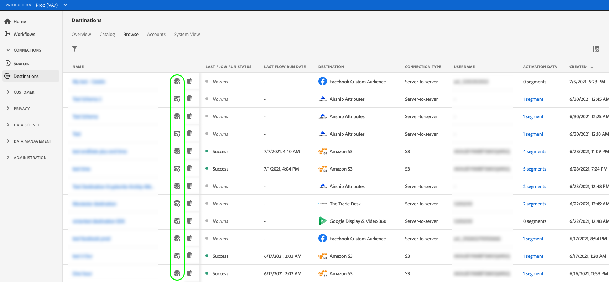

# Aktivera målgruppsdata för att direktuppspela segmentexportmål

## Översikt {#overview}

I den här artikeln förklaras det arbetsflöde som krävs för att aktivera målgruppsdata i Adobe Experience Platform segmentdirektuppspelningsmål.

## Förutsättningar {#prerequisites}

Om du vill aktivera data till mål måste du ha [anslutit till ett mål](./connect-destination.md). Om du inte redan har gjort det går du till [målkatalogen](../catalog/overview.md), bläddrar bland de mål som stöds och konfigurerar det mål som du vill använda.

## Välj mål {#select-destination}

1. Gå till **[!UICONTROL Connections > Destinations]** och välj fliken **[!UICONTROL Browse]**.

   

1. Markera **[!UICONTROL Add segments]**-knappen som motsvarar målet där du vill aktivera dina segment, vilket visas i bilden nedan.

   

1. Gå till nästa avsnitt för att [markera dina segment](#select-segments).

## Välj segment {#select-segments}

Använd kryssrutorna till vänster om segmentnamnen för att markera de segment som du vill aktivera för målet och välj sedan **[!UICONTROL Next]**.

## Mappa attribut och identiteter {#mapping}

>[!CONTEXTUALHELP]
>id="platform_destinations_activate_applytransformation"
>title="Använd omformning"
>abstract="Markera det här alternativet om du vill att Adobe Experience Platform automatiskt ska hash-koda dem vid aktiveringen när du använder ohashed-källfält."

>[!IMPORTANT]
>
>Det här steget gäller endast vissa mål för segmentdirektuppspelning. Om destinationerna inte har ett **[!UICONTROL Mapping]**-steg går du vidare till [Schemalägg segmentexport](#scheduling).

Vissa mål för segmentdirektuppspelning kräver att du väljer källattribut eller identitetsnamnutrymmen som ska mappas som målidentiteter i målet.

1. Välj **[!UICONTROL Add new mapping]** på sidan **[!UICONTROL Mapping]**.

   

1. Markera pilen till höger om **[!UICONTROL Source field]**-posten.

   

1. På sidan **[!UICONTROL Select source field]** använder du alternativen **[!UICONTROL Select attributes]** eller **[!UICONTROL Select identity namespace]** för att växla mellan de två kategorierna med tillgängliga källfält. Välj de tillgängliga [!DNL XDM]-profilattributen och identitetsnamnutrymmena de som du vill mappa till målet och välj sedan **[!UICONTROL Select]**.

   

1. Markera knappen till höger om **[!UICONTROL Target field]**-posten.

   

1. På sidan **[!UICONTROL Select target field]** markerar du det målidentitetsnamnområde som du vill mappa källfältet till och väljer **[!UICONTROL Select]**.

   

1. Om du vill lägga till fler mappningar upprepar du steg 1 till 5.

### Mappningsexempel: aktivera målgruppsdata i [!DNL Facebook Custom Audience] {#example-facebook}

Nedan visas ett exempel på korrekt identitetsmappning när målgruppsdata aktiveras i [!DNL Facebook Custom Audience].

Välja källfält:

* Välj namnutrymmet `Email` som källidentitet om de e-postadresser du använder inte hashas.
* Välj namnutrymmet `Email_LC_SHA256` som källidentitet om du hashade kundens e-postadresser vid dataöverföring i [!DNL Platform], enligt [!DNL Facebook] [e-posthashkrav](../catalog/social/facebook.md#email-hashing-requirements).
* Välj namnutrymmet `PHONE_E.164` som källidentitet om dina data består av icke-hash-kodade telefonnummer. [!DNL Platform] kommer att hash-koda telefonnumren så att de uppfyller  [!DNL Facebook] kraven.
* Välj namnutrymmet `Phone_SHA256` som källidentitet om du hashade telefonnummer vid dataöverföring till [!DNL Platform], enligt [!DNL Facebook] [krav på telefonnummer som hash-kodar](../catalog/social/facebook.md#phone-number-hashing-requirements).
* Välj namnutrymmet `IDFA` som källidentitet om dina data består av [!DNL Apple] enhets-ID:n.
* Välj namnutrymmet `GAID` som källidentitet om dina data består av [!DNL Android] enhets-ID:n.
* Välj namnutrymmet `Custom` som källidentitet om dina data består av andra typer av identifierare.

Markera målfält:

* Välj namnutrymmet `Email_LC_SHA256` som målidentitet när källnamnutrymmena är antingen `Email` eller `Email_LC_SHA256`.
* Välj namnutrymmet `Phone_SHA256` som målidentitet när källnamnutrymmena är antingen `PHONE_E.164` eller `Phone_SHA256`.
* Välj namnutrymmena `IDFA` eller `GAID` som mål-ID när källnamnutrymmena är `IDFA` eller `GAID`.
* Välj namnutrymmet `Extern_ID` som målidentitet när källnamnutrymmet är ett anpassat namnutrymme.

>[!IMPORTANT]
>
>Data från namnutrymmen som inte är hash-kodade hashas automatiskt av [!DNL Platform] vid aktiveringen.
> 
>Attributkälldata hashas inte automatiskt. När källfältet innehåller ohashade attribut bör du markera alternativet **[!UICONTROL Apply transformation]** så att [!DNL Platform] automatiskt hash-kodar data vid aktiveringen.

### Mappningsexempel: aktivera målgruppsdata i [!DNL Google Customer Match] {#example-gcm}

Detta är ett exempel på korrekt identitetsmappning när målgruppsdata aktiveras i [!DNL Google Customer Match].

Välja källfält:

* Välj namnutrymmet `Email` som källidentitet om de e-postadresser du använder inte hashas.
* Välj namnutrymmet `Email_LC_SHA256` som källidentitet om du hashade kundens e-postadresser vid dataöverföring i [!DNL Platform], enligt [!DNL Google Customer Match] [e-posthashkrav](../catalog/social/../advertising/google-customer-match.md).
* Välj namnutrymmet `PHONE_E.164` som källidentitet om dina data består av icke-hash-kodade telefonnummer. [!DNL Platform] kommer att hash-koda telefonnumren så att de uppfyller  [!DNL Google Customer Match] kraven.
* Välj namnutrymmet `Phone_SHA256_E.164` som källidentitet om du hashade telefonnummer vid dataöverföring till [!DNL Platform], enligt [!DNL Facebook] [krav på telefonnummer som hash-kodar](../catalog/social/../advertising/google-customer-match.md).
* Välj namnutrymmet `IDFA` som källidentitet om dina data består av [!DNL Apple] enhets-ID:n.
* Välj namnutrymmet `GAID` som källidentitet om dina data består av [!DNL Android] enhets-ID:n.
* Välj namnutrymmet `Custom` som källidentitet om dina data består av andra typer av identifierare.

Markera målfält:

* Välj namnutrymmet `Email_LC_SHA256` som målidentitet när källnamnutrymmena är antingen `Email` eller `Email_LC_SHA256`.
* Välj namnutrymmet `Phone_SHA256_E.164` som målidentitet när källnamnutrymmena är antingen `PHONE_E.164` eller `Phone_SHA256_E.164`.
* Välj namnutrymmena `IDFA` eller `GAID` som mål-ID när källnamnutrymmena är `IDFA` eller `GAID`.
* Välj namnutrymmet `User_ID` som målidentitet när källnamnutrymmet är ett anpassat namnutrymme.

Data från namnutrymmen som inte är hash-kodade hashas automatiskt av [!DNL Platform] vid aktiveringen.

Attributkälldata hashas inte automatiskt. När källfältet innehåller ohashade attribut bör du markera alternativet **[!UICONTROL Apply transformation]** så att [!DNL Platform] automatiskt hash-kodar data vid aktiveringen.

## Schemalägg segmentexport {#scheduling}

1. På sidan **[!UICONTROL Segment schedule]** markerar du varje segment och använder sedan väljarna **[!UICONTROL Start date]** och **[!UICONTROL End date]** för att konfigurera tidsintervallet för att skicka data till målet.

   

   * Vissa mål kräver att du väljer **[!UICONTROL Origin of audience]** för varje segment med hjälp av den nedrullningsbara menyn under kalenderväljarna. Om målet inte innehåller den här väljaren hoppar du över det här steget.

      

   * Vissa mål kräver att du manuellt mappar [!DNL Platform]-segment till deras motsvarighet i måldestinationen. Det gör du genom att markera varje segment och sedan ange motsvarande segment-ID från målplattformen i fältet **[!UICONTROL Mapping ID]**. Om målet inte innehåller det här fältet hoppar du över det här steget.

      

   * Vissa mål kräver att du anger ett **[!UICONTROL App ID]** när du aktiverar [!DNL IDFA]- eller [!DNL GAID]-segment. Om målet inte innehåller det här fältet hoppar du över det här steget.

      

1. Välj **[!UICONTROL Next]** om du vill gå till sidan [!UICONTROL Review].

## Granska {#review}

På sidan **[!UICONTROL Review]** visas en sammanfattning av ditt val. Välj **[!UICONTROL Cancel]** om du vill dela upp flödet, **[!UICONTROL Back]** om du vill ändra inställningarna eller **[!UICONTROL Finish]** om du vill bekräfta valet och börja skicka data till målet.

>[!IMPORTANT]
>
>I det här steget söker Adobe Experience Platform efter brott mot dataanvändningspolicyn. Nedan visas ett exempel där en princip överträds. Du kan inte slutföra arbetsflödet för segmentaktivering förrän du har löst konflikten. Mer information om hur du löser policyöverträdelser finns i [Politiska åtgärder](../../rtcdp/privacy/data-governance-overview.md#enforcement) i dokumentationsavsnittet för datastyrning.

Om inga principöverträdelser har identifierats markerar du **[!UICONTROL Finish]** för att bekräfta ditt val och börja skicka data till målet.

## Verifiera segmentaktivering {#verify}

Kontrollera destinationskontot. Om aktiveringen lyckades fylls målgrupperna i på målplattformen.

<!-- 
For [!DNL Facebook Custom Audience], a successful activation means that a [!DNL Facebook] custom audience would be created programmatically in [[!UICONTROL Facebook Ads Manager]](https://www.facebook.com/adsmanager/manage/). Segment membership in the audience would be added and removed as users are qualified or disqualified for the activated segments.

>[!TIP]
>
>The integration between Adobe Experience Platform and [!DNL Facebook] supports historical audience backfills. All historical segment qualifications are sent to [!DNL Facebook] when you activate the segments to the destination.
-->
