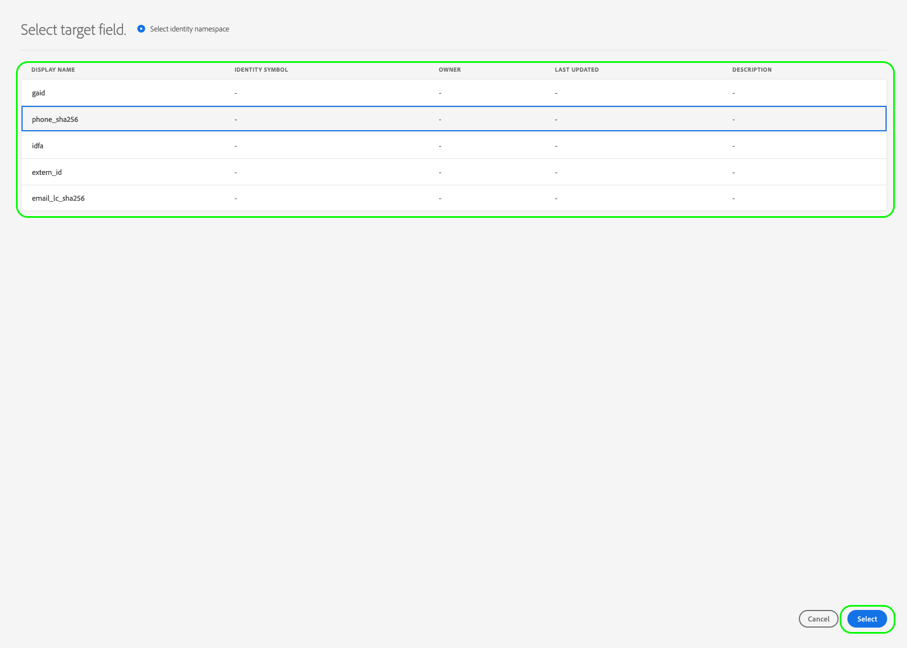

# Aktivera målgrupper för direktuppspelningsmål

>[!IMPORTANT]
> 
> * Om du vill aktivera målgrupper och aktivera [mappningssteget](#mapping) i arbetsflödet behöver du behörigheterna **[!UICONTROL View Destinations]**, **[!UICONTROL Activate Destinations]**, **[!UICONTROL View Profiles]** och **[!UICONTROL View Segments]** [åtkomstkontroll](/help/access-control/home.md#permissions).
> * Om du vill aktivera målgrupper utan att gå igenom [mappningssteget](#mapping) i arbetsflödet behöver du behörigheterna **[!UICONTROL View Destinations]**, **[!UICONTROL Activate Segment without Mapping]**, **[!UICONTROL View Profiles]** och **[!UICONTROL View Segments]** [åtkomstkontroll](/help/access-control/home.md#permissions).
> * Om du vill exportera *identiteter* måste du ha **[!UICONTROL View Identity Graph]** [åtkomstkontrollbehörighet](/help/access-control/home.md#permissions).   {width="100" zoomable="yes"}
> 
> Läs [åtkomstkontrollsöversikten](/help/access-control/ui/overview.md) eller kontakta produktadministratören för att få den behörighet som krävs.

## Översikt {#overview}

I den här artikeln förklaras det arbetsflöde som krävs för att aktivera målgrupper i Adobe Experience Platform direktuppspelningsmål.

## Förhandskrav {#prerequisites}

Om du vill aktivera målgrupper till mål måste du ha [anslutit till ett mål](./connect-destination.md). Om du inte redan har gjort det går du till [målkatalogen](../catalog/overview.md), bläddrar bland de mål som stöds och konfigurerar det mål som du vill använda.

## Välj mål {#select-destination}

1. Gå till **[!UICONTROL Connections > Destinations]** och välj fliken **[!UICONTROL Catalog]**.

   

1. Välj **[!UICONTROL Activate audiences]** på det kort som motsvarar målet där du vill aktivera målgrupperna, vilket visas i bilden nedan.

   

1. Markera målanslutningen som du vill använda för att aktivera målgrupperna och välj sedan **[!UICONTROL Next]**.

   

1. Gå till nästa avsnitt för att [välja dina målgrupper](#select-audiences).

## Välj målgrupper {#select-audiences}

Om du vill välja vilka målgrupper du vill aktivera för målet använder du kryssrutorna till vänster om målgruppsnamnen och väljer sedan **[!UICONTROL Next]**.

Du kan välja mellan flera typer av målgrupper, beroende på deras ursprung:

* **[!UICONTROL Segmentation Service]**: Publiker som genererats inom Experience Platform av segmenteringstjänsten. Mer information finns i [segmenteringsdokumentationen](../../segmentation/ui/overview.md).
* **[!UICONTROL Custom upload]**: Publiker som genererats utanför Experience Platform och överförts till Experience Platform som CSV-filer. Mer information om externa målgrupper finns i dokumentationen om att [importera en målgrupp](../../segmentation/ui/audience-portal.md#import-audience).
* Andra typer av målgrupper som kommer från andra Adobe-lösningar, till exempel [!DNL Audience Manager].

## Mappa attribut och identiteter {#mapping}

>[!IMPORTANT]
>
>Det här steget gäller endast vissa målgruppsmål för direktuppspelning. Om målet inte har ett **[!UICONTROL Mapping]**-steg går du till [målgruppsplanering](#scheduling).
>
>När du aktiverar målgrupper till direktuppspelningsmål måste du även mappa *minst ett målidentitetsnamnområde*, förutom målprofilsattribut. Annars aktiveras inte målgrupperna till målplattformen.
>&#x200B;>  {zoomable="yes"}

Vissa målgruppsmål för direktuppspelning kräver att du väljer källattribut eller identitetsnamnutrymmen som ska mappas som målidentiteter i målet.

1. Välj **[!UICONTROL Mapping]** på sidan **[!UICONTROL Add new mapping]**.

   

1. Markera pilen till höger om posten **[!UICONTROL Source field]**.

   

1. På sidan **[!UICONTROL Select source field]** använder du alternativen **[!UICONTROL Select attributes]** eller **[!UICONTROL Select identity namespace]** för att växla mellan de två kategorierna med tillgängliga källfält. Välj de tillgängliga profilattributen och identitetsnamnutrymmena för [!DNL XDM] och markera dem som du vill mappa till målet. Välj sedan **[!UICONTROL Select]**.

   Använd växlingsknappen **[!UICONTROL Show only fields with data]** om du bara vill visa schemafält med värden. Som standard visas endast ifyllda schemafält.

   

1. Markera knappen till höger om posten **[!UICONTROL Target field]**.

   

1. På sidan **[!UICONTROL Select target field]** markerar du det målidentitetsnamnområde som du vill mappa källfältet till och väljer **[!UICONTROL Select]**.

   

1. Om du vill lägga till fler mappningar upprepar du steg 1 till 5.

### Använd omformning {#apply-transformation}

>[!CONTEXTUALHELP]
>id="platform_destinations_activate_applytransformation"
>title="Använd omformning"
>abstract="Markera det här alternativet om du vill att Adobe Experience Platform automatiskt ska hash-koda dem vid aktiveringen när du använder ohashed-källfält."

När du mappar ohash-kodade källattribut till målattribut som målet förväntar ska hash-kodas (till exempel: `email_lc_sha256` eller `phone_sha256`), kontrollerar du alternativet **Använd omformning** så att Adobe Experience Platform automatiskt hash-kodar källattributen vid aktiveringen.

## Schemalägg målgruppsexport {#scheduling}

>[!CONTEXTUALHELP]
>id="platform_destinations_activate_enddate"
>title="Slutdatum"
>abstract="Det går inte att lägga till ett slutdatum för målgruppsschemat."

Som standard visar sidan **[!UICONTROL Audience schedule]** bara de nyvalda målgrupperna som du valde i det aktuella aktiveringsflödet.

Om du vill se alla målgrupper som aktiveras till ditt mål använder du filtreringsalternativet och inaktiverar filtret **[!UICONTROL Show new audiences only]**.

1. På sidan **[!UICONTROL Audience schedule]** väljer du varje målgrupp och använder sedan väljarna **[!UICONTROL Start date]** och **[!UICONTROL End date]** för att konfigurera tidsintervallet för att skicka data till målet.

   

   * Vissa mål kräver att du väljer **[!UICONTROL Origin of audience]** för varje målgrupp med hjälp av listrutan under kalenderväljarna. Om målet inte innehåller den här väljaren hoppar du över det här steget.

     

   * Vissa mål kräver att du manuellt mappar [!DNL Experience Platform] målgrupper till deras motsvarighet i måldestinationen. För att göra detta väljer du varje målgrupp och anger sedan motsvarande målgrupps-ID från målplattformen i fältet **[!UICONTROL Mapping ID]**. Om målet inte innehåller det här fältet hoppar du över det här steget.

     

   * Vissa mål kräver att du anger en **[!UICONTROL App ID]** när du aktiverar [!DNL IDFA] eller [!DNL GAID] målgrupper. Om målet inte innehåller det här fältet hoppar du över det här steget.

     

1. Välj **[!UICONTROL Next]** om du vill gå till sidan [!UICONTROL Review].

## Granska {#review}

På sidan **[!UICONTROL Review]** kan du se en sammanfattning av ditt val. Välj **[!UICONTROL Cancel]** om du vill dela upp flödet, **[!UICONTROL Back]** om du vill ändra inställningarna eller **[!UICONTROL Finish]** om du vill bekräfta ditt val och börja skicka data till målet.

### Principutvärdering av samtycke {#consent-policy-evaluation}

Om din organisation har köpt **Adobe Healthcare Shield** eller **Adobe Privacy &amp; Security Shield** väljer du **[!UICONTROL View applicable consent policies]** för att se vilka medgivandepolicyer som tillämpas och hur många profiler som inkluderas i aktiveringen som ett resultat av dem. Läs mer om [utvärdering av medgivandeprincip](/help/data-governance/enforcement/auto-enforcement.md#consent-policy-evaluation).

### Kontroller av policyer för dataanvändning {#data-usage-policy-checks}

I steget **[!UICONTROL Review]** söker Experience Platform även efter överträdelser av dataanvändningsprinciper. Nedan visas ett exempel där en princip överträds. Du kan inte slutföra arbetsflödet för målgruppsaktivering förrän du har löst överträdelsen. Mer information om hur du löser policyöverträdelser finns i [brott mot dataanvändningsprinciper](/help/data-governance/enforcement/auto-enforcement.md#data-usage-violation) i dokumentationsavsnittet för datastyrning.

### Filtrera målgrupper {#filter-audiences}

I det här steget kan du även använda de tillgängliga filtren på sidan för att visa endast de målgrupper vars schema eller mappning har uppdaterats som en del av det här arbetsflödet. Du kan också växla vilka tabellkolumner som du vill se.

Om du är nöjd med ditt val och inga principöverträdelser har identifierats, markerar du **[!UICONTROL Finish]** för att bekräfta ditt val och börja skicka data till målet.

## Verifiera målgruppsaktivering {#verify}

Mer information om hur du övervakar dataflödet till dina mål finns i [dokumentationen för målövervakning](../../dataflows/ui/monitor-destinations.md).

<!-- 
For [!DNL Facebook Custom Audience], a successful activation means that a [!DNL Facebook] custom audience would be created programmatically in [[!UICONTROL Facebook Ads Manager]](https://www.facebook.com/adsmanager/manage/). Audience membership in the audience would be added and removed as users are qualified or disqualified for the activated audiences.

>[!TIP]
>
>The integration between Adobe Experience Platform and [!DNL Facebook] supports historical audience backfills. All historical audience qualifications are sent to [!DNL Facebook] when you activate the audiences to the destination.
-->
