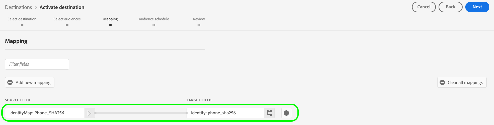

# Aktivera målgrupper för direktuppspelningsmål

>[!IMPORTANT]
> 
> * Så här aktiverar du målgrupper och aktiverar [mappningssteg](#mapping) i arbetsflödet behöver du **[!UICONTROL View Destinations]**, **[!UICONTROL Activate Destinations]**, **[!UICONTROL View Profiles]** och **[!UICONTROL View Segments]** [behörigheter för åtkomstkontroll](/help/access-control/home.md#permissions).
> * Så här aktiverar du målgrupper utan att gå igenom [mappningssteg](#mapping) i arbetsflödet behöver du **[!UICONTROL View Destinations]**, **[!UICONTROL Activate Segment without Mapping]**, **[!UICONTROL View Profiles]** och **[!UICONTROL View Segments]** [behörigheter för åtkomstkontroll](/help/access-control/home.md#permissions).
>* Exportera *identiteter* behöver du **[!UICONTROL View Identity Graph]** [behörighet för åtkomstkontroll](/help/access-control/home.md#permissions).   {width="100" zoomable="yes"}
> 
> Läs [åtkomstkontroll - översikt](/help/access-control/ui/overview.md) eller kontakta produktadministratören för att få de behörigheter som krävs.

## Översikt {#overview}

I den här artikeln förklaras det arbetsflöde som krävs för att aktivera målgrupper i Adobe Experience Platform direktuppspelningsmål.

## Förhandskrav {#prerequisites}

Om du vill aktivera målgrupper till mål måste du ha lyckats [ansluten till ett mål](./connect-destination.md). Om du inte redan har gjort det går du till [målkatalog](../catalog/overview.md), bläddra bland de mål som stöds och konfigurera det mål som du vill använda.

## Välj mål {#select-destination}

1. Gå till **[!UICONTROL Connections > Destinations]** och väljer **[!UICONTROL Catalog]** -fliken.

   

1. Välj **[!UICONTROL Activate audiences]** på kortet som motsvarar destinationen där du vill aktivera målgrupperna, vilket visas i bilden nedan.

   

1. Välj den målanslutning som du vill använda för att aktivera dina målgrupper och välj sedan **[!UICONTROL Next]**.

   

1. Gå till nästa avsnitt till [välj era målgrupper](#select-audiences).

## Välj målgrupper {#select-audiences}

Om du vill välja vilka målgrupper du vill aktivera för målet använder du kryssrutorna till vänster om målgruppsnamnen och väljer sedan **[!UICONTROL Next]**.

Du kan välja mellan flera typer av målgrupper, beroende på deras ursprung:

* **[!UICONTROL Segmentation Service]**: Målgrupper som genererats i Experience Platform av segmenteringstjänsten. Se [segmenteringsdokumentation](../../segmentation/ui/overview.md) för mer information.
* **[!UICONTROL Custom upload]**: Publiker som genererats utanför Experience Platform och överförts till Platform som CSV-filer. Mer information om externa målgrupper finns i dokumentationen om [importera en publik](../../segmentation/ui/audience-portal.md#import-audience).
* Andra typer av målgrupper som härrör från andra Adobe-lösningar, t.ex. [!DNL Audience Manager].

## Mappa attribut och identiteter {#mapping}

>[!IMPORTANT]
>
>Det här steget gäller endast vissa målgruppsmål för direktuppspelning. Om målet inte har en **[!UICONTROL Mapping]** steg, hoppa till [målgruppsplanering](#scheduling).
>
>När du aktiverar målgrupper till direktuppspelningsmål måste du också mappa *minst ett namnutrymme för målidentitet*förutom målprofilsattribut. Annars aktiveras inte målgrupperna till målplattformen.
>  {zoomable="yes"}

Vissa målgruppsmål för direktuppspelning kräver att du väljer källattribut eller identitetsnamnutrymmen som ska mappas som målidentiteter i målet.

1. I **[!UICONTROL Mapping]** sida, markera **[!UICONTROL Add new mapping]**.

   

1. Markera pilen till höger om **[!UICONTROL Source field]** post.

   

1. I **[!UICONTROL Select source field]** sidan använder du **[!UICONTROL Select attributes]** eller **[!UICONTROL Select identity namespace]** för att växla mellan de två kategorierna med tillgängliga källfält. Från tillgängliga [!DNL XDM] profilattribut och identitetsnamnutrymmen, markera de som du vill mappa till målet och välj sedan **[!UICONTROL Select]**.

   Använd **[!UICONTROL Show only fields with data]** växla till att endast visa schemafält med värden. Som standard visas endast ifyllda schemafält.

   

1. Markera knappen till höger om **[!UICONTROL Target field]** post.

   

1. I **[!UICONTROL Select target field]** väljer du det målidentitetsnamnutrymme som du vill mappa källfältet till och väljer **[!UICONTROL Select]**.

   

1. Om du vill lägga till fler mappningar upprepar du steg 1 till 5.

### Använd omformning {#apply-transformation}

>[!CONTEXTUALHELP]
>id="platform_destinations_activate_applytransformation"
>title="Använd omformning"
>abstract="Markera det här alternativet om du vill att Adobe Experience Platform automatiskt ska hash-koda dem vid aktiveringen när du använder ohashed-källfält."

När du mappar ohashade källattribut till målattribut som målet förväntar sig ska hash-kodas (till exempel: `email_lc_sha256` eller `phone_sha256`), kontrollera **Använd omformning** att Adobe Experience Platform automatiskt ska hash-koda källattributen vid aktiveringen.

## Schemalägg målgruppsexport {#scheduling}

>[!CONTEXTUALHELP]
>id="platform_destinations_activate_enddate"
>title="Slutdatum"
>abstract="Det går inte att lägga till ett slutdatum för målgruppsschemat."

Som standard är **[!UICONTROL Audience schedule]** visas endast de nyvalda målgrupperna som du valde i det aktuella aktiveringsflödet.

Om du vill se alla målgrupper som aktiveras till destinationen använder du filteralternativet och inaktiverar **[!UICONTROL Show new audiences only]** filter.

1. På **[!UICONTROL Audience schedule]** väljer du varje målgrupp och använder sedan **[!UICONTROL Start date]** och **[!UICONTROL End date]** väljare för att konfigurera tidsintervallet för att skicka data till målet.

   

   * Vissa mål kräver att du väljer **[!UICONTROL Origin of audience]** för varje målgrupp med hjälp av listrutan under kalenderväljarna. Om målet inte innehåller den här väljaren hoppar du över det här steget.

     

   * Vissa mål kräver att du mappar manuellt [!DNL Platform] målgrupper till deras motsvarighet i måldestinationen. För att göra detta väljer du varje målgrupp och anger sedan motsvarande målgrupps-ID i målplattformen i dialogrutan **[!UICONTROL Mapping ID]** fält. Om målet inte innehåller det här fältet hoppar du över det här steget.

     

   * Vissa mål kräver att du anger en **[!UICONTROL App ID]** vid aktivering [!DNL IDFA] eller [!DNL GAID] målgrupper. Om målet inte innehåller det här fältet hoppar du över det här steget.

     

1. Välj **[!UICONTROL Next]** för att gå till [!UICONTROL Review] sida.

## Granska {#review}

På **[!UICONTROL Review]** kan du se en sammanfattning av markeringen. Välj **[!UICONTROL Cancel]** för att bryta upp flödet, **[!UICONTROL Back]** för att ändra dina inställningar, eller **[!UICONTROL Finish]** för att bekräfta ditt val och börja skicka data till målet.

### Principutvärdering av samtycke {#consent-policy-evaluation}

Om din organisation har köpt **Adobe Healthcare Shield** eller **Adobe Privacy &amp; Security Shield**, markera **[!UICONTROL View applicable consent policies]** för att se vilka regler för samtycke som tillämpas och hur många profiler som inkluderas i aktiveringen till följd av dessa. Läs om [utvärdering av godkännandepolicy](/help/data-governance/enforcement/auto-enforcement.md#consent-policy-evaluation) för mer information.

### Kontroller av policyer för dataanvändning {#data-usage-policy-checks}

I **[!UICONTROL Review]** Experience Platform kontrollerar också om dataanvändningspolicyn har överträtts. Nedan visas ett exempel där en princip överträds. Du kan inte slutföra arbetsflödet för målgruppsaktivering förrän du har löst överträdelsen. Mer information om hur du löser policyöverträdelser finns i [brott mot dataanvändningsprinciper](/help/data-governance/enforcement/auto-enforcement.md#data-usage-violation) i dokumentationsavsnittet för datastyrning.

### Filtrera målgrupper {#filter-audiences}

I det här steget kan du även använda de tillgängliga filtren på sidan för att visa endast de målgrupper vars schema eller mappning har uppdaterats som en del av det här arbetsflödet. Du kan också växla vilka tabellkolumner som du vill se.

Om du är nöjd med ditt val och inga policyöverträdelser har identifierats väljer du **[!UICONTROL Finish]** för att bekräfta ditt val och börja skicka data till målet.

## Verifiera målgruppsaktivering {#verify}

Kontrollera [dokumentation för målövervakning](../../dataflows/ui/monitor-destinations.md) om du vill ha detaljerad information om hur du övervakar dataflödet till dina mål.

<!-- 
For [!DNL Facebook Custom Audience], a successful activation means that a [!DNL Facebook] custom audience would be created programmatically in [[!UICONTROL Facebook Ads Manager]](https://www.facebook.com/adsmanager/manage/). Audience membership in the audience would be added and removed as users are qualified or disqualified for the activated audiences.

>[!TIP]
>
>The integration between Adobe Experience Platform and [!DNL Facebook] supports historical audience backfills. All historical audience qualifications are sent to [!DNL Facebook] when you activate the audiences to the destination.
-->
