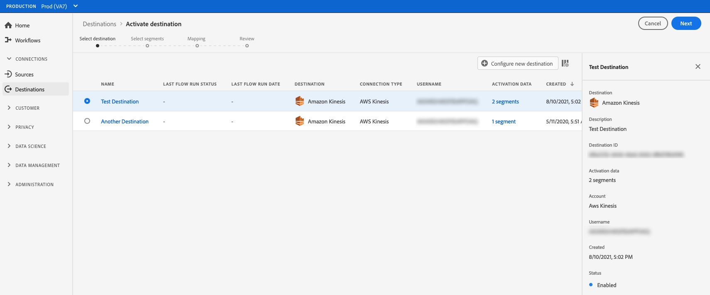

# Aktivera målgrupper för att direktuppspela exportmål för profiler

>[!IMPORTANT]
> 
> * Om du vill aktivera data och aktivera [mappningssteget](#mapping) för arbetsflödet behöver du behörigheterna **[!UICONTROL View Destinations]**, **[!UICONTROL Activate Destinations]**, **[!UICONTROL View Profiles]** och **[!UICONTROL View Segments]** [åtkomstkontroll](/help/access-control/home.md#permissions).
> * Om du vill aktivera data utan att gå igenom [mappningssteget](#mapping) i arbetsflödet behöver du behörigheterna **[!UICONTROL View Destinations]**, **[!UICONTROL Activate Segment without Mapping]**, **[!UICONTROL View Profiles]** och **[!UICONTROL View Segments]** [åtkomstkontroll](/help/access-control/home.md#permissions).
> 
> Läs [åtkomstkontrollsöversikten](/help/access-control/ui/overview.md) eller kontakta produktadministratören för att få den behörighet som krävs.

## Översikt {#overview}

I den här artikeln förklaras det arbetsflöde som krävs för att aktivera målgruppsdata i Adobe Experience Platform för att direktuppspela profilbaserade mål (kallas även [företagsmål](/help/destinations/destination-types.md#advanced-enterprise-destinations)).

Denna artikel gäller följande tre destinationer:

* [Amazon Kinesis](/help/destinations/catalog/cloud-storage/amazon-kinesis.md)
* [Azure Event Hubs](/help/destinations/catalog/cloud-storage/azure-event-hubs.md)
* [HTTP API-mål](/help/destinations/catalog/streaming/http-destination.md).

## Förhandskrav {#prerequisites}

Om du vill aktivera data till mål måste du ha [anslutit till ett mål](./connect-destination.md). Om du inte redan har gjort det går du till [målkatalogen](../catalog/overview.md), bläddrar bland de mål som stöds och konfigurerar det mål som du vill använda.

## Välj mål {#select-destination}

1. Gå till **[!UICONTROL Connections > Destinations]** och välj fliken **[!UICONTROL Catalog]**.

   

1. Välj **[!UICONTROL Activate audiences]** på det kort som motsvarar målet där du vill aktivera målgrupperna, vilket visas i bilden nedan.

   

1. Markera målanslutningen som du vill använda för att aktivera målgrupperna och välj sedan **[!UICONTROL Next]**.

   

1. Gå till nästa avsnitt för att [välja dina målgrupper](#select-audiences).

## Välj målgrupper {#select-audiences}

Om du vill välja vilka målgrupper du vill aktivera för målet använder du kryssrutorna till vänster om målgruppsnamnen och väljer sedan **[!UICONTROL Next]**.

Du kan välja mellan flera typer av målgrupper, beroende på deras ursprung:

* **[!UICONTROL Segmentation Service]**: Publiker som genererats inom Experience Platform av segmenteringstjänsten. Mer information finns i dokumentationen för [målportalen](../../segmentation/ui/audience-portal.md).
* **[!UICONTROL Custom upload]**: Publiker som genererats utanför Experience Platform och överförts till Experience Platform som CSV-filer. Mer information om externa målgrupper finns i dokumentationen om att [importera en målgrupp](../../segmentation/ui/audience-portal.md#import-audience).
* Andra typer av målgrupper som kommer från andra Adobe-lösningar, till exempel [!DNL Audience Manager].


## Välj profilattribut {#select-attributes}

I steget **[!UICONTROL Mapping]** väljer du de profilattribut som du vill skicka till målmålet.

1. Välj **[!UICONTROL Add new field]** på sidan **[!UICONTROL Select attributes]**.

   

1. Markera pilen till höger om posten **[!UICONTROL Schema field]**.

   

1. På sidan **[!UICONTROL Select field]** markerar du de XDM-attribut som du vill skicka till målet och väljer sedan **[!UICONTROL Select]**.

   

1. Om du vill lägga till fler fält upprepar du steg 1 till 3 och väljer sedan **[!UICONTROL Next]**.

## Granska {#review}

På sidan **[!UICONTROL Review]** kan du se en sammanfattning av ditt val. Välj **[!UICONTROL Cancel]** om du vill dela upp flödet, **[!UICONTROL Back]** om du vill ändra inställningarna eller **[!UICONTROL Finish]** om du vill bekräfta ditt val och börja skicka data till målet.


### Principutvärdering av samtycke {#consent-policy-evaluation}

[Principutvärdering av samtycke](/help/data-governance/enforcement/auto-enforcement.md#consent-policy-evaluation) stöds för närvarande inte i exporter till de tre företagsmålen - Amazon Kinesis, Azure Event Hubs och HTTP API.

Detta innebär att profiler som inte har samtyckt till att vara *som mål inkluderas* i exporten till dessa tre mål.

<!--

If your organization purchased **Adobe Healthcare Shield** or **Adobe Privacy & Security Shield**, select **[!UICONTROL View applicable consent policies]** to see which consent policies are applied and how many profiles are included in the activation as a result of them. Read about [consent policy evaluation](/help/data-governance/enforcement/auto-enforcement.md#consent-policy-evaluation) for more information.

-->

### Kontroller av policyer för dataanvändning {#data-usage-policy-checks}

I steget **[!UICONTROL Review]** söker Experience Platform även efter överträdelser av dataanvändningsprinciper. Nedan visas ett exempel där en princip överträds. Du kan inte slutföra arbetsflödet för målgruppsaktivering förrän du har löst överträdelsen. Mer information om hur du löser policyöverträdelser finns i [brott mot dataanvändningsprinciper](/help/data-governance/enforcement/auto-enforcement.md#data-usage-violation) i dokumentationsavsnittet för datastyrning.


### Filtrera målgrupper {#filter-audiences}

I det här steget kan du även använda de tillgängliga filtren på sidan för att visa endast de målgrupper vars schema eller mappning har uppdaterats som en del av det här arbetsflödet.


Om du är nöjd med ditt val och inga principöverträdelser har identifierats, markerar du **[!UICONTROL Finish]** för att bekräfta ditt val och börja skicka data till målet.

## Verifiera målgruppsaktivering {#verify}

Dina exporterade [!DNL Experience Platform]-data kommer in i måldestinationen i JSON-format. Händelsen nedan innehåller till exempel e-postadressattributet för en profil som har kvalificerats för en viss målgrupp och avslutat en annan målgrupp. Identiteterna för den här potentiella kunden är `ECID` och `email_lc_sha256`.

```json
{
  "person": {
    "email": "yourstruly@adobe.com"
  },
  "segmentMembership": {
    "ups": {
      "7841ba61-23c1-4bb3-a495-00d3g5fe1e93": {
        "lastQualificationTime": "2020-05-25T21:24:39Z",
        "status": "exited"
      },
      "59bd2fkd-3c48-4b18-bf56-4f5c5e6967ae": {
        "lastQualificationTime": "2020-05-25T23:37:33Z",
        "status": "realized"
      }
    }
  },
  "identityMap": {
    "ecid": [
      {
        "id": "14575006536349286404619648085736425115"
      },
      {
        "id": "66478888669296734530114754794777368480"
      }
    ],
    "email_lc_sha256": [
      {
        "id": "655332b5fa2aea4498bf7a290cff017cb4"
      },
      {
        "id": "66baf76ef9de8b42df8903f00e0e3dc0b7"
      }
    ]
  }
}
```
