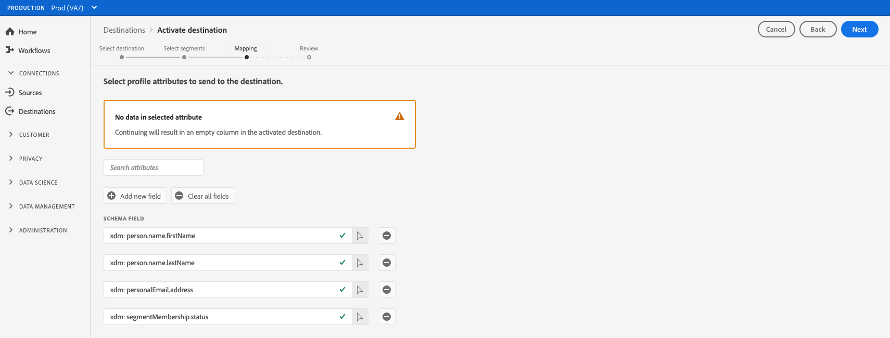

# Aktivera målgruppsdata till exportmål för direktuppspelningsprofiler

## Översikt {#overview}

I den här artikeln beskrivs det arbetsflöde som krävs för att aktivera målgruppsdata i Adobe Experience Platform direktuppspelningsprofilbaserade mål, som Amazon Kinesis.

## Förutsättningar {#prerequisites}

Om du vill aktivera data till mål måste du ha [anslutit till ett mål](./connect-destination.md). Om du inte redan har gjort det går du till [målkatalogen](../catalog/overview.md), bläddrar bland de mål som stöds och konfigurerar det mål som du vill använda.

## Välj mål {#select-destination}

1. Gå till **[!UICONTROL Connections > Destinations]** och välj fliken **[!UICONTROL Browse]**.

   

1. Markera **[!UICONTROL Add segments]**-knappen som motsvarar målet där du vill aktivera dina segment, vilket visas i bilden nedan.

   

1. Gå till nästa avsnitt för att [markera dina segment](#select-segments).

## Välj segment {#select-segments}

Använd kryssrutorna till vänster om segmentnamnen för att markera de segment som du vill aktivera för målet och välj sedan **[!UICONTROL Next]**.


## Välj profilattribut {#select-attributes}

Markera de profilattribut som du vill skicka till målmålet.

>[!NOTE]
>
> Adobe Experience Platform fyller markeringen i förväg med fyra rekommenderade attribut från ditt schema: `person.name.firstName`, `person.name.lastName`, `personalEmail.address`, `segmentMembership.status`.

Filexporter varierar på följande sätt, beroende på om `segmentMembership.status` är markerat:
* Om fältet `segmentMembership.status` är markerat innehåller exporterade filer **[!UICONTROL Active]**-medlemmar i den första fullständiga ögonblicksbilden och **[!UICONTROL Active]**- och **[!UICONTROL Expired]**-medlemmar i efterföljande stegvisa exporter.
* Om fältet `segmentMembership.status` inte är markerat innehåller exporterade filer endast **[!UICONTROL Active]** medlemmar i den första fullständiga ögonblicksbilden och i efterföljande stegvisa exporter.



1. Välj **[!UICONTROL Add new field]** på sidan **[!UICONTROL Select attributes]**.

   

1. Markera pilen till höger om **[!UICONTROL Schema field]**-posten.

   

1. På sidan **[!UICONTROL Select field]** markerar du de XDM-attribut som du vill skicka till målet och väljer sedan **[!UICONTROL Select]**.

   


1. Om du vill lägga till fler mappningar upprepar du steg 1 till 3 och väljer **[!UICONTROL Next]**.

## Granska {#review}

På sidan **[!UICONTROL Review]** visas en sammanfattning av ditt val. Välj **[!UICONTROL Cancel]** om du vill dela upp flödet, **[!UICONTROL Back]** om du vill ändra inställningarna eller **[!UICONTROL Finish]** om du vill bekräfta valet och börja skicka data till målet.

>[!IMPORTANT]
>
>I det här steget söker Adobe Experience Platform efter brott mot dataanvändningspolicyn. Nedan visas ett exempel där en princip överträds. Du kan inte slutföra arbetsflödet för segmentaktivering förrän du har löst konflikten. Mer information om hur du löser policyöverträdelser finns i [Politiska åtgärder](../../rtcdp/privacy/data-governance-overview.md#enforcement) i dokumentationsavsnittet för datastyrning.


Om inga principöverträdelser har identifierats markerar du **[!UICONTROL Finish]** för att bekräfta ditt val och börja skicka data till målet.


## Verifiera segmentaktivering {#verify}

Dina exporterade [!DNL Experience Platform]-data har körts i måldestinationen i JSON-format. Händelsen nedan innehåller till exempel e-postadressprofilattributet för en målgrupp som har kvalificerat sig för ett visst segment och avslutat ett annat segment. Identiteterna för den här potentiella kunden är ECID och e-post.

```json
{
  "person": {
    "email": "yourstruly@adobe.con"
  },
  "segmentMembership": {
    "ups": {
      "7841ba61-23c1-4bb3-a495-00d3g5fe1e93": {
        "lastQualificationTime": "2020-05-25T21:24:39Z",
        "status": "exited"
      },
      "59bd2fkd-3c48-4b18-bf56-4f5c5e6967ae": {
        "lastQualificationTime": "2020-05-25T23:37:33Z",
        "status": "existing"
      }
    }
  },
  "identityMap": {
    "ecid": [
      {
        "id": "14575006536349286404619648085736425115"
      },
      {
        "id": "66478888669296734530114754794777368480"
      }
    ],
    "email_lc_sha256": [
      {
        "id": "655332b5fa2aea4498bf7a290cff017cb4"
      },
      {
        "id": "66baf76ef9de8b42df8903f00e0e3dc0b7"
      }
    ]
  }
}
```
