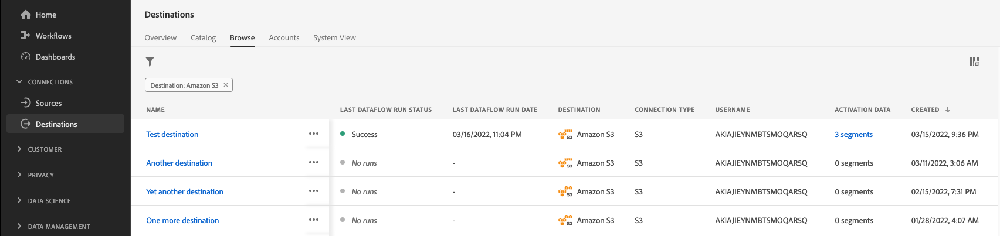

# Prenumerera på aviseringar om destinationer i sitt sammanhang

Med Adobe Experience Platform kan du prenumerera på händelsebaserade aviseringar om Adobe Experience Platform-aktiviteter. Varningar minskar eller eliminerar behovet av att ringa [[!DNL Observability Insights] API](../../observability/api/overview.md) för att kontrollera om ett jobb har slutförts, om en viss milstolpe i ett arbetsflöde har nåtts eller om några fel har uppstått.

Du kan prenumerera på varningar när du skapar ett dataflöde för att få varningsmeddelanden om status, om det lyckades eller om det inte gick att köra ditt flöde.

Det här dokumentet innehåller anvisningar om hur du prenumererar på meddelanden om att ta emot aviseringar för dina måldataflöden.

## Komma igång

Dokumentet kräver en fungerande förståelse av följande komponenter i Adobe Experience Platform:

* [Destinationer](../home.md): Färdiga integreringar med målplattformar som möjliggör smidig aktivering av data från Adobe Experience Platform. Ni kan använda destinationer för att aktivera kända och okända data för flerkanalskampanjer, e-postkampanjer, riktad reklam och många andra användningsfall.
* [Observationer](../../observability/home.md): [!DNL Observability Insights] gör att ni kan övervaka plattformsaktiviteter med hjälp av statistiska värden och händelsemeddelanden.
   * [Varningar](../../observability/alerts/overview.md): När en viss uppsättning villkor för plattformsåtgärder har nåtts (t.ex. ett potentiellt problem när systemet överskrider ett tröskelvärde) kan Platform leverera varningsmeddelanden till alla användare i organisationen som har prenumererat på dem.

## Prenumerera på aviseringar i användargränssnittet {#subscribe-destination-alerts}

>[!CONTEXTUALHELP]
>id="platform_destination_alerts_subscribe"
>title="Prenumerera på destinationsaviseringar"
>abstract="Med varningar kan du ta emot meddelanden baserat på statusen för måldataflödena. Du kan ange varningsmeddelanden för att få uppdateringar om dataflödet har startats, har misslyckats, eller om inga data har skickats till målet."
>text="Learn more in documentation"

>[!IMPORTANT]
>
>Du måste aktivera snabbmeddelanden om e-post för ditt plattformskonto för att kunna ta emot e-postbaserade varningsmeddelanden för dina dataflöden.

Du kan aktivera varningar för dina dataflöden under [!UICONTROL Configure new destination] steg i [målanslutning](connect-destination.md) arbetsflöde.

Välj de aviseringar du vill prenumerera på och välj sedan **[!UICONTROL Next]** för att granska och slutföra dataflödet.

Aviseringar som är tillgängliga för måldataflöden beskrivs i tabellen nedan.

* För direktuppspelningsmål är det bara [!DNL Activation Skipped Rate Exceeded] varning finns tillgänglig.
* För filbaserade mål är alla aviseringar tillgängliga.

| Larm | Beskrivning |
| --- | --- |
| Körningsfördröjning för målflöde | Den här varningen meddelar dig när en målflödeskörning tar längre tid än 150 minuter att aktivera ett segment. |
| Körningsfel för målflöde | Den här varningen meddelar dig när ett fel inträffar när ett segment aktiveras till ett mål. |
| Målflödet har körts | Den här varningen meddelar dig när ett segment har aktiverats till ett mål. |
| Start för målflödeskörning | Den här varningen meddelar dig när en målflödeskörning börjar aktivera ett segment. |
| Överhoppad aktiveringshastighet har överskridits | Den här varningen meddelar dig när aktiveringshastigheten har överskridit 1 % av det totala antalet aktiveringar. Identiteter hoppas över under aktivering om de saknar attribut eller har samtyckesöverträdelse. |

## Få aviseringar {#receiving-alerts}

När måldataflödet körs kan du få aviseringar via användargränssnittet eller via e-post.

### Få aviseringar i användargränssnittet {#receiving-alerts-in-ui}

Varningar representeras i användargränssnittet av en meddelandeikon i det övre huvudet i användargränssnittet för plattformen. Välj meddelandeikonen om du vill visa specifika varningsmeddelanden om dina dataflöden.

Meddelandepanelen visas med en lista över statusuppdateringar för det dataflöde som du skapade.

Du kan hovra över ett varningsmeddelande och markera det som läst eller välja klockikonen för att ange framtida påminnelser om dataflödets status.

Markera varningsmeddelandet om du vill visa specifik information om dataflödet.

The [!UICONTROL Dataflow run details] visas. I den övre halvan av skärmen visas en översikt över dataflödet, inklusive information om dess attribut, motsvarande körnings-ID för dataflöde och en sammanfattning av högnivåfel.

Den nedre halvan av sidan visar alla [!UICONTROL Dataflow run errors] som uppstod under körningsfasen för dataflödet. Härifrån kan du förhandsgranska feldiagnostik eller använda [[!DNL Data Access] API](https://www.adobe.io/experience-platform-apis/references/data-access/) för att hämta feldiagnostik eller det filmanifest som motsvarar ditt dataflöde.

Mer information om hur du hanterar dataflödesfel finns i handboken om [övervaka destinationsdataflöden i användargränssnittet](../../dataflows/ui/monitor-destinations.md).

### Få aviseringar via e-post {#receiving-alerts-by-email}

Varningar för dataflödena levereras också till dig via e-post. Välj dataflödets namn i e-postbrödtexten om du vill ha mer information om dataflödet.

Liknar gränssnittsvarningen visas [!UICONTROL Dataflow run overview] visas så att du får ett gränssnitt där du kan undersöka eventuella fel som är kopplade till dataflödet.

## Prenumerera och avbeställa aviseringar {#subscribe-and-unsubscribe}

Du kan prenumerera på fler aviseringar eller avbryta prenumerationen på etablerade aviseringar för ett befintligt måldataflöde på målplatserna [!UICONTROL Browse] sida.

Leta reda på målanslutningen som du vill få aviseringar för och välj ellipserna (`...`) för att se en listruta med alternativ. Nästa, välj **[!UICONTROL Subscribe to alerts]** om du vill ändra aviseringsinställningarna för måldataflödet.

Ett popup-fönster visas med en lista över destinationsvarningar. Markera de aviseringar som du vill prenumerera på eller avmarkera aviseringar som du vill avsluta prenumerationen på. När du är klar väljer du **[!UICONTROL Save]**.

## Nästa steg {#next-steps}

Det här dokumentet innehåller en stegvis guide om hur du prenumererar på snabbmeddelanden för måldataflöden. Mer information finns i [guide för varningsgränssnitt](../../observability/alerts/ui.md).
