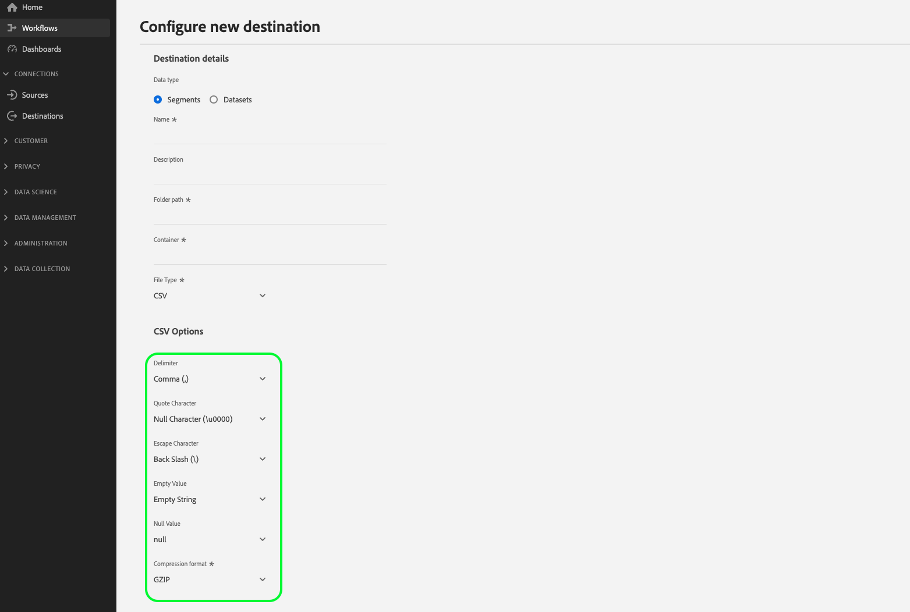

# Konfigurera filformateringsalternativ för filbaserade mål

>[!IMPORTANT]
> 
>Filformateringsalternativen som beskrivs i det här dokumentet är för närvarande bara tillgängliga för CSV-filer.

Alternativet att konfigurera olika filformateringsalternativ för de exporterade filerna är tillgängligt när du [ansluter](/help/destinations/ui/connect-destination.md) till ett filbaserat mål, till exempel [Amazon S3](/help/destinations/catalog/cloud-storage/amazon-s3.md#connect), [Azure Blob](/help/destinations/catalog/cloud-storage/azure-blob.md#connect) eller [SFTP](/help/destinations/catalog/cloud-storage/sftp.md#connect).

Du kan konfigurera olika filformateringsalternativ för exporterade filer med hjälp av användargränssnittet i Experience Platform. Du kan ändra flera egenskaper för de exporterade filerna så att de matchar kraven i filmottagningssystemet på din sida för att optimera läsningen och tolkningen av de filer som tas emot från Experience Platform.

<!--
* To configure file formatting options for exported files by using the Experience Platform UI, read this document.
* To configure file formatting options for exported files by using the Experience Platform Flow Service API, read [Flow Service API - Destinations](https://developer.adobe.com/experience-platform-apis/references/destinations/).
-->

## Filformateringskonfiguration för CSV-filer {#file-configuration}

Om du vill visa filformateringsalternativen startar du arbetsflödet [Ansluta till mål](/help/destinations/ui/connect-destination.md). Välj **Datatyp: Segment** och **Filtyp: CSV** om du vill visa de filformateringsinställningar som är tillgängliga för de exporterade `CSV` filerna.

>[!IMPORTANT]
>
>Målet som du ansluter till kanske inte har alla dessa alternativ tillgängliga. Det är upp till målutvecklaren att avgöra vilka filformateringsalternativ som stöds i målet. Målutvecklaren kan avgöra vilka alternativ som är tillgängliga vid anslutning till målet. Obligatoriska alternativ är markerade med en asterisk i Experience Platform-gränssnittet.
> 
>De molnbaserade lagringsplatserna som skapats av Adobe - [Amazon S3](/help/destinations/catalog/cloud-storage/amazon-s3.md), [Azure Blob](/help/destinations/catalog/cloud-storage/azure-blob.md), [Azure Data Lake Storage Gen2](/help/destinations/catalog/cloud-storage/adls-gen2.md), [Data Landing Zone](/help/destinations/catalog/cloud-storage/data-landing-zone.md), [Google Cloud Storage](/help/destinations/catalog/cloud-storage/google-cloud-storage.md), [SFTP](/help/destinations/catalog/cloud-storage/sftp.md) - stöder för närvarande endast de sex CSV-alternativ som markerats nedan.

### Avgränsare {#delimiter}

>[!CONTEXTUALHELP]
>id="platform_destinations_csvOptions_delimiter"
>title="Avgränsare"
>abstract="Använd den här kontrollen för att ange en avgränsare för varje fält och värde. I dokumentationen finns exempel för varje markering."

Använd den här kontrollen om du vill ange en avgränsare för varje fält och värde i de exporterade CSV-filerna. Tillgängliga alternativ är:

* Kolon `(:)`
* Komma `(,)`
* Pipe `(|)`
* Semikolon `(;)`
* Flik `(\t)`

#### Exempel

Visa exemplen nedan för innehållet i de exporterade CSV-filerna med var och en av valen i användargränssnittet.

* Exempelutdata med **[!UICONTROL Colon `(:)`]** markerat: `male:John:Doe`
* Exempelutdata med **[!UICONTROL Comma `(,)`]** markerat: `male,John,Doe`
* Exempelutdata med **[!UICONTROL Pipe `(|)`]** markerat: `male|John|Doe`
* Exempelutdata med **[!UICONTROL Semicolon `(;)`]** markerat: `male;John;Doe`
* Exempelutdata med **[!UICONTROL Tab `(\t)`]** markerat: `male \t John \t Doe`

### Citattecken {#quote-character}

>[!CONTEXTUALHELP]
>id="platform_destinations_csvOptions_quoteCharacter"
>title="Citattecken"
>abstract="Använd det här alternativet om du vill ta bort dubbla citattecken från exporterade strängar. I dokumentationen finns exempel för varje markering."

Använd det här alternativet om du vill ange om dubbla citattecken ska tas bort eller behållas i exporterade strängar.

De tillgängliga alternativen är:

* **[!UICONTROL Null Character (\0000)]**. Använd det här alternativet om du vill ta bort dubbla citattecken från exporterade CSV-filer.
* **[!UICONTROL Double Quotes (")]**. Använd det här alternativet när strängvärdena innehåller avgränsare eller dubbla citattecken. Med det här alternativet kan du behålla avgränsare eller dubbla citattecken i dina exporterade CSV-filer, så att du kan identifiera vilket värde som motsvarar vilket fält.

#### Exempel

Överväg indatavärdet `Anna,"Doe,John"`.

Visa exemplen nedan för innehållet från de exporterade CSV-filerna tillsammans med varje val i användargränssnittet.

* Exempelutdata med **[!UICONTROL Null Character (\0000)]** markerat: `Anna,Doe,John`
* Exempelutdata med **[!UICONTROL Double Quotes (")]** markerat: `Anna,"Doe,John"`

### Escape-tecken {#escape-character}

>[!CONTEXTUALHELP]
>id="platform_destinations_csvOptions_escapeCharacter"
>title="Escape-tecken"
>abstract="Ställer in ett enskilt tecken som används för att undvika citattecken inuti ett redan citattecken. I dokumentationen finns exempel för varje markering."

Använd det här alternativet om du vill ange ett enskilt tecken för att undvika citattecken inuti ett redan citattecken. Det här alternativet är till exempel användbart när du har en sträng omsluten av citattecken där en del av strängen redan omsluts av citattecken. Med det här alternativet anger du vilket tecken som ska ersätta de inre dubbla citattecknen med. Tillgängliga alternativ är:

* Snedstreck `(\)`
* Enkelt citattecken `(')`

#### Exempel

Visa exemplen nedan för innehållet från de exporterade CSV-filerna tillsammans med varje val i användargränssnittet.

* Exempelutdata med **[!UICONTROL Back slash `(\)`]** markerat: `"Test,\"John\",LastName"`
* Exempelutdata med **[!UICONTROL Single quote `(')`]** markerat: `"Test,'"John'",LastName"`

### Tomt värde {#empty-value-output}

>[!CONTEXTUALHELP]
>id="platform_destinations_csvOptions_emptyValueOutput"
>title="Tomt värde"
>abstract="Använd det här alternativet om du vill ange hur tomma värden ska visas i de exporterade CSV-filerna. I dokumentationen finns exempel för varje markering."

Använd den här kontrollen för att ange strängbeteckningen för ett tomt värde. Det här alternativet avgör hur tomma värden representeras i dina exporterade CSV-filer. Tillgängliga alternativ är:

* **[!UICONTROL Null (null)]**
* **Tom sträng inom dubbla citattecken (&quot;&quot;&quot;)**
* **[!UICONTROL Empty string]**

#### Exempel

Visa exemplen nedan för innehållet från de exporterade CSV-filerna tillsammans med varje val i användargränssnittet.

* Exempelutdata med **[!UICONTROL null]** markerat: `male,NULL,TestLastName`. I det här fallet omvandlar Experience Platform det tomma värdet till ett null-värde.
* Exempelutdata med **&quot;** valt: `male,"",TestLastName`. I det här fallet omvandlar Experience Platform det tomma värdet till ett par dubbla citattecken.
* Exempelutdata med **[!UICONTROL Empty string]** markerat: `male,,TestLastName`. I det här fallet behåller Experience Platform det tomma värdet och exporterar det som det är (utan dubbla citattecken).

>[!TIP]
>
>Skillnaden mellan utdata för tomt värde och utdata för null-värde i avsnittet nedan är att ett tomt värde har ett faktiskt värde som är tomt. NULL-värdet har inget värde alls. Tänk dig det tomma värdet som ett tomt glas på bordet och att null-värdet inte har glaset över huvud taget på bordet.

### Utdata för null-värde {#null-value-output}

>[!CONTEXTUALHELP]
>id="platform_destinations_csvOptions_nullValueOutput"
>title="Utdata för null-värde"
>abstract="Använd den här kontrollen för att ange strängbeteckningen för ett null-värde i de exporterade filerna. I dokumentationen finns exempel för varje markering."

Använd den här kontrollen för att ange strängbeteckningen för ett null-värde i de exporterade filerna. Det här alternativet avgör hur null-värden återges i dina exporterade CSV-filer. Tillgängliga alternativ är:

* **[!UICONTROL Null (null)]**
* **Tom sträng inom dubbla citattecken (&quot;&quot;&quot;)**
* **[!UICONTROL Empty string]**

#### Exempel

Visa exemplen nedan för innehållet från de exporterade CSV-filerna tillsammans med varje val i användargränssnittet.

* Exempelutdata med **[!UICONTROL null]** markerat: `male,NULL,TestLastName`. I det här fallet sker ingen omformning och CSV-filen innehåller null-värdet.
* Exempelutdata med **&quot;** valt: `male,"",TestLastName`. I det här fallet ersätter Experience Platform null-värdet med dubbla citattecken runt en tom sträng.
* Exempelutdata med **[!UICONTROL Empty string]** markerat: `male,,TestLastName`. I det här fallet ersätter Experience Platform null-värdet med en tom sträng (utan dubbla citattecken).

### Komprimeringsformat {#compression-format}

>[!CONTEXTUALHELP]
>id="platform_destinations_csvOptions_compressionFormat"
>title="Komprimeringsformat"
>abstract="Anger vilken komprimeringstyp som ska användas när data sparas i filen. Alternativen är GZIP och NONE. I dokumentationen finns exempel för varje markering."

Anger vilken komprimeringstyp som ska användas när data sparas i filen. Alternativen är GZIP och NONE. Det här alternativet avgör om du ska exportera komprimerade filer eller inte.

### Kodning

*Visas inte på skärmbilden för användargränssnittet*. Anger kodning (teckenuppsättning) för sparade CSV-filer. Alternativen är UTF-8 eller UTF-16.

### Char to escape quote

*Visas inte på skärmbilden för användargränssnittet*. En flagga som anger om värden som innehåller citattecken alltid ska omslutas av citattecken.

Standard är att undvika alla värden som innehåller ett citattecken.

### Radavgränsare

*Visas inte på skärmbilden för användargränssnittet*. Definierar den radavgränsare som ska användas för att skriva. Maxlängden är 1 tecken.

### Ignorera inledande blanksteg

*Visas inte på skärmbilden för användargränssnittet*. En flagga som anger om inledande blanksteg från värden som exporteras ska hoppas över.

Exempelutdata med **[!UICONTROL True]** markerat: `"male","John","TestLastName"`
Exempelutdata med **[!UICONTROL False]** markerat: `" male","John","TestLastName"`

### Ignorera avslutande blanksteg

Visas inte på skärmbilden för användargränssnittet. En flagga som anger om efterföljande blanksteg från värden som exporteras ska hoppas över.

Exempelutdata med **[!UICONTROL True]** markerat: `"male","John","TestLastName"`
Exempelutdata med **[!UICONTROL False]** markerat: `"male ","John","TestLastName"`

### Nästa steg {#next-steps}

När du har läst det här dokumentet vet du nu hur du konfigurerar alternativ för filexport för dina CSV-datafiler för att anpassa filinnehållet efter kraven i det underordnade filmottagningssystemet. Sedan kan du läsa den [filbaserade självstudiekursen för aktivering av mål](/help/destinations/ui/activate-batch-profile-destinations.md) för att börja exportera filer till den önskade molnlagringsplatsen.
